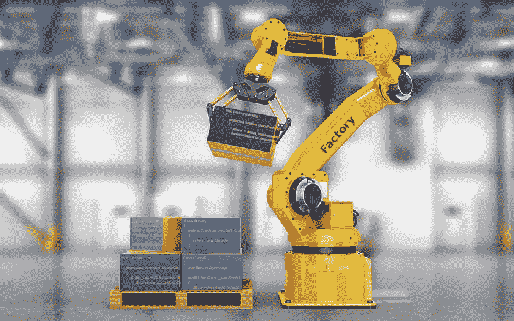

# 禁止在 PHP 工厂外创建对象

> 原文：<https://levelup.gitconnected.com/forbidding-of-creating-objects-outside-factory-in-php-7173d7be6cb4>

## 领域驱动设计建议在工厂中创建集合和其他复杂的对象。在 PHP 中，我们可以将构造函数定义为 private 或 protected，然后只能在类本身的工厂方法中创建对象。但它违反了单一责任原则。还有别的办法吗？



如果我们想在类之外创建对象，这个类的构造函数必须是公共的。这是否意味着我们需要相信其他开发人员不会在工厂之外创建对象？不，不是的。构造函数可以控制对象的创建位置。函数 [debug_backtrace](https://www.php.net/manual/en/function.debug-backtrace.php) 将帮助我们解决这个问题。

我们不想在每个类中添加方法 checkFactory，这个方法不足以成为创建抽象超类的理由。所以这里是使用 trait 的好地方。

它可以工作，但是 classA 仍然有额外的责任——验证它是在哪里创建的。所以我们返回私有/受保护的构造函数。有没有方法在类本身的静态方法之外用私有/受保护的构造函数创建类的实例？这可以通过 PHP 核心的模块反射来实现。

ClassA 中的常量 FRIEND_CLASSES 用于定义可以创建类实例的类列表。

现在 ClassA 没有额外的职责，我们只能在 friend 类中创建类的实例。但是性能怎么样呢？所以，我们来测试一下。

作为起点，我们将使用未经任何验证的工厂:

```
test.php<?phpclass ClassA
{
    public function __construct() {}
}class Factory
{
    public function create(): ClassA
    {
        return new ClassA();
    }
}$start = microtime(true);
$factory  = new Factory();
for ($i = 0; $i < 100000; $i++) {
    $object = $factory->create();
}
echo microtime(true) - $start;> php test.php
0.12572288513184
```

然后用 debug_backtrace 做同样的事情:

```
> php backtrace.php
0.26334500312805
```

通过思考:

```
> php reflect.php
0.52497291564941
```

因此，使用 debug_backtrace 验证创建对象比不使用验证慢 2 倍，使用反射慢 4 倍。但是我们需要明白 classA 的构造函数和我们的工厂什么都不做。我们只测量 PHP 创建空对象的时间。在实际情况下，差异会更小。

我们对这个想法有什么看法？你使用任何方法来避免在其工厂之外创建对象吗？