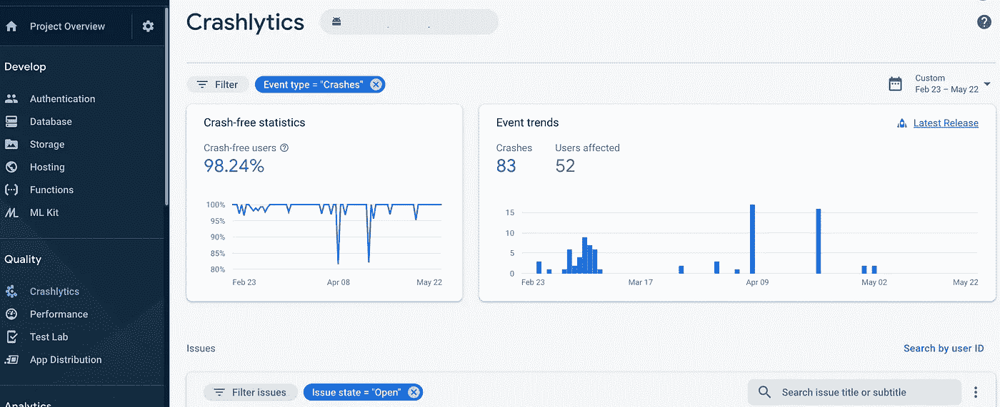

# 强制用户在 React Native 中更新你的应用

> 原文：<https://levelup.gitconnected.com/force-users-to-update-your-application-in-react-native-c232ee348954>



体育应用中的碰撞分析

我最近开发了一款手机应用程序，在发布的第一周就被下载了 90000 多次(这是一款追踪体育赛事直播的应用程序)。由于它与实时数据的紧密联系以及在移动世界中的一点经验，我们知道我们的应用程序的第一个版本不会没有错误。出于安全原因，我们必须找到一种直观的解决方案，在出现会导致应用程序崩溃的错误时，迫使用户更新应用程序。

# 🛠我们的期望

然而，我们的解决方案必须满足某些标准:

*   在第一个屏幕开始时阻止应用程序(以防止加载服务再次导致崩溃，这将使应用程序不可用)
*   通知并重定向用户到他们的应用商店(下载和升级应用)
*   可远程配置(能够选择在哪个版本的应用程序上激活我们的解决方案)
*   可定制的设计和“用户友好”

为了满足这些期望，我们决定在应用程序加载时(甚至在闪屏期间)使用阻塞模式。


阻止弹出窗口的建议

# 🧰设计

在发布时，一个[上下文](https://reactjs.org/docs/context.html)开始初始化我们应用程序的不同服务(比如 firebase，或者我们的新解决方案)。然后我们的 modal 通过检查应用程序的版本和最低推荐版本来初始化。


例如，我已经规划了一个**web 服务**，但是我强烈建议你(这是我们在产品中使用的)使用 [Firebase 远程配置](https://firebase.google.com/docs/remote-config)，它允许存储一个 JSON 配置，当 Firebase 加载时下载。这允许你控制你的应用程序的行为(比如这里存储最低要求的版本)，而不必在商店中发布更新(或者[推送代码](https://github.com/Microsoft/react-native-code-push))。

# ⏳设置

为此，我使用:

*   虚拟代码
*   反应 16.9
*   反应原生 0.61.5
*   打字稿 3.8.3
*   [样式-组件](https://styled-components.com/docs/basics#react-native) 5.1.0
*   世博会 37.0.3
*   一台 MacBook 和我的 iPhone …😎

# 👨🏼‍💻代码，代码，代码！

首先，让我们创建我们的服务加载器！

让我们创建一个[自定义挂钩](https://reactjs.org/docs/hooks-custom.html)来与我们的**web 服务**通信，以便获得启动应用程序的最小版本。(在 Firebase 远程配置的情况下，此挂钩将被替换为 [this](https://rnfirebase.io/remote-config/usage) )

让我们把我们的钩子添加到我们的上下文中。

最后，让我们将我们的应用程序与我们的上下文包含在一起！

现在我们有了一个看起来像这样的架构:

```
├───src/
│   └───modules/
│       ├───app/
│          ├───hooks/
│          │   └───useGetMinimumAvailableVersion.tsx
│          └───AppContext.tsx
├───App.tsx
```

# 📲模态

为了保持一定的结构，让我们在模块目录中添加一个模态文件夹:

```
├───src/
│   └───modules/
│       └───modal/
│           └───AppVersionModal.tsx
```

让我们初始化我们的模态。你可以随意定制。

我在等一个`loadingComponent`道具在模态打开的时候显示在模态后面。

现在，如果我们在我们的`App.tsx`中调用这个组件，模态仍然可以在屏幕上看到。因此，有必要添加一些逻辑。首先，让我们从上下文中调用方法来获取应用程序的最小版本:

然后让我们使用 React 生命周期来调用我们的方法。

注意:依赖数组为空的`useEffect`对应的是`[componentDidMount()](https://reactjs.org/docs/react-component.html#componentdidmount)`。

现在我们有了比较版本的所有必要信息，让我们稍微修改一下模态组件的逻辑。

首先，让我们添加方法，以便在打开模式时重定向到商店。然后让我们比较一下应用程序的版本。(我使用一个小的 npm 包来完成这项工作)。

我们现在有 3 种不同的回报:

*   服务正在加载:我们返回加载屏幕
*   这个版本是不正确的:我们用
*   这个版本很好:我们返回子组件

加到我们的`App.tsx`就行了。

这就对了。我们现在可以阻止从我们的**web 服务**直接访问应用程序，并将用户重定向到商店，强迫他更新。

对于完整的项目:我的 [Github](https://github.com/Trobyss/react-native-modal-force-update)

(ps:我已经移除了样式组件块。你可以直接从我的 [Github](https://github.com/Trobyss/react-native-modal-force-update) 获取。

# 🌟更进一步

也可以通过`Error Boundaries`保护代码，从源头解决问题。

[React 文档](https://reactjs.org/docs/error-boundaries.html) & [包例](https://www.npmjs.com/package/react-native-error-boundary)