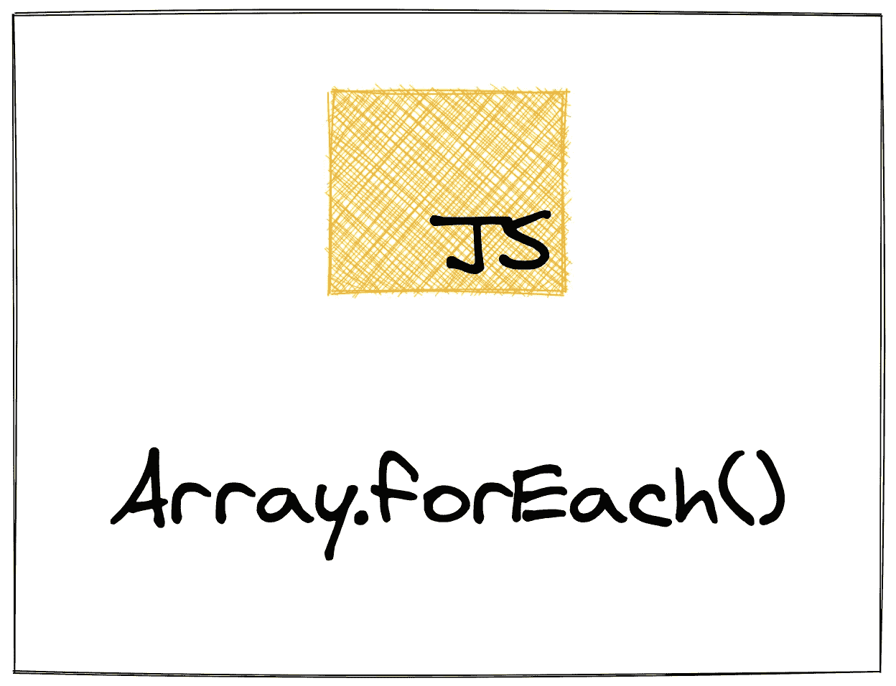

# forEach:通过构建 JavaScript 的数组方法来学习它们

> 原文：<https://levelup.gitconnected.com/foreach-learn-javascripts-array-methods-by-building-them-32b8c2261519>

探索 JavaScript 数组方法的系列文章的第一篇，包括如何构建自己的数组方法的演练。本文涵盖了`forEach`方法。



# 介绍

JavaScript 的数组方法是非常强大的工具，可以用来编写表达性强、易于阅读的代码。但是对于初学者来说，它们可能很难理解。一旦你熟悉了循环，`forEach`是一个很好的学习第一数组的方法，因为它只是单个`for`循环的一个小抽象。

本文是我将要做的一个系列的一部分，在这个系列中，我将解释 JavaScript 的内置数组方法。我将描述如何以及何时使用它们，以及如何自己实现它们。自己实现数组方法的目的是帮助您理解幕后发生的事情。所以当你想使用`map`或者看到一个使用`reduce`的代码块时，你就能明白发生了什么。

加深对 JavaScript 数组方法的理解是提高代码可读性的一个好方法。每个数组方法都是一个`for`循环的抽象，这意味着你可以用数组方法做的任何事情都可以用一个`for`循环来完成，反之亦然。不同之处在于，数组方法使代码更具表现力，从而使代码更具可读性。

我认为学习新的编程语言结构类似于学习新的外语词汇。如果你在学校学过西班牙语或法语，那么你可能学过问路、餐馆点餐或求职面试。在这些课程中，你学习了在特定环境中更容易出现的单词和短语，这样你可以更好地表达自己。

当然，你可以在餐馆坐下来，点“有绿色东西的盘子”，但是如果你说“请给我一份沙拉”，服务员会更容易理解你的意思。

学习这些词汇有助于你更清楚地表达自己，就像学习编程语言结构有助于你为特定类型的问题编写更具表现力的代码一样。JavaScript 的数组方法将帮助您在使用数组时编写更具表现力的代码。效果是一样的:其他开发者，包括你未来的自己，会对你的意思有更好的理解。

我将介绍每一个内置的数组方法，解释它的作用和使用方法，并通过解释如何自己实现它来展示它的工作原理。如果这听起来像是你感兴趣的事情，那就注册我的[时事通讯](https://hawthorne.substack.com/)并在 [Twitter](https://twitter.com/ZFleischmann) 上关注我。

让我们开始吧

# 它是如何工作的

我们从`forEach`开始，因为它是标准`for`循环中最轻的抽象。使用数组时的一个常见任务是遍历数组中的每一项并对其执行一些操作。例如，您可能会这样做:

```
const numbers = [1, 2, 3, 4, 5, 6];for (let i = 0; i < numbers.length; i++) {
  let number = numbers[i]
  console.log(number)
}
```

在上面的代码片段中，我们创建了一个数字数组(名为`numbers`，然后创建了一个`for`循环来遍历数组中的每一项。在`for`循环中，我们简单地抓取当前项目并`console.log`它。

如果我们想让上面的代码片段稍微抽象一点，我们可以修改它，如下所示:

```
const numbers = [1, 2, 3, 4, 5, 6];function printNumber(number) {
  console.log(number)
}for (let i = 0; i < numbers.length; i++) {
  let number = numbers[i]
  printNumber(number)
}
```

这里我们创建了一个名为`printNumber`的函数，它获取一个数字并将其打印到控制台。重要的一点是，无论我们对数组中的每一项执行什么操作，这个函数都会执行。在这个具体的例子中，这仅仅意味着打印它。我们一会儿会回到这个函数。

# 实现我们自己的

顾名思义，`forEach`方法循环遍历一个数组，并为数组中的每个项运行一个函数*(就像我们前面的代码片段一样)。我们实际上已经非常接近`forEach`的实现了。*

为了实现我们自己的`forEach`方法，我们需要定义一个函数，它接受一个数组和一个函数，循环遍历数组，并将每一项传递给函数。

让我们从定义我们的函数开始:

```
function forEach(arr, fn) {
  // more to come here ...
}
```

我们声明了一个名为`forEach`的函数，它有两个参数:一个名为`arr`的数组和一个名为`fn`的函数。

接下来，我们要遍历数组中的每一项:

```
function forEach(arr, fn) {
  for (let i = 0; i < arr.length; i++) {
    // more to come here ...
  }
}
```

我们添加了一个`for`循环来遍历传入的数组。请注意，这与上面的`for`循环完全相同。

现在剩下要做的就是获取当前条目并将其传递给函数，`fn`:

```
function forEach(arr, fn) {
  for (let i = 0; i < arr.length; i++) {
    let item = arr[i]
    fn(item)
  }
}
```

现在你知道了！现在你可以看到这一切:

```
const numbers = [1, 2, 3, 4, 5, 6];function printNumber(number) {
  console.log(number)
}function forEach(arr, fn) {
  for (let i = 0; i < arr.length; i++) {
    fn(arr[i])
  }
}forEach(numbers, printNumber)
```

# `forEach`在行动

既然我们已经定义了我们的`forEach`方法，现在只需要修改我们传递给`numbers`中的条目的函数。

例如，我们可以将`numbers`中的每个数字翻倍:

```
function doubleNumber(number) {
	console.log(number * 2)
}forEach(numbers, doubleNumber)
```

或者，我们可以使用`forEach`来获得字符串数组的大写版本:

```
const names = ["Mercedes", "Antonio", "Sergio", "José", "Ana", "Carmen", "Dolores"]function uppercaseName(name) {
	console.log(name.toUpperCase())
}forEach(names, uppercaseName)
```

# 为什么使用数组方法

JavaScript 的数组方法的目标是为常见任务提供内置方法，并帮助您编写更具可读性的代码。任何`for`循环都需要真正地查看和阅读代码，以便理解它在做什么。我们可以通过改变几个字符来改变`for`循环的含义:

```
for (let i = 0; i < numbers.length; i++) {
  let number = numbers[i]
  console.log(number)
}for (let i = numbers.length; i >= 0; i--) {
  let number = numbers[i]
  console.log(number)
}
```

这里我们有两个几乎相同的`for`循环，但是其中一个循环向后遍历数组(从最后一个索引到第一个)。当您通读代码时，您可以看到不同之处，但乍一看并不明显。此外，循环的构造不是这段代码的重要部分，主体才是，所以我们不想花时间去阅读和理解它。

回想一下西班牙餐馆和我们的盘子，上面有绿色的东西。服务员必须检查你是指沙拉还是芦笋配菜，就像我们必须检查这个循环在做什么一样。如果我们只是学习如何要一份沙拉，对每个人来说都比较容易。

当我们说我们希望我们的代码易于阅读时，我们的意思是我们希望它一眼就能理解它在做什么，而不用花时间一段一段地研究语法。使用数组方法，如`forEach`，使这变得容易得多:

```
const numbers = [1, 2, 3, 4, 5, 6];function printNumber(number) {
  console.log(number)
}forEach(numbers, printNumber)
```

# 结论

我对`forEach`的讨论到此结束。我希望您发现它很有帮助，但是我也希望您发现`forEach`的实现相当简单。我发现很多 JavaScript 开发人员没有考虑过这些方法是如何实现的。当你这样做时，你会发现它们都很简单。仔细检查并思考它们是如何实现的，使得使用它们变得容易多了，这也是我希望与你分享的。

我将详细介绍并解释和实现每个内置数组方法，这将帮助您理解它们是如何工作的，以及何时和如何使用它们。要跟进，注册我的[简讯](https://hawthorne.substack.com/)并在 [Twitter](https://twitter.com/ZFleischmann) 上关注我。