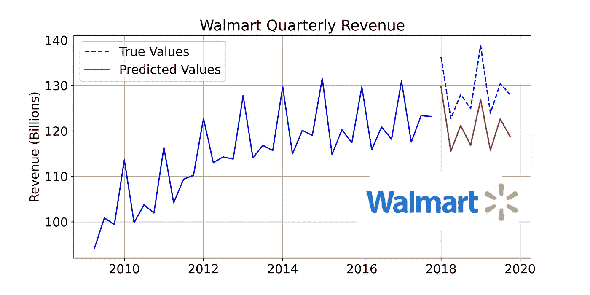
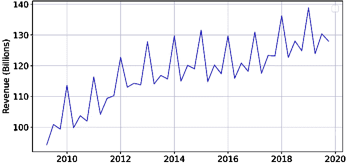
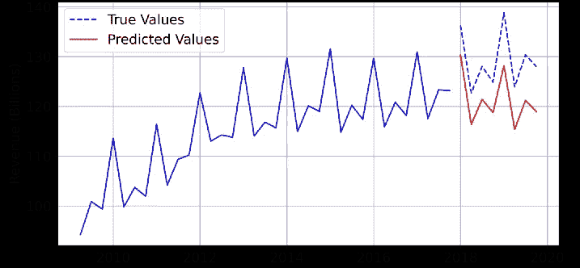

# Pytorch LSTM 示例—时间序列预测

> 原文：<https://levelup.gitconnected.com/forecasting-walmart-quarterly-revenue-pytorch-lstm-example-b4e4b20862a7>

## 应用 LSTM 网络预测时间序列数据



作者图片

在这篇文章中，我将使用 PyTorch 应用一个长短期记忆(LSTM)网络来预测未来多个时间段的时间序列。正如我们在上面的图表中看到的，许多时间序列显示出季节性趋势。例如，一家公司的销售额可能会在每年的假日季节激增。这是许多零售商的特点，从大公司到你当地的周日市场，他们的销售因圣诞节而增加。

传统模型很难发现这些季节性趋势，但是 LSTMs 已经很好地处理了这类问题。模型本身将是非常基本的；我们将使用前面的十六个季度值来预测后面的八个季度值。因此，我们本质上是在处理一个时间序列预测问题。

## 数据

该数据是任何季节性时间序列数据的特征，具有某些重复模式。数据和代码都可以在我的 Github [这里](https://github.com/rian-dolphin/Walmart_LSTM)找到。本文中使用的收入数据是公开的，每个上市公司都可以通过其法律要求的公司文件获得，这些数据可以从[这里](https://stock.walmart.com/investors/financial-information/quarterly-results/default.aspx)获得。



作者图片

正如我们所看到的，数据中有一个清晰的模式。最引人注目的是，每四个数据点就有一个大的峰值，对应于假日季节，许多零售商都经历了销售额的增长。希望我们的 LSTM 模型能够捕捉到季节模式，以及其他模式，如总体趋势。

下面的代码用于读入数据并确保索引是 DateTime 格式的。数据是按时间顺序倒过来的，所以我把它倒过来了。此外，只使用了截至 2019 年底的数据，因为疫情破坏了数据中良好的季节模式！

## 为我们的模型准备数据

如前所述，我们将简单地使用前面的十六个季度值来预测后面的八个季度值。首先，我将过去八个季度作为训练集，我们可以用它来公平地比较预测。

接下来，我调整了训练数据以提高模型性能。通过使用 sklearn 的 MinMaxScaler，当我们希望将预测转换回原始单位(在我们的例子中是十亿美元)时，我们可以很容易地应用反向转换💵

现在，让我们将缩放后的训练数据转换为 Pytorch FloatTensor，以便它稍后与我们的模型兼容。

为了训练我们的模型，我们需要从训练数据中创建 *(x，y)* 对，其中 *x* 是长度为 16 的序列， *y* 是要预测的长度为 8 的序列。我们在这里注意到，【T6(x，y)】对意味着 *y* 序列包含紧跟在 *x* 序列之后的八个值。这很重要，因为我们希望在预测接下来的八个季度值时使用最新的数据。

现在我们有了 *(x，y)* 对，我们可以定义我们的 LSTM 模型并开始训练了！🏃‍♂️

我们定义的模型将接受三个输入:

1.  *input _ size*-该输入表示我们在模型中使用的预测要素的数量。在我们的例子中，我们只使用一个特性，过去的收入。值得注意的是，尽管我们使用了一系列收入值，但它仍然只是一个特性，因此 *input_size* 为 1。
2.  *hidden_size —* 该输入将决定 LSTM 模型中隐藏状态和单元格状态的维度(参见[此处](https://towardsdatascience.com/lstm-networks-a-detailed-explanation-8fae6aefc7f9)了解更多相关信息)。
3.  *output _ size—*py torch LSTM 的输出是隐藏状态和单元格状态的组合，为了将它们转换成我们想要的格式，我们必须使用线性层。 *output_size* 将告诉我们的模型我们想要从线性层得到的输出数量(在我们的例子中是 8)。

我们定义的模型将给出两个输出:

1.  首先，该模型将输出长度为 8 的序列，其中包含对未来八个季度收入的预测。
2.  其次，它将输出 *self.hidden* —这是一个包含两个元素的元组。第一个元素是一个张量，包含计算出的最终隐藏状态。第二个元素是包含单元状态的*最新版本的张量。就我们的目的而言，我们不需要它们，但是如果您希望在保留先前上下文的同时进行进一步的预测，它会很有用。*

定义了模型类之后，我们现在需要初始化该类的一个实例，并决定使用哪个标准和优化器。由于我们在这里处理的是连续输出，我们可以使用均方误差(MSE)作为我们的损失函数。优化器的工作是调整网络的权重和偏差。我选择使用 Adam 优化器，它只是随机梯度下降的一个替代方案。

## 培养

既然我们已经建立了模型，我们可以开始训练了。这发生在以下步骤中:

1.  定义时期数-时期数是一个超参数，表示训练过程将使用整个数据集的次数。决定使用多少个历元并不是一门精确的科学。一个有用的指标是以一定的时间间隔观察损失，并在损失不再减少时识别出来。选择太多的历元会导致训练数据过拟合。
2.  对于每个历元中的每个 *(x，y)* 对，我们首先计算预测的***【ŷ****序列。*
3.  *接下来，我们计算 *ŷ* 和真实值 *y.* 之间的**损失** (MSE)*
4.  *然后我们使用 Pytorch *计算神经网络中参数的**梯度**。*功能向后()。*
5.  *计算出梯度后，最后一步是相应地更新参数。这是使用 Pytorch 的 *optimizer.step()* 函数完成的。*
6.  *重复上述步骤，直到达到指定的次数。*

```
*------- Output -------epoch:    0 loss:0.34732404
epoch:  100 loss:0.00491276
epoch:  200 loss:0.00099649
epoch:  300 loss:0.00120929
epoch:  400 loss:0.00043398
epoch:  500 loss:0.00050389
epoch:  600 loss:0.00022331*
```

## *做预测*

*训练好我们的模型后，让我们看看我们做得怎么样！我们希望使用 2014-2017 年发布的十六个值来预测 2018-2019 年发布的八个季度收入。*

*因为我们在训练之前调整了数据，所以我们需要下面的最后一行代码将输出转换回我们最初的十亿美元单位。*

*现在我们有了预测值，我们可以将它们与真实值进行对比，看看我们的 LSTM 模型是否能够捕捉到公司收入的趋势。*

**

*作者图片*

*通过比较红线和蓝色虚线，我们可以看到，该模型肯定会考虑数据的季节性趋势。预测值比预期值低了一点。然而，纵观前几年，我们可以看到，预测是完全合理的。*

## *结论*

*对于那些走到这一步的人，我希望你学到了一些东西！如果你有任何想法或问题，请在下面评论。这个项目完整的 Jupyter 笔记本可以在我的 Github [**这里**](https://github.com/rian-dolphin/Walmart_LSTM) 找到。🪐*

*要深入了解 LSTM 网络如何运作，请查看我的另一篇文章👇*

*[](https://towardsdatascience.com/lstm-networks-a-detailed-explanation-8fae6aefc7f9) [## LSTM 网络|详细解释

### LSTMs 的全面介绍

towardsdatascience.com](https://towardsdatascience.com/lstm-networks-a-detailed-explanation-8fae6aefc7f9)* *[](https://medium.com/@riandolphin/membership) [## 加入我的推荐链接-海豚

### 作为一个媒体会员，你的会员费的一部分会给你阅读的作家，你可以完全接触到每一个故事…

medium.com](https://medium.com/@riandolphin/membership)*