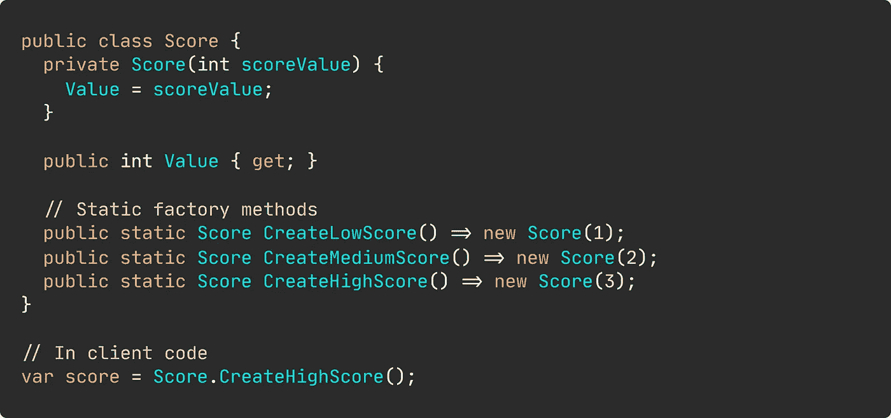
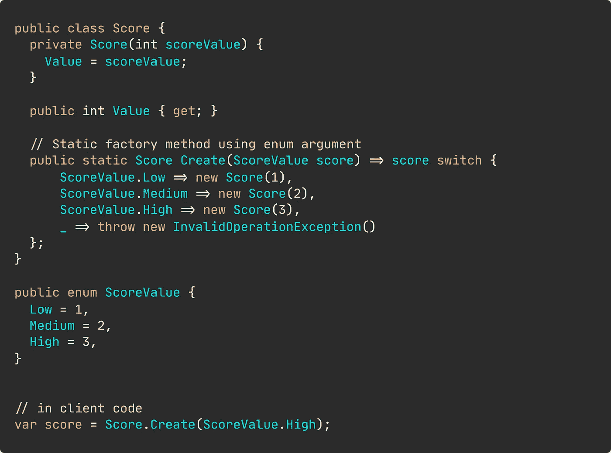
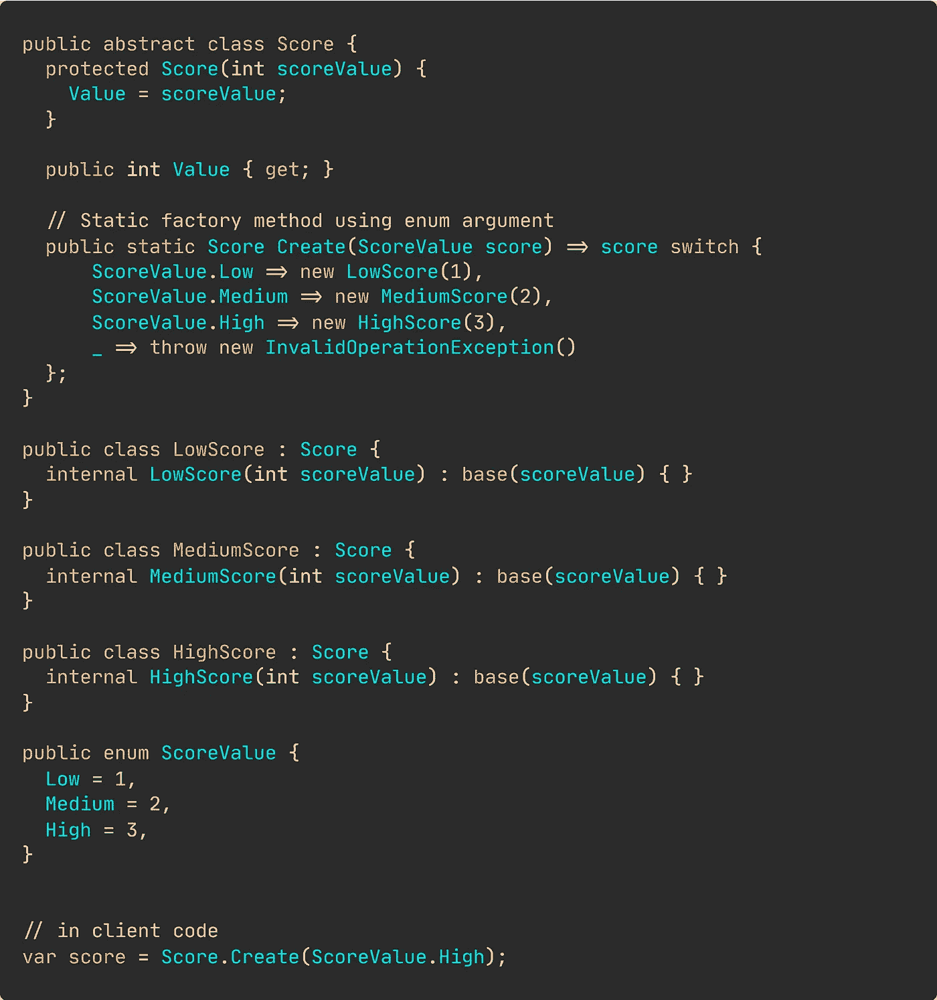

# 调用构造函数的替代方法

> 原文：<https://levelup.gitconnected.com/forget-about-constructors-8fb61288065>

## 应用设计模式

## 让我们使用另一种方法来实现对象实例化


您可能已经阅读过左右“新建”对象的代码——要理解这些对象的用途，您需要非常熟悉传递给构造函数的值的含义。

你们都知道我在说什么…就是这个。


一行代码。简单。但是，意图何在？

为了揭开这个谜，你试图在总是写得很好的文档或任何其他地方找到这种信息可能的澄清。却在这里发现了这块宝石。

```
*From meeting notes*
A score is categorized as **Low**, **Medium**, or **High**.
```

那 3 到底是什么？在这一点上做出假设肯定会给你带来各种各样的麻烦。

> 停止使用无意义的构造函数。从调用者那里抽象出实例化细节。

# 我们给代码增加一些清晰度怎么样？

我们将应用一个非常简单的模式，我在客户项目中已经用它取得了很多成功。

对于这个演示，我们使用三种不同的方法来隐藏实例化逻辑。让它们适应你的喜好。

## 1 静态工厂方法

如果我们的对象可能只有几个不同的有效状态，我们可以简单地为每个状态创建静态工厂方法。



现在毫无疑问我们在处理什么分数。这种方法毫无疑问是最强大的方法，因为用最少的努力就可以让你的代码更容易阅读。

## 2 带有枚举参数的静态工厂方法

不确定最终会有多少个有效的状态？也许您稍后会添加另一个分数，然后选择 enum 参数。



默认操作是抛出异常。这可能是期望的操作，但是作为抛出的替代，您可以返回一个空对象。

[](https://medium.com/swlh/stop-checking-for-nulls-5f9f857ddf72) [## 在本文中了解更多关于空对象的知识:停止检查空值

### 空对象模式、工厂方法——让我们看看一些生产就绪代码！

medium.com](https://medium.com/swlh/stop-checking-for-nulls-5f9f857ddf72) 

## 3 静态工厂方法——一切都是对象

如果你相信所有的东西都应该被建模为一个独立的对象，你可能会想采用这种方法。



对于这个简单的例子，我认为这是矫枉过正。但是，我也想向您展示这种方法，因为它确实为您提供了很大的灵活性。

## 测试时间

像往常一样，只是一些简单的测试表明它实际上工作…停止视频，如果你想阅读代码。

# 但是工厂类呢？

那是一个通行证。至少对于简单的事情。

否则，我们可能会以`AbstractFactoryFactory`结束，突然之间，我们处理了如此多的间接问题，以至于我们完全看不到我们要解决的商业问题。

通常，我们想要的只是稍微清晰一点，以真正让这些意图流行起来。在这些情况下，工厂模式就是太多的工作。

```
**Resources for the curious**[Explanation by refactoring guru](https://refactoring.guru/design-patterns/factory-method#:~:text=Factory%20Method%20is%20a%20creational,objects%20that%20will%20be%20created.)
[Explanation by SourceMaking](https://sourcemaking.com/design_patterns/factory_method)
[Simple Factory vs Factory Method by Shamik Mitra](https://dzone.com/articles/factory-method-vs-simple-factory-1) 
```

[](https://medium.com/@nmillard/5-ways-to-replace-if-else-statements-857c0ff19357) [## 替换 If-Else 语句的 5 种方法

### 从初级到高级的例子

medium.com](https://medium.com/@nmillard/5-ways-to-replace-if-else-statements-857c0ff19357) [](https://medium.com/swlh/stop-using-if-else-statements-f4d2323e6e4) [## 停止使用 If-Else 语句

### 编写干净、可维护的代码，不使用 if-else。

medium.com](https://medium.com/swlh/stop-using-if-else-statements-f4d2323e6e4) [](/never-store-secrets-in-appsettings-json-3a7404ea50d0) [## 永远不要在 appsettings.json 中存储机密

### 太多的人弄错了。让我们来弥补吧。

levelup.gitconnected.com](/never-store-secrets-in-appsettings-json-3a7404ea50d0) [](https://medium.com/swlh/stop-checking-for-nulls-5f9f857ddf72) [## 停止检查空值

### 空对象模式、工厂方法——让我们看看一些生产就绪代码！

medium.com](https://medium.com/swlh/stop-checking-for-nulls-5f9f857ddf72) 

**Nicklas Millard** 是一名软件开发工程师，供职于一家发展最快的银行，负责构建关键金融服务基础设施。

此前，他是 Big4 的高级技术顾问，为商业客户和政府机构开发软件。

> 在 [LinkedIn](https://www.linkedin.com/in/nicklasmillard/) 上连接