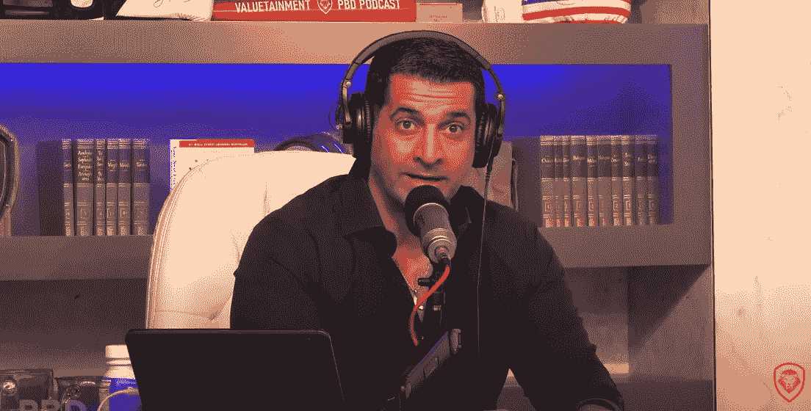
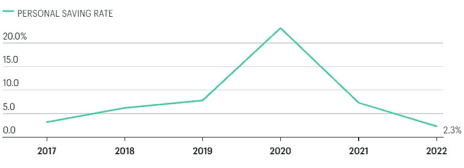

# 忘了比特币吧——你不存钱太鲁莽了(帕特里克·贝特-大卫)

> 原文：<https://levelup.gitconnected.com/forget-bitcoin-youre-being-reckless-not-saving-money-patrick-bet-david-d347b354a51d>

你会看到这位千万富翁对美国历史上最低储蓄率的惊人反应。

来源— [帕特里克·贝特-大卫](https://www.youtube.com/watch?v=Nng9gKXhK5c) YouTube

帕特里克·贝特·大卫是美国梦的缩影。

他是一个伊朗人，从一个饱受战争蹂躏的国家逃到德国的一个难民营，最终身无分文来到了美国。

他的父亲是一家 0.99 美分商店的收银员，他的母亲靠福利救济生活。

帕特里克的净资产现在估计有 2 亿美元，这是一个惊人的白手起家的故事。

现在，他利用自己的巨大平台，为创业和金融发声。他也是比特币的大力支持者。

帕特里克说，他在比特币和以太坊都有头寸，但人们不会说他对此充满热情。

对他来说这只是一种投资工具。

他表示，比特币对他来说是有意义的，因为去中心化的部分将更多权力还给人们，并消除了政府对你资产的集中控制。

> 帕特里克·贝特-大卫:
> 
> “我越想越觉得有意义的部分是乌克兰和俄罗斯发生的事情，以及加拿大卡车司机发生的事情。
> 
> 他们(政府)可以关闭你的支票账户，如果他们愿意的话。
> 
> 他们可以关闭很多东西。
> 
> 如果我在伊朗的家人正经历艰难时期，我也不能给他们寄黄金。"

帕特里克说，价值交换的方向正在发生变化，区块链对年轻观众来说更有意义。

他说，当颠覆和变化发生时，没有人知道谁是对的，但有一方对它一直以来的样子感到舒服，害怕变化。

他们是投资黄金和股票的人。

他们投资这些东西，并期望其他人也这样做，因为他们认为年轻一代不知道他们在做什么。

对他们来说，比特币是个骗局。

> 帕特里克·贝特-大卫:
> 
> “那些人可能是正确的，但他们也可能是错误的。
> 
> 另一方面，年轻一代说我们不喜欢事情的处理方式。
> 
> 他们不信任美联储。
> 
> 如果黄金支持他们的钱，他们会相信黄金，但事实并非如此。
> 
> 他们不再信任中央集权的货币体系，并希望它分散化。"

帕特里克说没有人 100%确定谁是正确的，但是我们必须注意年轻人在做什么。

诚然，一些像查理·蒙格这样的老投资者称比特币为“老鼠药”。

# 帕特里克看到了比比特币更值得关注的问题。

2019 年至 2020 年，美国的年同比个人储蓄率大幅上升，但在过去一年中大幅下降。

根据经济分析局的数据，美国人把大部分收入花在了他们的储蓄上。

今天的储蓄率是有史以来第二低的。

来源— [经济分析局](https://www.bea.gov/news/2022/personal-income-and-outlays-september-2022)

Patrick 认为，这对于那些资金被捆绑在数字资产上、工作在经济不景气时可能会被解雇的年轻人来说很可怕。

> 帕特里克·贝特-大卫:
> 
> “你知道那有多可怕吗？
> 
> 美国是世界上最富有的国家，但储蓄率却排在倒数第二。
> 
> 由于物价上涨和日常生活的回归，人们再次外出旅游，美国人消费更多，储蓄更少。"

Patrick 表示，人们拥有可观的储蓄，持有大量现金，并投资于数字资产。

尽管如此，在通胀趋势高于工资增长的情况下，总得有所让步。

他表示，一些现实生活中的场景可能会发生在储蓄不足的人身上，这些人轻率地投资于投机性资产，并在光景好的时候花掉了他们的储蓄。

> 帕特里克·贝特-大卫:
> 
> “人们不会因为有钱就以应有的价格出售房子。
> 
> 人们仍然可以得到现金。
> 
> 他们不计后果，不存钱，认为钱会定期到来。
> 
> 人们还没有意识到明年失业率会上升，最终，在接下来的 6 个月、9 个月和 12 个月，他们会告诉他们的伴侣我们需要现实一点，卖掉房子。
> 
> 以下是我们将与房地产经纪人进行的对话。
> 
> 你认为你有一个价值 100 万美元的房子，但在崩盘时，它充其量不过是一个价值 79 万美元的房子。
> 
> 房地产经纪人必须像医生一样坐在病人面前，说相当于“如果你不停止减肥和吃甜食，你将在未来 12 至 24 个月内心脏病发作并死亡。”
> 
> 医生必须进行这样的对话。
> 
> 人们会意识到他们的经济状况会导致心脏病发作。"

帕特里克说，很少有人喜欢关注导致可怕生活事件的趋势标志，无论是健康、财务还是个人关系。

他说，当情况好的时候，人们变得非常傲慢，但没有存款，他们现在将经历艰难的时刻，有些人将经历痛苦，因为他们将在公司的裁员名单上。

> 帕特里克·贝特-大卫:
> 
> “想象一下晚上睡觉。那是一个可怕的地方。
> 
> 我要提醒这些人，一年半前你非常傲慢，每隔 90 天就欺负你的雇主要求加薪。
> 
> 你威胁说如果他们不给你加薪你就离开。
> 
> 如果你在听这个，你知道你是谁。
> 
> 你做到了。
> 
> 换工作告诉我，你需要学习如何处理冲突，但最终还是会辞职。
> 
> 你才是问题所在，不是公司的问题。不是组织的问题。
> 
> 你态度消极。你可能也会让其他人辞职。你吸走了这个地方的生命。
> 
> 你有问题。
> 
> 你做了五个决定，今天你的情况就不同了。
> 
> 如果你的生活很好，过去五年的那些决定会帮助你。"

# 最后的想法

帕特里克·贝特-大卫是个直言不讳的人。

明确地说，他的论点针对的是没有存钱的美国人。

他是一个直言不讳、直言不讳的共和党人。无论你的政治立场是什么，你都不得不钦佩他的故事，他几乎是白手起家。

考虑他的建议。

存钱很可能是他成长过程中基因的重要组成部分，尤其是当他没有太多钱的时候。

我认为作为一名移民，你会有不同的思维方式。

作为一个出生在南非、生活在英国的人，我不那么认为理所当然，也把存钱放在一个基座上。

也许这是我的天性。我还在想办法。

帕特里克对比特币的立场是不带感情色彩的——他支持比特币的价值，但警告称存钱将有助于你生存。

> 如果你想在 Web3 上阅读更多我的观点，可以考虑成为会员。你的会员费直接支持你读的作家。如果你用我的链接 [*注册，我会赚一小笔佣金。点击这里*](https://medium.com/@jayden_levitt/membership) *。*

*本文仅供参考；不应将其视为财务、税务或法律建议。在做出任何重大的财务决定之前，你可以咨询财务专家。*