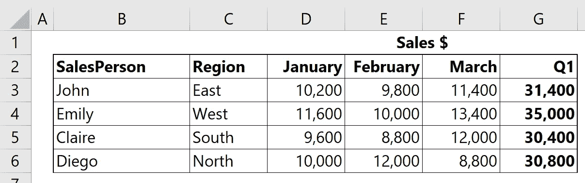

# 忘记 VLOOKUP()，改用 INDEX(MATCH())

> 原文：<https://levelup.gitconnected.com/forget-vlookup-use-index-match-instead-ba02f6a30c38>


由作者提供

## 为您的 Excel 数据分析使用更快、更灵活、更高效的替代方法

如果您曾经使用 Excel 进行过数据分析，您一定遇到过以下问题:



> 如何自动获得 John 或“North”地区一月份的销售额？

既然您正在 ***查找*** 特定值，那么您自然会使用 Excel 预编程的函数 **VLOOKUP()** 。毕竟，这就是它在这里的目的，不是吗？

为了你自己的利益和工作表的优化，不要这样做。

有一个更好的选择，将另外两个 Excel 函数合并成一个强大的搜索工具，使用起来更灵活，对资源的要求更低(也就是更快)。

这个替代品就是 **INDEX(MATCH())** 组合，它会让你的生活轻松很多！

# 比较两种方法

让我们考虑一下可供我们使用的两种方法:

`+VLOOKUP(*lookup_value;table_array;column_number;match_type*)`

`+INDEX(*array;row_number;column_number*)`

`+MATCH(*lookup_value;lookup_array;match_type*)`

**VLOOKUP()有一个主要的缺点**:它只考虑在你的数据范围的**第一列**中的 *lookup_values* 。在上面的例子中，您可以按人员搜索销售额，但不能按地区搜索。你必须移动你的数据，这是你不应该做的。

**INDEX(MATCH())立刻显得更加灵活，**因为你可以向它传递任何行号或列号。此外，您可以拆分公式(MATCH()在一个单元格中，INDEX()在另一个单元格中)，这进一步提高了速度。

让我们比较以下搜索和两种方法返回的结果:


我们看到两种方法返回相同的结果。两者都找不到“Jane ”,因为它不在数据表中。

INDEX(MATCH())的明显优势在于它接受另一列中的搜索词(即查找值)，您只需要稍微调整一下公式，而 VLOOKUP()根本无法处理请求。

# 如何使用 INDEX(MATCH())？

在上面的示例中，如果我们想要查找 John 一月份的销售额，您应该运行以下函数:

`+INDEX($B$2:$G$6;MATCH("John";$B$2:$B$6;0);MATCH("January";$B$2:$G$2;0))`

如果您有数千行和数千列的数据，为了不加快搜索速度，您还可以:

```
B15 = MATCH("John";$B$2:$B$6;0)
B16 = MATCH("January";$B$2:$G$2;0)
B17 = INDEX($B$2:$G$6;B15;B16)
```

现在，假设您想要搜索东部地区二月份的销售额，您只需要更改一些参数，瞧:

```
B15 = MATCH("East";$C$2:$C$6;0)
B16 = MATCH("February";$B$2:$G$2;0)
B17 = INDEX($B$2:$G$6;B15;B16)
```