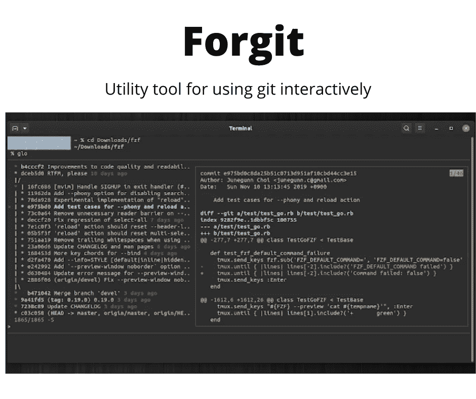
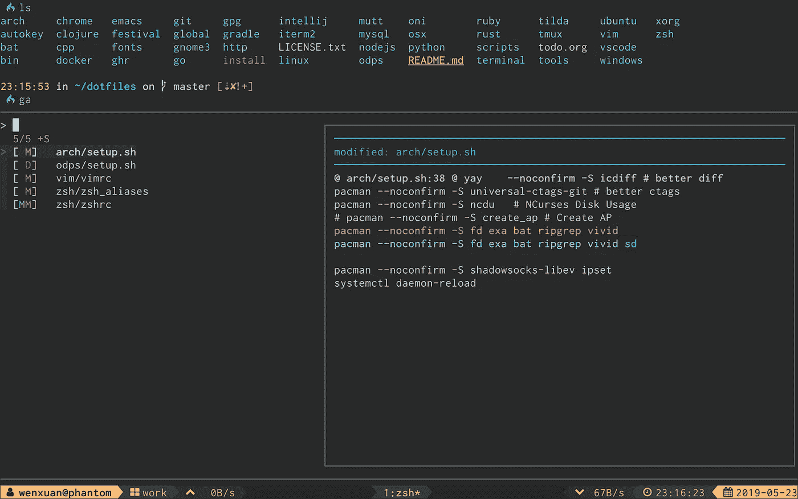
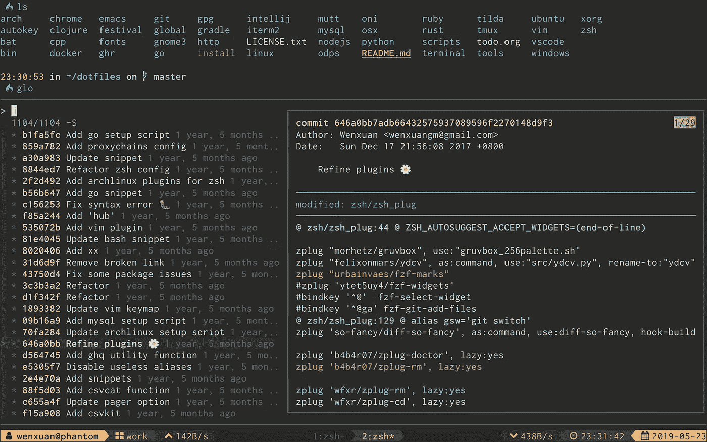
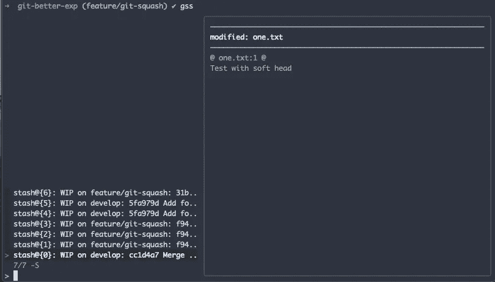

# forgit——交互式使用 git 的实用工具

> 原文：<https://levelup.gitconnected.com/forgit-a-utility-tool-to-use-git-interactively-454180970610>



Forgit —轻量级 CLI 工具

Forgit 是一个轻量级的 CLI 工具，可以帮助你交互式地使用 git。这个工具是一个非常有用的工具，可以帮助你有效地工作。

## 装置

这个工具使用`[**fzf**](https://github.com/junegunn/fzf)**.**` ，所以不要忘记下载它。

要安装 fzf，请针对您各自的平台遵循`[**these instructions**](https://github.com/junegunn/fzf#installation)`。

要安装 Forgit，

## 使用

Forgit 中一些有用的命令

## git 添加

默认命令是 **ga**



在上图中，你可以看到交互式屏幕。

你可以使用`**arrow keys**`来上下导航。

## git 日志

默认命令是 **glo**



由于该工具使用 fzf，您可以模糊搜索日志。

## git 贮藏

默认命令是 **gss**



## 更改默认别名

Forgit 还提供了更改默认别名的选项。

只需在您的 shell 中配置这些变量并对其进行编译。一些常见的变量是:

```
forgit_log=**glo**forgit_diff=**gd**forgit_add=**ga** forgit_stash_show=**gss** forgit_cherry_pick=**gcp**
```

对于选项的完整列表，您可以查看[这个配置](https://github.com/wfxr/forgit#--options)来更改别名。

Forgit 可能需要一些时间来适应你的工作流程，但是它是一个非常有用的工具，在很多地方都很方便。

感谢您的阅读:)

> 如果你已经来了这么久，那么我想你会对 Git 更感兴趣。可以订阅我的简讯[**Git better**](https://gitbetter.substack.com/)**获取 Git 的招数、技巧、高级话题。**