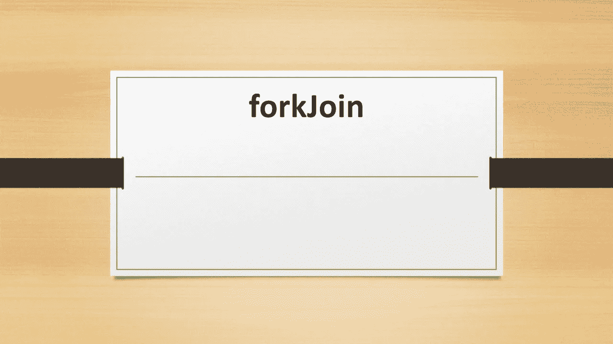
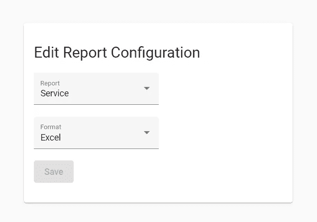

# 叉连接

> 原文：<https://levelup.gitconnected.com/forkjoin-10e2ddf3e6ca>

## forkJoin 是最有用的 RxJS 操作符之一。让我们理解它。



forkJoin rxjs 运算符

在有角度的表单中，我们需要填充下拉框/选择框。这些下拉列表包含通常不可变的主数据。假设我们有报告配置表单，它有两个下拉菜单，分别用于报告类型和报告格式，如下所示。



ForkJoin 运算符

现在，我们在组件中创建了一个表单，并为 Dropdown1、Dropdown2 和之前保存的配置调用了三个 API。

显然，我们使用 form 并维护三个变量来显示 html 中的 loader。一旦我们在各自的 API 中得到响应，我们就将这些变量设置为 true。

```
*isReportsAvailable=false;* isReportFormatAvailable=false;
isReportDataAvailable=false;
```

在 Html 中，我们使用如下的加载器和表单。

在这里，我们在 ng-container 上使用 if 条件来显示从所有 API 获得响应后的加载器。

```
*ngIf=”isReportsAvailable && isReportFormatAvailable && isReportDataAvailable else loading”
```

它工作得很好，但是这个代码的问题是我们用变量来维护状态。想象一下有许多 API，我们的代码库会因为不必要的变量而膨胀。发生这种情况是因为我们正在等待所有的 API 完成，并在它之后做一些操作。

ForkJoin 运算符正是在这种情况下使用的。

## 当我们想要并行调用我们的 API，并且想要在接收到所有响应后进行操作时，我们使用 forkJoin。

让我们重构代码。

显然，ForkJoin 在一个数组中获取可观察值，在 map 操作符中，我们在所有可观察值完成后接收响应，我们还可以轻松地进行操作，如设置变量或维护状态。在 Html 中，我们只使用了一个变量，如下所示。

```
<ng-container *ngIf=”isAllDataAvailable else loading” [formGroup]=”form”>
```

我希望你学到了有用的东西。

我在 Udemy 上创建了一个 Angular 课程，涵盖了 Angular 中的许多实际问题和解决方案，包括这个。这可能是你职业生涯的垫脚石。 [***请看一看。***](https://www.udemy.com/course/angular-practicals/?couponCode=F48E50E6ECF6D99AD500)


角实践

也可以观看/订阅我的免费 [**YouTube 频道**](https://www.youtube.com/channel/UC30-Z9Lz8DWe_Vq93dOs-Gw) **。**

请订阅/关注/喜欢/鼓掌。