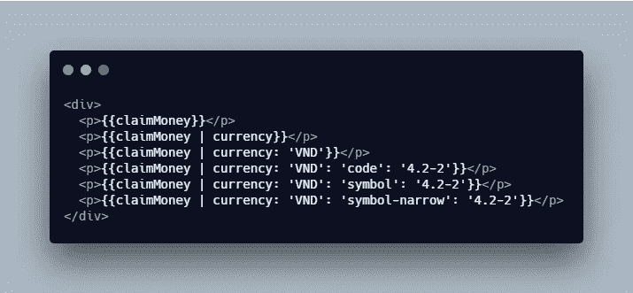
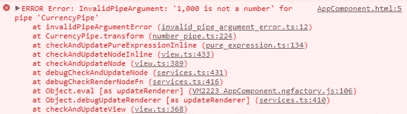
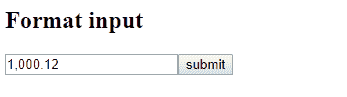

# 以角度格式表示货币

> 原文：<https://levelup.gitconnected.com/format-currency-in-angular-86b3babd3878>

## 有角的

## 在 Angular 中将数字转换成格式化货币的指南


Cyril Saulnier 在 Unsplash 上拍摄的照片

在这篇文章中，我将向你展示如何处理 Angular 中的货币。

1.  当前管道
2.  在 HTML 中使用 CurrencyPipe
3.  在 TypeScript 中使用 CurrencyPipe

更多类似的内容，请查看 https://betterfullstack.com 的

# 当前管道

`CurrencyPipe`将一个数字转换成货币字符串，根据地区规则进行格式化。这决定了组大小和分隔符、小数点字符以及其他特定于区域设置的配置。

下面是来自`@angular/common`的实现:

@angular/common 中的电流管

您可以阅读上面的描述，以了解每个参数的更多信息。

# 在 HTML 中使用 CurrencyPipe

在这一节中，我将提供货币管道如何在 Angular HTML 模板中工作的例子。

每个示例都将使用相同的模板设置:



首先，让我们将`claimMoney`设置为`1`。它将产生以下结果:

```
1
$1.00
₫1
VND0,001.00 // this because I set min integer to 4
₫0,001.00 // this because I set min integer to 4
₫0,001.00 // this because I set min integer to 4
```

现在将`claimMoney`设置为`1000`。

```
1000
$1,000.00
₫1,000
VND1,000.00
₫1,000.00
₫1,000.00
```

最后将`claimMoney`设置为`'1,000'`。`CurrencyPipe`期望该值是一个数字，或者使用 JavaScript 强制为一个数字。由于我们的字符串中有一个逗号`,`，它不会被识别为数字，在解析时会变成`NaN`。



我得到一个错误。表示`CurrencyPipe`不接受上面`value:any`中的逗号。

# 在 TypeScript 中使用 CurrencyPipe

很多时候我不得不在一个角度组件中处理货币，这个角度组件是一个`.ts`文件。

这里有一个样例问题。我调用一个 API，它返回一个数字，格式是`1110.5`。然后我必须把它插入到一个表格中。然后，我允许用户编辑该数字，并将结果提交给服务器。

首先将`CurrencyPipe`注入`constructor`:

```
constructor(private currencyPipe : CurrencyPipe, private fb: FormBuilder){}
```

然后，我将数字格式化，并将该值插入到`ngOnInit()`生命周期的表单中:

```
ngOnInit() {
    this.claimMoney = 1000.12; // this value get from API
    this.claimForm = this.fb.group({
      total: [ this.formatMoney(this.claimMoney), Validators.required]
    });
}

formatMoney(value) {
    const temp = `${value}`.replace(/\,/g, "");
    return this.currencyPipe.transform(temp).replace("$", "");
}
```

为了获得转换后的结果，我添加了一个名为`transformTotal()`的方法:

```
transformTotal() {
    const value = this.claimForm.controls.total.value;
    this.claimForm.controls.total.setValue(
      this.formatMoney(value.replace(/\,/g, "")), 
      {emitEvent: false}
    );
}
```

这个将从组件模板的输入中调用。



# 摘要

这篇文章提供了一个简单的方法来处理 Angular 中的货币。这有助于减少开发人员在应用程序中实现**格式货币**的时间和错误。

我希望这篇文章对你有用！你可以在我的网站上找到我。欢迎在下面的评论中留下任何问题。我很乐意帮忙！

点击此处查看源代码。

[](https://stackblitz.com/edit/angular-currency-1?embed=1&file=src/app/app.component.html) [## 角-货币-1 -堆叠

### 导出到 Angular CLI 的 Angular 应用程序的启动项目

stackblitz.com](https://stackblitz.com/edit/angular-currency-1?embed=1&file=src/app/app.component.html) 

# 资源/参考资料

[ [1](https://www.hoangtran.co/assets/2-angular-currency/cover.jpg) :角流管【https://angular.io/api/common/CurrencyPipe#ngmodule】T4

[](https://betterfullstack.com/stories/) [## 故事-更好的全栈

### 关于 JavaScript、Python 和 Wordpress 的有用文章，有助于开发人员减少开发时间并提高…

betterfullstack.com](https://betterfullstack.com/stories/)