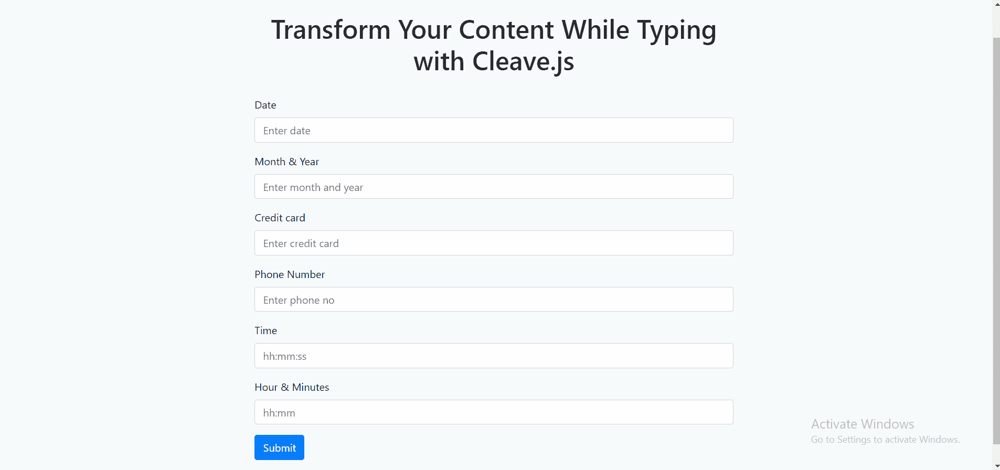

# 使用 Cleave.js 键入时格式化您的内容

> 原文：<https://levelup.gitconnected.com/format-your-input-content-while-typing-with-cleave-js-b249f9686c9a>

## 在 Angular 应用程序中自动转换输入内容。



最后结局

我刚刚发现了一个非常有用的开源 JavaScript 库，它可以将你的输入内容格式化成你想要的任何格式。我们的大多数应用程序都包含表单，这将帮助您提高他们的 UX。这将简化您的工作，而不是创建将输入文本内容转换为所需格式的自定义管道或指令。以下是该库中提供的一些功能:

*   信用卡号码格式
*   电话号码格式
*   日期和时间格式
*   数字格式
*   自定义分隔符、前缀和块模式

# 装置

只需运行以下命令，在 Angular 应用程序中安装 cleave.js。

```
npm install cleave.js --save
```

我们还需要安装 jQuery 来使它正常工作。

```
npm install jquery --save
```

# 设置表单

安装完成后，我们将创建一个包含几个输入表单字段的表单。在这里，我使用了一个带引导的 Angular 8 应用程序。查看此[链接](https://medium.com/javascript-in-plain-english/build-angular-8-project-with-bootstrap-7b89775e5764)了解如何使用 Bootstrap 设置 Angular 8 应用。

接下来，我们需要创建`profile.ts`并更新我们的`app.component.html`和`app.component.ts`。你也可以查看这个[链接](https://github.com/aimanrahmattt/cleaveform)来获得这些文件的完整代码。

确保将此添加到您的`app.component.ts`中。

```
import "cleave.js/dist/addons/cleave-phone.us";
declare var Cleave: any;
```

对于这个演示，我只使用美国手机格式。你也可以改变它的基础上，你想要的国家或使其动态和检查这个路径`node_modules/cleave.js/dist/addons/`进口该国的手机格式文件。

# 日期格式

下面是将日期格式化为 YYYY-MM-DD 格式的示例代码。

```
this.date1 = new Cleave('#date1', {
  date: true,
  delimiter: '-',
  datePattern: ['Y', 'm', 'd']
});
```

上面的示例代码将找到一个元素，其中`id`等于`date1`，并根据`datePattern`设置分隔符和模式。您还可以将它查找元素的方式从`id`更改为 CSS `class`。只需将`#date1`更改为`.date1`或引用输入标签创建的任何 CSS 类。

# 信用卡格式

下面是将输入内容更改为信用卡格式的示例代码。

```
this.creditcard = new Cleave('#creditcard', {
  delimiter: ' ',
  blocks: [4, 4, 4, 4],
});
```

# 手机格式化

下面是将输入内容更改为美国移动电话格式的示例代码。您可以参考此路径`node_modules/cleave.js/dist/addons/`获取可用的国家代码。

```
this.phone = new Cleave('#phone', {
  phone: true,
  phoneRegionCode: 'US'
});
```

# 时间格式

下面是将输入内容更改为时间格式(hh:mm:ss)的示例代码。

```
this.time1 = new Cleave('#time1', {
  time: true,
  timePattern: ['h', 'm', 's']
});
```

您可以在此[链接](https://nosir.github.io/cleave.js/)中查看许多其他示例。

# 结论

在本文中，我们学习了如何将输入内容转换成几种格式，如日期、时间、信用卡和手机格式。

如果你认为这篇文章是有帮助的，不要忘记与你的朋友分享。

# 资源

1.  https://nosir.github.io/cleave.js/