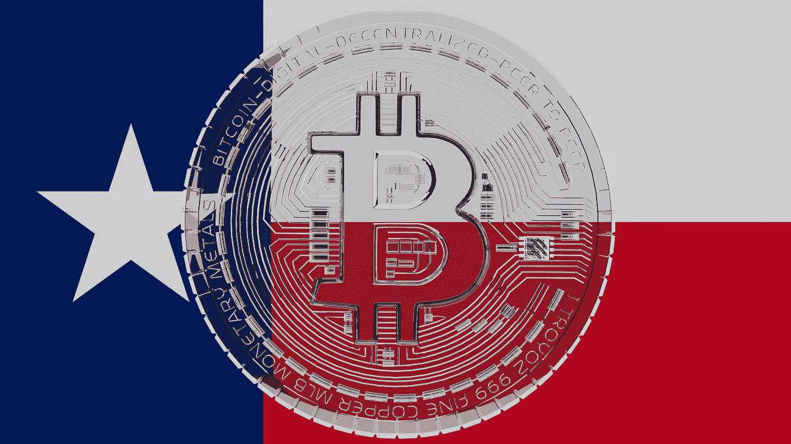

# 沃斯堡成为美国首个在市政厅开采比特币的城市

> 原文：<https://levelup.gitconnected.com/fort-worth-becomes-the-first-u-s-city-to-mine-bitcoin-inside-city-hall-1be4d7c691b5>

## 不要惹德克萨斯

图片来自 [Shutterstock](https://www.shutterstock.com/image-illustration/3d-rendering-large-transparent-glass-bitcoin-1935972724)

在通过一项探索比特币采矿的决议后，沃思堡市立即采取了行动——正如他们所说，“不要惹德克萨斯”。

在市长 Mattie Taylor 的领导下，一个小型的比特币矿场现已在市政厅建成，用于试点该计划，截至 4 月 26 日，[的三台采矿机器](https://youtu.be/6pSCjCmJqpY)现在每天 24 小时、每周 7 天运行。

如果这一举措证明有利可图，该合资企业可能会与 Luxor Technologies 合作扩大规模。Luxor Technologies 是一家领先的比特币采矿公司，允许矿商集中他们的技术资源，以最大限度地提高投资的时间(和能量)回报。

# 什么是比特币挖矿？

[比特币挖矿](/bitcoin-mining-vs-gold-mining-vs-money-printing-9bbf6152e533)是维持支撑加密货币的比特币计算机网络的过程，通过这个过程，新的比特币被发行，因为它越来越接近发行 2100 万比特币的限量发行。

比特币网络由数千个类似沃思堡现有的采矿平台组成，这些平台分布在世界各地，没有单一的所有者、个人或国家控制，比特币完全是去中心化的。

据估计，市政厅里运行的每台矿用计算机消耗的能量与一台家用真空吸尘器消耗的能量相同。这种电力成本将由每台钻机估计从网络中产生的新比特币抵消，作为支持网络的回报，以及作为“区块奖励”，因为计算机将获得新的比特币，作为对其处理能力的回报。

来源:[推特](https://twitter.com/AB_Brammer/status/1519066147588648966?s=20)

# 沃斯堡的优势

随着时间的推移，市政厅内运行的采矿计算机应该能够自我维持，甚至可能开始以比特币的形式为市议会创收，这些钱将被添加到该市的资产负债表中。

泰勒市长认为这是第一步，可能会导致更多的采矿活动，并提高沃思堡作为技术和加密货币前沿创新城市的声誉。她[评论](https://www.cnbc.com/2022/04/26/fort-worth-tx-the-first-city-in-the-us-to-mine-bitcoin.html):

> “我们是全国发展最快的城市。尤其是在北德克萨斯和沃思堡周围有很多令人兴奋的事情。为了真正保持这种能量，我们必须以不同的方式推动自己，我们认为加密货币是我们未来经济的重要组成部分。”

# 沃思堡加入迈阿密成为比特币友好城市

Forth Worth 正在利用德克萨斯区块链委员会的成立，该委员会旨在协调和促进该州的区块链和加密货币计划。2021 年 6 月，州长格雷格·艾伯特宣布[德克萨斯州为比特币友好州](/what-could-be-the-effects-of-texas-declaring-itself-a-bitcoin-friendly-state-f14faf010892)。

沃思堡现在加入了许多其他美国城市的行列，这些城市正在接受比特币和加密货币带来的可能性，包括佛罗里达州的迈阿密。

2021 年，迈阿密市长 Francis Suarez 做出了他的[承诺](https://www.forbes.com/sites/rogerhuang/2021/02/01/miamis-mayor-leads-the-charge-to-bring-bitcoin-to-americas-largest-cities/)，为了迈阿密的利益，更广泛地采用比特币。他宣布，市民将能够使用比特币支付服务，他正在研究将比特币作为该市部分国库的投资，以抵御通胀。

来源:[推特](https://twitter.com/FrancisSuarez/status/1455562833006059528?s=20)

苏亚雷斯还承诺接受自己的比特币薪酬，佛罗里达州州长罗恩·德桑蒂斯最近宣布，该州将允许一些政府服务也因使用比特币而付费。

随着美联储、美国证券交易委员会和其他各种政府机构摇摆不定，而不是对比特币和加密货币采取明确和决定性的立场，各城市和州继续选择自己的立场。

Forth Worth 是第一个拥有比特币的美国城市。这种大胆创新的举措将有望很好地服务于这座城市及其居民。

如果你喜欢阅读这样的故事，并且愿意支持我和媒体上的其他作家，可以考虑注册**成为媒体会员。一个月 5 美元，给你无限的故事。如果你注册使用* [*我的链接*](https://tobyhazlewood.medium.com/membership) *，我会赚一小笔佣金。**

* [## 通过我的推荐链接加入灵媒——托比·黑兹伍德

### 作为一个媒体会员，你的会员费的一部分会给你阅读的作家，你可以完全接触到每一个故事…

tobyhazlewood.medium.com](https://tobyhazlewood.medium.com/membership) 

注意:*本文仅供参考。不应将其视为财务或法律建议。在做任何重大财务决定之前，先咨询财务专家。**