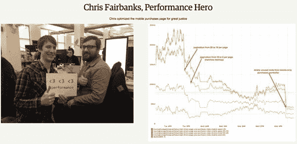

# 培养网络绩效文化

> 原文：<https://levelup.gitconnected.com/fostering-a-web-performance-culture-41360eb8dd36>

## Web 性能不仅仅是理解是什么让一个网站变得快速。这是关于在开发人员和非开发人员之间建立意识。性能是一个特性，需要优先考虑。

表演是一个让我感兴趣很久的话题。记得我学动态编程的时候，贪心或者分治算法。让一段需要几分钟才能运行的代码在几秒钟内运行起来是一件令人满意的事情。

转移到 web 上，性能问题就不同了。通常，它们与计算复杂性无关，而是在需要的时候以最好的方式提供所需的服务。这看起来似乎很容易，但比看起来要困难得多。

Steve Souders 是第一个对浏览器请求和等待资源的方式进行逆向工程的人。哪些资源在阻塞？哪些可以延迟？响应头呢？他在[列出了 14 条加快网站加载速度的规则。如果你曾经使用过 YSlow，这些是该工具用来标记性能问题的](http://stevesouders.com/hpws/rules.php)[规则](https://blog.keycdn.com/blog/wp-content/uploads/2016/03/yslow-score-test-results-e1457987091251.png)。

史蒂夫·苏德斯的 14 条规则([来源](https://blog.keycdn.com/blog/wp-content/uploads/2016/03/yslow-score-test-results-e1457987091251.png))

如今，我们有更多更好的工具来审计我们的表现。它们可以一次性运行，也可以集成到我们的开发和部署管道中。Google 的 [Lighthouse](https://developers.google.com/web/tools/lighthouse/) 就是其中之一，上面显示了 PWA、SEO 等信息。

灯塔 3.0 的截图，在 Google IO 2018 中呈现([来源](https://developers.google.com/web/updates/2018/05/lighthouse3))

这些工具使我们更容易确定我们需要把重点放在哪里来改进我们的网站。与此同时，它们打开了一扇通向许多可能令人应接不暇的概念的大门:PRPL、RAIL、画图计时 API、TTI、HTTP/2、速度索引、优先级提示[和更多](https://docs.google.com/presentation/d/1UcjvtuMT4VAmc-MySWOcc1rLkMNoDjt2DxIhvfHNRXg/present?slide=id.g35f8c548da_0_202) …

# 为什么性能没有得到优先考虑

组织的 Web 性能是一个真正的挑战。我们拥有比以往更好的指南和工具，但很少有公司花时间来提高绩效。你看，我们并不是不知道是什么原因导致我们的网站出现长时间的空白屏幕。

> *这不是一篇解释为什么网页性能很重要的文章。*

有很多其他资源做得更好，有来自真实项目的真实数字。**这是一篇关于文化以及文化如何决定我们公司优先考虑的事情的帖子**。只有理解了这一点，我们才能将性能作为项目的另一个特征。

如果你正在读这篇文章，你可能是一个了解 web 并关心性能的开发人员。如果我问你在哪里工作和做什么，你可以代表你的团队和公司。但是**很可能你并不能代表你团队和公司里的其他 web 开发人员**，除非你是独立工作的。这很好。同样的道理，你也不可能了解每一门学科的一切。

在您的日常工作中，您需要关注许多技术领域。你将努力实现功能，与其他团队合作(如添加分析脚本，广告，重定向，A/B 测试)，设置 CI/CD，确保安全，并确保项目可用和悦目。别忘了用测试覆盖你的背部。

你可能永远也不会有时间看得更远。时间是有限的，而你的积压工作却在不断增加。需要有一些优先次序。

**优先排序应该客观，并基于可衡量的假设。**“我们认为，通过实施特性 X，用户保持率将增长 Y%”。实际上，这种设置更加困难。让我们看看那些我们需要关心的话题，想想是谁提出的:

*   **实现特性**:通常 PO/PM 会根据团队的愿景和任务决定下一步需要做什么。该特性可能来自依赖我们的利益相关者(例如添加第三方脚本用于[跟踪或 A/B 测试](https://simonhearne.github.io/weak-links))
*   **建立 CI/CD** :虽然开发人员可以提出他们自己的构建和部署管道，但是他们很可能依赖于其他团队提供的一些基础设施(例如“infra”团队)
*   **安全性**:希望有一个对安全性有深入了解的团队或个人帮助我们审查系统设计、实现，并通知我们有关报告或和安全补丁。
*   **UI/UX** :通常有一个设计师和/或 UX 人来设定外观&感觉和信息架构。
*   测试:嗯，我们应该写一些测试，对吗？

当某人对要完成的任务负有责任时，他更有可能在董事会。其中大部分可以追溯到某个角色，但是其他的像测试是开发人员应该做的事情。测试取决于团队，因此某些部分会比其他部分测试得更好。

我们同意拥有自动化测试是积极的。通常团队决定如何覆盖和测试代码，团队中的所有开发人员知道如何编写测试是很重要的。与测试类似，性能通常留给开发人员来解决。我发现**为一段代码编写测试并了解生产中破损代码的含义比理解所有可能导致糟糕的 web 性能的移动盒子更容易。**

# 建立网络绩效文化的 6 个步骤

我们有衡量绩效的工具，尽管这取决于团队。如何才能达到认知度，把性能当成一个特性，并得到公司的支持？

我收集了 6 个想法，可以帮助你建立网络绩效文化。

# 1.您的开发环境不是您的用户环境

图片由 [Unsplash](https://unsplash.com?utm_source=medium&utm_medium=referral) 上的[émile Perron](https://unsplash.com/@emilep?utm_source=medium&utm_medium=referral)拍摄

我用 Macbook Pro 开发网站。我有一个 iPhone X 作为我的手机，和我的测试设备。此外，我的互联网连接速度非常快，而且我离位于斯德哥尔摩和伦敦的数据中心很近。当我结束一天的工作时，我会乘地铁，在那里我有不间断的 4G 连接。事实上，早在 2009 年，斯德哥尔摩就是第一个安装 4G 网络的城市。

除了极少数情况，你的产品的用户没有类似的环境。差远了。

**如果我们没有察觉到性能问题，我们如何确定性能的优先级？这就像不使用键盘导航、屏幕阅读器或颜色对比检查器就能让某些东西变得易于访问一样。没有办法。**

这是不会改变的。西方网络开发者喜欢使用最新的笔记本电脑和小工具。这个链条一直延伸到几乎所有负责对任务和项目进行优先排序的人，他们都是你的公司。不仅如此，在某些情况下，我们可能会优先考虑顶级设备，因为这些是最有可能为我们的产品付费的用户使用的设备。正如布鲁斯·劳森所说，我们应该建立“万维网，而不是富裕的西方网络”。

布鲁斯·劳森在 Fronteers 2016 上的演讲

问问你自己，拥有更多的用户，即使他们在经济上不那么值钱，是否比拥有更少的潜在好用户更好。

不使用用户设备的一个有趣的衍生是**我们做出错误的假设**。比方说，我们已经决定看看使用统计数据，弃用那些用户较少或使用较少的平台(例如每个会话的页面浏览量较少)，以简化开发和减少熵。**支持一个几乎没人用的老浏览器**毫无意义。有人可能会说这是一个指标驱动的决策。

嗯，没那么快。如果一个平台上的用户或使用量越来越少，因为它的可用性/趣味性/性能越来越差，那该怎么办？这一点很难证明，因为开发者会说“体验”就是他们在电脑上使用谷歌 Chrome 浏览器所看到的。没有恶意，我们倾向于优先考虑我们使用的浏览器，在这种优先考虑中，我们经常决定有利于现代环境的权衡。“为什么用户还在用那个浏览器，他们应该升级”我听到你在喊。

最近我看到了这句话，我很喜欢:

> “当我在谷歌的时候，有人告诉我一个故事，有一次“他们”完成了一个大的优化，却发现测得的页面加载时间增加了。当他们挖掘数据时，他们发现加载时间增加的原因是他们在进行优化后从非洲获得了更多的流量。该团队的产品从对网速慢的人不可用变成了可用，这导致太多网速慢的用户开始使用该产品，加载时间实际上增加了。” *—* [*丹·卢谈“网络膨胀”*](https://danluu.com/web-bloat/)

同样，通过忽略不好的指标，阻止破坏统计数据的用户，很容易伪造性能优化。这不是真正的性能优化，**这只是在玩数字游戏**。

为你自己和参与你项目的人准备一台旧设备。模拟恶劣的网络条件和缓慢的 CPU，使您的项目具有弹性。弄清楚用户拥有哪些设备，并根据用户在你的网站上使用的设备小心地进行优先排序。

# 2.学基础不如学图书馆

仍然有很多工作描述和面试过程关注的是图书馆，而不是底层技术。当浏览器试图加载一个网站时会发生什么？网站加载时间过长的原因是什么？你如何构建一个规模不小的 web 项目(客户机、服务器、数据库、缓存层)？

意识到这一点的开发人员在选择向项目添加什么 npm 库时会做出更好的决定。当与设计师和利益相关者一起构建功能时，他们将提供独特的观点。他们将密切关注新老浏览器 API，并试图利用该平台，而不是试图孤立它。

你的团队可能需要雇佣熟悉 React 或 Vue 的人。你希望他们从第一天起就富有成效，并推动项目向前发展。同时，你希望新员工在公司呆得更久，鼓励他们质疑现有的技术决策，并提出更好的决策。

作为一名开发人员，我反复看到两个常量:

1.  你需要挑战你自己的公司，否则竞争对手也会这么做。促进个人贡献者的反馈，给他们时间来创建创新的原型和概念验证。
2.  **你今天做出的技术决策寿命很短。**针对删除、模块化和快速交付进行优化。

如果你同意上述观点，你将受益于那些对特定技术不感兴趣的人的想法，并能清楚地表达不同技术决策的利弊。

参与面试过程。提出有时间学习一些话题(午餐和学习/棕色袋子),并提出一些对你的项目有益的想法，这将引导我们进入下一个问题。

我过去常常给我的同事发送关于最新的 Google I/O talk 或 medium 文章的链接，这些文章讨论了一些新东西。我发现了解最新消息很有用，并且认为我也在让我的朋友了解最新消息。

**通常，盲目分享内容会让他们更加努力。**他们不仅要做好自己的工作，现在还要承受阅读你所分享内容的同辈压力。他们有机会通过实践更好地学习，所以现在他们有额外的压力，必须尝试新的库/技术/想法。

帮他们一个忙，试着将这种新鲜感应用到你公司的一个项目中。不要想“新的浏览器 API 听起来很酷”，而要想“**这就是使用 X 将如何改进我们的项目**”。当然，这更难实现，但更有价值。这就是你说服老板的方法。

有很多关于性能优化如何提高关键指标的研究，像 [WPO 统计](https://wpostats.com/)这样的网站是很好的案例研究来源。

大量案例研究表明，绩效变化带来了关键指标的改进。

显而易见，有时我们需要比这些案例研究更多的证据来优先考虑我们公司的绩效。

您可能会想，您永远不会有时间来完成这个概念验证。你正忙于处理票证，要么是修复错误，要么是添加一些新功能。

在我看来，功能应该是这样的:

这个想法可能来自 PO/PM，但**也可能来自开发人员**。它应该通过原型或 MVP 进行测试，证明它是可行的。只有这样它才会被建造。这也意味着我们构建的所有东西都应该有某种形式的验证。**我们应该被要求证明为什么制作高性能的网站会推动衡量标准，但这同样适用于任何其他功能。**

如果你不得不选择一些你想加速的东西，选择一个用户可以感知的。**为了让用户几乎看不到持续时间的差异，** [**必须至少改变 20%**](https://www.smashingmagazine.com/2015/09/why-performance-matters-the-perception-of-time/) **。**理想情况下，[争取 30%的速度提升](https://www.machmetrics.com/speed-blog/highlights-perfmatters-2018-web-performance-conference/)。

# 4.教育你的同事

你有没有遇到过这样的情况，某段代码被删除或替换，因为没有人理解它是做什么的？我们大多数人都去过那里。作者是唯一能够维护它并理解它的人。如果那个人去度假、休育儿假、生病、离开公司，会发生什么？

趁着约翰不在，我们把这件事简化一下。

我们大多数人在团队中工作，我们需要强调选择大多数同事理解的解决方案。**找出团队中的最小公分母，避免过度设计的解决方案，因为它们构建起来很有趣**。当谈到性能优化时，为了少量的节省而引入大量的复杂性是非常容易的。

在加载图像之前，我们可以在占位符中显示不同的内容。

几个月前[我写了关于图像优化和如何提高感知性能的文章](https://medium.com/@jmperezperez/lazy-loading-images-on-the-web-to-improve-loading-time-and-saving-bandwidth-ec988b710290)。它从显而易见的开始:避免请求，选择正确的格式，优化图像。然而，大多数人只记得创造性地使用占位符来平滑过渡到最终图像。

当然，这是最有趣和最有创意的部分！现在，去找你的团队，告诉他们你将创建一个后端服务，它将处理队列中的图像，并存储一个在渲染时在线提供的小缩略图。什么时候运行？跑步需要多长时间？你在哪里储存？如何通过不同的服务器进行扩展？

最大的节省是通过不提供图像和优化您提供的图像来实现的。那是甜蜜点。以此为目标。

除了选择你的团队中大多数人都理解的“足够好”的解决方案，**想想如何提高你的团队的标准**。你是某个领域的专家吗？安排一个演示，给他们看。让他们兴奋起来。

如果你是唯一一个推动一个想法的人，它迟早会死去。

# 5.分享和庆祝成功(和失败)的故事

改变一个公司的文化是从小战斗开始的，通常是在团队层面。在团队之外分享你的实验结果。

在公司内部，**它将激励同事，并衍生出更大的计划**。如果几个团队有相同的需求，就更容易获得基础设施或服务的支持。

对外来说，**这是一种吸引人才、向客户和用户妥协的方式**。

谈到 web 性能，我特别喜欢 Etsy 的开放性。内部:

> “Etsy 的绩效团队维护着一个仪表盘，用来表扬其他团队中为绩效改进做出贡献的人。我们附上了他们的照片、显示性能改进的图表，以及对他们的解决方案的简要描述。”— [*Lara Hogan 谈“改变你组织的文化*](http://designingforperformance.com/changing-culture/)*”*

Chris Fairbanks 承认优化了 Etsy 的移动购买页面

对外而言，[他们多年来一直在谈论和发布](https://www.slideshare.net/mikebrittain/web-performance-culture-and-tools-at-etsy)他们面临的挑战和表现状态。

左边，[2011 年 Etsy](https://www.slideshare.net/mikebrittain/web-performance-culture-and-tools-at-etsy) 关于网络绩效文化和工具的演示。在右边，[在他们的博客](https://codeascraft.com/category/performance/)上报告站点性能。

在谈论性能改进之前，重要的是要开诚布公，明确当前的状态以及我们希望达到的目标。最好的例子之一是 Vox Media，它是 The Verge 和其他高流量网站的幕后公司。2015 年 5 月，Vox Media 写了他们网站的缓慢，并承诺让他们更快。

> “我们的首要任务是先发布，后迭代，在我们有时间充分完善和优化我们的最新版本之前，我们经常不得不转移到下一个大项目，这导致我们积累了相当**大量的性能债务**。” *— Vox 传媒的* [*宣布业绩破产*](https://product.voxmedia.com/2015/5/6/8561867/declaring-performance-bankruptcy) *(重点矿山)*

几个新闻网站的速度曲线报道，包括 Vox 媒体的 The Verge ( [来源](https://product.voxmedia.com/2015/5/6/8561867/declaring-performance-bankruptcy))。

Vox Media 采用了一些性能指标(首次上色、页面完成和速度指数)并确定了一个目标。然后，他们承诺改进它，并定期发布性能更新帖子。

左边是 Vox Media 的业绩预算。在右边，他们的许多帖子中的一个，在那里他们给出了状态的更新。

总的来说，不要害怕承认你的产品有不好的性能，并公开它。你会发现有人想帮助解决它，这将表明你致力于改善它。

# 6.让绩效成为您工作流程的一部分

将您的绩效检查整合到团队的常规工作流程中，并尽可能实现自动化，这一点非常重要。这样，你在宣传业绩时更有可能成功。

有很棒的工具可以检测性能问题，比如 [WebPagetest](http://webpagetest.org/) 、 [Pagespeed Insights](https://developers.google.com/speed/pagespeed/insights/) 或者 Chrome 开发工具上的[审计](https://developers.google.com/web/tools/lighthouse/)。它们有助于快速获得网站性能的报告。

WebPageTest 对于创建性能报告非常有用

您将希望自动化报告来检测问题，而不必依赖开发人员手动运行这些工具。

MVP 将设定一个[绩效预算](https://infrequently.org/2017/10/can-you-afford-it-real-world-web-performance-budgets/)，每天在你的生产现场进行绩效审计，并在预算没有达到时得到通知。这将有助于您捕捉问题并缩小可能导致问题的部署范围，而且您几乎不需要设置它。

如果你想超越，运行测试作为你的拉请求检查的一部分。这样，您就不会合并或部署降低性能的代码。这种类型的测试被称为 [syntethic](https://www.oreilly.com/ideas/web-performance-tools-synthetic-vs-rum) ，因为它是由一个具有预定义环境(设备、网络速度、位置……)的脚本自动执行的。

合成测试的补充是 RUM 测试。这些都是基于真实用户浏览你的网站。这个想法是收集一些度量标准，比如加载时间或[首涂](https://medium.com/@jmperezperez/performanceobserver-and-paint-timing-api-72d3e5b384ea)，并将它们发布到一些服务上，您可以使用这些服务来可视化和比较它们。

虽然你可以使用像谷歌分析这样的基本工具来定制事件，但我建议你使用专门为此定制的工具。检查[口径](https://calibreapp.com/)、[速度曲线](https://speedcurve.com/)或[现场速度](https://www.sitespeed.io/)。

Calibre 与 Slack 的整合。无论何时超出预算，Calibre 都会通知您。

**性能监控应该毫不费力。你应该只在需要采取行动的时候才知道。**

一般来说，使用这些工具需要付费订阅。其他开源工具，如 SiteSpeed，需要你来托管它，所以要考虑设置它的时间。重要的是，你要三思而后行，你会建议增加这些工具。

# 总结的一个具体例子

几个月前，我提议使用 Calibre 来监控 web 性能。在过去，我会把它作为另一个愉快的想法提出，但这一次我希望它成功。我是这样做的:

*   **亲自试用该产品。**注册试用，为我们的网站设置监控，使用现实条件(位置、网速)并开始收集数据。
*   **向团队展示。**一旦我对产品有了信心，我就为我的团队准备了演示文稿，展示我们遇到的问题，以及像这样的工具如何改善这种情况。我仔细检查了这个工具，并建议使用 3 个月，决定是否继续使用它。
*   **形式化。**我写了一份正式的建议书，以便利益相关者审阅。这包括像“为什么要使用某些东西”、“为什么要使用 Calibre”、“优点”、“缺点”和“路线图”这样的部分。每个人都喜欢在最后期限前决定是否使用付费产品。

这个提议为什么有价值？它勾选了我在文章中谈到的所有 6 个想法。

1.  它测试了几个地点和限制，而不是我们理想的办公条件。
2.  它独立于库/框架。你可以选择任何工具来建立你的网站，最终我们关心的是快速的体验。
3.  它被应用到我们的项目中，使解决方案变得相关，而不仅仅是随机文章的另一个链接。
4.  该团队被告知，知道如何使用该工具，并集体同意推进这项工作。
5.  它有助于可视化性能并看到其演变，这对于与公司的其他 web 开发人员共享结果是有用的。这些工具迫使您设置拒绝 PRs 或获得通知的阈值，这些阈值成为您的绩效预算。
6.  这是我们工作流程的一部分，可以毫不费力地运行，不会危及其他任务。

# 结论

感谢阅读！我希望我给了你一些提示来帮助你建立更好的网站。

*最初发表于*[*【jmperezperez.com】*](https://jmperezperez.com/fostering-web-performance-culture/)*。*