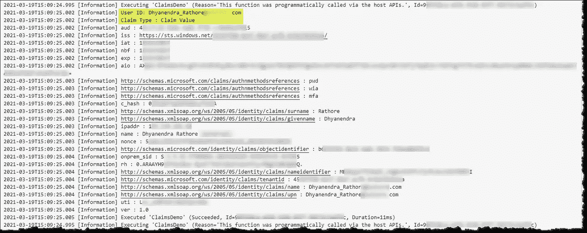
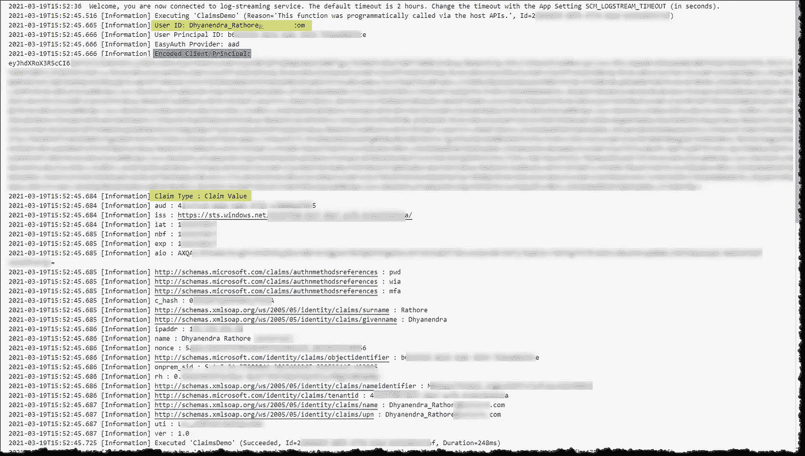
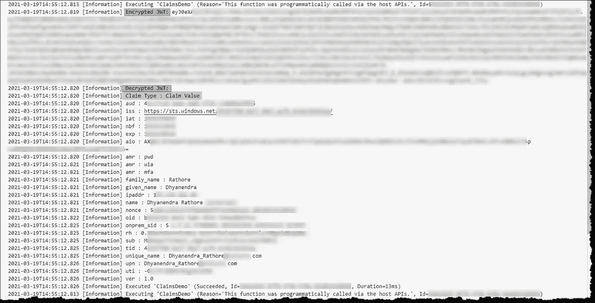
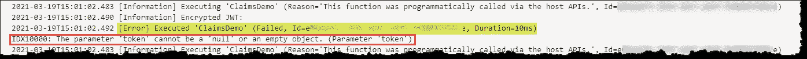

# 在. NET Azure Functions 应用程序中获取用户身份和声明的四种替代方法

> 原文：<https://levelup.gitconnected.com/four-alternative-methods-to-get-user-identity-and-claims-in-a-net-azure-functions-app-df98c40424bb>

## 关于如何在. NET Core Azure Functions 应用程序中获取用户身份和身份验证声明的全面指南


[亚历山大·奈特](https://unsplash.com/@agk42?utm_source=unsplash&utm_medium=referral&utm_content=creditCopyText)在 [Unsplash](/?utm_source=unsplash&utm_medium=referral&utm_content=creditCopyText) 上拍照

Azure App Service 提供内置的身份和认证支持，使用户识别和认证成为一项轻松的任务。

对于 ASP.NET 4.6(及更高版本)应用程序，`ClaimsPrincipal.Current`由经过认证的用户的身份和声明填充，使开发者能够遵循该标准。NET 代码模式。然而，在。基于. NET Core 的 Azure 函数，`ClaimsPrincipal.Current`不会自动填充，`Claims`必须通过不同的方式获得。

本文将介绍四种方法来访问。NET Core (C#)代码。

**注意:** *Microsoft Azure 是一项付费服务，遵循本文可能会导致您或您的组织承担财务责任。*

*在继续阅读本文之前，请阅读我们的使用条款:*[*https://dhyanintech . medium . com/disclaimer-disclosure-disclosure-terms-of-use-fb3 BF BD 1e 0e 5*](https://dhyanintech.medium.com/disclaimer-disclosure-terms-of-use-fb3bfbd1e0e5)

# 先决条件

1.  有效的 Microsoft Azure 订阅
2.  Azure 功能应用

启用应用程序服务身份验证时，每个传入的 HTTP 请求在被应用程序代码处理之前都要通过身份提供者的身份验证和授权模块。关于经过身份验证的客户端的信息可以作为一个 *ClaimsPrincipal* 对象和在特殊的头中获得。

*嗯……我如何启用应用服务认证？*

[](https://medium.com/geekculture/easyauth-in-functions-app-with-azure-active-directory-29c01cad8477) [## Azure Active Directory 功能应用中的“EasyAuth”

### 使用 Azure AD 在 Azure 功能应用程序中配置身份和身份验证

medium.com](https://medium.com/geekculture/easyauth-in-functions-app-with-azure-active-directory-29c01cad8477) 

# 将 Principal 声明为绑定参数

最直接的方法是从函数的绑定参数中获取`ClaimsPrincipal`对象。将`ClaimsPrincipal`作为附加参数包含在函数签名中。对象将被自动注入，类似于 ILogger 的注入方式。

获取 ClaimsPrincipal 作为绑定参数(C#)



ClaimsPrincipal:用户身份和声明(图片由作者提供)

# 从请求上下文中声明 Principal

`ClaimsPrincipal`对象也是请求上下文的一部分，可以从`HttpRequest.HttpContext`中提取。

从请求上下文中获取 ClaimsPrincipal)

`ClaimsPrincipal`的优点是易于引用和处理身份所代表的个人声明，允许快速验证或设计/决策逻辑实现。

# 来自请求标头的用户声明

应用服务通过使用特殊的请求头将用户声明传递给应用。不允许外部请求设置这些头，因此它们只有在由应用服务设置时才会出现。几个示例标题:

```
X-MS-CLIENT-PRINCIPAL-ID --User ID
X-MS-CLIENT-PRINCIPAL-NAME --User Name
X-MS-CLIENT-PRINCIPAL-IDP --Identity Provider's ID
X-MS-CLIENT-PRINCIPAL --Claims
```

从请求头获取用户声明(C#)



来自请求标头的声明(图片由作者提供)

# 来自身份验证令牌的用户声明

身份验证服务器将特定于提供者的令牌注入到请求头中，请求头包含经过身份验证的用户的详细信息和声明。这些令牌还可以用来访问用户信息和代码中的声明。

> 令牌头是 JSON web 令牌(jwt)。jwt 是加密的，在引用之前必须解密。

在我们的演示代码中，我们将从 Azure AD ID 令牌头获取声明:`X-MS-TOKEN-AAD-ID-TOKEN`

从身份验证令牌获取用户声明(C#)



来自认证令牌的声明(图片由作者提供)

*那么来自其他提供商的令牌头呢？*

[](https://docs.microsoft.com/en-us/azure/app-service/app-service-authentication-how-to#retrieve-tokens-in-app-code) [## AuthN/AuthZ - Azure 应用服务的高级用法

### 本文向您展示了如何在 App Service 中定制内置的身份验证和授权，以及如何管理…

docs.microsoft.com](https://docs.microsoft.com/en-us/azure/app-service/app-service-authentication-how-to#retrieve-tokens-in-app-code) 

想要在没有任何代码的情况下窥视你的 JWT 内部吗？

[https://jwt.ms/](https://jwt.ms/)

## 亲 tip

如果遇到*令牌不能为空*错误，请确保在应用程序的**身份验证/授权**设置中将**令牌存储**设置为上的**。**



令牌为空:必须启用令牌存储(图片由作者提供)

# 第三方

只是为了完成对话，有一些第三方开源中间件组件可以让事情变得简单。

现在我们配备了适合这项工作的工具。

# 结论

我们探讨了在. NET 核心应用程序中获取用户身份和声明的不同方法。我们用演示程序展示了处理索赔的简易性和复杂性。

## 喜欢这个帖子？与 Dhyan 联系

让我们做朋友吧！你可以在 [LinkedIn](https://www.linkedin.com/in/dhyans/) 上找到我或者在 [Medium](https://dhyanintech.medium.com/membership) 上**加入**我。