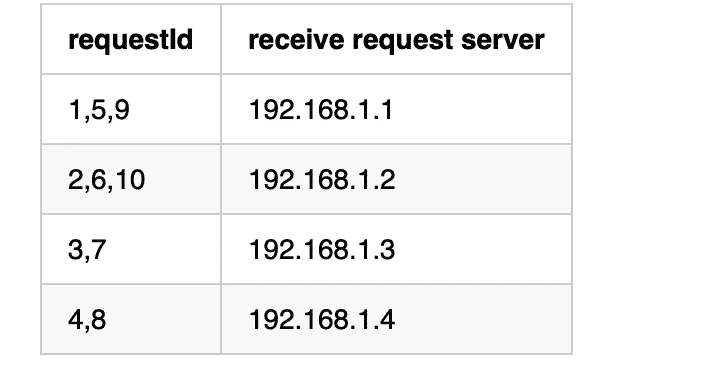
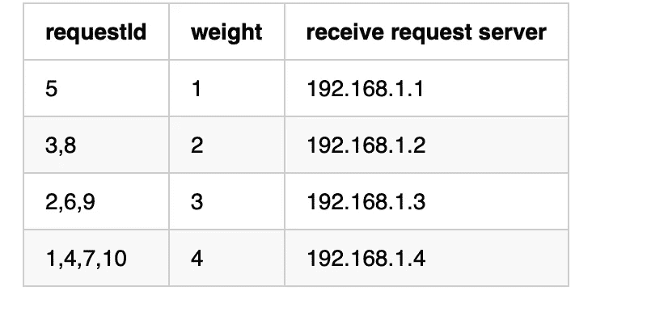

# 每个 Java 程序员都必须知道的四种负载平衡算法

> 原文：<https://levelup.gitconnected.com/four-load-balancing-algorithms-that-every-java-programmer-must-know-cba8d07fc3ec>

像我这样的软件架构师，必须掌握负载均衡算法。

一般来说，我们在设计系统的时候，为了系统的高可扩展性，会尽量将系统创建为无状态，这样就可以采用集群的方式进行部署，这样就可以根据系统的访问情况，方便地动态增加或减少服务器的数量。然而，为了使系统具有更好的可扩展性，除了无状态设计之外，关键的考虑因素是负载平衡算法。

## 什么是负载平衡

负载平衡意味着多台服务器以对称的方式组成一个服务器集群。每台服务器的地位相当(但不同的服务器可能有不同的性能)，可以独立提供服务，不需要其他服务器的协助。为了保证系统的可扩展性，需要有一个[算法](https://medium.com/hackernoon/grokking-algorithms-book-review-aa4459da93f5)，可以将系统负载平均分配到集群中的各个服务器上。这种算法称为负载平衡算法。负责执行负载平衡算法并平均分配请求的服务器称为负载平衡器。

## 随机算法

随机算法非常简单。算法的核心是通过随机函数随机获取一个服务器进行访问。假设我们现在有四台服务器，`192.168.1.1` ~ `192.168.1.4`。该算法实现如下。

当样本很小时，算法可能不会均匀分布，但根据概率论，样本越大，负载会越均匀，负载均衡算法本来就是为了应对高并发场景而设计的。这种算法的另一个缺点是所有机器的访问概率相等。如果服务器性能不同，负载就不会均衡。

## 循环算法

循环法是另一种经典的负载平衡算法。请求以循环方式分发到集群中的所有服务器。同样，对于上述四台服务器，假设客户端向集群发送 10 个请求，请求分布如下图所示:

在这十个请求中，第一、第五和第九个请求将被分配给`192.168.1.1`，第二、第六和第十个请求将被分配给`192.168.1.2`，依此类推。我们可以看到，循环算法可以在集群中均匀地分配请求。然而，该算法具有与随机算法相同的缺点。如果服务器性能不一样，负载就不会均衡，所以需要加权轮询算法。

## 加权循环法

加权轮循是在轮循的基础上根据服务器的性能分配权重。服务器能够支持的请求越多，权重就越高，分配的请求也就越多。对于同样的 10 个请求，使用加权循环算法的请求分布如下图所示:

可以看到`192.168.1.4`的权重最大，分配的请求数量最多。看一下下面的加权循环算法，我只是用 [Java](https://medium.com/javarevisited/10-best-places-to-learn-java-online-for-free-ce5e713ab5b2) 实现了这个算法。

这个算法的核心是`currentWeight`的动态计算。每个服务器被选中后，`currentWeight`需要减去所有服务器的权重之和，这样就可以避免权重高的服务器一直被选中。权重高的服务器有更多的分配请求，这些请求可以在所有服务器之间平均分配。

## 散列算法

哈希算法，顾名思义，就是根据`hashcode%N`使用哈希表计算请求的路由。这里 hashcode 表示哈希值，N 表示服务器数量。这种算法的优点是实现起来非常简单。具体实现如下:

哈希算法在很多缓存分布式存储系统中非常常见，比如`Memorycached`、`Redis`，但一般不采用上述哈希算法，而是优化一致哈希算法(本文不做介绍。有兴趣的话，我会单独写一篇关于一致哈希算法的介绍)，因为上面的哈希算法对于缓存系统有一个致命的缺点。如果增加或减少服务器，大量缓存不会被命中。

在介绍了四种负载均衡算法之后，希望这篇文章能让你对负载均衡策略有更深入的了解。感谢您的阅读。

# 分级编码

感谢您成为我们社区的一员！在你离开之前:

*   👏为故事鼓掌，跟着作者走👉
*   📰查看[升级编码出版物](https://levelup.gitconnected.com/?utm_source=pub&utm_medium=post)中的更多内容
*   💰免费编码面试课程[查看课程](https://skilled.dev/?utm_source=luc&utm_medium=article)
*   🔔关注我们:[Twitter](https://twitter.com/gitconnected)|[LinkedIn](https://www.linkedin.com/company/gitconnected)|[时事通讯](https://newsletter.levelup.dev)

🚀👉 [**加入升级达人集体，找到一份惊艳的工作**](https://jobs.levelup.dev/talent/welcome?referral=true)