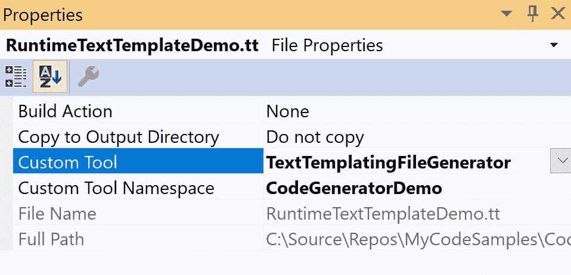
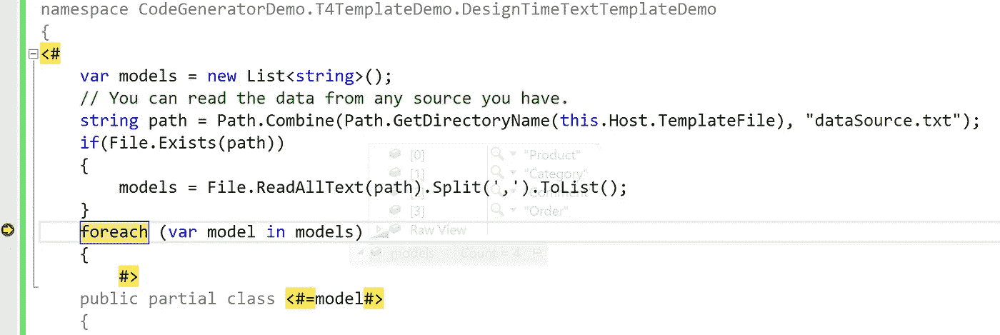
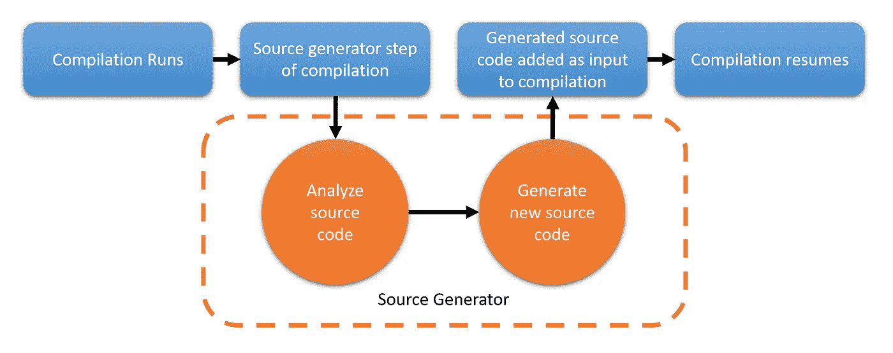
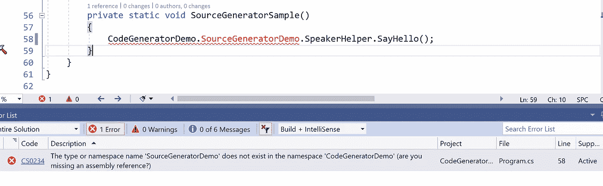
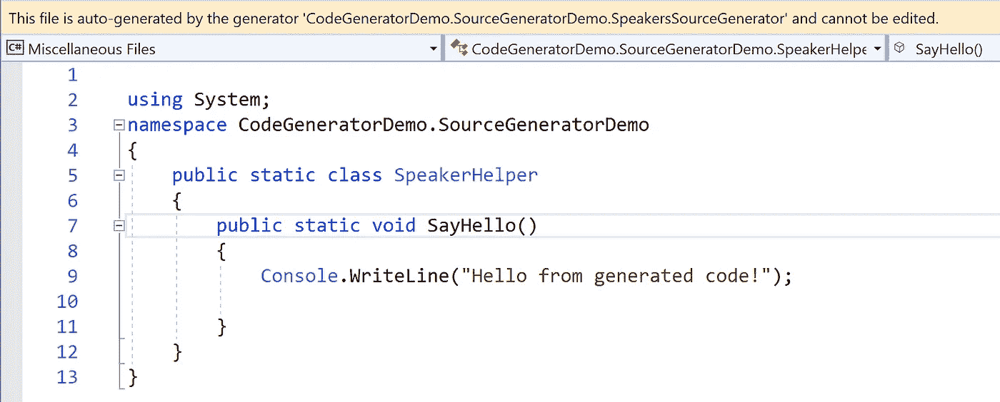
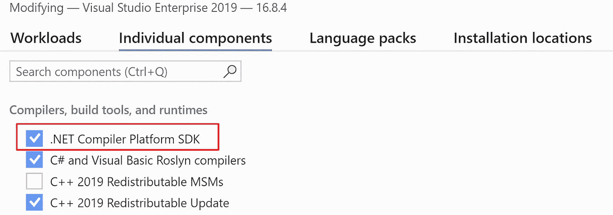

# 用 C#生成代码的 4 种方法——包括。网络 5

> 原文：<https://levelup.gitconnected.com/four-ways-to-generate-code-in-c-including-source-generators-in-net-5-9e6817db425>

微软在最新的 C#版本中引入了源代码生成器。这是一个新特性，允许我们在代码编译时生成源代码。在本文中，我将向您介绍四种可以生成源代码来简化我们日常工作的方法。然后就可以针对各种场景选择合适的方式了。

好的开发人员是懒惰的开发人员，因为他们不想一遍又一遍地重复代码。在。NET 世界中，我们有这样的方法来帮助我们生成代码:

*   代码片段。
*   反思。
*   T4 模板。
*   中的[新]源发生器。净 5。

也许你有更多的想法，但这篇文章将主要涵盖这四种方式。你可以查看我这篇文章的 repo:[https://github . com/yanxiaodi/MyCodeSamples/tree/main/CodeGeneratorDemo](https://github.com/yanxiaodi/MyCodeSamples/tree/main/CodeGeneratorDemo)。我们开始吧！

# 代码片段

代码片段是可重用代码的小块，可以通过使用热键组合插入到我们的代码文件中。例如，如果你在 Visual Studio 中输入`prop`然后按下`Tab`，VS 会自动在你的类中生成一个属性，那么你就可以很容易地替换属性名。VS 已经为我们提供了很多内置的代码片段，比如`prop`、`if`、`while`、`for`、`try`等。你可以在这里找到所有默认代码片段的列表: [C#代码片段](https://docs.microsoft.com/en-us/visualstudio/ide/visual-csharp-code-snippets?view=vs-2019&WT.mc_id=DT-MVP-5001643)。

代码片段的好处是您可以替换参数。例如，当我们为 UWP/厦门/WPF 应用程序使用 MVVM 模式时，我们经常需要在实现 [INotifyPropertyChanged](https://docs.microsoft.com/en-us/dotnet/api/system.componentmodel.inotifypropertychanged?WT.mc_id=DT-MVP-5001643) 接口的类中创建属性。如果你使用 **MvvmCross** 框架，它可能看起来像这样:

```
private ObservableCollection<Comment> _commentList;
public ObservableCollection<Comment> CommentList
{
     get => _commentList;
     set => SetProperty(ref _commentList, value);
}
```

我们不想复制/粘贴然后改变变量名，所以我创建了一个代码片段来简化工作。创建一个名为`myMvvm.snippet`的新文件，并复制&粘贴以下代码:

```
<?xml version="1.0" encoding="utf-8"?>
<CodeSnippets ae lc" href="http://schemas.microsoft.com/VisualStudio/2005/CodeSnippet" rel="noopener ugc nofollow" target="_blank">http://schemas.microsoft.com/VisualStudio/2005/CodeSnippet">
  <CodeSnippet Format="1.0.0">
    <Header>
      <SnippetTypes>
        <SnippetType>Expansion</SnippetType>
      </SnippetTypes>
      <Title>MvvmCross property</Title>
      <Author>Xiaodi Yan</Author>
      <Shortcut>mvxprop</Shortcut>
      <Description>
        A property in a ViewModel in the Xamarin project with MvvmCross.
      </Description>
    </Header>
    <Snippet>
      <Declarations>
        <Literal>
          <ID>Property</ID>
          <ToolTip>Property name</ToolTip>
          <Default>Property</Default>
        </Literal>
        <Object>
          <ID>type</ID>
          <ToolTip>Property type</ToolTip>
          <Default>string</Default>
        </Object>
        <Literal>
          <ID>pProperty</ID>
          <ToolTip>Private property name</ToolTip>
          <Default>property</Default>
        </Literal>
      </Declarations>
      <Code Language="csharp">
        <![CDATA[#region $Property$;
  private $type$ _$pProperty$;
        public $type$ $Property$
        {
            get => _$pProperty$;
            set => SetProperty(ref _$pProperty$, value);
        }
  #endregion]]>
      </Code>
    </Snippet>
  </CodeSnippet>
</CodeSnippets>
```

在这段代码中，我们使用`<Shortcut>`部分来指定快捷键`mvxprop`，并使用`<Declarations>`部分来声明一些参数。例如，我们声明了一个名为`Property`的参数，然后使用`$Property`将其插入到代码片段中。你可以通过**代码片段管理器**从 VS **工具**菜单导入这个代码片段(或者按 **Ctrl+K，Ctrl+B** )。

现在您可以键入`mvxprop`并按下 **Tab 键**，VS 可以为您创建属性——您只需手动替换属性名称。

有关更多信息:

*   [演练:创建代码片段](https://docs.microsoft.com/en-us/visualstudio/ide/walkthrough-creating-a-code-snippet?view=vs-2019&WT.mc_id=DT-MVP-5001643)
*   [代码片段函数](https://docs.microsoft.com/en-us/visualstudio/ide/code-snippet-functions?view=vs-2019&WT.mc_id=DT-MVP-5001643)
*   [如何:分发代码片段](https://docs.microsoft.com/en-us/visualstudio/ide/how-to-distribute-code-snippets?view=vs-2019&WT.mc_id=DT-MVP-5001643)

代码片段适合重用来插入整个类、方法或属性。您还可以将代码片段分发给其他用户。当我们创建新的文件/类/方法时，这很有用。但是如果您想在完成后更新生成的代码，您必须删除现有的代码，然后重新创建它。基本上，它节省了枯燥的复制/粘贴的时间，但它是一次性使用。

# 反射

反射被广泛应用于许多领域。NET 框架和库，如[ASP.NET 核心](https://docs.microsoft.com/en-us/aspnet/core/?view=aspnetcore-5.0&WT.mc_id=DT-MVP-5001643)、[实体框架核心](https://docs.microsoft.com/en-us/ef/core/?WT.mc_id=DT-MVP-5001643)等。它可以提供描述程序集、模块和类型的类型[类型](https://docs.microsoft.com/en-us/dotnet/api/system.type?WT.mc_id=DT-MVP-5001643)的对象，这样你就可以动态地创建一个类型的实例，从一个现有的对象中获取类型，然后调用它的方法或者访问它的字段和属性。

当我们建造。NET 应用程序，它生成程序集，如*。dll 文件。这些程序集包含我们的模块，这些模块包含一些类型。类型包含成员。反思让我们能够读懂这些信息。因此我们可以动态加载新的*。dll 文件并调用它们的方法或事件，而无需编辑代码。**动态**意味着它在运行时工作。换句话说，当我们编译应用程序时。NET 应用程序直到运行时才知道我们需要使用什么类型。通过这种方式，我们可以创建一个客户端，它可以基于我们的规则动态地执行其他程序集中的方法。如果我们按照规则更新其他程序集中的类，我们不需要更新客户端代码。

让我们看看下面的样品。您可以在我的示例项目中找到它。我们在 **CodeGeneratorDemo 中有一个名为`ISpeaker`的接口。ReflectionDemo.Core** 项目如下图所示:

```
namespace CodeGeneratorDemo.ReflectionDemo.Core
{
    public interface ISpeaker
    {
        string SayHello();
    }
}
```

创建两个实现类:

`ChineseSpeaker`:

```
namespace CodeGeneratorDemo.ReflectionDemo.Core
{
    public class ChineseSpeaker : ISpeaker
    {
        public string Name => this.GetType().ToString();public string SayHello()
        {
            return "Nihao";
        }
    }
}
```

还有`EnglishSpeaker`:

```
namespace CodeGeneratorDemo.ReflectionDemo.Core
{
    public class EnglishSpeaker : ISpeaker
    {
        public string Name => this.GetType().ToString();

        public string SayHello()
        {
            return "Hello!";
        }
    }
}
```

现在我们可以使用反射找到`ISpeaker`接口的所有实现，并调用它们的方法或属性。

在 **CodeGeneratorDemo 中创建一个名为 **ReflectionHelper** 的新文件。反射演示**项目:

```
using CodeGeneratorDemo.ReflectionDemo.Core;
using System;
using System.Collections.Generic;
using System.IO;
using System.Linq;
using System.Reflection;namespace CodeGeneratorDemo.ReflectionDemo
{
    public class ReflectionHelper
    {
        public static List<Type> GetAvailableSpeakers()
        {
            // You can also use AppDomain.CurrentDomain.GetAssemblies() to load all assemblies in the current domain.
            // Get the specified assembly.
            var assembly =
                Assembly.LoadFrom(Path.Combine(Directory.GetCurrentDirectory(), "CodeGeneratorDemo.ReflectionDemo.Core.dll"));
            // Find all the types in the assembly.
            var types = assembly.GetTypes();
            // Apply the filter to find the implementations of ISayHello interface.
            var result = types.Where(x => x.IsClass && typeof(ISpeaker).IsAssignableFrom(x)).ToList();
            // Or you can use types.Where(x => x.IsClass && x.GetInterfaces().Contains(typeof(ISpeaker))).ToList();
            return result;
        }
    }
}
```

在这个类中，我们加载包含我们需要的类型的指定 dll 文件。然后我们可以应用 LINQ 查询来找到所有使用反射的`ISpeaker`接口的实现。

在 **CodeGeneratorDemo 中。客户端**项目，我们可以输出每个扬声器的名称和调用`SayHello`方法:

```
private static void ReflectionSample()
{
    Console.WriteLine("Here is the Reflection sample:");
    // Find all the speakers in the current domain
    var availableSpeakers = ReflectionHelper.GetAvailableSpeakers();
    foreach (var availableSpeaker in availableSpeakers)
    {
        // Create the instance of the type
        var speaker = Activator.CreateInstance(availableSpeaker);
        // Get the property info of the given property name
        PropertyInfo namePropertyInfo = availableSpeaker.GetProperty("Name");
        // Then you can get the value of the property
        var name = namePropertyInfo?.GetValue(speaker)?.ToString();
        Console.WriteLine($"I am {name}");
        // Invoke the method of the instance
        Console.WriteLine(availableSpeaker.InvokeMember("SayHello", BindingFlags.InvokeMethod, null, speaker, null));
    }Console.WriteLine();
}
```

运行程序，你会看到下面的输出:

```
Here is the Reflection sample:
I am CodeGeneratorDemo.ReflectionDemo.Core.ChineseSpeaker
Nihao
I am CodeGeneratorDemo.ReflectionDemo.Core.EnglishSpeaker
Hello!
```

如果我们需要添加其他语言的其他演讲者，只需在同一个项目中添加实现类。。NET 反射可以自动找出所有需要的类并正确调用方法。

当我们创建插件类型的应用程序时，这是非常有用的。首先，我们创建接口，并通过反射从客户端调用方法。然后，我们可以根据客户端的接口创建插件，这些插件可以作为*。dll 文件并动态执行。

另一个场景是框架开发。作为一名框架开发人员，您将无法知道用户将创建什么样的实现，因此您只能使用反射来创建这些实例。一个例子是在一些 MVVM 框架中，如果你按照约定创建类，比如 xxxViewModel，框架可以找到所有的视图模型并使用反射自动加载它们。

一般人说反思，主要关注的是表现。因为它是在运行时运行的，所以理论上，它比普通的应用程序要慢一点。但是它对于许多场景都是灵活的，尤其是当你开发框架的时候。如果花几秒钟(或者几百毫秒)来加载程序集是可以接受的，那么请随意使用它。

我们需要用于反射的主要名称空间是 [System。反射](https://docs.microsoft.com/en-us/dotnet/api/system.reflection?WT.mc_id=DT-MVP-5001643)和[系统。类型](https://docs.microsoft.com/en-us/dotnet/api/system.type?WT.mc_id=DT-MVP-5001643)。您可能还需要了解以下术语:

*   [组装](https://docs.microsoft.com/en-us/dotnet/api/system.reflection.assembly?WT.mc_id=DT-MVP-5001643)
*   [模块](https://docs.microsoft.com/en-us/dotnet/api/system.reflection.module?WT.mc_id=DT-MVP-5001643)
*   [ConstructorInfo](https://docs.microsoft.com/en-us/dotnet/api/system.reflection.constructorinfo?WT.mc_id=DT-MVP-5001643)
*   [MethodInfo](https://docs.microsoft.com/en-us/dotnet/api/system.reflection.methodinfo?WT.mc_id=DT-MVP-5001643)
*   [字段信息](https://docs.microsoft.com/en-us/dotnet/api/system.reflection.fieldinfo?WT.mc_id=DT-MVP-5001643)
*   [事件信息](https://docs.microsoft.com/en-us/dotnet/api/system.reflection.eventinfo?WT.mc_id=DT-MVP-5001643)
*   [PropertyInfo](https://docs.microsoft.com/en-us/dotnet/api/system.reflection.propertyinfo?WT.mc_id=DT-MVP-5001643)
*   [参数信息](https://docs.microsoft.com/en-us/dotnet/api/system.reflection.parameterinfo?WT.mc_id=DT-MVP-5001643)
*   [自定义属性数据](https://docs.microsoft.com/en-us/dotnet/api/system.reflection.customattributedata?WT.mc_id=DT-MVP-5001643%20)

有关更多信息，请查看这些文档:

*   [倒影在。网](https://docs.microsoft.com/en-us/dotnet/framework/reflection-and-codedom/reflection?WT.mc_id=DT-MVP-5001643)
*   [查看类型信息](https://docs.microsoft.com/en-us/dotnet/framework/reflection-and-codedom/viewing-type-information?WT.mc_id=DT-MVP-5001643)
*   [动态加载和使用类型](https://docs.microsoft.com/en-us/dotnet/framework/reflection-and-codedom/dynamically-loading-and-using-types?WT.mc_id=DT-MVP-5001643)

# T4 模板

**T4 文本模板**是文本块和控制逻辑的混合物，可以生成一个文本文件。 **T4** 意为*文本模板转换*。您可以使用它在 Visual Studio for C#和 Visual Basic 中生成文件。但是文件本身可以是任何类型的文本，比如*。txt 文件，或 HTML 文件，或任何语言的程序源代码。你用 C#代码(或者 VB)来控制模板中的逻辑。几年前，我曾经使用一个 NuGet 包(EntityFramework 反向 POCO 生成器)来为 EntityFramework 生成 POCO 模型。它是通过 T4 模板实现的。我只需要更新 T4 模板中的数据库连接字符串并保存它，然后 T4 模板就可以读取数据库信息并自动创建所有的模型和方法。

让我们看看奇迹是如何发生的。有两种 T4 模板:**运行期**和**设计期**。不同之处在于，运行时 T4 模板是在应用程序中执行的，以生成文本字符串。它将创建一个*。包含一个`TransformText()`方法的 cs 类。然后，即使目标计算机没有安装 Visual Studio，也可以调用此方法来生成字符串。相反，当您在 Visual Studio 中保存模板时，设计时 T4 模板会生成原始源代码或文本文件。如果要使用运行时 T4 模板，需要将文件的**自定义工具**属性设置为**texttemplatingfile preprocessor**。对于设计时 T4 模板，**自定义工具**属性应设置为**TextTemplatingFileGenerator**。



你可以在 **CodeGeneratorDemo 中找到样本。T4TemplateDemo** 项目。有两个 T4 模板:**runtimetexttemplatedemo . TT**和**designtimetexttemplatedemo . TT**。

# 运行时 T4 模板

为了正确构建项目，您需要安装**系统。CodeDom** NuGet 包。打开**runtimetexttemplatedemo . TT**文件，对 HTML 代码做一些修改，然后保存。您将看到 T4 模板自动更新生成的文件**runtimetexttemplatedemo . cs**。您可以在客户端代码中使用一个名为`TransformText()`的方法。

```
<#@ template language="C#" #>
<#@ assembly name="System.Core" #>
<#@ import namespace="System.Linq" #>
<#@ import namespace="System.Text" #>
<#@ import namespace="System.Collections.Generic" #>
<html><body>
<h1>Sales for Previous Month</h2>
<table>
    <# for (int i = 1; i <= 10; i++)
       { #>
         <tr><td>Test name <#= i #> </td>
             <td>Test value <#= i * i #> </td> </tr>
    <# } #>
 </table>
This report is Company Confidential.
</body></html>
```

每次保存模板，都会更新生成的文件。在客户端代码中，我们可以调用下面的代码:

```
var page = new RunTimeTextTemplateDemo();
Console.WriteLine(page.TransformText());
```

您将在控制台中看到 HTML 代码。

# 设计时 T4 模板

设计时模板只能在开发程序时在 Visual Studio 中使用。它生成原始文本文件，无论格式是什么—可以是*cs，*。通常，您需要定义一个**模型**，它可以是一个文本文件(XML 或 JSON 或 csv 或其他文件)，或者一个数据库，然后模板从模型中读取数据并生成一些源代码。

这里有一个例子:

```
<#@ template debug="false" hostspecific="true" language="C#" #>
<#@ assembly name="System.Core" #>
<#@ import namespace="System.Linq" #>
<#@ import namespace="System.Text" #>
<#@ import namespace="System.Collections.Generic" #>
<#@ import namespace="System.IO" #>
<#@ output extension=".cs" #>using System;
using System.Threading.Tasks;namespace CodeGeneratorDemo.T4TemplateDemo.DesignTimeTextTemplateDemo
{
<# 
    var models = new List<string>();
    // You can read the data from any source you have.
    string path = Path.Combine(Path.GetDirectoryName(this.Host.TemplateFile), "dataSource.txt");
    if(File.Exists(path))
    {
        models = File.ReadAllText(path).Split(',').ToList();
    }
    foreach (var model in models)
    {
        #>
    public partial class <#=model#>
    {
        public Guid Id { get; set; }
        public <#=model#>(Guid id)
        {
            Id = id;
        }
    }public partial class <#=model#>Service
    {
        public Task<<#=model#>> Get<#=model#>(Guid id)
        {
            return Task.FromResult(new <#=model#>(id));
        }
    }
<#
    }
#>
}
```

当您保存模板时，T4 模板可以为每个类生成模型和服务。

# 如何创建 T4 模板

正如您在上述示例中看到的，T4 模板由以下部分组成:

*   **指令** —控制模板处理方式的元素。
*   **文本块** —直接复制到输出的原始文本。
*   **控制块** —将变量值插入文本的程序代码，并控制文本的条件或重复部分。

例如，您可以使用以下指令来指定输出文件格式:

```
<#@ output extension=".txt" #>
```

您也可以使用 C#代码来控制逻辑。例如，检查以下代码:

```
<#
    for(int i = 0; i < 4; i++)
    {
#>
Hello!
<#
    }
#>
```

它将输出`Hello`四次。在这个例子中，`Hello`是一个文本块，`for`语句只是 C#代码。

要使用变量，可以使用表达式控制块。使用`<#= ... #>`输出变量即可，如下图所示:

```
<#
    string message = "Hello";
    for(int i = 0; i < 4; i++)
    {
#>
  <#=message#>
<#
    }
#>
```

它将输出四倍的`Hello`。

T4 模板的强大功能是您可以导入程序集并使用大多数。您需要的. NET 库，例如:

```
<#@ assembly name="System.Core" #>
<#@ import namespace="System.Linq" #>
<#@ import namespace="System.Text" #>
<#@ import namespace="System.Collections.Generic" #>
<#@ import namespace="System.IO" #>
```

请注意，您需要将它们放在原始文本和控制块之前。你甚至可以在控制块中使用反射。有了这些特性，我们可以为某些场景编写非常有用的模板。

# 调试 T4 模板

像普通的 C#程序一样，我们可以通过设置断点来调试 T4 模板。要调试设计时 T4 模板，右击该模板并从解决方案资源管理器的文件菜单中选择**调试 T4 模板**。要调试运行时 T4 模板，只需调试项目，因为它在程序编译时运行。



# T4 模板编辑器

默认情况下，Visual Studio 不支持语法着色和智能感知等。幸运的是，我们有一些 VS 扩展来提高生产率，比如[德瓦特 T4 编辑器](https://www.devart.com/t4-editor/)。你可以在 VS 扩展市场搜索 *T4 模板*你会找到更多。

在本文中，我们不会涉及 T4 模板的所有细节。有关更多信息，请阅读这些文档:

*   [代码生成和 T4 文本模板](https://docs.microsoft.com/en-us/visualstudio/modeling/code-generation-and-t4-text-templates?view=vs-2019&WT.mc_id=DT-MVP-5001643)
*   [演练:使用文本模板生成代码](https://docs.microsoft.com/en-us/visualstudio/modeling/walkthrough-generating-code-by-using-text-templates?view=vs-2019&WT.mc_id=DT-MVP-5001643)
*   [使用 T4 文本模板进行运行时文本生成](https://docs.microsoft.com/en-us/visualstudio/modeling/run-time-text-generation-with-t4-text-templates?view=vs-2019&WT.mc_id=DT-MVP-5001643)
*   [T4 文本模板指令](https://docs.microsoft.com/en-us/visualstudio/modeling/t4-text-template-directives?view=vs-2019&WT.mc_id=DT-MVP-5001643)
*   [文本模板控制块](https://docs.microsoft.com/en-us/visualstudio/modeling/text-template-control-blocks?view=vs-2019&WT.mc_id=DT-MVP-5001643)
*   [T4 文本模板编写指南](https://docs.microsoft.com/en-us/visualstudio/modeling/guidelines-for-writing-t4-text-templates?view=vs-2019&WT.mc_id=DT-MVP-5001643)

# 源发生器在。网络 5

要开始使用源代码生成器，您需要安装最新的[。NET 5 SDK](https://dotnet.microsoft.com/download/dotnet/5.0) 。

# 什么是源发生器，它是如何工作的？

根据微软的定义:

> *源代码生成器是在编译期间运行的一段代码，它可以检查您的程序以生成与您的代码的其余部分一起编译的附加文件。*

让我们回顾一下反射是如何工作的。正如我之前提到的，当我们构建应用程序时，反射代码不知道它将使用什么类型，直到应用程序运行。这就是为什么人们抱怨反思的表现。如果我们在应用程序启动时加载了大量的程序集，这可能会对性能造成轻微的影响。这个问题很难解决，因为这是反射的缺点——你得到了开发的好处，但是你必须接受它的缺点。

源生成器用于解决性能问题——至少，提高性能是一个重要的目标。源代码生成器可以分析当前的源代码，并注入到代码编译过程中，然后生成一些代码，这些代码将根据当前的源代码进行编译——换句话说，当应用程序完成编译时，它已经确切地知道它将使用什么类型。这是改进的关键。

下面是来自微软的源生成器图表:



我们需要知道的一件事是**源代码生成器只能给代码添加一些东西，而不能改变任何现有的代码**。让我们看一个例子。

# 我的第一个源发生器示例

生成源是`Microsoft.CodeAnalysis.ISourceGenerator`的实现:

```
namespace Microsoft.CodeAnalysis
{
    public interface ISourceGenerator
    {
        void Initialize(GeneratorInitializationContext context);
        void Execute(GeneratorExecutionContext context);
    }
}
```

创建新的。名为 **CodeGeneratorDemo 的. NET Standard 2.0 类项目。SourceGeneratorDemo** 。安装这两个 NuGet 包:

*   微软。CodeAnalysis.CSharp v3.8+版
*   微软。code analysis . analyzer v 3.3+版

我们还需要将语言版本指定为`preview`:

```
<PropertyGroup>
  <TargetFramework>netstandard2.0</TargetFramework>
  <LangVersion>preview</LangVersion>
</PropertyGroup>
```

从技术上来说，源代码生成器不是 C#语言的特性。它们仍在预览中。所以我们现在需要明确地指定它。

然后在项目中创建一个`SpeakersSourceGenerator.cs`文件。如下所示更新内容:

```
using Microsoft.CodeAnalysis;
using Microsoft.CodeAnalysis.CSharp.Syntax;
using Microsoft.CodeAnalysis.Text;
using System.Collections.Generic;
using System.Text;namespace CodeGeneratorDemo.SourceGeneratorDemo
{
    [Generator]
    public class SpeakersSourceGenerator : ISourceGenerator
    {
        public void Initialize(GeneratorInitializationContext context)
        {
            // Not needed for this sample
        }public void Execute(GeneratorExecutionContext context)
        {
            // begin creating the source we'll inject into the users compilation
            var sourceBuilder = new StringBuilder(@"
using System;
namespace CodeGeneratorDemo.SourceGeneratorDemo
{
    public static class SpeakerHelper
    {
        public static void SayHello() 
        {
            Console.WriteLine(""Hello from generated code!"");
");
            sourceBuilder.Append(@"
        }
    }
}");
            // inject the created source into the users compilation
            context.AddSource("speakersSourceGenerator", SourceText.From(sourceBuilder.ToString(), Encoding.UTF8));
        }
    }
}
```

`SpeakersSourceGenerator`类实现了`ISourceGenerator`接口，并具有`Generator`属性。当程序编译时，它会找到源代码生成器并生成我们需要的代码。在这个例子中，我只创建了一个名为`SpeakerHelper`的新类，它包含一个`SayHello()`方法。如果我们正确地生成了代码，它应该会在控制台中输出消息。

接下来，添加对 **CodeGeneratorDemo 的引用。客户**项目。请注意，您需要像这样更新项目文件:

```
<Project Sdk="Microsoft.NET.Sdk">
  <PropertyGroup>
    <OutputType>Exe</OutputType>
    <TargetFramework>net5.0</TargetFramework>
    <LangVersion>preview</LangVersion>
  </PropertyGroup><ItemGroup>
    <ProjectReference Include="..\CodeGeneratorDemo.SourceGeneratorDemo\CodeGeneratorDemo.SourceGeneratorDemo.csproj" 
                      OutputItemType="Analyzer"
                      ReferenceOutputAssembly="false"/>
  </ItemGroup>
</Project>
```

您还需要指定语言版本。此外，因为我们没有将项目作为普通的 dll 文件引用，所以我们需要如上所示更新`OutputItemType`和`ReferenceOutputAssembly`的值。

在客户端代码中添加代码:

```
private static void SourceGeneratorSample()
{
    CodeGeneratorDemo.SourceGeneratorDemo.SpeakerHelper.SayHello();
}
```

你可能会看到 VS 抱怨`CodeGeneratorDemo.SourceGeneratorDemo.SpeakerHelper`找不到，因为在我们的代码中没有这样的类。源生成器的工具仍在预览中，所以我们需要构建 **CodeGeneratorDemo。SourceGeneratorDemo** 项目并关闭 VS 然后重启它。然后你会发现 VS 也可以支持智能。当我们构建它时，源生成器实际上生成了`SpeakerHelper`类。现在运行客户端应用程序，我们可以看到来自生成代码的输出:

```
Hello from generated code!
```

所以过程是，当我们构建项目时，源生成器将被调用来产生一些代码，这些代码可以与原始源代码一起编译。这样，就不会有性能问题，因为它发生在编译过程中。当应用程序启动时，生成的代码已经与其他源代码一起编译了。

从我的经验来看，有时 VS 不能识别生成的方法或类，但是如果构建运行正确，这应该没问题。



如果您按下`F12`来检查客户端代码中的`SayHello()`方法，您将看到生成的文件显示该文件不可编辑:



你可能会好奇文件在哪里。如果你想看到实际生成的文件，你可以将这些部分添加到 **CodeGeneratorDemo 中。SourceGeneratorDemo** 项目和 **CodeGeneratorDemo。客户**项目:

```
<EmitCompilerGeneratedFiles>true</EmitCompilerGeneratedFiles>
<CompilerGeneratedFilesOutputPath>$(BaseIntermediateOutputPath)\GeneratedFiles</CompilerGeneratedFilesOutputPath>
```

然后你可以在 **obj/GeneratedFiles** 文件夹中找到这个文件。如果不指定**CompilerGeneratedFilesOutputPath**属性，它应该在**obj/SourceGeneratorFiles**文件夹中。

这只是一个非常简单的例子，展示了如何在运行时之前生成代码。接下来，让我们看另一个稍微复杂一点的例子。

# 在编译中生成属性

当我们使用依赖注入时，通常我们需要手动注册实例。对于这个演示，我将创建一个[属性](https://docs.microsoft.com/en-us/dotnet/csharp/programming-guide/concepts/attributes/?WT.mc_id=DT-MVP-5001643)来修饰需要注册的类。我们可以使用反射来检索这些属性，以找到特定的类，但操作可能会很昂贵。有了源代码生成器，我们可以在运行时之前生成代码来注册它们。

创建一个名为`AutoRegisterSourceGenerator`的新类，如下所示:

```
[Generator]
public class AutoRegisterSourceGenerator : ISourceGenerator
{
    public void Initialize(GeneratorInitializationContext context)
    {
        // TODO
    }public void Execute(GeneratorExecutionContext context)
    {
         // TODO
    }
}
```

接下来，让我们创建属性。我们可以创建实际的类作为普通代码，但是为了演示，我将使用 Source Generator 来生成它。将以下代码添加到`AutoRegisterSourceGenerator`:

```
private const string AttributeText = @"
using System;
namespace CodeGeneratorDemo.SourceGeneratorDemo
{
    [AttributeUsage(AttributeTargets.Class, Inherited = false, AllowMultiple = false)]
    sealed class AutoRegisterAttribute : Attribute
    {
        public AutoRegisterAttribute()
        {
        }
    }
}";
```

这只是一个字符串。接下来，更新`Execute`方法，将字符串添加到源代码中:

```
public void Execute(GeneratorExecutionContext context)
{
    context.AddSource("AutoRegisterAttribute", SourceText.From(AttributeText, Encoding.UTF8));
}
```

当我们构建项目时，它将生成`AutoRegisterAttribute`。

下一步是创建一些接口:

```
namespace CodeGeneratorDemo.Client.Core
{
    public interface IOrderService
    {
    }
    public interface IProductService
    {
    }
}
```

还有一些实现，比如`OrderService`和`ProductService`，是用`AutoRegister`属性修饰的:

```
using System;
using CodeGeneratorDemo.SourceGeneratorDemo;namespace CodeGeneratorDemo.Client.Core
{
    [AutoRegister]
    public class OrderService : IOrderService
    {
        public OrderService()
        {
            Console.WriteLine($"{this.GetType()} constructed.");
        }
    }

    [AutoRegister]
    public class ProductService : IProductService
    {
        public ProductService()
        {
            Console.WriteLine($"{this.GetType()} constructed.");
        }
    }
}
```

目前我们的代码中没有`AutoRegister`。所以你会看到 VS 抱怨。这没有关系，因为属性将由源生成器稍后生成。

我们将有另一个名为`DiContainerMocker`的类来模拟 DI 容器:

```
using System;
namespace CodeGeneratorDemo.Client.Core
{
    public static class DiContainerMocker
    {
        public static void RegisterService<TInterface, TImplementation>(TImplementation service)
        {
            Console.WriteLine($"{service.GetType()} has been registered for {typeof(TInterface)}.");
        }
    }
}
```

源发电机依靠[罗斯林](https://docs.microsoft.com/en-us/dotnet/csharp/roslyn-sdk/?WT.mc_id=DT-MVP-5001643)。它可以检查来自编译的数据。我们可以通过使用名为`SyntaxReceivers`的对象来访问`SyntaxTrees`，迭代`SyntaxNodes`，然后基于这些信息生成代码。

创建一个名为`MySyntaxReceiver`的新类，它实现了`ISyntaxReceiver`接口:

```
public class MySyntaxReceiver : ISyntaxReceiver
{
    public List<ClassDeclarationSyntax> CandidateClasses { get; } = new List<ClassDeclarationSyntax>();/// <summary>
    /// Called for every syntax node in the compilation, we can inspect the nodes and save any information useful for generation
    /// </summary>
    public void OnVisitSyntaxNode(SyntaxNode syntaxNode)
    {
        // any method with at least one attribute is a candidate for property generation
        if (syntaxNode is ClassDeclarationSyntax classDeclarationSyntax
            && classDeclarationSyntax.AttributeLists.Count >= 0)
        {
            CandidateClasses.Add(classDeclarationSyntax);
        }
    }
}
```

在这节课上，我们将检查每个`SyntaxNode`。如果它是一个类并且有属性，那么我们将把它添加到一个列表中。

接下来，我们需要在源生成器的`Initialize`方法中注册`MySyntaxReceiver`:

```
public void Initialize(GeneratorInitializationContext context)
{
    context.RegisterForSyntaxNotifications(() => new MySyntaxReceiver());
}
```

现在是时候完成我们的源生成器了。这个想法是，我们将挂钩编译并检查`SyntaxNode`是否是一个类并具有`AutoRegister`属性。用以下代码更新`Execute`方法:

```
public void Execute(GeneratorExecutionContext context)
        {
            context.AddSource("AutoRegisterAttribute", SourceText.From(AttributeText, Encoding.UTF8));
            if (!(context.SyntaxReceiver is MySyntaxReceiver receiver))
            {
                return;
            }
            CSharpParseOptions options = (context.Compilation as CSharpCompilation).SyntaxTrees[0].Options as CSharpParseOptions;
            SyntaxTree attributeSyntaxTree =
                CSharpSyntaxTree.ParseText(SourceText.From(AttributeText, Encoding.UTF8), options);
            Compilation compilation = context.Compilation.AddSyntaxTrees(attributeSyntaxTree);
            StringBuilder stringBuilder = new StringBuilder();
            stringBuilder.Append(@"
using System;
using CodeGeneratorDemo.Client.Core;
namespace CodeGeneratorDemo.SourceGeneratorDemo
{
    public class RegisterHelper
    {
        public static void RegisterServices()
        {
");
            // Get all the classes with the AutoRegisterAttribute
            INamedTypeSymbol attributeSymbol =
 compilation.GetTypeByMetadataName("CodeGeneratorDemo.SourceGeneratorDemo.AutoRegisterAttribute");
            foreach (var candidateClass in receiver.CandidateClasses)
            {
                SemanticModel model = compilation.GetSemanticModel(candidateClass.SyntaxTree);
                if (model.GetDeclaredSymbol(candidateClass) is ITypeSymbol typeSymbol &&
                    typeSymbol.GetAttributes().Any(x =>
                        x.AttributeClass.Equals(attributeSymbol, SymbolEqualityComparer.Default)))
                {
                    stringBuilder.Append($@"
            DiContainerMocker.RegisterService<I{candidateClass.Identifier.Text}, {candidateClass.Identifier.Text}>(new {candidateClass.Identifier.Text}());");
                }
            }
            stringBuilder.Append(@"
        }
    }
}");
            context.AddSource("RegisterServiceHelper", SourceText.From(stringBuilder.ToString(), Encoding.UTF8));
        }
    }
```

如果你不熟悉罗斯林，这个方法可能看起来很复杂。它使用 Roslyn API 来获取类的元数据——有点类似于反射。您可以查看文档以了解更多信息:

*   [使用语法](https://docs.microsoft.com/en-us/dotnet/csharp/roslyn-sdk/work-with-syntax?WT.mc_id=DT-MVP-5001643)
*   [使用语义](https://docs.microsoft.com/en-us/dotnet/csharp/roslyn-sdk/work-with-semantics?WT.mc_id=DT-MVP-5001643)
*   [使用 Visual Studio 中的 Roslyn 语法可视化工具浏览代码](https://docs.microsoft.com/en-us/dotnet/csharp/roslyn-sdk/syntax-visualizer?tabs=csharp&WT.mc_id=DT-MVP-5001643)

为了更好地检查我们项目中的语法树，您可以安装**。NET 编译器平台 SDK** 来自 **Visual Studio Installer** ，为 VS2019 提供 SyntaxVisualizer 窗口。



一旦我们找到了由`AutoRegister`属性修饰的类，我们就可以添加注册实例的源代码。生成的代码会和原代码一起编译。通过这种方式，我们避免了昂贵的反射成本并提高了性能。

最后，我们可以在客户端调用生成的代码:

```
private static void SourceGeneratorSample()
{
    Console.WriteLine("Here is the simple Source Generator sample:");
    CodeGeneratorDemo.SourceGeneratorDemo.SpeakerHelper.SayHello();
    Console.WriteLine();
    Console.WriteLine("Here is the AutoRegisterAttribute Source Generator sample:");
    CodeGeneratorDemo.SourceGeneratorDemo.RegisterHelper.RegisterServices();
}
```

您需要构建 **CodeGeneratorDemo。SourceGeneratorDemo** 项目然后重新打开 VS2019。然后您可以看到这样的输出:

```
Here is the AutoRegisterAttribute Source Generator sample:
CodeGeneratorDemo.Client.Core.OrderService constructed.
CodeGeneratorDemo.Client.Core.OrderService has been registered for CodeGeneratorDemo.Client.Core.IOrderService.
CodeGeneratorDemo.Client.Core.ProductService constructed.
CodeGeneratorDemo.Client.Core.ProductService has been registered for CodeGeneratorDemo.Client.Core.IProductService.
```

如果你按下`RegisterServices()`上的`F12`来检查它的定义，你会看到生成的代码如下:

```
using System;
using CodeGeneratorDemo.SourceGeneratorDemo.Core;
namespace CodeGeneratorDemo.SourceGeneratorDemo
{
    public class RegisterHelper
    {
        public static void RegisterServices()
        {
            DiContainerMocker.RegisterService<IProductService, ProductService>(new ProductService());
            DiContainerMocker.RegisterService<IOrderService, OrderService>(new OrderService());
        }
    }
}
```

这正是我们想要的。

酷的事情是，如果您删除或添加服务的`AutoRegister`，您会看到生成的代码将立即更新-不需要重建项目！

# 如何调试源代码生成器

有时我们需要调试源代码生成器，以防出现任何问题。如果在源代码生成器中设置断点，您会发现它不起作用。解决方案是在`Initialize`方法中附加调试器:

```
 public void Initialize(GeneratorInitializationContext context)
        {
#if DEBUG
            if (!Debugger.IsAttached)
            {
                Debugger.Launch();
            }
#endif
            context.RegisterForSyntaxNotifications(() => new MySyntaxReceiver());
        }
```

然后，您可以通过设置断点来调试源代码生成器。

# 如何处理复杂的模板代码？

在这两个例子中，我演示了如何使用源代码生成器生成代码。我们在`Execute`方法中使用了原始字符串——这看起来很难看。更好的方法是使用模板引擎。一个可能的选择是[Scriban](https://github.com/scriban/scriban)——一种快速、强大、安全和轻量级的. NET 脚本语言和引擎。因此我们可以将模板存储在单独的文件中，并使解决方案整洁。我不会深入研究模板语法，因为这超出了本文的范围。你可以在它的 GitHub repo 上找到更多。

# 使用场景

微软提供了一个源代码生成器指南。可以在 GitHub 上找到:[https://GitHub . com/dot net/roslyn/blob/master/docs/features/source-generators . cookbook . MD](https://github.com/dotnet/roslyn/blob/master/docs/features/source-generators.cookbook.md)。您将看到源代码生成器可以应用于许多场景，尤其是替换反射，或者当您开发样板代码时。例如，一些 JSON 序列化经常使用动态分析，比如在运行时反射来检查类型。源代码生成器可以在编译时生成静态序列化代码，以节省成本。您还可以访问其他文件，如 XML 或 JSON 文件来生成您的代码。

在 GitHub 上查找更多示例:[https://GitHub . com/dot net/roslyn-SDK/tree/master/samples/cs harp/source generators](https://github.com/dotnet/roslyn-sdk/tree/master/samples/CSharp/SourceGenerators)。

# 摘要

在本文中，我将向您介绍在 C#程序中生成代码的四种方法。它们可能适合不同的场景，所以我们需要比较每种方法并选择合适的方法。

*   **代码片段**:创建特定格式的代码块，如属性、方法、类等。**优点**:节省键入重复代码块的时间。**缺点**:只能适用于特定格式。无法自动更新。
*   反射:在运行时获取元数据，然后与类、属性、方法等交互。**优点**:强大灵活，适合多种场景。可以减少耦合。**缺点**:成本贵。潜在的性能问题。维护起来更复杂。
*   **T4 模板**:生成一些样板代码。但有时它可以被设计模式重构。**优点**:可以从其他文件中读取数据。许多可用的控制块。可以生成静态代码而没有性能问题。**缺点:**可怕的编辑支持。模板容易出错。
*   **源生成器**:替换一些反射代码。基于 Roslyn 在编译中生成静态代码。优点:没有性能问题。更快的构建。智能感知支持。当无法生成源代码时，可以生成诊断。分部类/方法支持。缺点:工具需要改进。开始有点困难。

重点是我们如何使用源代码生成器——中提供的新特性。净 5。它仍在预览中，所以我们可能很快就会看到微软的更多改进。我的期望是与 VS2019 更好的集成。现在体验不够好是因为必须反复重开 VS。希望这篇文章能帮助你节省 C#开发的时间。如果您有任何想法，请随时留下您的评论。谢了。