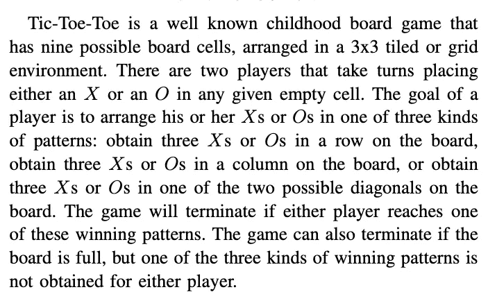
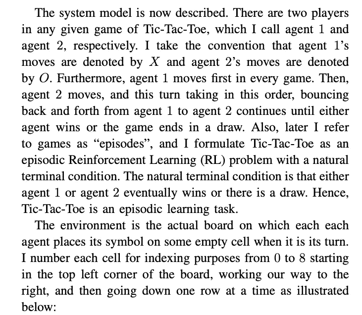
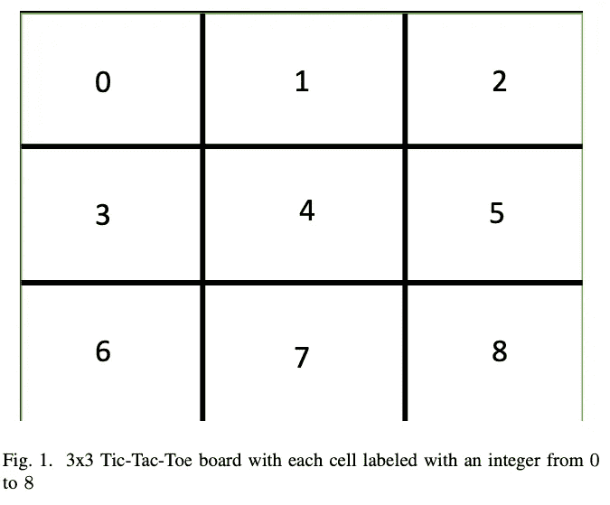
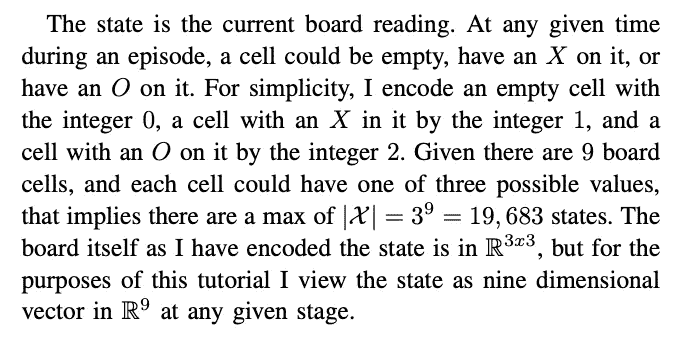
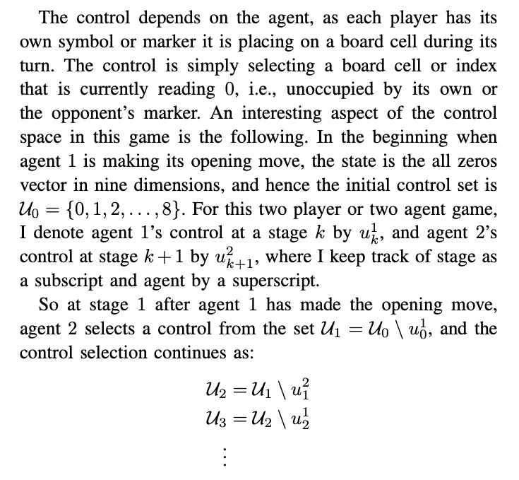
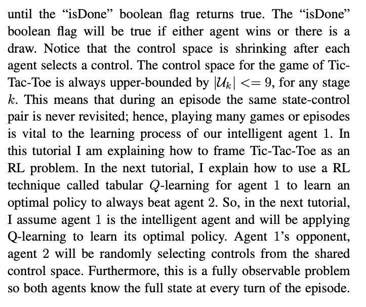
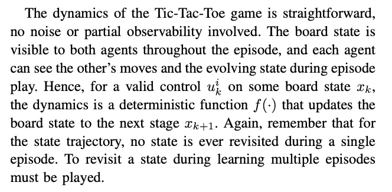
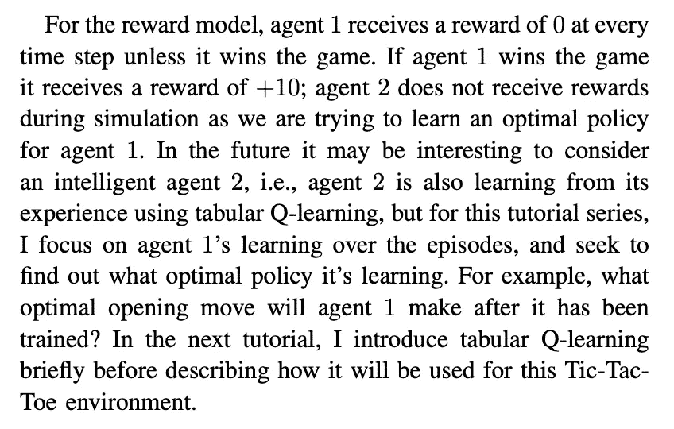

# 将井字游戏框架化为强化学习问题

> 原文：<https://levelup.gitconnected.com/framing-tic-tac-toe-as-a-reinforcement-learning-problem-eb76b6ece4de>

图片由 Pexels 的 Elī na Arā ja 提供

# 介绍

# 状态空间模型

# 控制空间模型

# 环境动力学

# 奖励模型

直到下一次，

凯勒。

考虑成为一个媒体成员，永远不会错过我的故事。无限制地访问我的作品和其他作者的作品:

 [## 加入我的介绍链接媒体-迦勒鲍耶

### 作为一个媒体会员，你的会员费的一部分会给你阅读的作家，你可以完全接触到每一个故事…

medium.com](https://medium.com/@CalebMBowyer/membership)