# 面向前端开发人员的免费电子书和课程

> 原文：<https://levelup.gitconnected.com/free-ebook-courses-for-frontend-devs-16ccba6f453b>

面向前端开发人员的电子书和课程

众所周知，在线课程或电子书是学习前端工程的最佳资源。

有时候真的很难买到电子书或者课程。就像当我还是学生的时候，我主要是想知道在哪里可以找到学习 HTML、CSS 和 JavaScript 的免费资源。

在那里，我找到了 MDN、FreeCodeCamp 和其他一些网站。

我将在这篇文章中分享这些资源，希望它们能有所帮助。

# 免费电子书📚

## 1. [JavaScript 花园](https://bonsaiden.github.io/JavaScript-Garden/)

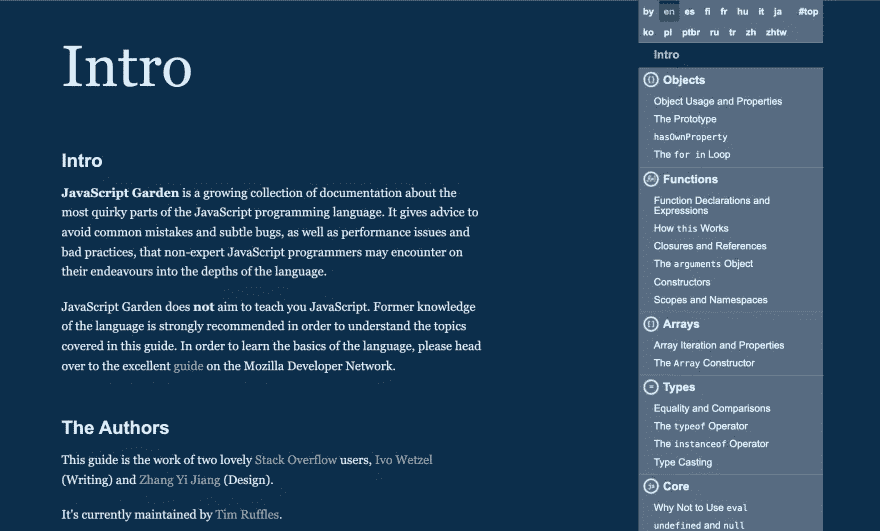

JavaScript Garden 是一个不断增长的关于 JavaScript 编程语言最古怪部分的文档集合。

## 2. [HTML5 专业人士须知书](https://goalkicker.com/HTML5Book/)

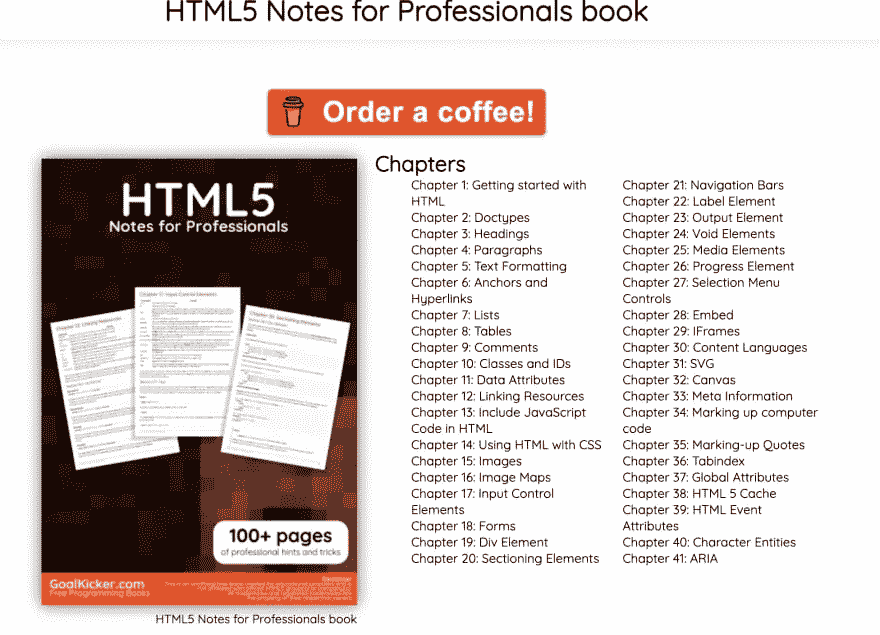

免费的编程书籍。免责声明。这是一本为教育目的而创作的非官方免费书籍。

## 3.[奥丁项目](https://www.theodinproject.com/home)

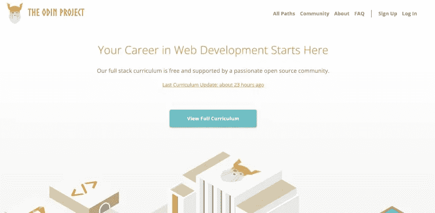

Odin 项目让有抱负的 web 开发人员能够免费一起学习。

## 4. [CSS 动画](https://cssanimation.rocks/)

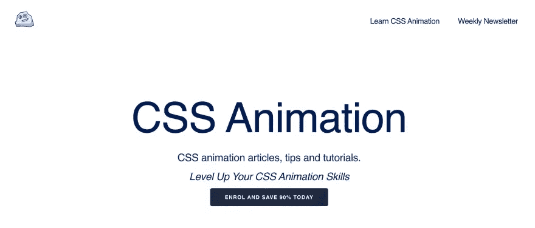

学习 CSS 动画与真棒教程，视频课程和每周 CSS 动画通讯。

## 5. [JavaScript 书籍收藏](https://jsbooks.revolunet.com/)

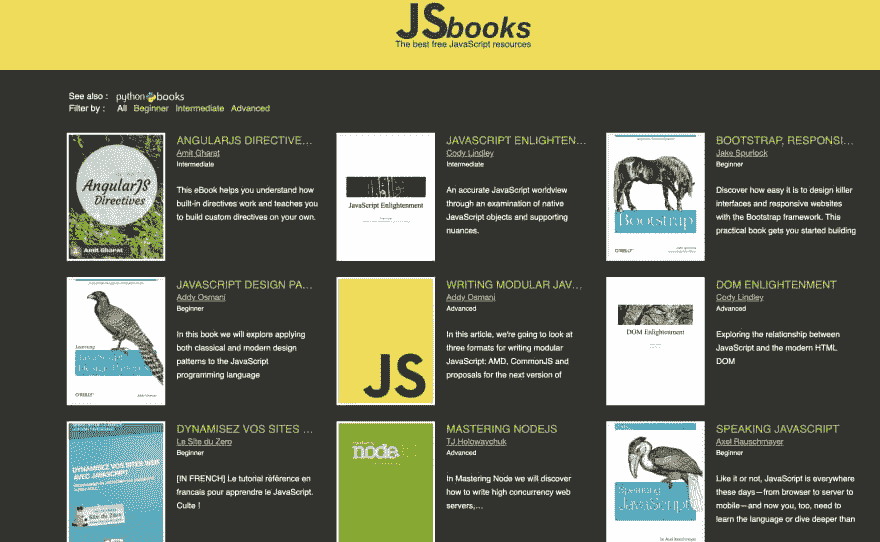

JSbooks 展示了关于 Javascript 的最好的免费电子书。在这里找到关于你最喜欢的编程语言的最佳出版物。

## 6.[使用 CSS3 的网页视觉效果](https://leanpub.com/web-visual-effects-with-css3/read)

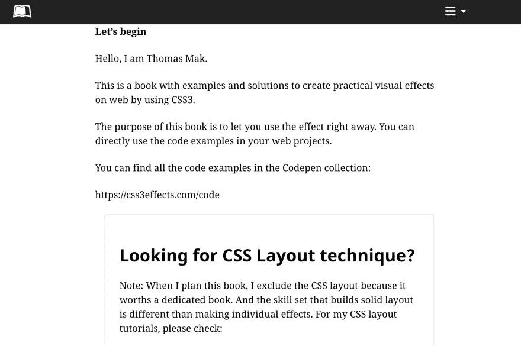

这是一本使用 CSS3 在网页上创建实用视觉效果的例子和解决方案的书。

## 7.[雄辩的 JavaScript](https://eloquentjavascript.net/)

雄辩的 Javascript 第三版被广泛认为是最好的 Javascript 书籍之一。该书于 2018 年底发布，即使在 2020 年，仍被吹捧为最好的 Javascript 书籍。雄辩的 JavaScript 不像许多教育材料。

## 8.[CSS 的魔力](https://adamschwartz.co/magic-of-css/)

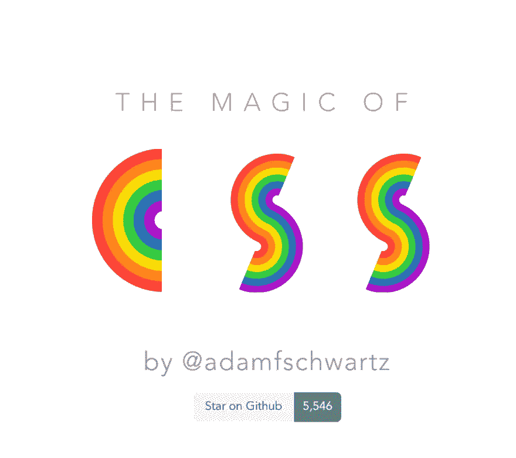

一门 CSS 课程让你变成魔术师。在 GitHub 上创建一个帐户，为 adamschwartz/magic-of-css 的开发做出贡献。

## 9.[标记表](https://marksheet.io/)

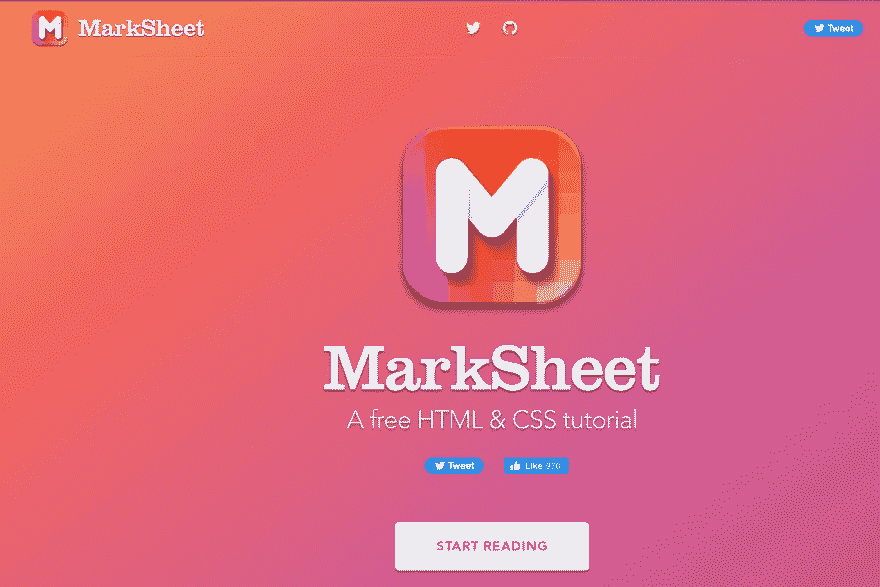

这本电子书是一步一步的指导，在其中我教你如何从头开始，一行一行的用 HTML5，CSS3，甚至 JS 建立你自己的个人网页。

## 10. [HTML 画布深潜](https://joshondesign.com/p/books/canvasdeepdive/toc.html)

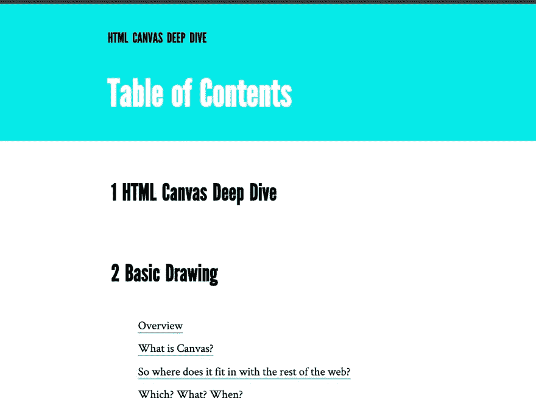

HTML Canvas Deep Dive 是对 Canvas 的实际介绍。根据书本编写代码，并使用交互式示例进行游戏

## 11.[html 5 和 CSS3 指南](https://html5hive.org/free-ebook-a-guide-to-html5-and-css3/)

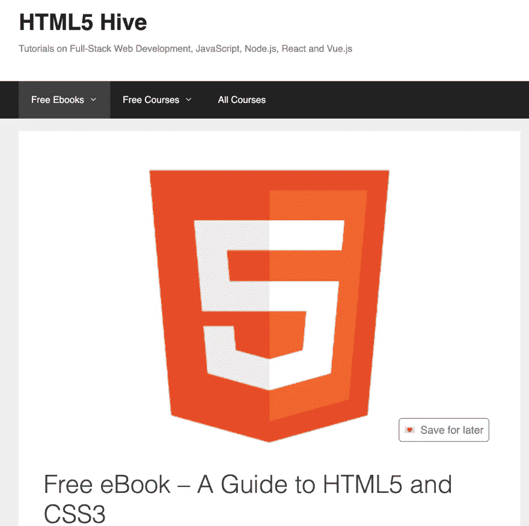

《HTML5 和 CSS3 网页设计基本指南》已经从广受好评的第一版进行了全面修订，并更新了 HTML5 和 CSS3 的所有新功能和最佳实践。

## 12.[前端导师](https://www.frontendmentor.io/)

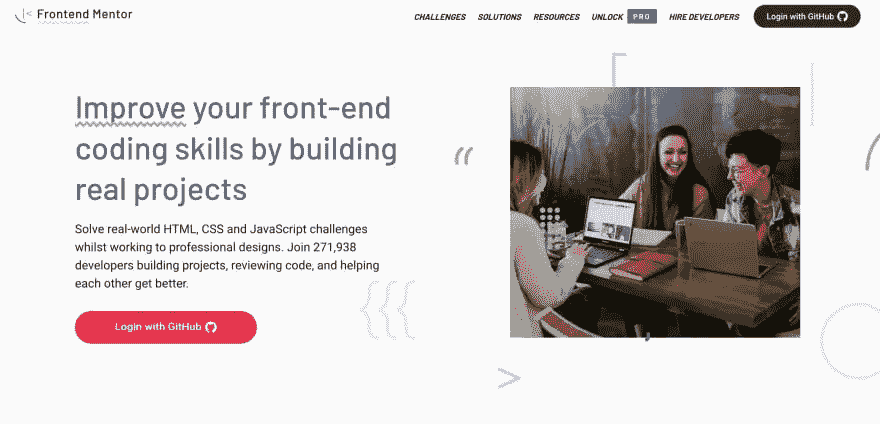

通过构建真实的项目来提高自己的前端技能。在进行专业设计的同时，解决现实世界中的 HTML、CSS 和 JavaScript 挑战。

# 免费课程🆓

## 1.[从零开始学习 HTML5 和 CSS3】](https://www.youtube.com/watch?v=mU6anWqZJcc&ab_channel=freeCodeCamp.org)

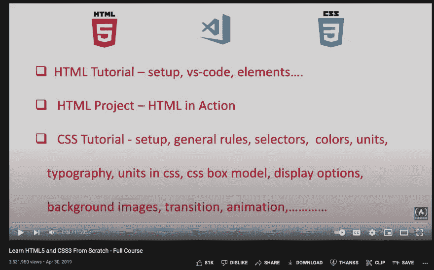

youtube 上的 freecodecamp 课程，学习 HTML5 和 CSS 的基础知识。

## 2.[学习 JavaScript](https://www.codecademy.com/learn/introduction-to-javascript)

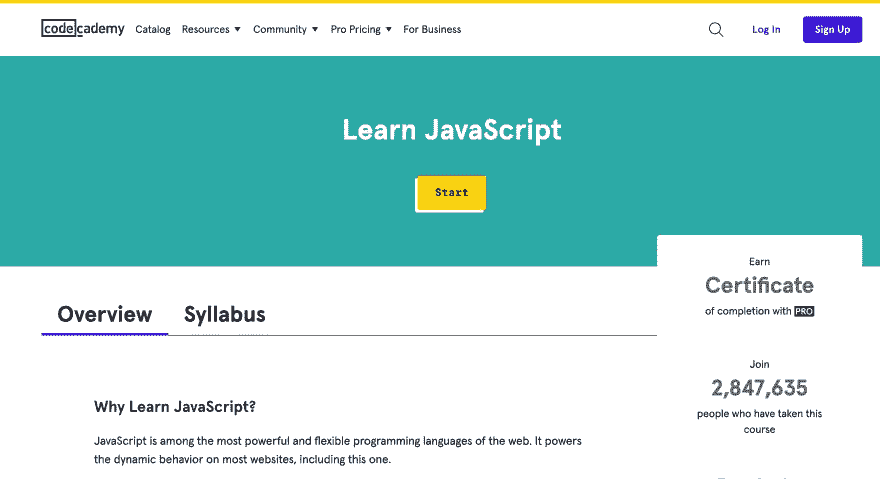

## 3.[学习 ECMAScript 下一代 Javascript](https://www.udemy.com/course/ecmascript2015/)

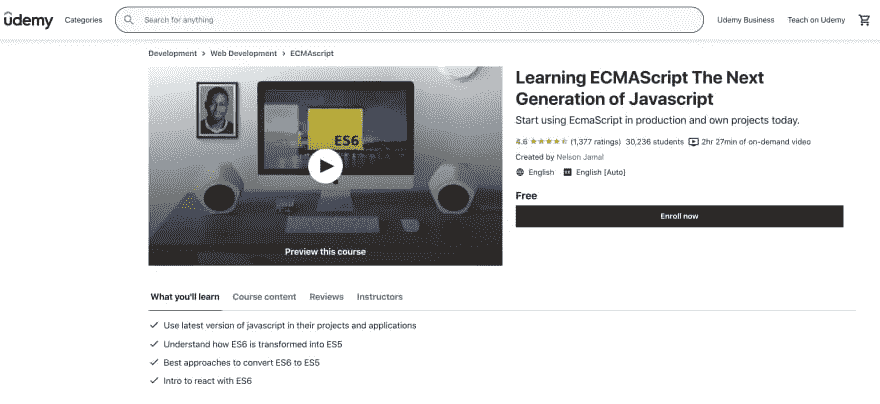

## 4.[学习 Javascript 编程:初学者到专业人员](https://www.udemy.com/course/programming-in-javascript/)

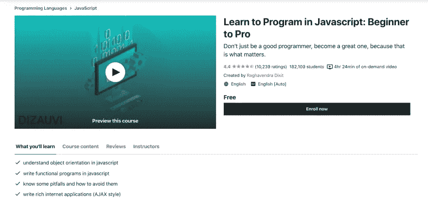

## 5.[用 HTML、CSS 和 JavaScript 构建一个测验应用](https://www.udemy.com/course/build-a-quiz-app-with-html-css-and-javascript/)

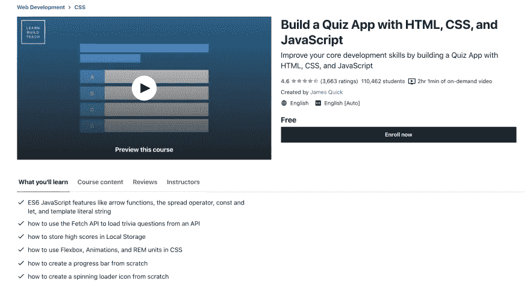

## 6.[高级面向对象的 JavaScript 和 ES6](https://www.udemy.com/course/advanced-and-object-oriented-javascript/)

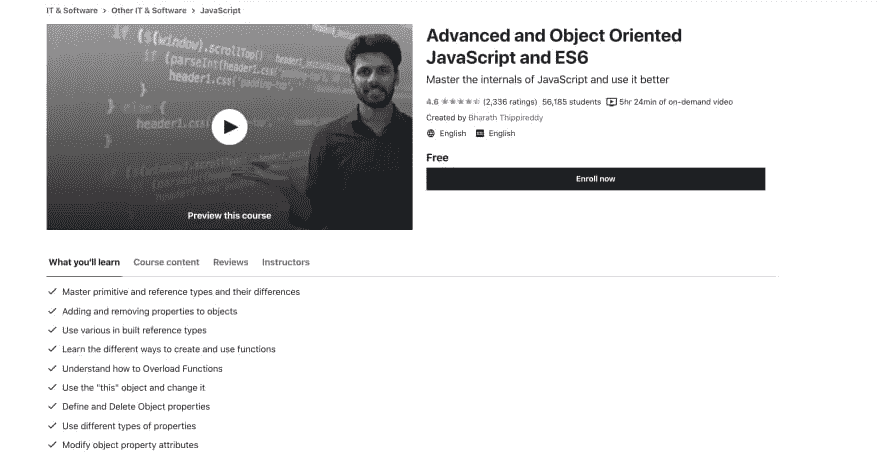

## 7.[前端 Web 开发基础](https://www.udemy.com/course/foundations-of-front-end-development/)

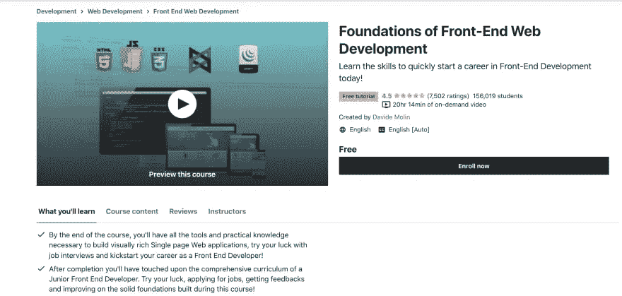

## 8.掌握 HTML5 的基础知识& CSS3:初学 Web 开发

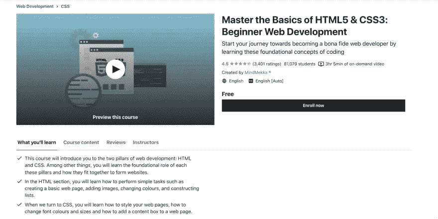

感谢您阅读❤️这篇文章

🌟[推特](https://twitter.com/suprabhasupi) |📚[电子书](https://gum.co/css-pseudo-class-elements)🌟 [Instagram](https://www.instagram.com/suprabhasupi/)