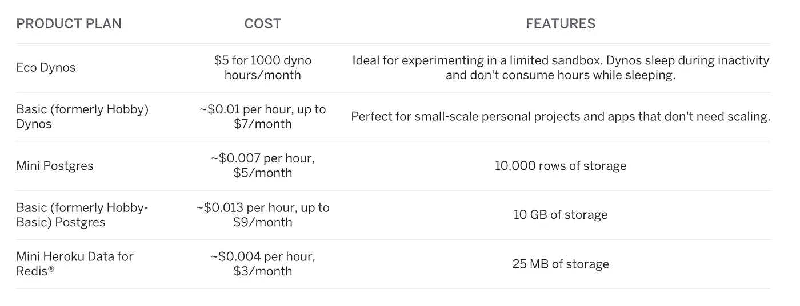
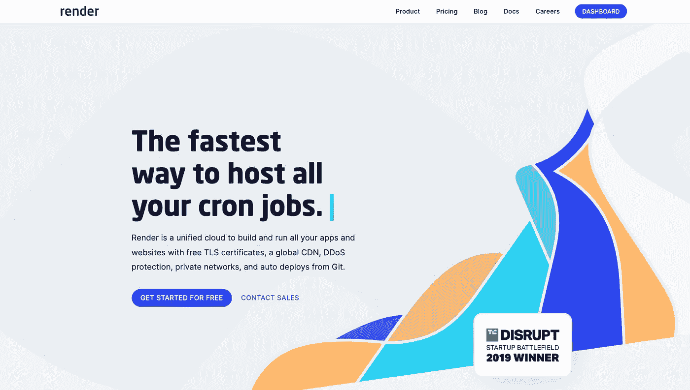
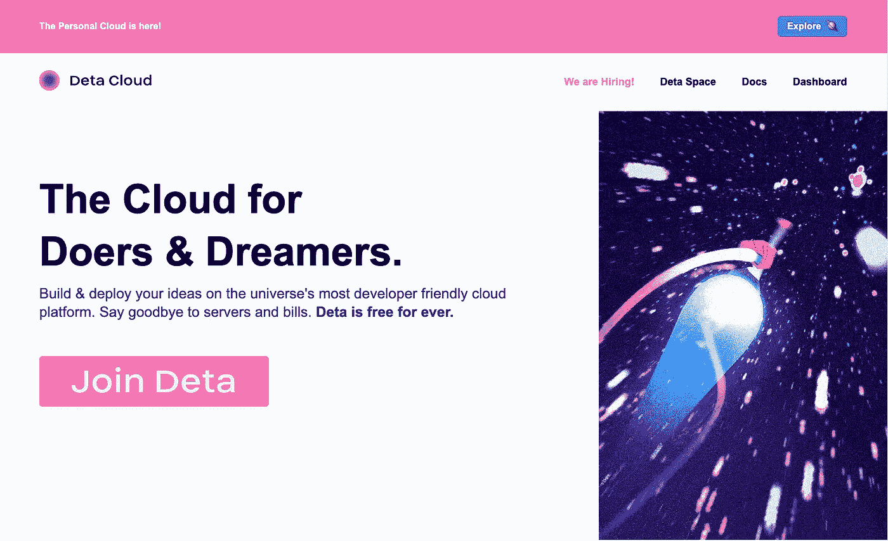
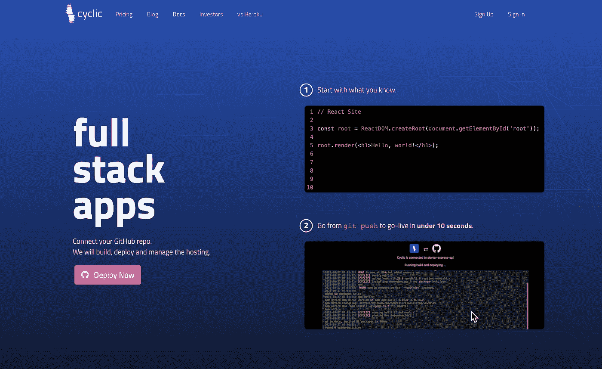
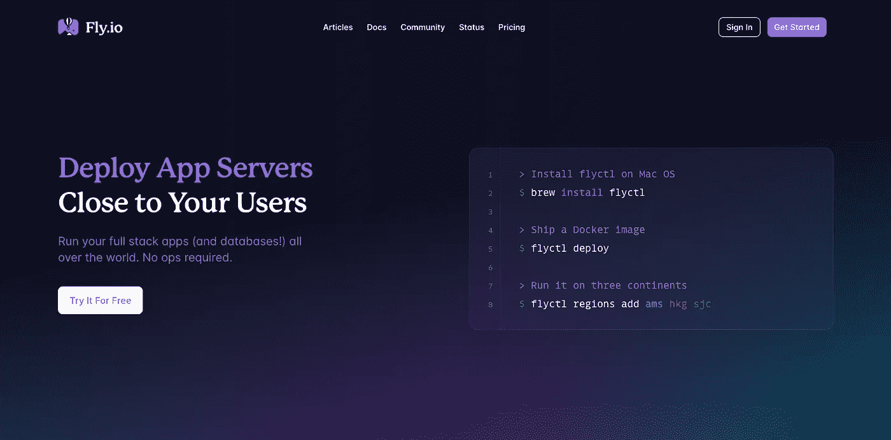

# 2023 年免费主机提供商

> 原文：<https://levelup.gitconnected.com/free-hosting-providers-in-2023-a984f9fb955e>

# 介绍

最受欢迎的免费主机提供商 Heroku 宣布取消他们的免费产品计划,这将影响免费的 Heroku Dynos、Postgres 和 Redis 服务器。

> **免费的 Heroku Postgres、Redis 的免费 Heroku Data 和免费 Heroku Dynos 不再提供。**
> 
> 如果你有使用这些资源的应用，你必须升级到我们的[新的低成本](https://blog.heroku.com/new-low-cost-plans)或其他付费计划，以确保你的应用继续运行并保留你的数据。

如果你在免费的 Heroku Dynos 上部署了一个应用程序，你必须切换到每月花费 5 美元的新 Eco Dynos。

否则，如果你仍然想免费运行你的副业项目，2023 年有 4 个很好的 Heroku 替代方案来部署你的应用。

我们将逐一查看，并决定哪一个最适合您的目的。在每一节的结尾，我还将提供每个平台的部署指南。

# 提供；给予

与 Heroku 最相似的服务是 [Render](https://render.com/) ，如果你已经在 Heroku 上部署了应用程序，这是最容易迁移到的平台。

在 Render 上部署 Web 服务(替代 Heroku Dyno)很容易。您只需链接您的 [GitHub](https://render.com/docs/github) 或 [GitLab](https://render.com/docs/gitlab) 存储库并点击 Create Web Service。每次你推送到你的仓库时，Render 自动构建并且[部署](https://render.com/docs/deploys)你的服务。

他们的平台有对 Node.js、Python、Ruby、Elixir、Go 和 Rust 的原生支持。如果这些对您不起作用，您还可以用 docker 文件构建和部署任何东西。

然而，Render 会在 15 分钟不活动后关闭你的免费实例，就像我们在 Heroku 做的那样。

要在 Render 上部署您的应用程序，请遵循本 [**渲染部署指南**](/top-heroku-alternatives-73a758af8282#:~:text=you%20have%20one.-,Render,-The%20first%20one)

# 二亚乙基三胺

Deta 是一个免费的云平台，你可以在这里建立和部署你的想法，而不用担心服务器成本，也不用提供任何信用卡信息。

如果你想让你的应用程序一直运行，与渲染相比，Deta 是一个更好的选择。如果你的应用程序在 Node.js 或 Python 中，你可以永远免费地将你的应用程序部署在那里。

要在 Deta 上部署您的应用，请查看 [**Deta 部署指南**](/free-nodejs-hosting-on-deta-sh-af57fc46622b)

# 循环的

[循环](https://www.cyclic.sh/)无服务器。没有服务器，没有容器，也没有映像。每个应用程序都完全部署在无服务器的云基础架构上。

Cyclic 与 Deta 非常相似。即使有了免费层，应用程序也不必休眠、唤醒、启动或回收。所有前端和后端都随时准备就绪。

缺点是它们目前也只支持 JavaScript 和 Python 运行时。

要在 Cyclic 上部署您的应用程序，请遵循 [**Cyclic 部署指南**](/top-heroku-alternatives-73a758af8282#:~:text=in%20your%20account-,Cyclic,-Next%2C%20we%20have)

# Fly.io

[Fly.io](https://fly.io/) 是一个和 Heroku 非常相似的托管平台。

与其他替代方案相比，Fly.io 对编程语言的支持更加广泛，如果您愿意提供您的信用卡详细信息以便开始使用，它是 Heroku 的一个非常好的替代方案。如果你没有达到他们的免费限额，他们不会向你收费。

要在 Fly.io 上部署您的应用，请遵循 [**Fly.io 部署指南**](/deploy-node-js-app-to-fly-io-fb0f7ea9c13a)

# 🔗资源

*   fly . io—[https://fly.io/](https://fly.io/)
*   https://www.deta.sh/
*   渲染—[https://render.com/](https://render.com/)
*   周期性—[https://www.cyclic.sh/](https://www.cyclic.sh/)
*   Heroku 更新定价—[https://blog.heroku.com/new-low-cost-plans](https://blog.heroku.com/new-low-cost-plans)
*   Heroku 关闭自由层计划—[https://blog.heroku.com/next-chapter](https://blog.heroku.com/next-chapter)
*   Fly.io 免费限额—[https://fly.io/docs/about/pricing/#free-allowances](https://fly.io/docs/about/pricing/#free-allowances)
*   示例应用程序—[https://github.com/hayk-simonyan/basic-express-api](https://github.com/hayk-simonyan/basic-express-api)