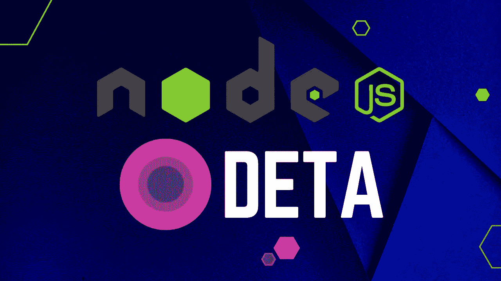
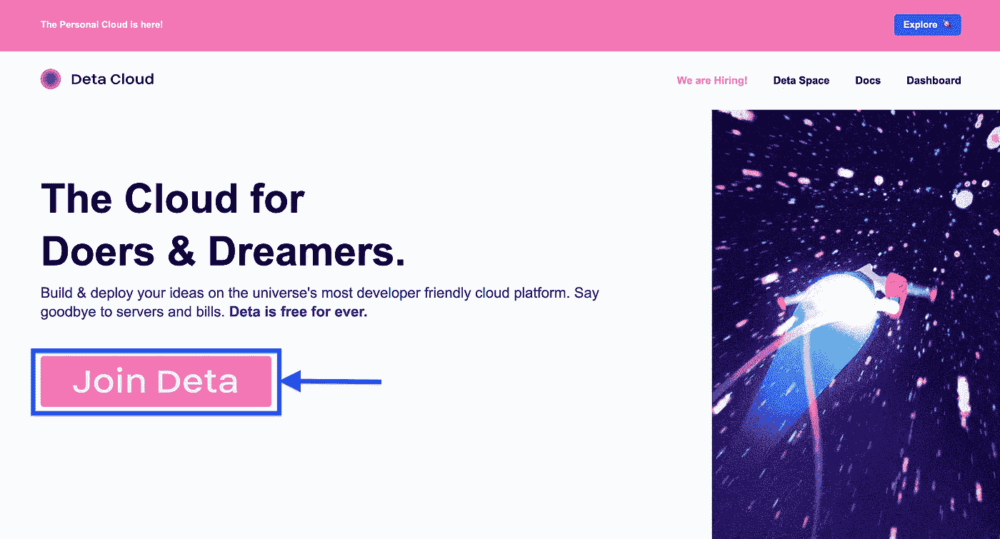
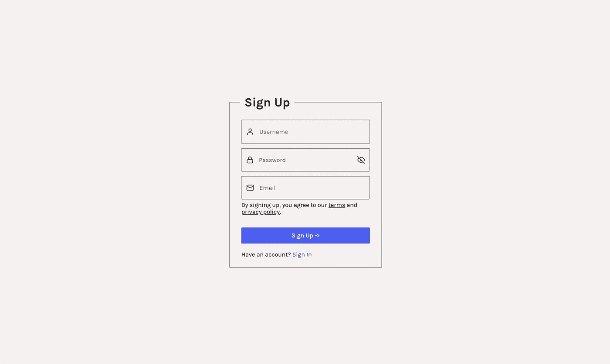
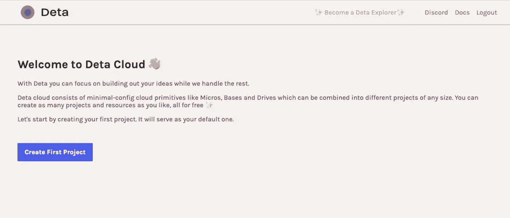
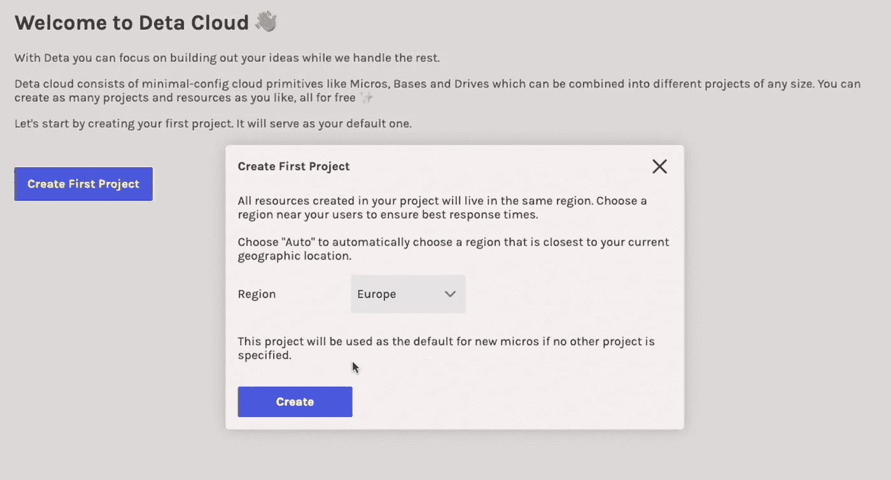
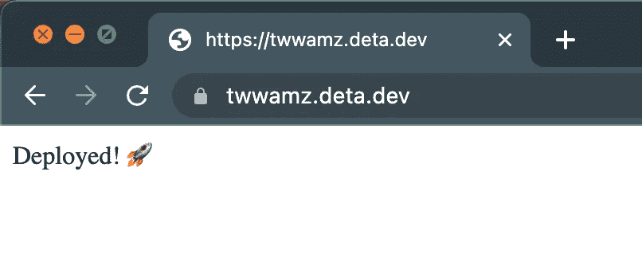

# 免费 NodeJS 托管在 Deta.sh 上

> 原文：<https://levelup.gitconnected.com/free-nodejs-hosting-on-deta-sh-af57fc46622b>



# 什么是 Deta

Deta 是一个免费的云平台，你可以在这里构建和部署你的想法，而不用担心服务器成本，也不用提供任何信用卡信息。

**他们提供 3 个免费的云解决方案**
1。 [Deta Base](https://docs.deta.sh/docs/home/#deta-base)
Deta Base 是一个即时可用的 NoSQL 数据库，具有无限的存储空间
2。 [Deta Drive](https://docs.deta.sh/docs/home/#deta-drive) [详细微](https://docs.deta.sh/docs/home/#deta-micros)。
Micros 是绑定到 HTTP 端点的服务器。目前仅支持 Node.js 和 Python Micros。

您可以使用 **Deta Micros** 服务来托管 Node.js 或 Python APIs。

# 部署

## 签约雇用

首先，我们需要详细创建一个帐户。

*   访问他们的网站创建一个账户。



*   在这里填写必要的信息，然后点击注册。



它会通过电子邮件向您发送一个确认链接。一旦您确认您的电子邮件，您将被重定向到此页面。



在这里，点击**“创建第一个项目”**，选择您所在的地区，然后点击**“创建”。**



## Deta CLI

下一步，它将要求您安装 [Deta CLI](https://docs.deta.sh/docs/home/#deta-cli) ，这将用于将 Node.js 应用程序部署到 Deta Micros。

根据您的操作系统安装 CLI

MAC:`curl -fsSL [https://get.deta.dev/cli.sh](https://get.deta.dev/cli.sh) | sh` Linux:`curl -fsSL [https://get.deta.dev/cli.sh](https://get.deta.dev/cli.sh) | sh`
Windows:`iwr [https://get.deta.dev/cli.ps1](https://get.deta.dev/cli.ps1) -useb | iex`

```
$ curl -fsSL https://get.deta.dev/cli.sh | sh

######################################################################## 100.0%
Archive:  /Users/admin/.deta/bin/deta.zip
  inflating: deta                    
Deta was installed successfully to /Users/admin/.deta/bin/deta
Run 'deta --help' to get started
```

**关闭并重新打开终端**，使其现在可以识别 deta 命令。

## 登录到 Deta

安装完 Deta CLI 后，下一步是使用`deta login`命令从终端登录 Deta。

```
$ deta login

Please, log in from the web page. Waiting…
https://web.deta.sh/cli/58554
Logged in successfully.
```

## 创建微型服务器

在创建一个 Micro 之前，Deta 要求 Node.js 应用程序在它们的服务器上进行部署

*   入口点文件必须命名为`index.js`，例如，如果您将它命名为`server.js`，那么您需要将它改为`index.js`，并且还要更新您的`package.json`中的主入口文件
*   你需要做的另一件事是在你的`index.js`文件
    `module.exports = app;`的末尾添加这一行

要创建 Deta Micro，您需要在终端中导航到项目的父目录。

例如，我的项目在`Desktop/basic-express-api`路径下，所以我需要从终端导航到`Desktop`。

```
$ cd Desktop
```

一旦进入父目录，运行`deta new — node [micro_name]`

注意 **micro_name 必须与您计算机上的项目文件夹**完全相同。

```
$ deta new --node basic-express-api             
Successfully created a new micro
{
 "name": "basic-express-api",
 "id": "31d3971a-57c5-4682-a6aa-9362e3448ea9",
 "project": "a0k1dvlu",
 "runtime": "nodejs14.x",
 "endpoint": "https://cyf414.deta.dev",
 "region": "eu-central-1",
 "visor": "disabled",
 "http_auth": "disabled"
}
Adding dependencies...

+ dotenv@16.0.3
+ express@4.18.2
added 58 packages from 42 contributors and audited 58 packages in 5.847s
6 packages are looking for funding
  run `npm fund` for details
found 0 vulnerabilities
(This must have the same naming as you named your Micro)
```

现在要部署它，我们只需要`cd into_our_project`并运行`deta deploy`

```
$ cd basic-express-api
$ deta deploy

Deploying...
Successfully deployed changes
```

运行`deta details`以获取您的 Micro 的 URL(端点),并打开该 URL 以验证它是否工作

```
$ deta details
{
 "name": "basic-express-api",
 "id": "8e309497-3b88-434c-8e09-fff9091ec133",
 "project": "default",
 "runtime": "nodejs14.x",
 "endpoint": "https://49ic6s.deta.dev",
 "region": "eu-central-1",
 "dependencies": [
  "dotenv@^16.0.3",
  "express@^4.18.2"
 ],
 "visor": "disabled",
 "http_auth": "disabled"
}
```



## 摘要

总之，对于您的项目来说，Deta 是一个非常好的平台，可以免费部署，但是它也有缺点

*   您必须遵守严格的规则，才能让您的应用程序在他们的服务器上运行而不出错(比如入口点文件名)
*   您只能使用 Node.js 和 Python 应用程序

## 🔗资源

Deta 网址:[https://www . Deta . sh](https://www.deta.sh/)
文档:[https://docs.deta.sh/docs/home](https://docs.deta.sh/docs/home/)
Deta CLI:[https://docs.deta.sh/docs/cli/install](https://docs.deta.sh/docs/cli/install)
Deta Micros:[https://docs.deta.sh/docs/home/#deta-micros](https://docs.deta.sh/docs/home/#deta-micros)
部署示例:[https://docs.deta.sh/docs/micros/deploy](https://docs.deta.sh/docs/micros/deploy)