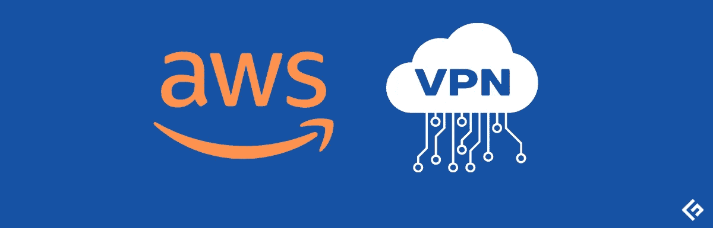
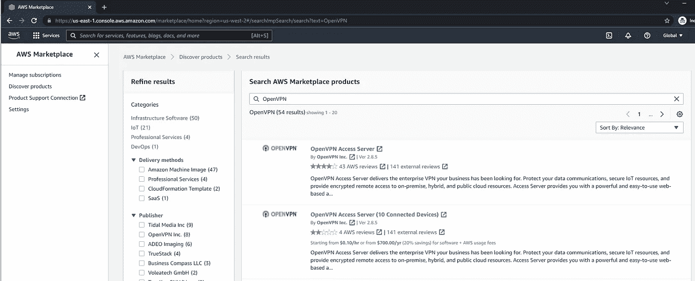
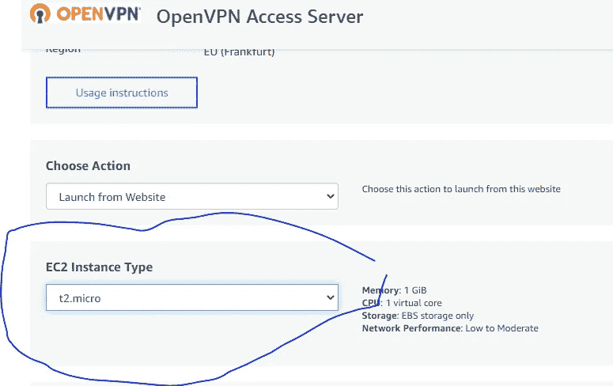
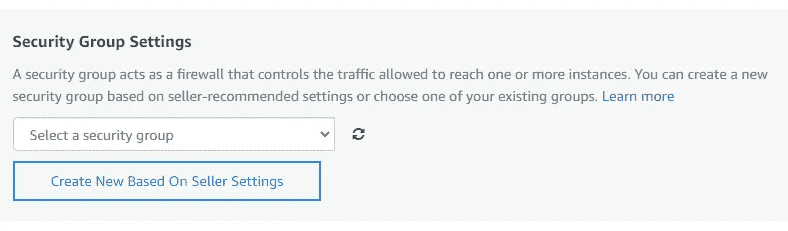
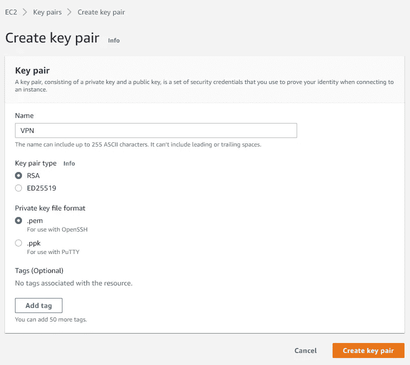
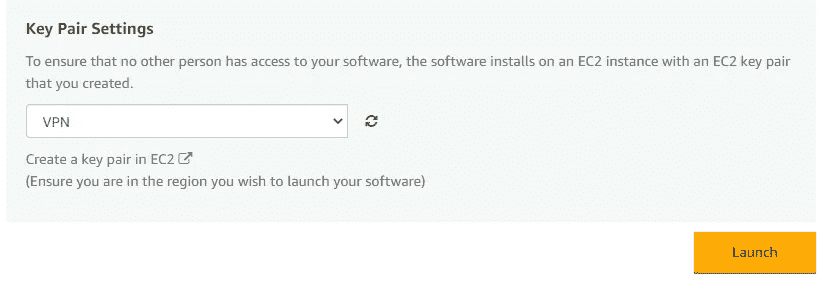
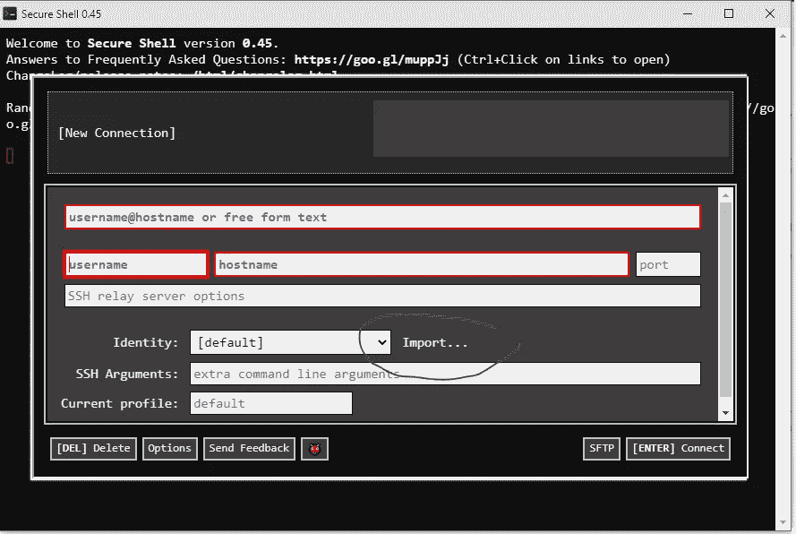
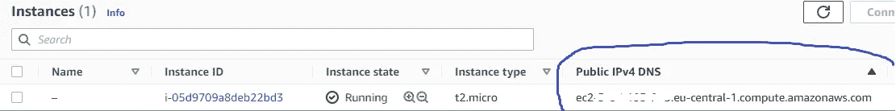
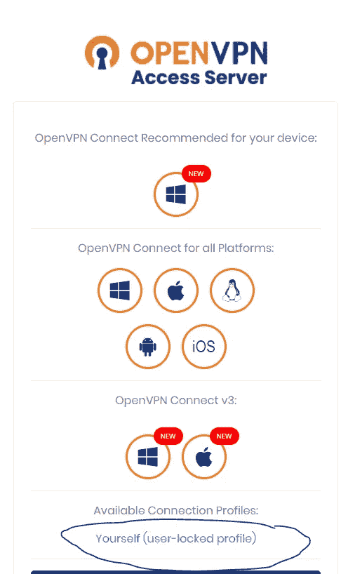

# 免费俄罗斯——在 AWS 上免费创建一次性 VPN 服务器

> 原文：<https://levelup.gitconnected.com/free-russia-create-disposable-vpn-servers-on-aws-for-free-ba429363c305>

你可能知道，普京的军队目前正在乌克兰努力寻找想象中的纳粹分子，并摧毁一切可以摧毁的东西。

你可能没听说，与此同时，普京政府正在打击他的另一个敌人——俄罗斯人民。这场斗争的一部分包括封锁所有可能揭露真相的不受控制的媒体。一个有着邪恶名字 Roskomnadzor 的联邦机构仅仅负责屏蔽广播电台、电视频道和网站。
是的，这也是欧洲石油和天然气资金的用途。

他们已经封锁了成千上万的资源，包括脸书和 Instagram。YouTube 可能正在路上。

直到最近，这些限制都很烦人，但使用任何好的 VPN 服务都可以轻松绕过。不再是了。
邪恶变得更聪明了——他们现在扫描网络中已知的 VPN 和代理 IP，并阻止它们。

# 新的解决方案:专用 VPN 服务器。

只是听起来很难。多亏了 AWS cloud，只需点击几下鼠标就能完成。
几乎任何人都能做到，但不幸的是俄罗斯人做不到。
由于制裁，AWS 不接受新的俄罗斯客户。在本指南中，我将假设你正试图从外面帮助你的俄罗斯朋友或家人。

# 第一步。创建新的 AWS 帐户

请在这里填写登记表。这是一个有点漫长的过程，你需要确认你的电子邮件、电话号码和信用卡。你还必须解决一些烦人的验证码。所以，喝杯咖啡，保持冷静，坚持下去。
如果您已经有一个帐户，您也可以使用它，但是有了新帐户，您将获得 12 个月的 [AWS 免费层](https://aws.amazon.com/free/)优惠。

# 第二步。供应 OpenVPN 访问服务器

进入 [AWS Marketplace](https://us-east-1.console.aws.amazon.com/marketplace/home?region=us-west-2#/search!mpSearch/search?text=OpenVPN) ，搜索 OpenVPN，点击第一个结果。

单击“继续订阅”，接受条款并单击“继续配置”。

在下一步中，您需要选择服务器将托管在哪个区域。
该方法已通过**欧盟(法兰克福)**的成功测试

接下来的部分是最“技术性”的。我保证，这之后事情会变得更容易。

1.  将默认实例类型更改为 **t2.micro** 。
    这是属于自由层的唯一类型。

2.在安全组设置中单击“新建”，键入任意名称并保存。

3.在密钥对设置中，单击“创建密钥对”，在单独的选项卡中完成密钥对创建，将文件保存在某个位置并关闭该选项卡:

4.最后，从列表中选择新的密钥对，并单击“Launch”

恭喜，您的 VPN 服务器现在已经部署到云中了！

# 第三步。连接到 VPN 服务器

在实际使用服务器之前，你需要在上面配置一些东西。别担心，我会解释清楚需要做什么。

要连接到服务器，请将这个扩展添加到您的 chrome。
然后打开它，点击“导入…”并选择你之前下载的密钥对文件。

进入 [EC2 控制台](https://eu-central-1.console.aws.amazon.com/ec2/home?region=eu-central-1#Instances:)，在“实例”列表中复制你的服务器的公共地址:

然后在 chrome 扩展中:

*   将此地址粘贴到主机名字段中
*   在用户名字段中输入“root”
*   按回车键

恭喜你。您现在已连接到您自己的新 VPN 服务器！

# 第四步。配置服务器

当您连接到 VPN 服务器时，向导会询问您几个问题。
答案如下:

> 请输入“是”表示同意。

**是**

> 这将是主访问服务器节点吗

**是**

> 请指定管理员 Web 用户界面要使用的网络接口和 IP 地址

**1**

> 请为管理 Web 用户界面指定端口号

**943**

> 请为 OpenVPN 守护程序指定 TCP 端口号

**443**

> 默认情况下，客户端流量应该通过 VPN 路由吗？

**是**

> 默认情况下，客户端 DNS 流量应该通过 VPN 路由吗？

**是**

> 通过内部数据库使用本地身份验证？

**是**

> 默认情况下，客户端是否可以访问私有子网？

**否**

> 您希望以“openvpn”的身份登录到管理用户界面吗？

**否**

> 指定现有用户或新用户帐户的用户名:

输入您选择的任何用户名。

> 键入“用户”帐户的密码:

输入你喜欢的任何密码，但是我推荐以 **россиябудетсвободной** 或 **крымпоканаш** 开头的。

> 请指定您的 OpenVPN-AS 许可证密钥(或留空以便以后指定)

请留空。

恭喜，VPN 服务器现在已经配置好了！我们快完成了。

# 第五步。下载 VPN 配置文件

在浏览器中导航到您的服务器的公共地址，例如:
[https://ec2-* * * *。eu-central-1.compute.amazonaws.com/](https://ec2-3-67-193-235.eu-central-1.compute.amazonaws.com/)

您将看到关于证书问题的安全警告。
没问题，点击“接受并继续”。

使用您之前创建的用户名和密码登录。

点击“用户锁定配置文件”链接，下载 *client.openvpn* 文件。

# 第六步。把细节发给你在俄罗斯的朋友

以下是您的朋友连接到免费互联网所需的内容:

1.  他们设备上的 OpenVPN 应用。
    在你之前打开的页面中可以找到所有平台应用的链接。
2.  上一步下载的 *client.openvpn* 文件。
3.  你之前编的密码。

祝贺你，你成功了！
安装应用程序后，他们可以选择 *client.openvpn，*输入密码，开始不受限制地浏览网页。

# 常见问题解答

> 这种方法完全免费吗？

差不多了。基础设施和 VPN 软件真的是免费的。
流量每月免费高达 15GB。
之后，您将开始支付每 GB +约 0.09 美元的税款。请你的朋友不要试图下载所有的 YouTube 视频。

> 如果我在俄罗斯有两个朋友呢？

这两种方法都可以用，只要把细节也发给第二个朋友就行了。

> 如果我有很多朋友，我能帮助他们吗？

是的，但不是免费的。
免费版 OpenVPN 服务器只允许 2 个同时连接。考虑购买 [Open VPN 许可证](https://openvpn.net/access-server/pricing/)。

如果你真的不能移植，你可以重复这个过程，创建许多 AWS 账户。AWS 政策中没有任何内容不鼓励这样做。
事实上，你甚至不需要每个账户都有单独的电子邮件地址，你可以使用电子邮件别名。

> 我现在在俄罗斯，我不能按照这个指南，我没有任何人在国外。我能怎么做呢？

给我发消息。我会为你做的。