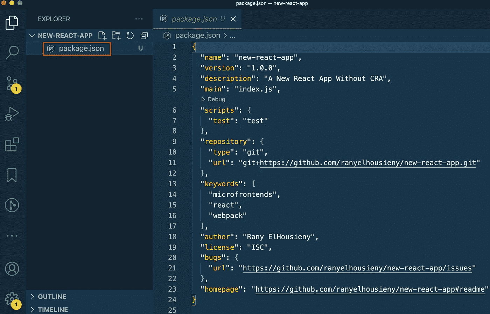
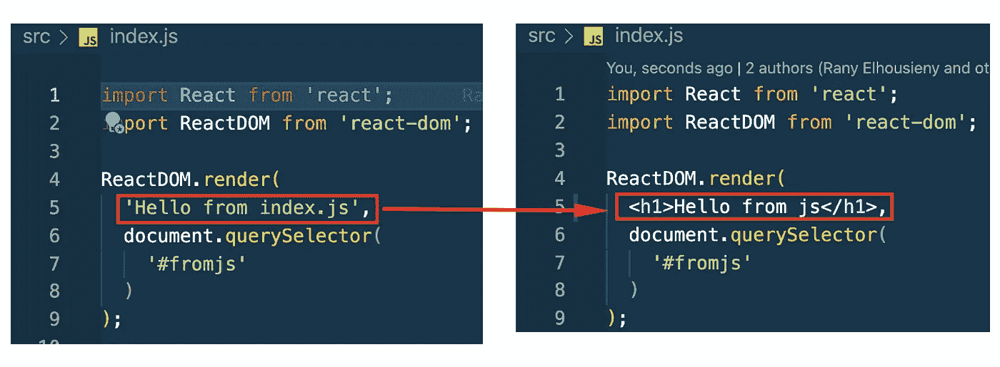

# 从创建-反应-应用中解放出来(如何在没有 CRA 的情况下创建反应应用)

> 原文：<https://levelup.gitconnected.com/freedom-from-create-react-app-how-to-create-react-apps-without-cra-27fadeb79c82>


免于创建 React 应用程序

当我开始使用模块联盟迁移到微前端时，我面临两个使用创建-反应-应用(CRA)构建的应用的挑战。第一个挑战是与 web pack 5([https://github.com/facebook/create-react-app/issues/9994](https://github.com/facebook/create-react-app/issues/9994))的兼容性。第二个挑战是 CRA 的抽象配置。它们不允许您更改或访问配置。所有使用 create-react-app 创建的遗留应用程序都无法轻松升级到微前端。因此，我决定投资展示如何在没有 CRA 的情况下构建 react 应用。这并不难，尤其是如果你把它与花在解决兼容性问题和绕过 CRA 框架上的所有时间相比。

# 什么是创建反应应用程序(CRA)

《CRA》的创作者脸书将其定义为[跟随](https://reactjs.org/docs/create-a-new-react-app.html#:~:text=More%20Flexible%20Toolchains.-,Create%20React%20App,create-react-app%20my-app%0Acd%20my-app%0Anpm%20start,-Note):

> [创建 React App](https://github.com/facebookincubator/create-react-app) 是**学习 React** 的舒适环境，也是在 React 中开始构建**新的** [**单页**](https://reactjs.org/docs/glossary.html#single-page-application) **应用**的最佳方式。
> 
> 它设置您的开发环境，以便您可以使用最新的 JavaScript 特性，提供良好的开发人员体验，并针对生产优化您的应用程序。你需要在你的机器上有[节点> = 10.16 和 npm > = 5.6](https://nodejs.org/en/) 。要创建项目，请运行:
> 
> `npx create-react-app my-app
> cd my-app
> npm start`

# 为什么最好避免创建 React 应用程序(CRA)

CRA 是为初学者设计的(根据脸书的说法),在不理解 Webpack 的下划线配置的情况下学习 React。但是，它不是为生产而创建的。不幸的是，开发人员一直在他们所有的项目中使用它。CRA 限制了您更改任何配置的能力，它有大量不必要的依赖关系，您无法定制配置，您无法构建微前端…当我的客户迁移到微前端时，我在工作中遇到的大多数挑战都是因为他们严重依赖 CRA，而不了解底层配置。

下面的文章将解释如何创建一个完整的网站，并配置没有 CRA 的 Webpack。此外，我将网站部署到 AWS。您可以通过([http://mfe1.s3-website-us-east-1.amazonaws.com/](http://mfe1.s3-website-us-east-1.amazonaws.com/))在线访问最终页面。

项目代码位于(【https://github.com/ranyelhousieny/new-react-app】T2)

这篇[文章](https://www.linkedin.com/feed/update/urn:li:ugcPost:6837477108789456896?updateEntityUrn=urn%3Ali%3Afs_feedUpdate%3A%28*%2Curn%3Ali%3AugcPost%3A6837477108789456896%29)提供了创建 React 应用程序所需的所有步骤，而不需要 create-react-app

[https://www . LinkedIn . com/pulse/create-react-app-without-create-react-app-CRA-elhousieny-PhD % 25e 1% 25 B4 % 25AC % 25e 1% 25 B4 % 25AE % 25e 1% 25 B4 % 25 B0](https://www.linkedin.com/pulse/create-react-app-without-create-react-app-cra-elhousieny-phd%25E1%25B4%25AC%25E1%25B4%25AE%25E1%25B4%25B0)

[https://youtu.be/jsSLA05vBTU](https://youtu.be/jsSLA05vBTU)

=========================

# 1.设置开发环境

如果需要，请按照下面的文章/视频准备您的机器并安装 nodejs:

[](https://medium.com/nerd-for-tech/preparing-your-mac-for-react-and-node-development-install-nodejs-npm-vs-code-and-configure-vs-e4f0cf1e99a4) [## 为 React 和节点开发准备您的 Mac，安装 NodeJS、npm、VS 代码，并配置 VS…

### 按照以下步骤/视频安装 Nodejs

medium.com](https://medium.com/nerd-for-tech/preparing-your-mac-for-react-and-node-development-install-nodejs-npm-vs-code-and-configure-vs-e4f0cf1e99a4) 

============================

# 2.初始化 NPM

mkdir 新建-反应-应用程序

cd 新建-反应-应用程序

npm 初始化

npm init 将启动项目并为您添加所需的样板文件。系统会提示您回答如下问题/选项(在红框内):


npm 初始化

然后向您提供 package.json 的内容以供审查和接受


写下“是”并点击输入。现在，您有一个空项目。您可以在 Visual Studio 代码(代码。).

该目录将只包含 package.json



package.json

==========================

# 文件夹结构

创建以下文件夹结构(您可以按照视频中的步骤操作)


[https://youtu.be/nrLGvlMIuVM](https://youtu.be/nrLGvlMIuVM)

===========================

# 安装 Webpack

```
cd new-react-appnpm install webpackoryarn add webpack
```


这将创建以下项目:

1.  package.json 中 Webpack(当前版本为 5.51.1)的依赖项
2.  将安装依赖项的节点模块(node_modules)的新目录
3.  yarn.lock(如果您使用了 yarn)

===============================

# 配置 Webpack

让我们在根目录下创建一个配置文件，并将其命名为 webpack.config.js。


这是 Webpack 的主要配置文件，也是我们将花费大部分时间的内容。

注意:我初始化了 git (git init)并将 node_modules 添加到。gitignore 与我在 Github 中的项目同步。你会发现。gitignore 文件在我的截图上。


下面是 Github 中目前为止的提交([https://Github . com/ranyelhousieny/new-react-app/commit/da 82 ea 6b 42 f 8 aa 1 b 4497413 BC 6760 f 90 edd 3d e 40](https://github.com/ranyelhousieny/new-react-app/commit/da82ea6b42f8aa1b4497413bc6760f90edd3de40))

## 添加开发模式

现在，让我们试着构建一下，看看会发生什么。运行以下命令:

```
yarn webpack
```

你会得到很少的错误。让我们看看第一个错误。


第一个错误是询问模式。Webpack 需要知道运行哪种模式，以便能够相应地捆绑依赖项。让我们使用开发模式。在 webpack.config.js 中，添加以下内容。

```
module.exports = {
  mode: 'development',
};
```


这将处理第一个错误，并告诉 Webpack 以开发模式构建。现在，再次构建并观察左侧的文件夹。您会注意到一个名为“dist”的目标文件夹将被创建。


现在，我们解决了第一个错误。但是，它仍然在抱怨 src 目录和一个条目文件。


每个项目必须有一个 src 文件，其中至少有一个入口点(例如:index.js)。让我们创建一个 src 目录并添加 index.js


这将处理所有错误并成功构建。然而，我们仍然有一个空项目。

## 让我们在这里停下来，解释一下发生了什么:


网络包模块捆扎机

Webpack 是一个模块捆绑器。它接受 index.js(或我们定义的任何条目文件)并将其所有依赖项打包到一个文件(main.js)中。这就是为什么我们将在微前端中使用这个技巧，因为每个微前端将是一个单独的捆绑 remote.js 文件，正如我们将在这篇[文章](https://www.linkedin.com/feed/update/urn:li:ugcPost:6773293273076391936?updateEntityUrn=urn%3Ali%3Afs_feedUpdate%3A%28*%2Curn%3Ali%3AugcPost%3A6773293273076391936%29)中看到的。

现在，我们需要使用 webpack-dev-server 将它呈现给浏览器

================================

# 添加 Webpack 服务器。

让我们添加一个 webpack-server，以便能够在开发过程中在浏览器上看到输出。


```
yarn add webpack-server webpack-cli webpack-dev-server
```

这将在 package.json 文件中再添加一个依赖项。


现在，让我们将 Webpack serve 命令添加到 package.json 脚本，如下所示

```
“start”: “webpack serve”
```

这样，我们可以使用 yarn 或 npm 来编译和服务站点。


在终端中，运行命令

纱线运行开始

去浏览器放网址 [http://localhost:8080](http://localhost:8080) 。


这里可以看到 main.js 的内容[http://localhost:8080/main . js](http://localhost:8080/main.js)。


如您所见，js 文件的内容并不那么有趣。我们需要添加一个 HTML 文件和一个 HTML Webpack 插件来理解如何渲染它。让我们在下一步做那件事。

============================

# 添加 HTML Webpack 插件

我们需要添加 **html-webpack-plugin**

```
**yarn add html-webpack-plugin**
```

然后，我们需要为 webpack 导入 html-webpack-plugin 来生成 index.html 并添加捆绑的 js 文件。

```
const HtmlWebpackPlugin = require('html-webpack-plugin');
```


然后，我们将插件添加到 module.exports 对象，作为插件的插件数组，如下所示:


正如您在这里注意到的，我们需要包含一个模板 index.html，Webpack 将使用它来生成一个新的 Index.html，其中包含生成的 main.js

在之后添加一个简单的 public/index.html 文件(你可以在这里找到[):](https://github.com/ranyelhousieny/new-react-app/blob/6e381ada988cb43537aa5f45d80814ef61371a89/public/index.html)


现在再次运行`yarn run start`并浏览到 [HTTP://localhost:8080](http://HTTP://localhost:8080)

```
yarn run start
```


当然，我们还没有任何 javascript 代码。但是如果你查看页面的源代码，你会发现 Webpack 注入了 main.js，它现在是空的。

右键单击页面并选择检查，然后选择源，如下所示:


我们没有添加这一行

```
<script defer src="main.js"></script></head>
```

webpack HTML 插件添加的

恭喜你！你有了你的第一个网页。现在，让我们开始添加 Javascript，然后做出反应。

=============

## 添加日志记录

让我们在控制台上打印一个日志语句

在 src/index.js 中导航并添加

```
console.log(“My First Web App”);
```


转到 localhost 页面，检查并选择 Console，然后查看如下所示的输出。


===================

# 链接 Javascript 和 HTML

下一步，我们需要通过 HTML 文件在浏览器上显示 javascript 文件的内容。为此，我们需要将两者联系起来，如下所示:

1.  决定在 HTML 文件中显示 js 的位置，并用 ID 标记它

```
<div *id*="fromjs"></div>
```


将 index.js 链接到该 id，如下所示:

```
document.querySelector('#fromjs').innerHTML = `<h1>From index.js</h1>`;
```


现在，您已经学习了如何使用 Webpack 构建页面并向其中添加 js。下一步是添加 React。

==================

# 将 React 添加到 Webpack


遵循下面的[文章](https://www.linkedin.com/pulse/adding-react-webpack-rany-elhousieny-phd%25E1%25B4%25AC%25E1%25B4%25AE%25E1%25B4%25B0)将 React 添加到您的项目中

[https://www . LinkedIn . com/pulse/adding-react-web pack-rany-elhousieny-PhD % 25e 1% 25 B4 % 25AC % 25e 1% 25 B4 % 25AE % 25e 1% 25 B4 % 25 B0](https://www.linkedin.com/pulse/adding-react-webpack-rany-elhousieny-phd%25E1%25B4%25AC%25E1%25B4%25AE%25E1%25B4%25B0)

虽然我们添加了 React，但我们仍然无法翻译 jsx。为了能够在 js 中添加 HTML 元素，我们需要安装允许添加 HTML 元素而不是文本的 babel，如下所示:



如果您尝试向 index.js 添加 HTML 元素，它将不会编译。

================

# 向 Webpack 添加 Babel


下面的[文章](https://www.linkedin.com/pulse/adding-babel-webpack-rany-elhousieny-phd%25E1%25B4%25AC%25E1%25B4%25AE%25E1%25B4%25B0)将解释如何将 babel 和 babel-loader 添加到 Webpack

[https://www . LinkedIn . com/pulse/adding-babel-web pack-rany-elhousieny-PhD % 25e 1% 25 B4 % 25AC % 25e 1% 25 B4 % 25AE % 25e 1% 25 B4 % 25 B0](https://www.linkedin.com/pulse/adding-babel-webpack-rany-elhousieny-phd%25E1%25B4%25AC%25E1%25B4%25AE%25E1%25B4%25B0)

就是这样。现在，您可以用 jsx 网站添加 React.js


下一步是添加 CSS 和样式加载器

==============

# 添加 CSS


[https://www . LinkedIn . com/pulse/adding-CSS-web pack-rany-elhousieny-PhD % E1 % B4 % AC % E1 % B4 % AE % E1 % B4 % B0](https://www.linkedin.com/pulse/adding-css-webpack-rany-elhousieny-phd%E1%B4%AC%E1%B4%AE%E1%B4%B0)

现在，你已经有了没有 CRA 的 React 应用程序样板文件。您可以将该项目克隆为未来文章的模板

==============

# 添加 Sass

[https://www . LinkedIn . com/pulse/adding-sass-web pack-rany-elhousieny-PhD % 25e 1% 25 B4 % 25AC % 25e 1% 25 B4 % 25AE % 25e 1% 25 B4 % 25 B0](https://www.linkedin.com/pulse/adding-sass-webpack-rany-elhousieny-phd%25E1%25B4%25AC%25E1%25B4%25AE%25E1%25B4%25B0)