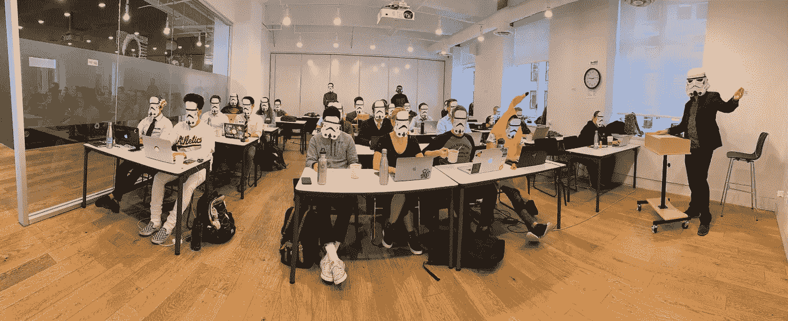
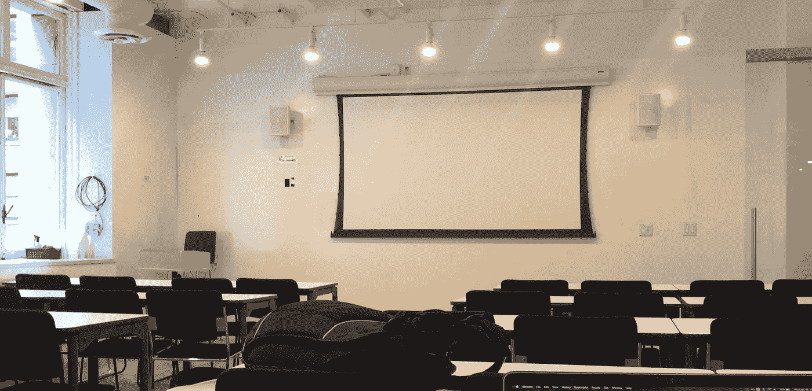
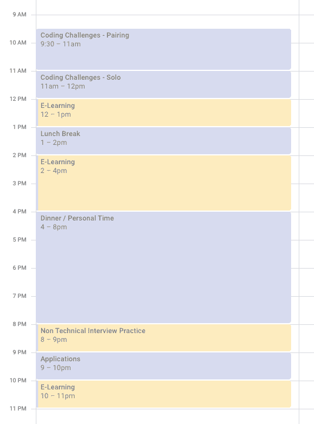
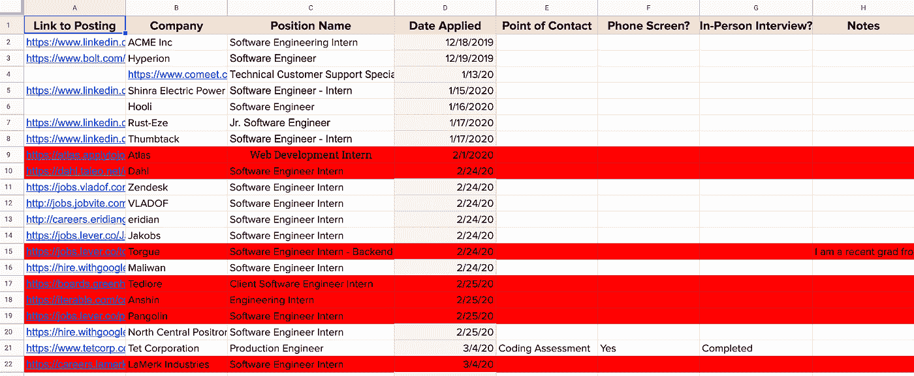
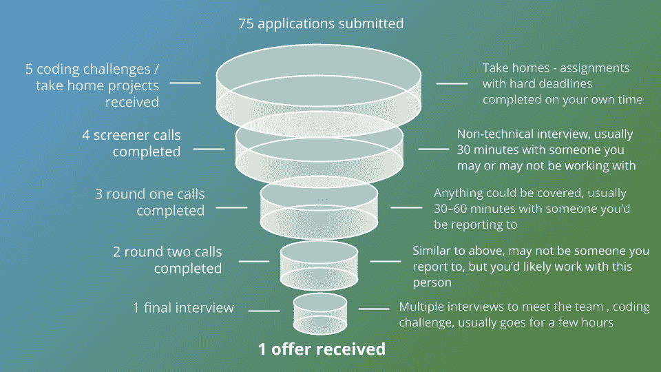

# 从编码训练营到报价——我的 1280 小时旅程

> 原文：<https://levelup.gitconnected.com/from-coding-bootcamp-to-an-offer-my-1280-hour-journey-c53d584f8feb>

那么，我为什么要写这个呢？我的目标是让你对获得第一份软件开发工作所需的时间投入有所了解。我希望通过分享我的独特经验来实现这个目标，以便其他人可以从中学习。进去的时候，我有一个在训练营期间我会做什么的想法，但是，我不知道毕业后会期待什么。我希望读完这篇文章后，你会比我更有见识。

像去年[的 3 万多人一样](https://careerkarma.com/blog/bootcamp-market-report-2020/)，我参加了一个编码训练营。我想要一次课堂体验，而且我想尽快得到它。我最终加入了大会的软件工程沉浸式项目。1200 多个小时后，我接受了脸书公司的生产工程师职位。

关于我自己的一点背景。我获得了广告学学士学位，在决定转行之前，我在数字营销领域工作了 9 年。

回想我参与的项目，任何工作中我最喜欢的部分就是和一个小团队一起深入研究一个问题。我们会做一系列的研究，尝试一些事情，并提出建议供开发人员实施。但是这些开发人员是如何将一组需求转化为功能软件的呢？我想知道。那时我意识到，我不想成为一个建议者，我想成为一个创造者。

经过深思熟虑，我决定从事软件工程，在那里我可以在一个小团队中工作来创造解决方案。最重要的是，该行业预计未来 10 年的增长率为[20%](https://www.bls.gov/ooh/computer-and-information-technology/software-developers.htm#tab-6)——肯定会有持续的需求。与我之前在数字营销领域的工作相比，我觉得在软件开发领域有更多的机会。

所以，这是编码训练营！

开始时，我只知道非常基本的 HTML 和 CSS(足以进行编辑，但不能从头开始构建任何东西)。我没有任何编程语言的经验，我也知道如何在命令行界面中使用简单的命令(想想 MS-DOS，Linux，任何涉及输入命令而不是点击东西的东西)。

现在，让我们来了解一下我是如何从只有一些前端知识到签署要约的。

## TLDR:

**实际训练营:2019 年 9 月至 2019 年 12 月**

训练营——660 小时(课内 480 小时，课外 180 小时)

**训练营后:自学—2020 年 2 月至 2020 年 5 月**

编码挑战——210 小时(180 小时单干，30 小时与同伴一起)

电子学习— 270 小时

行为面试——20 小时

求职——120 小时(75 小时用于申请，45 小时用于面试和带回家的项目)

## 细节

**实际训练营**

我的神奇团队—sei 5—2019 年 10 月

啊，多好的经历啊。这是有趣的部分——我们的日子是有计划的，我们有一个时间表要遵循。我们有其他同学可以依靠，老师们总是乐于助人。

训练营的时间是周一到周五上午 9 点到下午 5 点。为了最大限度地利用这个项目，我还每天花几个小时在课外(包括周末)完成作业、项目，或者只是学习。如果曾经有一个奖金或延伸目标，我要么完成它，或至少尝试它。

我是如何得出 660 小时的？

算上周末和节假日，一个月大概有 20 个工作日。这个项目进行了 3 个月，所以 60 个工作日 x 8 个小时。那就是 480 个小时花在课堂上。在这 90 天里，我每天至少花 2 个小时在课外提高技能。所以又是 180 个小时。

**后训练营:自学**

毕业编码 bootcamp，剩下的就看你自己了(还有你的背包)！

*嗯，现在怎么办？* *我该如何打发时间？我刚开始申请工作吗？我应该做什么？训练营结束后，你可以做无数的事情。以下是我的第一手经验和对我有效的方法。*

看着入门级软件开发职位的要求，我意识到即使在训练营结束后，我还有很多东西要学。数据结构和算法、白板练习、技术面试，甚至非技术面试都是我需要改进的地方。我的方法和我所学的任何东西都很相似——自己做大部分的跑腿工作，试着对我所学的东西有一个基本的理解。然后，联系同学练习新材料并获得反馈。

以下是我典型的一天的一个例子:

确保你得到一些突破。也要保证充足的睡眠！

我的工作日和周末开始变得模糊不清——我每天的时间表是早上的编码挑战，下午的在线学习，晚上的应用和继续在线学习。

我专注于一件事:在软件开发领域找一份工作。摆在我面前的是一项艰巨的任务，但是，我知道我并不孤单。在这个团队中有许多我可以依靠的盟友。我也有朋友(新老！)来和亲人一起练习，来支持我。

我是这样度过我的时间的:

E——学习
看视频和阅读。从训练营出来，我最大的弱点是不理解数据结构&算法(简称 DS & A)。2 对我帮助很大的资源是 [AppAcademy 的 DS & A](https://open.appacademy.io/) 单元，以及[柯尔特·斯蒂尔的 DS&A](https://www.udemy.com/course/js-algorithms-and-data-structures-masterclass/)Udemy 上的课程。

我还充分利用了 PluralSight 提供的一个月免费时间，参加了一些 AWS 和谷歌云培训项目。我将在底部添加一个附录，列出对我的站点可靠性工程有帮助的课程。

*那么关于那 270 小时呢？*

这相当于 90 天内大约 3 小时的视频/阅读。我每天在那 3 个小时里到底做了什么？有时我要花 3 个小时才能看完 1 个小时的内容——我会重读那些没有意义的部分。每次我碰到一些没有意义的东西，我都会记下来，要么研究它，要么就地查找。我还每天晚上花额外的时间修改和总结我的笔记。

几年前，我读到过教授一个话题是学习它的好方法。所以，每次我学到一个新的话题，我都会假装第二天我正在做一个关于这个话题的报告。在我向一群人展示任何信息之前，我需要对它有一个大致的了解。这样做的结果通常是创建一个关于新材料的备忘单。抱着这种心态去帮助我加深对新概念的理解。

C oding 挑战
不管讨厌它还是喜欢它，很多雇主还是用这个工具来衡量你解决问题的能力。练习编码挑战有很多选择。我同时使用了 HackerRank (HR) & LeetCode (LC)。这里的平台不太重要——只需选择一个并开始。

> 小贴士#1 我给初学者的建议是——不要在任何一个问题上花费超过 2-3 个小时。

为每个编码问题设定一个时间限制，在 1-3 小时之间。一旦你达到了这个上限，继续看讨论或解决方案，以了解其他人是如何处理这个问题的。不要浪费你的时间去重新发明轮子。我为什么要提这个？我在第一次编码挑战上浪费了 3 天时间(总共 8-9 个小时)。如果我在两个小时前停下来，研究一下其他人是如何处理同样的问题的，我会学到更多。

由于游戏化，我最终在 HR 上花了更多的时间。HR 会给你完成一系列特定问题的徽章。我推荐做 [30 天代码](https://www.hackerrank.com/domains/tutorials/30-days-of-code) & [10 天 JS](https://www.hackerrank.com/domains/tutorials/10-days-of-javascript) 。LC 上的[“探索”部分也很棒。](https://leetcode.com/explore/featured/card/top-interview-questions-easy/)

> 秘诀 2:不要独自去做

看看你的团队中是否有人想练习编码挑战。检查您的网络。

[使用 Pramp](https://www.pramp.com/#/) ！Pramp 是一个工具，它可以为你找到一个练习技术性和非技术性面试的搭档。使用 Pramp，你所要做的就是选择一个你可以用来练习编码挑战的时间段。然后，Pramp 会给你匹配一个伴侣。与他人一起解决问题是练习白板练习的绝佳方式。习惯和另一个人结对，边解决问题边交流。

我确保每周安排两次练习。大多数时候只是分享屏幕和视频聊天。在处理编码挑战时，我得到了一些关于我的一些习惯的反馈(当我遇到困难时避免叹气，不要说得太快)。

*210 小时？*

大约 30 个小时和另一个人一起练习编码挑战(12 周内 24 次练习，平均每次 1.5 小时)。单人约 180 小时(90 天每天约 2 小时)。

行为面试我以前做过面试，所以我认为这很容易。当我的一个朋友问我是否想练习时，我高兴地接受了他的邀请。我们做了一个模拟的非技术性面试，轮流扮演面试官和被面试者。我以前没有尝试过，但我决定记录我们的会议。

我听了大概 30 秒的录音，它太令人生厌了，我把它删掉了。我的朋友给了我一些很好的建设性反馈，我肯定还有很多需要改进的地方。我最大的一个问题是我对一个常见问题的电梯推销，“那么，告诉我你自己吧”。我以为我能在 60 秒内快速回答，但当我计时时，我已经超过了 4 分钟。

*花费的时间？*

大约 20 个小时的模拟面试，分 12 次与 8 到 9 个不同的人进行。Pramp 也是练习这些面试的好方法。

为了跟踪，我使用了一个简单的谷歌表单。我在下面附上了我实际工作跟踪文档的截图:

红色代表“不”的公司。其他的，我仍然抱有希望。

以下是我求职过程的详细分析:

抓住每一个机会。我最终接受的邀请是来自大会职业教练的建议。我还建议根据你进步最大的机会来调整你的学习努力。

我在这里是怎么度过的？

直到第二个月的自考，我才开始认真申请。

填写 90 份申请表大约花了 75 个小时。不知道花了多少时间浏览房源。

大约 45 小时花在电话/面试和带回家的项目上。

# 今天

我于 2020 年 8 月 17 日开始在脸书担任生产工程师，我期待着继续学习和成长。希望这篇文章对那些希望进入第一个软件开发角色的人有所帮助。

## 附录—现场可靠性角色面试准备

[苦读系统设计面试](https://www.educative.io/courses/grokking-the-system-design-interview) —设计大师—教育性
[LPI Linux 基础课程(010–160)](https://app.pluralsight.com/paths/skills/lpi-linux-essentials-010-160)—David Clinton—plural sight
[Mac OS 和 Linux 上的 Bash Shell 简介](https://app.pluralsight.com/library/courses/introduction-bash-shell-linux-mac-os)—Reindert-Jan Ekker—plural sight
[为企业构建分布式系统的模式](https://app.pluralsight.com/library/courses/cqrs-theory-practice)—Michael Perry—plural sight
[Cloud devo PS 工程师纳米学位](https://www.udacity.com/course/cloud-dev-ops-nanodegree--nd9991) —
[谷歌云课程](https://www.coursera.org/browse/information-technology/cloud-computing) — Coursera(基本系统设计/网络概念)
[Linux 如何工作:每个超级用户都应该知道的事情](https://nostarch.com/howlinuxworks2)Brian Ward 撰写
YouTube 上的系统设计视频来自 abrar、Gaurav Sen、
Clément Mihailescu、TechLead

# 谢谢

一路上我得到了很多支持，我要感谢很多人。

我的神奇训练营导师:肯尼，道尔顿，艾伦和马特。

我的同学，求职的战友，现在的朋友——特别是:杰克，杰里米，林，杰，君。

我的朋友:布莱恩和肯。

克里斯蒂娜、艾琳、林、莫妮卡:感谢你们帮助我改进这篇文章(200 多处编辑/建议！)

所有来看我的人:你们每一个人。

我的家人在各方面都给了我帮助，尤其是我的妻子乔伊斯，她独自抚养了我们的两个孩子，而我却在电脑前呆了将近一年。

你:通读这整件事。随意伸手！