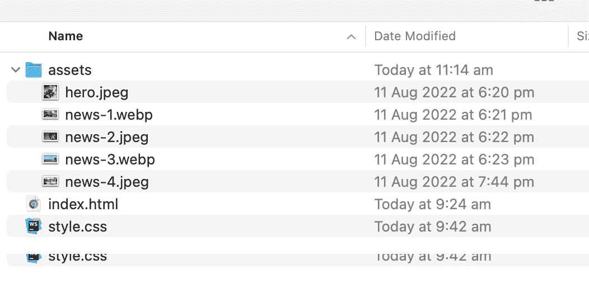
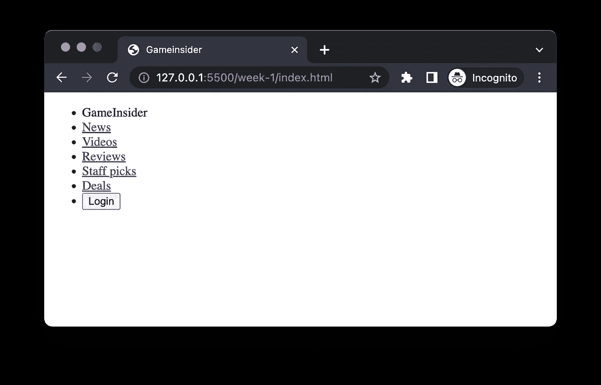
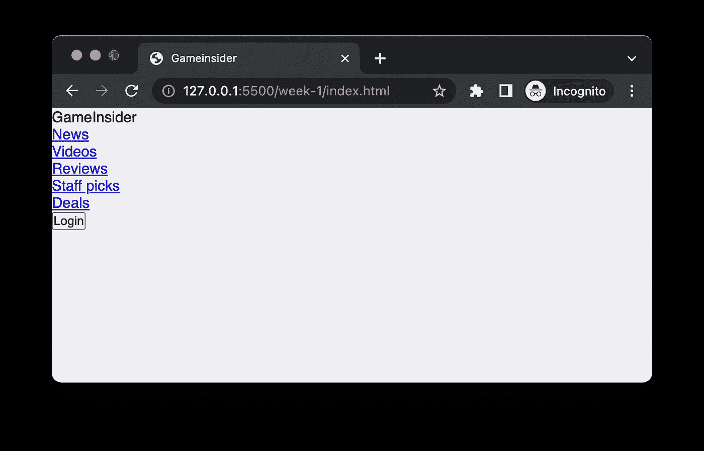
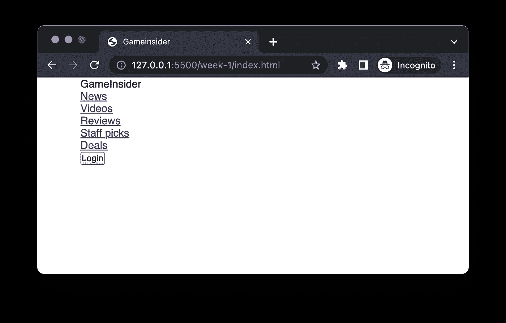
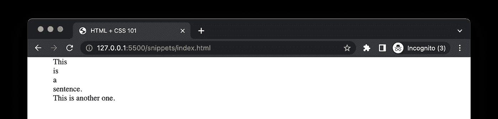
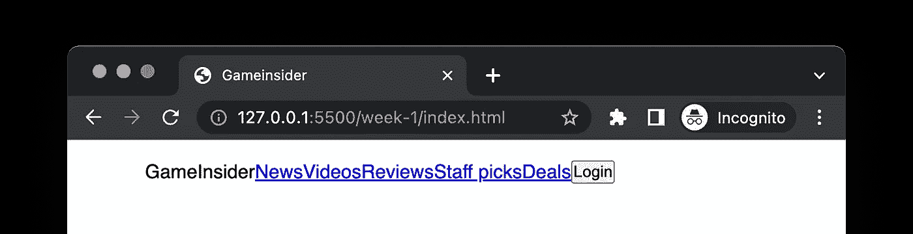
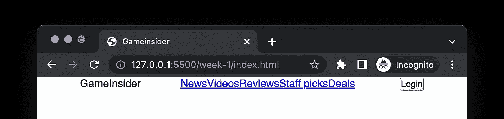
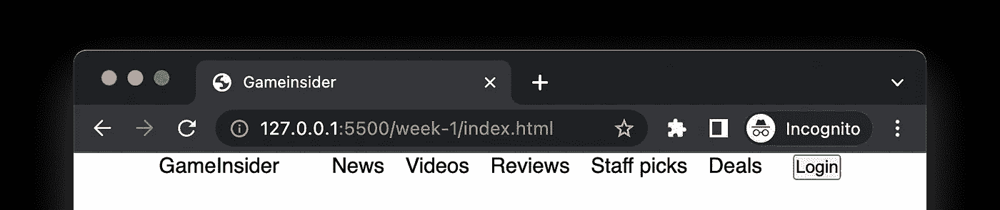
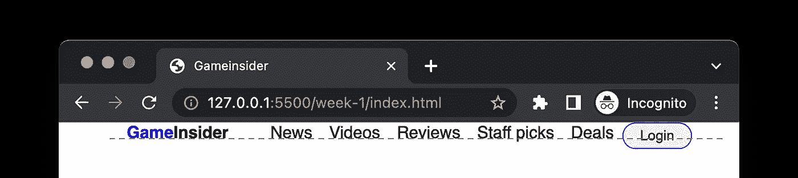
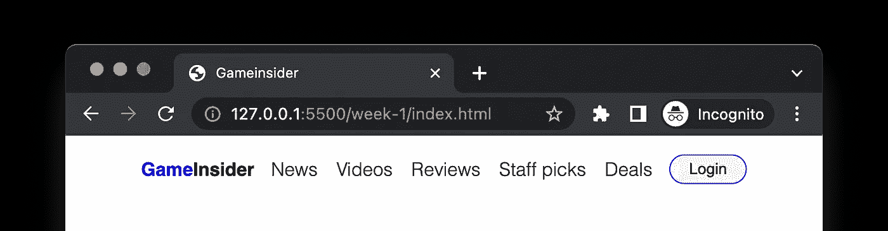

# 从设计到编码(第二天)

> 原文：<https://levelup.gitconnected.com/from-design-to-code-day-2-4665d6e449b4>

我最近正在开发一门叫做*三周三个网页设计*的课程。最初，它是一个为期 3 周的研讨会材料，旨在成为一个有许多实践的实践密集型研讨会。主要目标是教没有多少开发经验的人使用 HTML 和 CSS 来复制专业的设计模型——这就是为什么它被称为“从设计到代码”。

我发现即使是工作室里最简单的项目对于一篇文章来说也太长了，所以我决定把它分成三部分，形成一个系列。如果你想从头开始学习这个话题，请跟着做。

这是 4 部分教程中的第 2 部分，如果你错过了上一部分可以看看。

# 我们项目的任务

无论你是刚开始写你的第一页，还是有经验的，第一步都应该考虑页面的内容，并将模型分解成小块。一般来说，我们可以把页面按照从上到下的顺序拆解成多个模块，逐步用 HTML 描述每个模块，最后用 CSS 添加样式。

你可以一次写完所有的 HTML，或者实现一个模块，添加样式，然后继续下一个。这里，我们将一次一小段地实现第一页，以防止一次学到太多。

# 解构实体模型

从样机上可以看出，它的导航部分是一个相对独立的组件，所以我们可以从它开始。我们先做一些准备工作，创建一个目录`week-1`，在里面创建两个文件`index.html`和`style.css`。最后，我们在`week-1`中为图像资源创建一个`assets`子目录。



项目的文件夹结构

在`index.html`中，我们需要设置一些基本的 HTML 代码，也就是样本 HTML:

如果你不确定这里描述的是什么，不要担心，我们几乎不会触及这一部分。在`title`标签中定义的`Week 1`将会出现在你的浏览器标签中，所以如果你喜欢的话，给它起一个很酷的名字。

我们将在本章(包括整本书)的`body`区域工作，我们所有的 HTML 代码都将写在里面(几乎，我们可能需要添加外部 CSS 链接，但我们将在后面讨论)。

另外，语句`<link rel="stylesheet" href="style.css">`表明我们希望在这个 HTML 文档中使用一个外部文件:`style.css`。是的，这是我们定义样式的地方，但是这个文件还没有任何东西。

现在，您可以用代码启动实时服务器(通过单击状态栏上的 Go Live 按钮)。一旦页面被加载到浏览器中，在`body`中键入一些文本，您应该能够看到浏览器页面被编辑内容刷新。默认情况下，会有一秒钟的延迟。

# 实现导航栏

先说导航栏的 HTML。`HTML`与其他编程语言相比，是一种非常松散、包容的语言。松散意味着有许多不同的方法来实现一个组件。比如可以用`div`来表示页面上的一个逻辑容器，也可以用`article`或者`section`来达到同样的目的。

但在实际操作中，我们需要使用语义标签，比如`h1` - `h7`用于标题，`p`用于段落，`article`用于容纳相对独立的项目，等等。

对于导航栏，HTML 有一个可用的`nav`标签，对于`nav`中的列表内容，我们可以使用无序列表`ul`或有序列表`ol`。由于`nav`在页面的头部，我们可以使用`header`作为整个导航的容器。

页眉

导航栏中有七个项目。中间是五个超链接，第一个是图标，最后一个是按钮。为了帮助 CSS 选择特定的元素，我们需要给一些元素添加类似`class= "xxx"`的属性(并用`.xxx`来指代)。



没有任何 CSS

默认情况下，浏览器会为所有的`li`添加一个项目符号，并为`ul`添加一些空格以便于阅读。浏览器总是假设页面不需要任何 CSS 就可以使用。我们需要通过 CSS 覆盖这些默认样式:

从浏览器重置默认样式

这里，`*`是一个特殊的选择器，意思是选择页面上所有的 HTML 元素。并且对于所有这些选中的元素，我们应用两个规则，`margin:0`消除外层空间，即没有外层填充；`padding:0`的意思是消除填充，即元素内容和边框之间没有空格。



重置后

同样，我们使用标签类型`body`选择主要内容区域，将字体大小设置为 16 像素，使用字体`Open Sans`(如果`Open Sans`不可用，则使用系统默认的无衬线字体 sans-serif)。

此外，我们希望整个导航栏在页面上居中，宽度为可用区域的 80%:

```
nav {
  width: 80%;
  margin: 0 auto;
}
```



居中对齐

接下来，我们希望导航中的七个元素水平排列，而不是垂直排列。这里不得不提 HTML 中两种不同的元素:`block-level`元素和`inline`元素(严格来说 HTML 中不止两种，这里只描述最常见的两种)。默认情况下，块级元素占据一行，不管它们的实际内容有多宽。内联元素将内容保持在同一行。

块与行内元素

例如，由于`p`默认是块级元素，所以它会在自己的行上。和`span`会保持在同一条线上。因为大多数 HTML 元素都是块级元素，所以默认情况下它们会呈现尽可能多的行。



块与内联

我们可以使用`flex`布局来覆盖这个默认行为。`flex`CSS 中的布局机制之一。我不打算在这里涵盖所有的`flex`属性(因为那本身几乎就是一本书)，我们在这里只涵盖几个常见的。

首先，要使用`flex`布局，我们需要一个容器元素，然后将容器的`display`设置为`flex`:

```
.nav-list {
  display: flex;
}
```

立刻，所有元素像变魔术一样变成了一条线！



Flex 已初始化

接下来，我们进行一些间距调整，确保`Login`按钮在右边，徽标在左边，其他链接相对居中:

```
.list-item:last-child {
  margin-left: auto;
}.list-item:first-child {
  margin-right: 32px;
}
```

这里的`.list-item:last-child`选择器将选择带有类`.list-item`的最后一个子节点，类似地，`:first-child`将选择第一个子节点。



徽标和导航之间的空间

对于超链接，默认情况下浏览器会添加很多样式，比如下划线和明亮的字体颜色。根据模型，我们也需要覆盖这些样式:

```
.list-item a {
  padding: 0 8px;
  text-decoration: none;
  color: black;
  white-space: nowrap;
}
```

`.list-item a`选择器的意思是在`.list-item`的子节点中寻找`a`(超链接)标签。CSS 选择器是从右向左解析的，这个选择器在解释的时候会先寻找所有的`a`，然后查看它的祖先节点中是否有`.list-item`，然后决定是否应用这些 CSS 规则。



重新系锚

接下来，让我们定制一个圆角按钮，在文本和边框之间留一些空白。留白在设计中非常重要。足够的空白可以让阅读更容易，让页面更有吸引力。

```
.button-primary {
  appearance: none;
  border: 1px solid blue;
  padding: 4px 16px;
  border-radius: 16px;
}
```

通常，徽标将是一个图像元素，但我们在这里简单地使用一些文本来模拟它。我们需要使用更粗的字体并突出显示`Game`颜色:

```
.logo {
  font-weight: bold;
}.highlight {
  color: blue;
}
```

这样，标志看起来和实物模型一样。



按钮没有与其他项目对齐

但是如果你仔细观察按钮，它并没有与其他元素对齐(就像上图中的红线)。对齐是设计中另一个极其重要的原则(我们将在第三章讨论)，我们的大脑更喜欢整齐的排列而不是杂乱无章。事实上，在容器内水平对齐元素一直以来都非常困难，但是使用`flex`布局可以轻松解决这个问题。

在`flex`容器上，只需使用`align-items`，并将其设置为`center`:

```
.nav-list {
  display: flex;
  align-items: center;
}
```

此外，让我们在导航栏中添加一些额外的空白，给他更多的喘息空间:

```
.nav-list {
  display: flex;
  align-items: center;
  padding: 16px 0;
}
```

这是“最终”导航栏现在的样子:



导航决赛

我们现在非常接近模型，尽管它不是像素完美。更好的是，使用`flex`布局，我们的 navbar 仍然可以在更宽的屏幕上很好地工作，因为按钮将总是在页面的右侧，但这很酷，对吗？

第二天差不多了，我们在设计上取得了一些进展，目前看起来很棒。接下来，我们将讨论`flex`布局和`absolute`定位的更多高级功能。