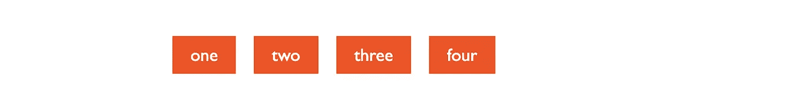

# 从设计到编码(第三天)

> 原文：<https://levelup.gitconnected.com/from-design-to-code-day-3-c0a504f47c2a>

我最近正在开发一门叫做*三周三个网页设计*的课程。最初，它是一个为期 3 周的研讨会材料，旨在成为一个有许多实践的实践密集型研讨会。主要目标是教没有多少开发经验的人使用 HTML 和 CSS 来复制专业的设计模型——这就是为什么它被称为“从设计到代码”。

我发现即使是工作室里最简单的项目对于一篇文章来说也太长了，所以我决定把它分成三部分，形成一个系列。如果你想从头开始学习这个话题，请跟着做。

这是 4 部分教程中的第 3 部分，如果你错过了第 1 天的[和第 2 天的](https://juntao-qiu.medium.com/from-design-to-code-day-i-a400084d918d)[和](https://juntao-qiu.medium.com/from-design-to-code-day-2-4665d6e449b4)就去看看吧。

# 实施英雄旗帜

接下来，我们可以看看英雄横幅部分。几乎每个网站都有这样一个宽敞的版块，通常有很大的字体，醒目的图片，还有一个按钮(号召行动)引导用户行动(喜欢，点击它)。

根据实体模型，我们可以将整个区域分为左右两部分。标题和描述性文字在左边，后面是行动号召按钮。右侧稍微复杂一点，包含一个图像和一些放在图像上面的描述和评级。

如上所述，我们先写 HTML 内容。值得注意的是，在编写 HTML 时，我们必须假设页面在没有任何 CSS 的情况下也是可用的。标题应该是可读的，超链接应该是可点击的，可以引导用户到他们需要的新地址，等等。

英雄部分

在这里，您可以使用`div`或`section`作为该部分的容器标签。我通常更喜欢用`section`作为内容的容器，用`div`作为辅助标签。

另外，除非必要，不要使用`div`。不过，通常这两个词在很多情况下可以互换使用。

在任何样式之前，这部分看起来像这样:


没有 CSS 的英雄部分

要让两个`block-level`元素`brief`和`media`水平排列，应该用什么方法？没错，像 navbar 一样，我们可以将容器`hero-section`设置为`flex`容器:

```
.hero-section {
  width: 80%;
  margin: 2rem auto;
  display: flex;
  align-items: center;
}
```

横向排列还好，但是两部分的宽度似乎不均匀。图像部分占的空间比较大，文字被推到左边。我们需要它们对半分布:


此时，我们需要对容器中的两个元素使用`flex:1`规则，并为图像设置`100%`的宽度而不是默认宽度，这样图像将填充其容器的可用宽度(T2):

```
.hero-section>section {
  flex: 1;
}.game-cover img {
  width: 100%;
}
```

注意这里有一个新的 CSS 语法:`>`。该符号代表所选`.hero-section`的直接子节点。如果没有这个直接操作符，`.hero-section section`将选择`.hero-section`中的所有`section`，不管它有多深。


均匀分布的

这里的`flex:1`也需要一些额外的解释。这是一个典型的 CSS 缩写，其完整形式为:

```
flex-grow: 1;
flex-shrink: 1;
flex-basis: 0%;
```

`flex-grow`是增长因子，即如何将剩余空间分配给 flex 容器中的元素。只有当所有元素本身都小于容器大小时，它才有效。`flex-shrink`收缩因子，即当所有 flex 元素的宽度超过容器的宽度时，每个元素应该收缩的比例。`flex-basis`指 flex 元素的默认大小。

## 灵活布局

我们可以通过一个具体的例子来说明这些属性之间的关系。

Flex 演示 HTML

一开始，我们将`container`设置为 flex 容器，它们的子节点`box`自动成为`flex`元素。但是由于每个单词的长度不一样，所以四个方框的排列是这样的:



使用默认设置的 Flex

```
.container {
  display: flex;
  align-items: center;
  gap: 1rem;
}.box {}
```

这是因为，默认情况下，flex 元素的 CSS 设置为`flex:0`，即:

```
flex-grow: 0;
flex-shrink: 1;
flex-basis: 0%;
```

我们将所有具有`box`类的 div 的`flex-grow`设置为 1，这意味着如果容器有足够的空间，它们具有相同的增长因子:

```
.box {
  flex-grow: 1;
  flex-shrink: 1;
  flex-basis: 0%;
}
```

此时，它们将填满整个容器并平均分配空间:


弹性:1 表示项目-均匀分布

如果我们为某些元素设置不同的增长因子:

```
.box:nth-child(1) {
  background-color: lightseagreen;
  flex-grow: 2;
}.box:nth-child(4) {
  flex-grow: 2;
  background-color: lightseagreen;
}
```

然后当容器空间足够时，第一个和第四个元素将比其他元素增长得更快(因为它们具有大的`flex-grow`比例)。


灵活增长

`flex-shrink`与`flex-grow`完全相反。当伸缩容器的宽度小于所有伸缩项目的宽度之和时，`flex-shrink`定义每个元素收缩的比率。

```
.box {
  flex-grow: 1;
  flex-shrink: 1;
  flex-basis: 50%;
}.box:nth-child(2) {
  background-color: lightseagreen;
  flex-shrink: 2;
}.box:nth-child(3) {
  background-color: lightseagreen;
  flex-shrink: 2;
}
```

例如，在这个例子中，我们将`flex-basis`设置为 50%，每个 flex 元素从父元素的 50%收缩或伸展。因为容器中有四个元素，总长度超过了容器，所以`flex-shrink`生效，结果是第二个和第三个元素比其他两个收缩得更快，因此也更小:


弯曲收缩

## 润色主页横幅

嗯，我们的横幅现在有一半一半的布局，然后我们需要做一些排版。一般来说，我们可以通过不同的字体、颜色等视觉元素来强调一些元素。，使主题更加醒目，页面更加平衡。

```
h1 {
  font-size: 48px;
  font-weight: bold;
}.brief p {
  font-weight: lighter;
  margin: 16px 0;
}
```

为了定制按钮和导航栏，我们使用颜色选择器从模型中获取紫色值:`#4A43EB`。

```
.button-secondary {
  appearance: none;
  padding: 8px 16px;
  border-radius: 16px;
  border: none;
  background-color: #4A43EB;
  color: white;
}
```

我们在这里使用`appearance: none`，重置浏览器的默认样式，并添加圆角、背景色和字体颜色。


英雄部分的左侧

对于横幅的右侧，我们注意到评级内容覆盖在实体模型中的图像上。这种**层叠**内容的效果需要稍微解释一下。

浏览器渲染 HTML 的时候，是把元素按顺序排列的，没有叠加(毕竟叠加就是遮挡，就是看不到部分内容)。如果我们需要一些元素**从排列过程的**中跳出来，腾出原本属于它的位置，那么我们需要将元素的`position`设置为`absolute`。

这样，元素就跳出了普通的文档流，将定位留给了开发人员。这时我们可以用`top`、`left`、`bottom`、`right`来控制元素的绝对定位，默认为屏幕左上角的坐标原点。

但是很多时候，我们并不想把屏幕左上角作为原点而是作为某个元素。在 CSS 中，我们可以将一个元素的`position`设置为`relative`，这样它的子节点将把它们的原点放在左上角(而不是屏幕的左上角)。

在本例中，我们想使用`.game-over`作为基线，然后将描述文本放在它的顶部:

```
.game-cover {
  position: relative;
}.media .title {
  position: absolute;
  bottom: 16px;
  left: 16px; color: white;
  font-size: 14px;
  font-weight: lighter;
}.media span.rating {
  margin-left: 8px;
}
```

最后，我们对图像的角落做了一点调整，使实现更接近实体模型:

```
.game-cover img {
  border-radius: 32px;
}
```

这导致图像具有圆角和半径为 32 像素的圆:


英雄部分的最终结果

恭喜您，我们已经完成了页面的第二个主要部分。在这里，我们学习了`flex`布局的一些细节，以实现元素在 flex 容器中的均匀分布，我们还学习了使用绝对定位(`position: absolute`)和相对定位(`position: relative`)来使元素分层，使其在视觉上更令人愉悦。

这是我们第三天的全部内容。接下来，我们将完成整个设计，看看我们如何发布网站，这样你就可以与你的朋友分享结果。