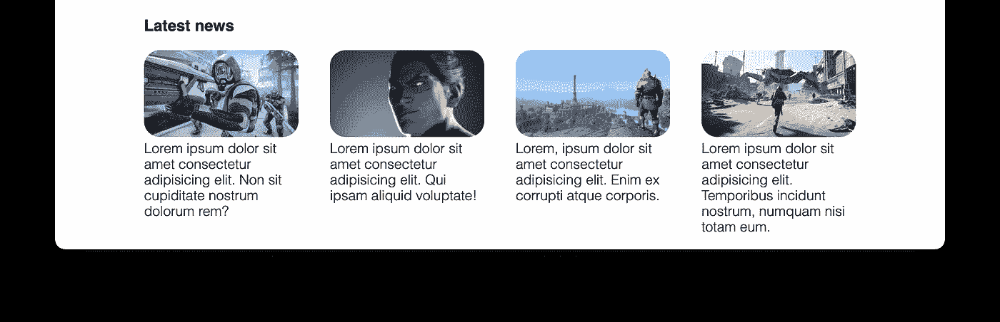

# 从设计到编码(第 4 天)

> 原文：<https://levelup.gitconnected.com/from-design-to-code-day-4-886cda25284d>

我最近正在开发一门叫做*的课程，三周内完成三个网页设计*。最初，它是一个为期 3 周的研讨会材料，旨在成为一个有许多实践的实践密集型研讨会。主要目标是教没有多少开发经验的人使用 HTML 和 CSS 来复制专业的设计模型——这就是为什么它被称为“从设计到代码”。

我发现即使是工作室里最简单的项目对于一篇文章来说也太长了，所以我决定把它分成三部分，形成一个系列。如果你想从头开始学习这个话题，请跟着做。

这是 4 部分教程的第 4 部分，如果你错过了[第 1 天](https://juntao-qiu.medium.com/from-design-to-code-day-i-a400084d918d)、[第 2 天](https://juntao-qiu.medium.com/from-design-to-code-day-2-4665d6e449b4)和[第 3 天](https://juntao-qiu.medium.com/from-design-to-code-day-3-c0a504f47c2a)就去看看吧。

# 最近新闻

接下来是页面的最后一部分:新闻列表。再说一遍，第一步是什么？没错，写 HTML。写 HTML 的时候，我们可以大致分析一下哪些元素需要用`class`标记。这个阶段不需要做到完美。

因为在以后使用 CSS 选择器的时候，如果我们发现一些需要特别注意的元素，我们总是可以回过头来把它们添加到标签中。

新闻列表相对简单，由一个标题和四篇文章组成，每篇文章都有图片和文字描述。

新闻的 HTML

注意我们在这里使用的新标签，`article`。`article`代表一个独立的实体，比如一条新闻、一条推文、一个博客等。当编写 HTML 时，我们还需要考虑如何使内容语义化，这意味着人们可以直接在编辑器中阅读 HTML 代码。在早期，许多网页充斥着冗余和无意义的标签(今天也是如此)。当我们编写一个页面时，我们需要从一开始就考虑可读性和可维护性。


没有 CSS

嗯，这看起来不太吸引人。让我们给它添加一些样式。

新闻的基本风格

添加`flex:1`后，新闻正确排列:


Flex 1

现在让我们找到一些真正的游戏封面，使它看起来真实可信。


图像现在被破坏了

哎呀，整个页面好像都乱了！但是不用担心。您只需要将图像的大小指定为百分比，这样图像就会自动缩放到其容器大小:

```
.news img {
  width: 100%;
  border-radius: 1rem;
}
```

图片现在可以正确缩放:


调整图像大小

此外，我们注意到字体太粗，比实体模型大，标题和图片之间的间距也太近。

让我们把它修好:

```
.news p {
  font-size: 14px;
  font-weight: lighter;
}h4 {
  margin: 1rem 0;
}
```

而现在最后的结果是这样的:



新闻部分的最终外观

看起来好多了，不是吗？这就完成了本页的大部分内容。有一些部分我故意省略了，比如图标的使用，还有按钮的阴影。这些主题将在后面的章节中与设计一起讨论。

# 发布您的设计

恭喜你，你已经完成了你的第一个复制模型。我相信你对你的工作非常满意，你确实应该如此。所以让我们与你的朋友分享这份快乐吧！

如何在公共平台上发布你的页面，让世界上任何地方的任何人都可以访问它？我们可以使用像 [Netlify](https://www.netlify.com/) 或 [Surge](https://surge.sh/) 这样的工具来完成这项工作。

如果你不想在你的机器上安装一些额外的软件，那么`Netlify`会更容易。注册账号后，只需要将本地目录`week-1`拖拽到其网站即可。几分钟后，`Netlify`将完成部署，并为您提供一个您可以与其他人共享的 URL。非常简单。


使用 Netlify 部署您的站点

此外，我们将在这里介绍一下如何使用`Surge`来发布您的作品。首先，你需要安装`[Node.js](https://nodejs.org/en/)`。安装完成后，您将在命令行中拥有`npm`包管理器。

现在，让我们安装`surge`的命令行工具。您需要在终端程序中执行它:

```
npm install --global surge
```

然后转到您的工作目录，即`week-1`:

```
cd ~/tutorial/3w3ps/week-1
surge
```

此时`surge`会提示你登录或者创建账号，然后它会随机给你分配一个域名，完成部署。


使用浪涌命令行工具

您现在可以在公共网络中访问该 URL 或与其他人共享。


发布到互联网上(归功于 Roman Zakhareko 的设计)

# 摘要

本周，我们学习了如何解构一个模型并编写相应的 HTML 文档，学习了如何使用`flex`布局实现导航栏，以及如何控制元素的均匀分布，学习了如何对文档流之外的元素使用绝对定位，以及其他一些常见的排版技术(如使用`padding`和`margin`)等。

我相信你已经迫不及待地想用你新获得的技能做点什么了，所以这里有一些有趣的挑战。

# 挑战 1

找到一个你经常访问的网站，用 Chrome 的 DevTool 检查网站的导航栏。看看我们上面讨论了哪些知识，哪些知识对你来说是新的。此外，您可以尝试通过我们在此介绍的方法重新实现导航栏。

1.  编写语义 HTML 标签
2.  使用`flex`的布局
3.  用边距和填充调整版式

# 挑战 2

检查你最喜欢的网站的登陆页面，分析它的字体和布局，并尝试在本地复制它。您可能需要注意以下几点:

1.  编写语义 HTML 标签
2.  字体的使用
3.  背景色和前景色的组合
4.  使用`flex`布局
5.  用边距和填充调整版式

在接下来的一周，我们将学习更多关于`flex`布局的知识，在垂直方向上，使用网格进行更复杂的布局，以及不同高度的布局元素。我们还将介绍如何使用外部字体和图标使页面更加有趣。

恭喜你！你成功了。如果你跟进并发布了你的网站，你应该感到非常自豪。如果您在跟随时有任何不清楚的部分，请不要犹豫在下面评论，我会修复它们。

如果你想了解更多这方面的知识，并喜欢本教程中的形式和节奏，我也为你准备了[一本书。它包含三个项目，结构就像这个一样——边做边学，每个部分后都有详细的解释，最后还有一些挑战。](https://leanpub.com/3webdesignsin3weeks)