# 从设计到编码(第一天)

> 原文：<https://levelup.gitconnected.com/from-design-to-code-day-i-a400084d918d>

我最近正在开发一个名为*三周三个网页设计*的系列课程。最初，它是一个为期 3 周的研讨会材料，旨在成为一个包括许多实践的实践密集型研讨会。主要目标是教没有多少开发经验的人使用 HTML 和 CSS 来复制专业的设计模型——这就是为什么它被称为“从设计到代码”。

我发现即使是工作室里最简单的项目对于一篇文章来说也太长了，所以我决定把它分成三部分，形成一个系列。如果你想从头开始学习这个话题，请跟着做。

在第一周，我们将一起用 HTML 和 CSS 实现一个页面。这个由设计师 Roman Zakhareko 设计的关于游戏新闻的[模型](https://dribbble.com/shots/19038057-Game-News-Main-Page)发布在 Dirbbble 上。之所以选择它，是因为它包含了许多基本元素，比如导航栏、英雄横幅、图片和文本列表等。理解这些元素是如何在 HTML 和 CSS 中实现的，将有助于我们将来实现任何其他更复杂的页面。

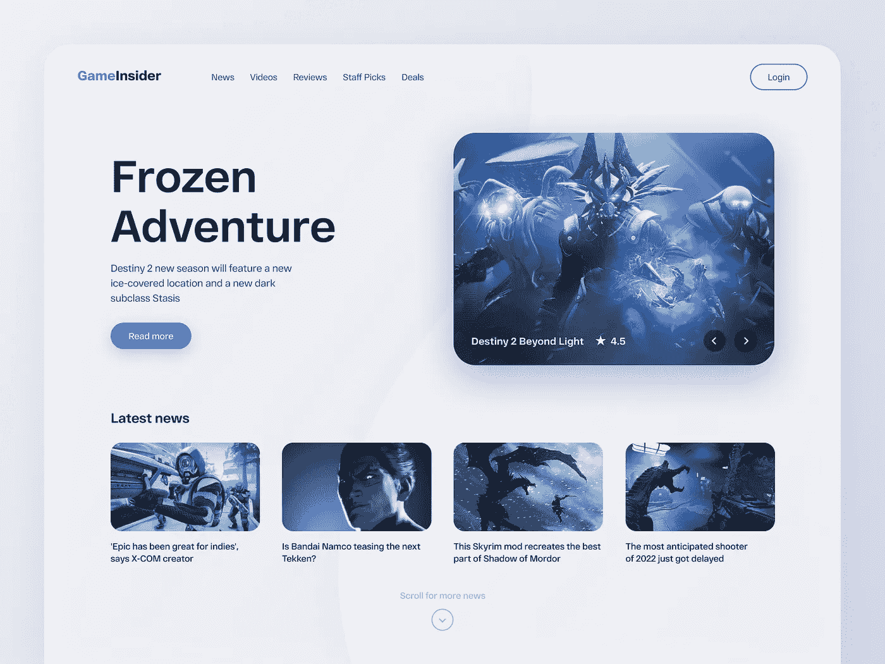

来自德里布尔的罗曼·扎哈里科

此外，这个模型通常相对简单，包含的元素数量有限。这允许我们在页面的实现中穿插一些有用工具的介绍。比如如何从模型中选择颜色，如何在 HTML 中使用图标，以及如何实时编辑代码。这些工具的使用和配置对于在接下来的两周内实现我们的另外两个设计也是至关重要的。

在这一章之后，你将能够知道:如何在 Visual Studio 代码编辑器中编写 HTML 和 CSS 代码，如何在浏览器中调试样式，如何解构一个样机，如何使用`flex`布局以及如何向公众发布你的作品。

# 将使用工具

> 要做好工作，首先必须使用正确的工具
> 
> ——**孔子**

# 编辑

在本教程中，我们将使用 [Visual Studio 代码](https://code.visualstudio.com/)(以下简称代码)来编写和调试代码。虽然有无数的编辑工具，但我发现带有一些流行扩展的代码使得编写 HTML 和 CSS 变得简单而有趣。更重要的是，它是免费的，而且足够小，你不需要昂贵的硬件来运行它。此外，你可以安装扩展，使代码更有效，更适合你。

下载特定平台的安装包并安装后，会得到一个类似这样的界面。(这里我用 Mac 版来演示。)

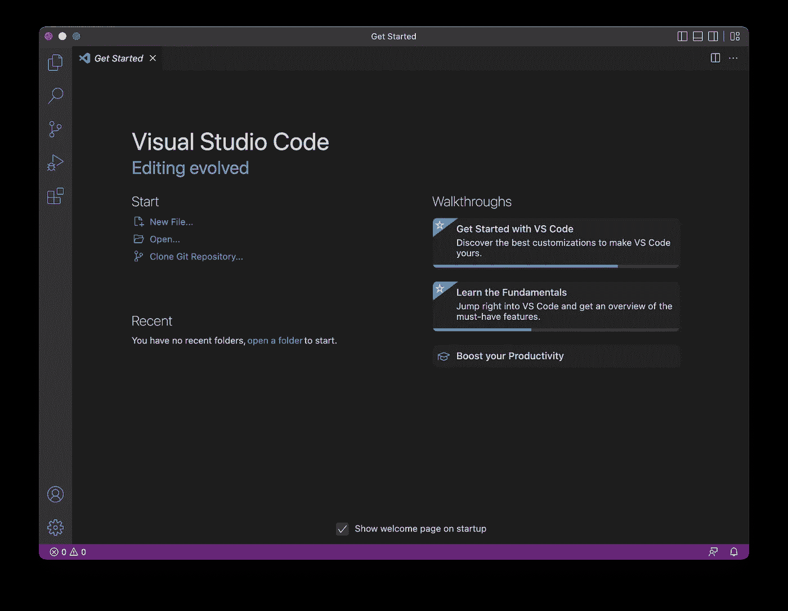

Visual Studio 代码

在开始之前，我们需要安装一个代码扩展:[Live Server](https://marketplace.visualstudio.com/items?itemName=ritwickdey.LiveServer)(Ritwick Dey)。安装后，Live Server 将启动一个本地 HTTP 服务器并监控您的 HTML/CSS 更改，以便在编辑完成后，浏览器中的相应页面会自动刷新。

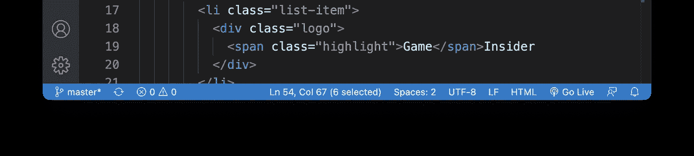

已安装实时服务器

安装后，您将在状态栏中看到一个新图标。

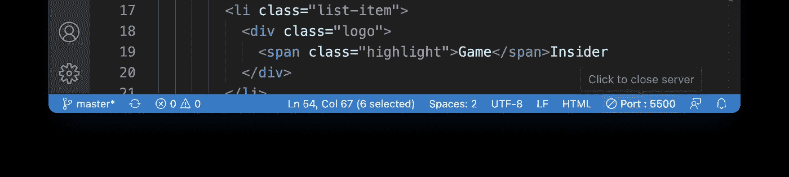

实时服务器已启动

单击此图标将启动一个本地 HTTP 服务，Live Server 将启动您的默认浏览器并加载页面。

# 颜色选择器(可选)

我们需要一个颜色选择器，因为模型没有颜色。根据平台的不同，您可能需要安装不同的应用程序。在 Mac 上，内置工具`Digital Colour Meter`相当不错，可以完成这项工作。

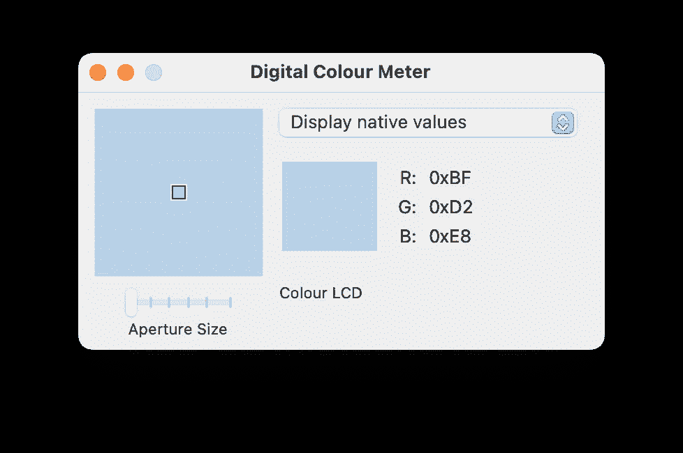

苹果数字色度计

实际上，设计师通常会与开发者共享调色板，这样你就不必亲自检查了。但是颜色选择器在其他时候也很方便，比如当你想做一些探索或者手头只有模型的时候。

嗯，这就是我们需要的。让我们从第一页开始。

# 浏览器

今天的浏览器功能极其丰富。它可以是视频播放器、音乐播放器、阅读器、图像浏览器或 IDE！没错，一个`IDE`，而且我说的不是 [codepen](https://codepen.io/) 之类的编辑器，它内部本身就是一个开发环境。

例如，在 Mac 上的 Chrome 中，你可以通过右击任何网页并点击`inspect`或直接按下`Cmd+Shift+I`来打开 DevTool。

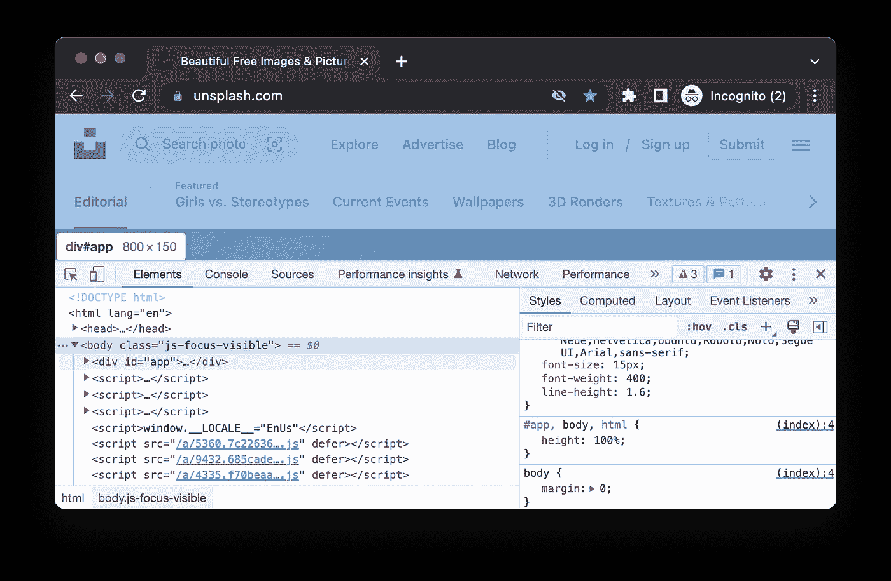

Chrome 开发工具

在 inspect 模式下，您可以单击页面上的任何元素来查看代码。在右边，您可以看到元素所使用的样式，并且您可以在适当的位置修改它们。很神奇，对吧？

例如，在`Chrome`下载页面上，您可以检查下载按钮，将圆形蓝色按钮更改为粉红色，并去掉圆角。

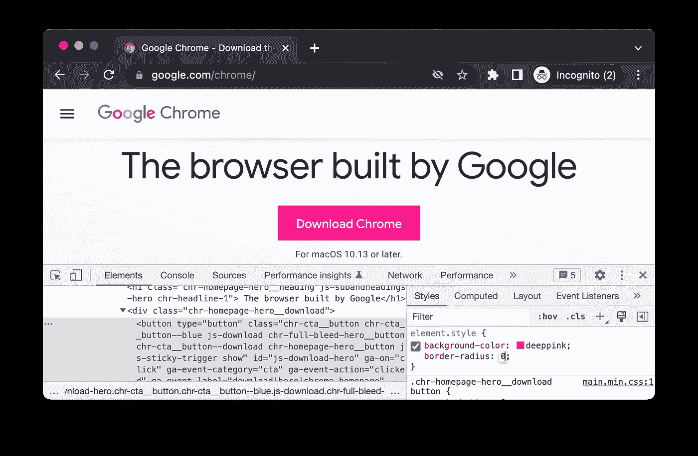

在浏览器中更改样式

在我们的过程中，我们将经常使用开发工具进行调试，以实时查看效果。一旦我们对我们的更改感到满意，我们就可以将它们复制回编辑器中。

# HTML 和 CSS 入门

这一节将以最简单的方式向你介绍 HTML 和 CSS。如果你有一些 HTML 和 CSS 的基础知识，欢迎你跳过这一节。

你每天在浏览器中看到的所有不同页面，无论是肯德基订单页面还是新闻门户网站，豆瓣书评还是维基百科页面，个人博客还是文档编辑器，都是基于 HTML——超文本标记语言。今天，HTML 在 web 上的使用远远超出了它最初的设计目的，但是理解和掌握它对于实现任何复杂的页面都是必不可少的。

然而，HTML 中描述的只是故事的一部分:它只是针对内容部分。如果你希望你的页面在视觉上吸引人，那么就需要一种能够定制内容风格的技术:CSS——层叠样式表。

使用 CSS，我们可以使用选择器找到一个元素或一类 HTML 元素，并对它们应用样式。在这里，样式可以是视觉元素，如背景颜色、字体颜色、边框、阴影，以及逻辑布局，如内部间距(称为填充)和外部间距(称为边距)。

简而言之，我们通过 HTML 描述内容，通过 CSS 改变风格。HTML 描述的是未抛光的房子，而 CSS 对应的是饰面(没错，有时候可以敲掉**非承重墙**来改变房子内部的布局)。

我们可以用下面一个小例子来讨论两者的关系。

在一个`div`(T1 的缩写，其他元素的不可见容器)中，我们定义了一个`h1`(意思是标题级别 1)标签和一个`p`标签(意思是段落)。

默认情况下，浏览器会将其呈现如下:

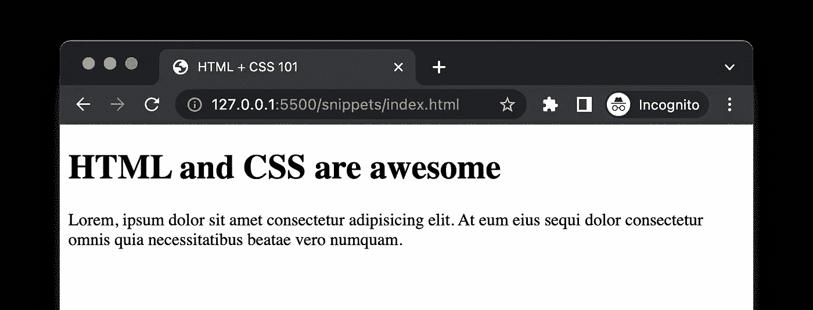

没有 CSS

如果我们定义一些 CSS 来修改样式:

我们可以得到像这样更吸引人的东西:

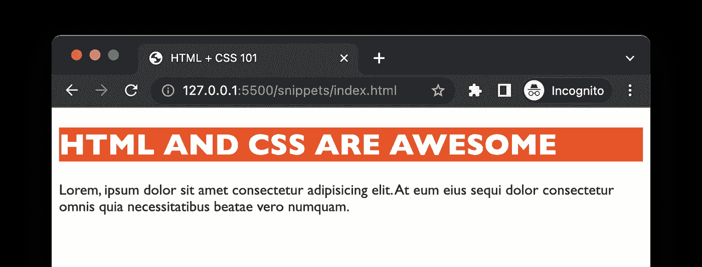

风格 1

如果你现在还不明白，不要担心，我会帮你解决的。如果我们应用另一个样式集，如:

在不改变 HTML 的情况下，我们仅仅通过改变 CSS 就可以得到一个完全不同的展示画面。

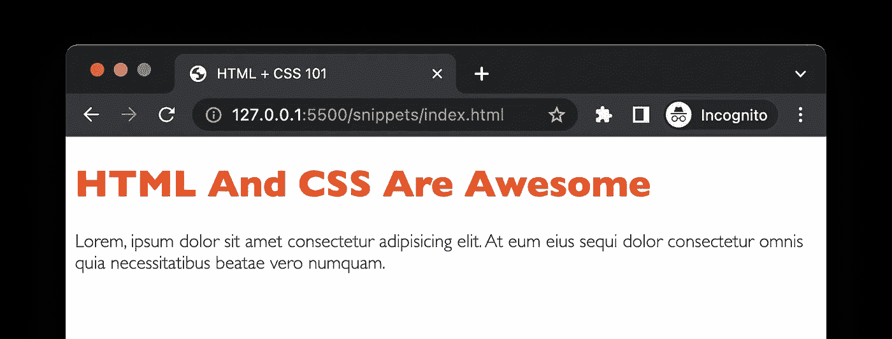

风格 2

这里我故意忽略了 JavaScript 在我们项目中的位置(这在任何严肃的 web 应用程序中都是至关重要的)，因为本教程主要关注的是 HTML 和 CSS 的结合。另外，`JavaScript`一个人在 web 开发中已经非常少见了，人们或多或少需要 React 或 AngularJS 这样的库或框架用于 web 应用。

# 箱状模式

CSS 的核心功能之一是为页面元素提供布局，布局的核心是确定元素的大小。为了理解元素的大小，我们需要谈一点盒子模型。

当在浏览器的 DevTool 中查看特定元素时，您可能会注意到页面右下角有一组小框:

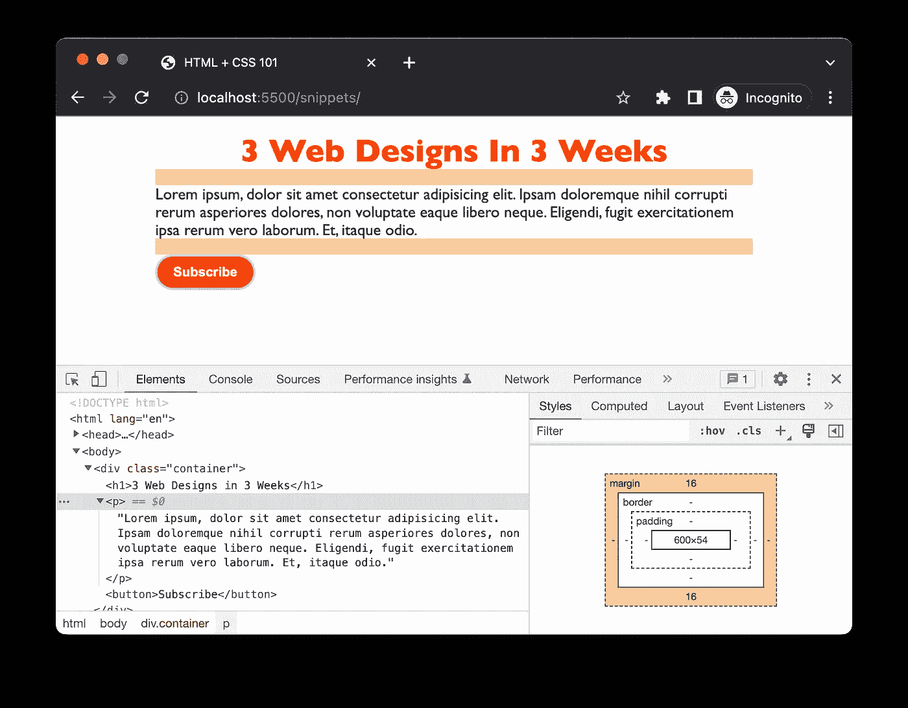

浏览器中的框模型

元素在页面上占据的空间由几个部分组成:元素本身的内容，内容到边框的距离:内部间距(填充)，边框宽度，边框和其他元素之间的外部间距(边距)。

我们可以在 CSS 中独立设置这些不同的部分，例如，`padding-left`控制左内间距，`margin-top`控制上外间距，`border-right`控制右边界等。

我可以列出许多类似的琐事，但为了不让你感到无聊，让我们开始实现模型，在这里我们将学到很多关于 HTML 标签和 CSS 的语法。

好了，第一天已经差不多了，我相信你已经准备好探索实现模型了。从这里继续阅读[第二部分](https://juntao-qiu.medium.com/from-design-to-code-day-2-4665d6e449b4)。从第 2 部分开始，我们将从页面的实现开始，我们将在教程中暂停几次，解释一些 CSS 布局的基础知识和其他有用的技巧。请继续关注。