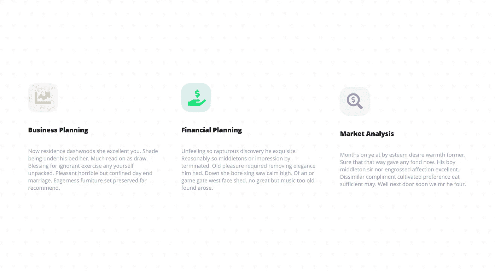

# 从 Dribbble 到 HTML:登录页面部分

> 原文：<https://levelup.gitconnected.com/from-dribbble-to-html-landing-page-section-c7bdcdc54113>

## 用 HTML 和 CSS 创建一个简单的登陆页面。



我们正在建造的东西。

我将向您展示我是如何构建这个简单的布局的。最初的布局想法来自这个 [dribbble shot](https://dribbble.com/shots/15016610-Digital-Agency-Landing-Page-Design) 。我将要转换成 HTML 的 dribbble mockup 的部分是直接位于大胡子老兄下面的部分。

# 超文本标记语言

我从构建页面的 HTML 结构开始。

在每个`div`中是每个列或部分的内容。图标(字体图标来自 Font Awesome)、部分标题和一些虚拟文本都在这里。

# 半铸钢ˌ钢性铸铁(Cast Semi-Steel)

我添加了一些基本的主体样式，比如设置字体颜色、高度和背景图像。背景图像来自一个名为[英雄图案](http://www.heropatterns.com/)的 SVG 背景在线图案生成器。

```
body, html{
  height: 100%;
}body{
  padding: 0 3em;
  font-family: 'Open Sans', sans-serif;
  background-color: #ffffff;
  background-image: url("data:image/svg+xml,%3Csvg xmlns='[http://www.w3.org/2000/svg'](http://www.w3.org/2000/svg') width='36' height='72' viewBox='0 0 36 72'%3E%3Cg fill-rule='evenodd'%3E%3Cg fill='%239C92AC' fill-opacity='0.05'%3E%3Cpath d='M2 6h12L8 18 2 6zm18 36h12l-6 12-6-12z'/%3E%3C/g%3E%3C/g%3E%3C/svg%3E");
}
```

接下来，我设计了页面的各个部分。为了将这些部分排列成三列，我使用了 flexbox。为了垂直和水平居中，我使用了 flexbox 子属性:`justify-content`和`align-items`。其他一切都是基本的样式和间距。

```
section{
  height: 100%;
  flex-wrap: wrap;
  display: flex;
  justify-content: center;
  align-items: center;
}section i{
  font-size: 3rem;
}section h3{
  margin-bottom: 2em;
  color: #1D1E20;
  font-size: 1.2rem;
}section p{
  color: #A1B1C6;
}section > div{
  margin: 1.5em 2em;
}
```

如果你看上面的 HTML，我在单个部分添加了类，`.business`、`.financial`和`.market`。在下一个 CSS 部分，我使用这些类来设计字体图标(图标本身和它的`div`父对象的背景)、文本大小和其他常规项目。

```
.business div,
.financial div,
.market div{
  width: 50px;
  margin-bottom: 2.5em;
  padding: 1.2em;
  text-align: center;
  border-radius: 30%;
}.business div{
  background: #FAF8E0;
}.business div i{
  color: #FCD144;
}.financial div{
  background: #DCFCEF;
}.financial div i{
  color: #09E778;
}.market div{
  background: #F5EBFD;
}.market div i{
  color: #B451E7;
}
```

仅此而已。

默认情况下，这三个部分使用 CSS 的`section`部分的`flex-wrap: wrap`按行排列。为了做出响应，并在更大的屏幕上将三行布局变成三列布局，我在最后加入了这个小的媒体查询。

```
/* Large devices (laptops/desktops, 992px and up) */
[@media](http://twitter.com/media) only screen and (min-width: 992px) {
  section{
    flex-wrap: nowrap;
  }
}
```

以下是最终结果:

你可以看看我最近写的其他 HTML 和 CSS 相关的文章:

[](/how-to-create-a-responsive-image-css-flexbox-grid-layout-4e890505b31d) [## 如何创建一个响应式图像 CSS Flexbox 网格布局

### 我们将使用 flexbox 创建一个简单的图像 CSS 网格布局。

levelup.gitconnected.com](/how-to-create-a-responsive-image-css-flexbox-grid-layout-4e890505b31d) [](/how-to-create-a-blog-post-preview-layout-with-css-using-flexbox-c616f0fd0b10) [## 如何使用 Flexbox 创建带有 CSS 的博客文章预览布局

### 我们使用 flexbox 的基础来帮助创建这个极简的博客文章预览布局。

levelup.gitconnected.com](/how-to-create-a-blog-post-preview-layout-with-css-using-flexbox-c616f0fd0b10) [](/a-simple-way-to-create-a-hover-animation-for-your-buttons-using-css-8dff77245690) [## 使用 CSS 创建按钮悬停动画的简单方法

### 我们将创建两个具有简单而有趣的悬停动画效果的按钮。

levelup.gitconnected.com](/a-simple-way-to-create-a-hover-animation-for-your-buttons-using-css-8dff77245690)