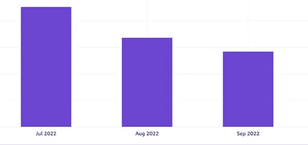
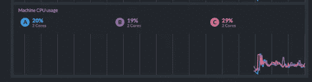
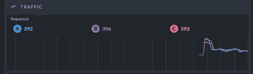

# 从 DynamoDB、ElasticCache、OpenSearch 到 RavenDB

> 原文：<https://levelup.gitconnected.com/from-dynamodb-elasticcache-and-opensearch-to-ravendb-7a462cd00b0>

## 如何节省几千欧元，同时为开源做贡献

*由软件架构师兼 Elixer 技术主管 Ygor Castor 撰写*

**在云中扩展你的应用是一个挑战，尽管让你的服务按需扩展很简单。然而，我们经常忘记，如果你不注意使用，一些云解决方案真的会让你的预算大吃一惊，这就是 AWS 弹性数据库如 DynamoDB、OpenSearch 和 ElasticCache 的情况。**

*在创建 DynamoDB 索引时给比尔一个惊喜*

# 四个数据库，一个用例

在我们的团队中，我们将这些不同的数据库用于非常具体的用例:

*   在 Dynamo 中，我们存储了用户的高分和谜题状态。
*   在 OpenSearch 中，我们存储生产数据用于文本搜索。
*   在 ElasticCache 中，最常用的播放列表。
*   关系数据的 Postgres

我们已经在使用四个数据库，一个新的用例出现了。我们需要整合关系数据库中的数据，以提高 API 时间，这是索引或视图无法解决的问题。

数据很复杂，不是简单的键值，所以 DynamoDB 是不可能的。它不是基于文本的，所以有了 OpenSearch 我们需要持久化和查询数据，所以 ElasticCache 也不是一个选项。最终，我们需要另一个数据库。

但是添加另一个数据库违背了我们的“简化”方法。这是另一个要维护的数据库、另一个备份和更多的管理时间。但是如果我们用一个新的代替一两个呢？

# 消除数据库

首先，我们确定了想要丢弃的当前数据库，因此我们检查了 DynamoDB，那里存储了我们的游戏状态。我们发现它不是我们用例的最佳数据库:它很贵，不支持特别查询，而且查询是一件非常头疼的事情。总而言之:一个很好的淘汰人选。

然后我们检查了我们的 OpenSearch，在那里我们存储了成千上万个作品的文本数据。在我们的新用例中，我们需要这些数据，但不是以一种易于使用 OpenSearch 查询的方式，所以最好有一个支持全文搜索的数据库。

最后，我们希望有一个快速阅读缓存。这就是我们使用 ElasticCache 的原因，所以我们需要一个能提供超快的阅读速度的数据库。

因此，我们需要一个速度极快的数据库，支持快速全文搜索，保证数据一致，易于实现，易于查询。我们如何解决这个难题？RavenDB 为救援！

# 为 RavenDB 构建驱动程序

RavenDB 是一个多模型数据库，自其诞生之日起就支持无冲突复制数据类型和内置 ACID。它提供了一种接近 SQL 的简单查询语言和全文搜索功能——看起来是一个不错的选择！但遗憾的是，它没有为我们☹️.服务的语言 Elixir 提供任何驱动程序但是我们不会轻易放弃。

通过分析 RavenDB 文档，我们更加确定了在我们的用例中使用它的决定。所有与数据库的通信都可以通过一个记录良好的 API 来完成。我们最初的测试表明，在一个简单的 t4g.medium EC2 中，该数据库每秒钟可以容纳超过 50，000 个读取请求，这可以解决我们的问题！那么，为什么不构建我们自己的驱动程序，并为开源社区做出贡献呢？这就是我们所做的。我们甚至因此获得了[的好评](https://www.linkedin.com/pulse/ravendb-newsletter-may-2022-grafana-plugin-data-now-available-/)！

随着新驱动程序的构建，我们实施了我们的数据库策略并逐步淘汰了三个(！idspnonenote)驱动程序。)数据库一气呵成。那么，它是如何整流罩了？我们的第一组数字非常有趣！

*   我们的一个 API 达到了 1~2 秒到 180 毫秒的中间值！

*现在我们快了！*

*   没有弹性数据库，我们的成本大幅下降！

*每月节省近 2000 欧元！*

*   我们每秒钟有近 1000 个查询，使用了我们 20%的容量，平均每个请求 3 毫秒！

我们对结果非常兴奋，也很想从你那里得到一些建议。把它们放在下面的评论里。