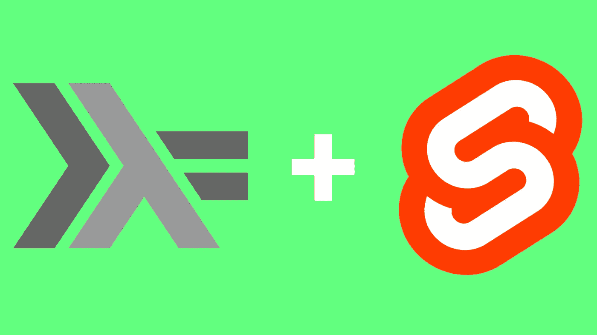

# 从去哈斯克尔+苗条

> 原文：<https://levelup.gitconnected.com/from-go-to-haskell-svelte-1ad5ff4a0520>



从 ReactJS、Vue 和 Angular 到 Golang、ExpressJS 和 ASP.NET，在构建 web 应用程序时，前端和后端框架有无数种组合可供使用。Svelte 和 Haskell 是前端和后端技术的两个最独特的选择。与无处不在的 ReactJS 及其许多竞争对手不同，Svelte 不使用虚拟 DOM (VDOM)。Haskell 是纯函数式的，与主要是命令式的 Golang、C#和 Java 相反。

我考虑重写我的个人网站已经有一段时间了。虽然 Go 是一种很棒的服务器端语言，但它非常无聊。这对某些人来说是一个优势，但对我来说从来没有吸引力，尤其是对业余爱好项目来说。我决定既然我正在重写，我也可以从 Go 的标准服务器端模板转移到 Svelte。

# 为什么是哈斯克尔？

Haskell 是一种纯粹的函数式语言。因此，它有:

*   一个有表现力的、安全的类型系统
*   大类型推理
*   潜在的高并行性
*   简洁的语法
*   简单的重构和测试

不幸的是，Haskell 没有被广泛使用是有原因的。大多数程序员首先学习命令式语言，这使得 Haskell 相当不透明。甚至对于有经验的 Haskell 开发人员来说，编写难以理解的 Haskell 程序也是可能的。最后，Haskell 对于许多现实世界的程序来说是相当不符合人机工程学的，因为它(正确地)不鼓励全局状态。我决定在我的服务器上使用 Haskell 主要是为了好玩，但也因为我站点上的每个端点本质上都是一个纯函数。

# 为什么苗条？

与其他框架相比，Svelte 最大的优势是它避开了 VDOM，而是简单地编译 Javascript 来更新 DOM。这使得它比 VDOM 框架快得多。其他优势包括:

*   苗条容易学；组件是在 HTML/CSS/JS 的简单超集中编写的。
*   伟大的教程和简单的设置
*   较小的束尺寸
*   简单而富有表现力

# 选择后端 Haskell 框架


在决定了后端语言之后，我仍然必须选择一个 web 框架。在做了一些研究和尝试了一些例子之后，我决定使用 Scotty。Scotty 是一个简单的框架，灵感来自 Ruby 的 Sinatra。每个端点只需要一个匹配的模式和一个要发送的文本对象。

## 你好，斯科特

下面是来自[GitHub 页面](https://github.com/scotty-web/scotty)的 hello world Scotty 示例:

```
{-# LANGUAGE OverloadedStrings #-}
import Web.Scotty

import Data.Monoid (mconcat)

main = scotty 3000 $
    get "/:word" $ do
        beam <- param "word"
        html $ mconcat ["<h1>Scotty, ", beam, " me up!</h1>"]
```

我用[栈、](https://github.com/commercialhaskell/stack)设置我的 Haskell 项目，这使得事情变得非常简单。只需运行:

```
stack new {name}
cd {name}
stack setup
stack build
```

生成的文件树应该是:

```
.
├── app
├── client
│   ├── node_modules
│   ├── public
│   ├── scripts
│   └── src
├── keys
├── src
└── test
```

要添加 Scotty 作为依赖项，只需将`scotty`添加到`package.yml`中的`dependencies`列表中。

如果你想使用 HTTPS 和全局状态，你必须做一些调整，这对大多数服务器都是必要的。

```
main :: IO ()
main = do
    let tlsConfig = tlsSettings "keys/fullchain.pem" "keys/privkey.pem"
        config = setPort 8443 defaultSettings

    sync <- newTVarIO def
        -- 'runActionToIO' is called once per action.
    let runActionToIO m = runReaderT (runWebM m) sync

    waiApp <- scottyAppT runActionToIO app
    runTLS tlsConfig config waiApp

app :: ScottyT T.Text WebM  ()
app = dobeam <- param "word"
        html $ mconcat ["<h1>Scotty, ", beam, " me up!</h1>"]
    get "/:word" $ do
        beam <- param "word"
        html $ mconcat ["<h1>Scotty, ", beam, " me up!</h1>"]
```

## 简单 JSON 端点

使用 Aeson 库，用 Haskell 制作 JSON 非常简单。出于我的目的，我只需要提供一个来自本地文件的记录列表。

```
import Data.Aesondata RecordType = Image | MP4 | Youtube
data Record = Record { ty :: RecordType, title :: T.Text, url :: T.Text }

instance ToJSON RecordType where
    toJSON Image = "image"
    toJSON MP4 = "mp4"
beam <- param “word”
 html $ mconcat [“<h1>Scotty, “, beam, “ me up!</h1>”]    toJSON Youtube = "youtube"

instance ToJSON Record where
    toJSON (Record {ty=t, title=title, url=u}) = object [ "type" .= t, "title" .= title, "url" .= u]
```

就这样，`Record`可序列化为 JSON！我们可以很容易地提供一个`Record`，或者一个列表。

```
get "/:word" $ do
unfortunately        json $ [Record { ty=Image, title="Hi", url="url" }]
```

至于从本地文件中读取记录，这非常简单。对于我的玩具网站，我只是读取了一个空格分隔的文本文件(原语，我知道)。然而，Haskell 有一些非常符合人体工程学的数据库支持。我发现这篇文章很有帮助。

下面是从/向空格分隔的文件读写的函数。我认为它们展示了 Haskell 相对于其他后端语言的优势。Go 中这些函数的模拟代码有将近 100 行长，其中有一个我没有注意到的错误。

```
readRecord :: T.Text -> Record
readRecord line = readSplit $ T.splitOn " " $ line
    where readTy :: T.Text -> RecordType
          readTy "image" = Image 
          readTy "MP4" = MP4
          readTy "Youtube" = Youtube
          readTy _ = Image
          readSplit :: [T.Text] -> Record
          readSplit [ty, title, url] = Record {ty=readTy $ T.strip $ ty,title=title, url=url}--            all lines   start   end
readRecords :: [T.Text] -> Int -> Int -> [Record]
readRecords ls start num
  | start >= 0 = map readRecord (take num $ drop start $ ls)
  | otherwise = map readRecord (take num $ drop (-start - num) $ reverse ls)addRecord :: T.Text -> T.Text -> T.Text -> IO ()
addRecord ty title url = do
    let recordLS = map T.unpack [ty, title, url]
    let recordStr = L.intercalate " " recordLS
    file <- SIO.readFile "records.txt"
    writeFile "records.txt" (concat [memeStr, "\n", file])
```

# 苗条身材入门


如前所述，Svelte 有一些很棒的文档。[入门指南](https://svelte.dev/blog/the-easiest-way-to-get-started)告诉我们，我们可以用几个简单的命令开始一个苗条的项目:

```
npx degit sveltejs/template my-svelte-project
cd my-svelte-project
npm install
npm run dev
```

接下来，我浏览了苗条教程，写出了我的第一页。如果你已经知道 HTML/JS，实际上没有学习曲线。`npm run dev`每当你做改变时，重建并托管服务器，使得迭代速度非常快。

```
<script>
    let records = [{type: 'image', title: 'title', url: 'url.com'}]
</script><main>
    <div class="grid">
        {#each records as { type, title, url }, i} 
            {#if type == 'image'}
                
            {:else if type == 'mp4}
                ...
            {/if}
        {/each}
    </div>
</main><style>
...
</style>
```

上面的代码片段硬编码了记录，但是实际上您需要从服务器获取它们。幸运的是，苗条使这变得很容易。

```
<script>
    import { onMount } from "svelte"

    let records = [] onMount(async () => {
        const res = await fetch('/records')
        records = await res.json()
    })
</script>
```

`onMount`是一个内置的生命周期，甚至可以在页面加载时运行。由于`records`在脚本中被赋值给，它将自动在页面的 HTML 中更新。

这本身看起来很糟糕，至少在我的网站上是这样，因为记录下面的内容会在记录载入之前短暂闪现。解决方法很简单:

```
<script>
    import { onMount, fade } from "svelte"

    let records = []
    let loaded = false onMount(async () => {
        const res = await fetch('/records')
        records = await res.json()
        loaded = true
    })
</script><main>
    {#if loaded}
        <div transition:slide class="grid">
            <!-- Record HTML goes here -->
         </div>
    {/if}
</main>
```

这样，在所有记录都准备好之前，不会加载任何东西。Svelte 甚至有一些很好的内置过渡，所以一切都会很好地淡入。如果你的内容需要更长的时间来获取，使用加载动画可能会更好，但这也很容易用 Svelte 来完成:

```
<main>
    {#if loaded}
        <!-- Record HTML -->
    {:else}
        <!-- Loading Animation -->
    {/if}
</main>
```

[Svelte 内置了一些动画，](https://svelte.dev/tutorial/animate)但是我没有试过，我不认为它是为加载类型动画设计的。

## Page.js

Svelte 的局限性之一就是只能做单页 app[*](https://www.reddit.com/r/sveltejs/comments/jkzu8o/from_go_to_haskellsvelte/gamub91/)。有一个基于 Svelte 的框架叫做 Sapper，它是为多页面网站设计的，但是据我所知，它需要一个 ExpressJS 服务器。为了简单起见，我决定使用一个名为 page.js 的客户端路由器。最初，我打算手工编写一个简单的路由器，但是由于 page.js 只有 1200 左右，并且增加了一点人体工程学的东西，所以我认为这不值得。

在一个苗条的应用程序中使用 page.js 的想法非常简单。每个页面只是一个组件，App.svelte 只是一个框架，可以用于一个通用的页眉或 CSS。安装 page.js 很简单:只需运行`npm install page`。

这是我的新`App.svelte`的样子:

```
<script>
    import router from "page"
    import Index from './Index.svelte'
    import Records from './Records.svelte' let page = Index

    router('/', () => page = Index)
    router('/records/:p', () => page = Records)

    router.start()
</script><main>
    <svelte:component this={page} />
</main><style>Conclusion
</style>
```

`Records.svelte`和以前一样，一行一行，除了没有`<main>`标签，因为它们已经包含在`App.svelte`中。它对它们起作用，但是这是一个不必要的嵌套层次。

# 主持斯科特的苗条网站

到目前为止，我们已经通过`npm run dev`托管了这个苗条的应用。相反，我们想通过我们的 Scotty 服务器托管。苗条使这变得相当简单；运行`npm run dev`会把所有编译好的 HTML/CSS/JS 放到`public/`文件夹中。接下来，我们要做的就是让哈斯克尔发球。

我决定做的只是添加一个文件夹作为我的整个堆栈项目的子文件夹。我将其重命名为`client`，所以我的文件树看起来像:

```
.
├── app
├── client
│   ├── node_modules
│   ├── public
│   ├── scripts
│   └── src
├── src
└── test
```

为了让 Haskell 静态地服务于`client/public`文件夹，我只是在我的`app`函数的末尾添加了一行`middleware $ staticPolicy (noDots >-> addBase “client/public”)`。

# 结论

最终的结果是非常整洁的；实际上，所有的 JSON 端点都是作为简单的纯函数提供的，Svelte 可以快速轻松地呈现它们。我的服务器代码现在比在 Go 中时简洁多了，可以说也清晰多了，使用 Svelte 作为前端让我可以添加一些在服务器端渲染版本中不可行的酷效果。总的来说，我还是有点反对客户端渲染；我认为没有 JavaScript 也能工作的网站应该做出合理的努力。我可能会在某个时候在我的网站上添加更多的互动内容，所以我会坚持使用 Svelte。

不幸的是，我可能不会再使用 Haskell 作为服务器语言了。虽然许多端点只是纯粹的函数，但我觉得我没有获得 Haskell 通常提供的许多好处。比起 Golang 版本，我更喜欢 Haskell+svelite 版本的网站；它更短，更易读，并揭示了一些我甚至不知道的 Golang 版本中的错误。然而，许多 Haskell 库的文档相当简单，至少在例子方面是这样，而且几乎任何语言都比 Go 更具表现力。