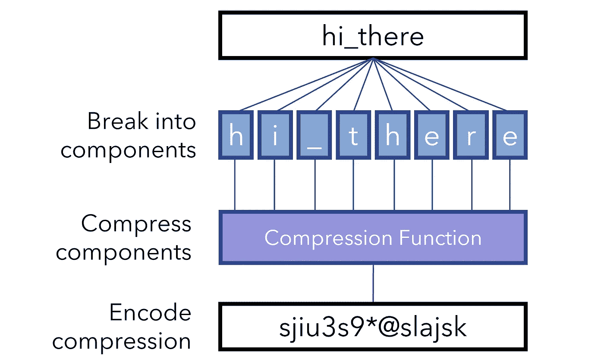
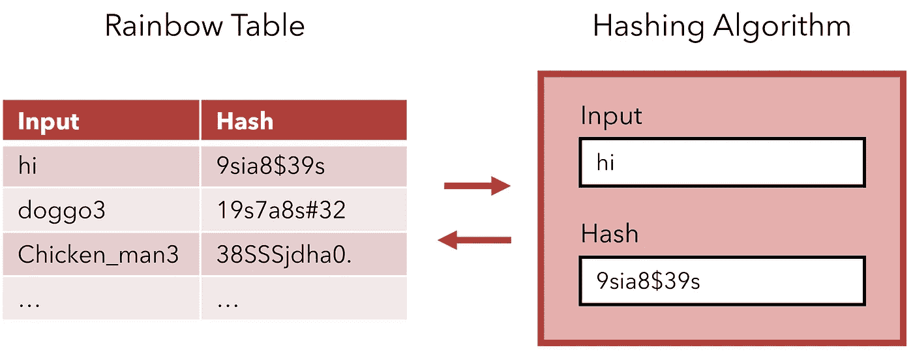
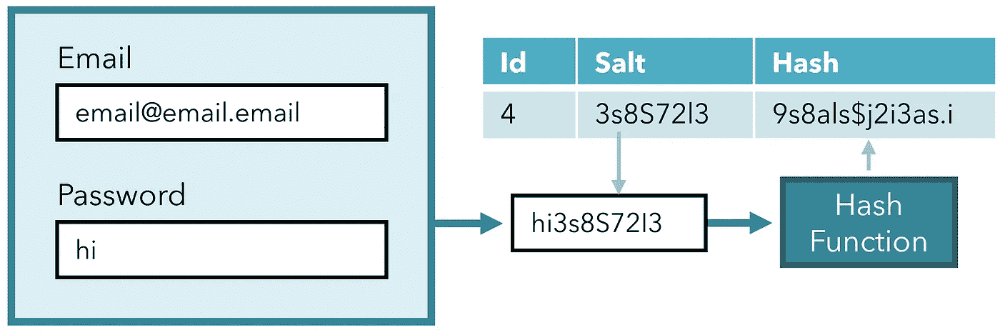

# 从“嗨”到$2y$10$TmNKr…你的密码怎么了？

> 原文：<https://levelup.gitconnected.com/from-hi-to-2y-10-tmnkr-what-happened-to-your-password-f70c869183c4>

## 密码保护的幕后

假设我决定注册一个账户，一个非常不安全的密码，“T0”。这是如何变成这样存储在数据库中的:

`$2y$10$TmNKrCzcsgVeIS/DOdQ6JeyhZUePie/yaiBQHMrN0tk4THZhgHyW6`

密码是携带你的钱包、个人信息和在线历史的字符序列。不仅从用户的角度，而且从网站的角度来看，这些都非常需要安全，以便符合法律并确保用户的信任。

出于多种原因，将用户密码直接存储在数据库中是很危险的。最明显的是，如果其他人获得了数据库的访问权限，他们将能够看到每个人的密码。许多网站还使用 cookies，即存储在您浏览器中的数据，即使您离开网站，这些数据仍然存在，以帮助您在下次访问网站时自动登录。将原始文本密码保留在 cookie 中会使下一个计算机用户以及可以读取跨站点 cookie 的站点和程序可以访问该密码。

哈希用于将字符串转换为该字符串的另一种表示形式。哈希函数的目的是创建密码的编码版本，以便:

*   从密码到编码很容易(`hi_there`到`sjiu3s9*@slajsk`)。
*   从编码到密码(解码)是不可能的(或者，至少，非常非常不容易)(`sjiu3s9*@slajsk`到`hi_there`)。

因此，即使黑客访问了我们的数据库，他们也无法将`sjiu3s9*@slajsk`转换成真正输入的密码`hi_there`。然而，散列是一个困难的想法，因为信息必须只能单向流动。

这类似于在五页文本中表示所有的*奥德赛*:转换是单向的，因为不可能从五页摘要中重建*奥德赛*。因此，散列的一个固有部分是丢弃信息。由于这一事实，有时非常不同的输入字符串将具有相同的散列，因为丢弃的信息导致相同的处理字符串，但是通过设计，这种可能性导致一些实际安全威胁的机会是可以忽略的。

虽然有许多散列函数，但通常它们遵循三步设计。首先，密码被分解成几个部分，然后传递给一个压缩函数。这个压缩函数就是挤出一些信息，压缩成分的部分。最后，压缩的输出被编码(表示)为一长串字符，可以包含数字、字母和符号。

通过信息的受控丢失(可以通过舍入或取模等运算以数学方式表示)，哈希创建了一个单向函数来保护密码。哈希算法的设计使得即使输入中很小的变化也会极大地影响最终结果(“fox123”的哈希与“fox122”的哈希完全不同)。

然后，我们不是将原始密码存储在数据库中，而是存储它的散列。下一次用户登录时，我们用同样的算法对他们的输入进行散列，看看散列是否匹配。由于散列对于相同的输入总是产生相同的结果，所以我们可以确信密码是相同的，而不会以公开的、易受攻击的格式存储密码。

散列法极大地提高了数据库的安全性，但是它仍然容易受到黑客经典的“试一试”策略的攻击。虽然哈希使得直接访问原始文本密码变得不可能，但只要我们知道使用的是哪种哈希算法——没有什么是一个相当优秀的黑客不能访问的——我们就可以尝试数百万个输入并存储它们的哈希，然后看看是否有任何哈希与记录的哈希匹配。这就是搭建彩虹桌的做法。

彩虹桌的构造。

虽然这看起来太过手动，但不幸的是，人们并不像你希望的那样善于创建密码，而且许多账户的密码都是一样的。然后，能够访问数据库的黑客可能会发现一个与彩虹表中记录的散列相似的散列:

注意到 id 4 与 id 6 具有相同的散列，并且记录的散列与彩虹表中输入“hi”的散列相同，黑客现在可以访问两个帐户，因为他们知道他们的密码是“hi”。尽管这种方法看起来太费力且效率低下，但许多黑客仍在不断构建彩虹表:

*   有效的彩虹表考虑了密码是真实密码的可能性。例如，“si*S&3ljksna”可能不是一个用过的密码，不值得检查，但“my_Doggo_3_2020”是。
*   仅一台标准计算机每秒就可以检查近 60 万个密码的散列。GPU 或 3D 卡的执行速度可以达到这个速度的三倍，更不用说一些黑客操作的专门系统了。
*   重申上面的观点:人们不擅长生成唯一的密码。' 123456 '仍被 2300 万账户持有人用作密码，无疑还有许多其他常用密码。59%的人在任何地方都使用相同的密码*，这意味着如果彩虹表成功登陆一个帐户，黑客就有很大机会成功登录你在不同网站的另一个帐户。*

*一个设计良好的连续几个月不间断生成的彩虹表生成器会有一个庞大的字典，其中几乎保证有很大一部分账户是匹配的。*

*为了解决这个问题，我们对哈希进行加盐处理。(饿了没？)*

*Salting 是一个绝妙的主意——它是在散列之前在密码末尾添加一个长字符串。每当创建某人的帐户时，都会生成一个 salt，存储的密码是密码和 salt 的散列。例如，如果密码是“hi”并且随机生成的盐是“3s8S72l3”，则存储的散列将不是“hi”的散列，而是“hi3s8S72l3”的散列。salt 和 hash 都被存储，以便当用户登录时，salt 被附加到他们的密码中，并且 hash 被匹配。*

**

*有了足够长的盐，腌制杂烩可以打败彩虹表。彩虹表是通过记住“常用密码”的概念构建的，如名称、形容词、名词和数字序列(如日期或圆周率的数字)，因为不可能在合理的时间内搜索所有可能的字符组合密码。*

*可以认为盐会增加密码的复杂性。具有 15 个字符 salt 的 5 个字符的密码将变成具有 20 个字符复杂性的密码，并大大降低彩虹表包含该散列的可能性。所以，从技术上来说，如果你用“嗨”这个密码注册了一个使用大量盐的网站，你是安全的。*

*也就是说，大多数网站不会花费太多资源进行大量 salting，因为它们会变得很长(salts 有时也可以是其他数据的函数，如您的用户名或注册时间，以避免存储它所需的空间)，因此为了安全起见，最好遵循良好的密码指南。*

## *要点*

*   *哈希用于将密码转换为编码形式。哈希不能被解码，这意味着即使你有一个哈希，你也无法访问原始密码。*
*   *为了确保单向信息流，散列利用了受控形式的信息丢失。*
*   *彩虹表是由黑客创建的，用来记录输入和它们的哈希值，这些哈希值可以与记录的哈希值进行匹配，以找到原始密码。这种方法对于一个有效且冗长的彩虹表来说是非常有效的。*
*   *Salting 通过在哈希之前将盐或随机生成的长字符串附加到密码的末尾来抵御彩虹表。这创建了一个完全不同的散列，增加了密码的复杂性，并使彩虹表攻击在计算上更不可行。*

* [## 关于大 O 和算法复杂性的常见误解

### 你是不是用错了 Big-O？

towardsdatascience.com](https://towardsdatascience.com/common-misconceptions-about-big-o-algorithmic-complexity-4a7601395038)  [## 面向对象编程中五个重要的高级概念，直观地解释

### 从封装到抽象

towardsdatascience.com](https://towardsdatascience.com/five-essential-advanced-concepts-in-object-oriented-programming-explained-intuitively-b7faefe04491)*