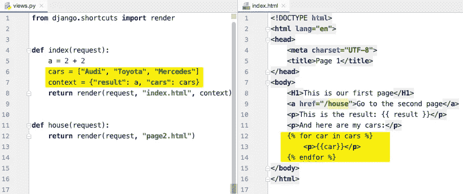

# 教程:10 分钟从 HTML 到 Django

> 原文：<https://levelup.gitconnected.com/from-html-to-django-6d8344da11d6>

## 姜戈力学导论

# 我们网站的介绍

在本文中，我试图解释 Django 是什么，它如何组成和提供 HTML 文件，以及如何控制 URL。

我们在这里所做的如下:

1.  为我们的新网站创建两个简单的 HTML 文件。我们从 HTML 开始，因为这很简单:)
2.  创建一个 Django 项目，设置并运行它。
3.  让两个 URL 导航到我们的两个 HTML 文件，这样你就能理解你的程序流是如何依赖于用户在 URL 栏中输入的内容的。
4.  看看你如何与用户沟通——我们将创建一个简单的表单，询问用户想要订购哪种类型的披萨。

为了简单起见，我们将不使用模型。我们将看到 URL、处理表单和 HTML 呈现的机制。

我们走吧！

# 创建一个包含两个 HTML 文件的文件夹

我们首先创建一个文件夹“formedium ”,在这个文件夹中，我们创建两个 HTML 文件:

1.  index.html

```
<!DOCTYPE **html**>
<**html lang="en"**>
<**head**>
    <**meta charset="UTF-8"**>
    <**title**>Page 1</**title**>
</**head**>
<**body**>
    <**H1**>This is our first page</**H1**>
    <**p**>You may add a picture of a cat here.</**p**>
</**body**>
</**html**>
```

2.page2.html

```
<!DOCTYPE **html**>
<**html lang="en"**>
<**head**>
    <**meta charset="UTF-8"**>
    <**title**>Page 2</**title**>
</**head**>
<**body**>
    <**H1**>This is our second page</**H1**>
    <**p**>You may add a picture of a house here.</**p**>
</**body**>
</**html**>
```

如果你有一些想象力，你甚至不必在浏览器中运行这些文件。

# 创建 Django 项目

现在，我们创建一个新的 Django 项目。

这是通过几个步骤完成的:

1.  创建一个虚拟环境，安装 Django
2.  创建项目
3.  创建应用程序

我们从虚拟环境开始。这一步是可选的。这是在终端中完成的:

```
$ python -m venv venv
$ source ./venv/bin/activate
```

安装 Django:

```
$ pip install django
```

您应该会收到这样的消息:

```
Successfully installed asgiref-3.2.10 django-3.1.2 pytz-2020.1 sqlparse-0.4.1
```

如果是，创建一个项目和一个应用程序:

```
$ django-admin startproject formedium
$ cd formedium
$ django-admin startapp myapp
```

因此，我们的文件夹应该如下所示:


我们差不多完成了。现在让我们在“myapp”中创建一个“template”文件夹，并将我们的 HTML 文件移入其中。我们现在应该有以下内容:


但是我们的“formedium”项目应该如何知道在哪里寻找模板呢？我们通过修改 **setting.py** 文件来帮助它:

添加我们的应用程序:


添加此行

设置模板文件夹的名称:


将此项添加到 DIRS 列表中

很好。我们已经准备好设置我们的项目了！

尝试运行它

```
$ python manage.py runserver
```

并在浏览器中运行“localhost:8000”。


本地主机:8000

# 将空 URL 指向 index.html

什么是 URL？

比如说，你有一个叫 medium.com 的网站。

如果用户在浏览器中键入“medium.com ”,则这是一个根 URL。在这种情况下，我们说 URL 是空的。

如果用户键入“medium.com/help”，则 URL 为“/help”。

如果用户输入“medium . com/login？user = Jim Carrey & password = monkey”，那么 URL 就是“/log in”，其余的我们都可以从 get 请求中得到，下面会讲到。

所以。每当 URL 为空时，我们都希望显示我们的 index.html。我们如何做到这一点？在“formedium”文件夹中，有一个名为“urls.py”的文件，当有用户请求时，首先调用这个文件。

在这个文件中，我们改变了两件事:

1.  导入我们的应用视图。
2.  比方说，如果 URL 为空，编辑 **views.index** 函数。


当 URL 为空时，运行 views.index 函数

那么这个“ **views.index** ”函数呢？当然，我们需要提供它。

编辑“myapp/views.py”文件，如下所示:


现在，尝试导航“localhost:8000”，您应该看到“index.html”文件的内容。

换句话说，Django 就是这样处理用户请求的:


# 指向 page2.html 的点/房屋 URL

这对你来说应该是个练习。

您所需要的只是添加一个新的 URL 行和一个新的函数。


这样，你可以根据需要添加任意多的 URL 和 HTML 视图。为了使您的应用程序更加用户友好，请尝试将第二页的地址添加到 index.html 中:

```
<a href="/house">See the second page</a>
```

# 将一些参数传递给 HTML 文件(上下文)

比方说，您的服务器非常聪明，它可以计算复杂的数学表达式，现在我们需要将这些结果放入 HTML 文件中。

对于这个，有个好听的东西叫**语境:**


如上编辑您的文件

上下文是一个普通的 Python 字典，它包含了需要传递给 HTML 的所有对象。在我们的例子中，我们已经使用“result”键传递了“a”的值。

尝试在上下文中多添加一个键，并在房子网页上显示。

# 将列表作为上下文传递

只有一个值的变量很无聊。让我们将元素列表发送到 HTML 文件中！

为此，模板解析器中有一个循环。



参考[Django 官方文档](https://docs.djangoproject.com/en/3.0/ref/templates/language/)来学习模板的所有特性。

还有我的另一篇关于[将 Django 渲染函数用于其他目的的文章](/the-power-of-django-render-function-fc890e82b279)。

# 从用户处获取数据

我们的最后一步是获取用户发布的一些数据。

为此，我们将使用标准的 HTML 表单:

```
<!DOCTYPE **html**>
<**html lang="en"**>
<**head**>
    <**meta charset="UTF-8"**>
    <**title**>Page 1</**title**>
</**head**>
<**body**>
    <**form method="POST"**>
        
        <**label for="password"**>Enter password</**label**>
        <**input id="password" name="password"**></**input**>
        <**button type="submit"**>Send</**button**>
    </**form**>
    <**p style="color**: **red"**>{{message}}</**p**>
</**body**>
</**html**>
```

注意这一行:

```

```

你需要把它包含到你 HTML 中的每个表单中。这边姜戈会负责安全。如果你有兴趣的话，请在这里阅读更多内容。

当然，我们需要接收发布的数据，具体如下:

```
**def** index(request):
    message = **""
    if** request.method == **"POST"**:
        **if** request.POST.get(**"password"**,**""**) == **"123"**:
            **return** redirect(**"/house"**)
        **else**:
            message = **"Incorrect password"** context = {**"message"**: message}
    **return** render(request, **"index.html"**, context)
```

于是，有了**的请求。POST.get** 函数，你可以得到输入字段中输入的任何内容。这里，在 HTML 表单中指定输入的"**名称"**字段是至关重要的，而不仅仅是 **"id"s** 。

因此，如果 **request.method** 是 **POST，**并且如果密码为空或不正确，我们向上下文传递一条消息，它将显示在同一页面上。

如果密码正确，我们会将用户重定向到第二个页面。

注意:您不应该使用如上所示的任何手动身份验证实现。这只是一个例子。这里有一个[官方的正确的认证用户的方法](https://docs.djangoproject.com/en/3.1/topics/auth/)。比起基本认证，更高级的开发人员可能更喜欢 [Django Rest 框架 JWT](https://jpadilla.github.io/django-rest-framework-jwt/) 。

# 结论

本文旨在展示如何在 Django 中处理 web 用户的请求，即如何处理 URL 和 HTML 表单。对于一些基本的东西来说，这应该足够了，并且可以被认为是使用 Django 和 Python 进行 Web 开发的起步文章。

在我的另一篇文章中，您可能会在 Django 中看到一些对性能有用的高级数据库查询:

[](/optimizing-django-queries-28e96ad204de) [## 优化 Django 查询

### 使用批量查询、预加载外键等。

levelup.gitconnected.com](/optimizing-django-queries-28e96ad204de) 

别忘了和你的朋友分享这个教程！