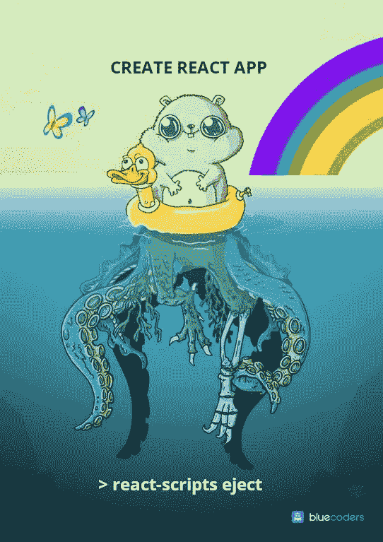

# 从婴儿到叛逆少年:使用 create-react-app 构建值得企业使用的 web 应用程序

> 原文：<https://levelup.gitconnected.com/from-infant-to-rebellious-teenager-using-create-react-app-to-build-an-enterprise-worthy-web-bcafb0a06c45>

那么，你已经说服你的老板(或者你自己)在这个项目中使用 React 了？太棒了，不错的选择。如今很少有框架像 React 一样有开发者的支持和行业的支持。脸书还创造了这个伟大的启动 React 的方式，叫做 [create-react-app](https://github.com/facebook/create-react-app) (从现在开始，我们简称它为 CRA)。你要做的就是

> >创建-反应-应用我的应用
> >光盘我的应用
> > npm 开始

然后嘣！React 项目。你可以把这个项目(做一两个非常小的调整)部署到你选择的服务中(在这种情况下，我使用 Heroku ),在创建我的项目后的 20 分钟内，我就把它部署到了云中，我知道继续开发和逐步提供新功能对我来说非常容易。

*(注意:这是一个架构帖子，不是一个工作示例帖子，所以不要指望看完这篇文章后会有功能代码。我只是想给你提供一些资源，帮助你像我一样导航这个旅程。)*

我在对框架一无所知的情况下开始使用 React。适应事物的反应方式是…有趣的。就过去使用单页应用程序(SPA)框架而言，我唯一的经验是 Angular。Angular 在设计方面很好地分离了关注点(路由、模板等)，但我偶尔会遇到状态管理方面的挑战。当我需要一个更复杂的数据结构并将其绑定到页面上的一个元素时，我总是觉得自己在违背 Angular 的意愿。我觉得我写了太多的转换代码，以至于无法把方钉装进圆孔。React 并没有完全解决这个问题，但是能够将一个属性作为参数传递给一个组件，将该属性转换为状态，并基于该状态呈现一个视图……这听起来简单多了。再加上 React 增加的[钩子](https://reactjs.org/docs/hooks-intro.html)，你真的可以以合理的速度编写出可重用的代码。我尽可能多地进行代码重用(稍后会有更多关于这方面的挑战)。

所以，这个项目进行了六个月左右..我有很多概念验证的东西。我的部署管道已经和 Heroku 建立好了。从我的 QA 服务器到产品，需要几分钟来提升一个发布，尽管我在我的持续部署策略中缺少一些质量关，但我对它的工作方式很满意。

# 弹出还是不弹出？

对于你们中的一些人来说，此时你可能会想“好吧，但是如果你想为‘企业’做点什么，你需要扔掉你的 CRA”。你说的弹射是什么意思？这张图表应该能解释一切:

如果你在 create-react-app eject 上进行谷歌搜索，你会得到解释为什么不这样做的博文:)在这种情况下，你所做的是暴露容器的底层配置(Webpack、Babel、ESLint 等)，所以你可以随心所欲地使用它。弹射的大问题是你不能把猫放回包里。一旦你这么做了，你就只能靠自己了。

事实是，为了实现我的长期目标，我需要做“一些事情”，不管我是否决定放弃我的申请。我错过了一些阻碍我进步的关键事情:

*   **性能。**嘿，给你们所有人一个快速提醒，当你在没有任何配置的情况下部署 CRA 时，你是在你的服务器上运行“react-scripts start”。这意味着您正在开发模式下运行！显然，有更好的方法在服务器上运行你的应用程序(事实上，一旦你运行 react-scripts build，CRA 会告诉你如何运行一个 build，但这需要额外的服务器配置步骤)。如果你像我一样，在 Heroku 上运行 react 服务器，我会推荐使用[create-react-app-build pack](https://github.com/mars/create-react-app-buildpack)，因为这是一个很好的中间步骤，让我在没有 SEO 的情况下在我的服务器上运行生产就绪代码。
*   **(前述)SEO** 。默认情况下，CRA 建立了一个模板 html 文件。有一些项目([头盔](https://github.com/nfl/react-helmet))会在客户端重写你的 HTML 头，但通常这在游戏中对爬虫来说已经太晚了，无法正确地分析你页面上的内容，并留给你非常不合理的内容页面预览。如果你正在建立任何依赖动态内容/SEO 的系统，我鼓励你继续阅读。

就如何实现 SEO 而言，有一些解决方案可以让你缓存网页的预渲染状态(想到了 [prerender.io](https://prerender.io/) ),但这些解决方案带有额外的价格标签和配置，这使得我很难保持 CRA 的完整性。我最终决定我需要在我的应用程序中实现服务器端渲染(SSR)。CRA 是完全客户端渲染的(CSR)，这意味着所有代码都被推送到客户端(您的浏览器)，然后 DOM 树被动态解析。SSR 允许你把你需要的东西推送到客户端(浏览器)，并允许你通过[代码分割](https://developers.google.com/web/fundamentals/performance/optimizing-javascript/code-splitting)来优化你的代码。所以最后，我决定我要

1.  一种通过 CRA 继续开发的方式(这意味着我不想放弃我的项目)
2.  一种运行 Express 应用程序的方法，该应用程序按照开发人员的意图与我的 CRA 进行通信

如果你想知道，是的，我研究了诸如 [Next.js](https://nextjs.org/) 和[Gatsby](https://www.gatsbyjs.org/)([https://dev . to/Jame esy/Gatsby-vs-next-js-what-why-and-when-4a l5](https://dev.to/jameesy/gatsby-vs-next-js-what-why-and-when-4al5))等框架，并决定推出自己的框架。坦率地说，Gatsby 不在我的用例中，因为我从一个 API 中生成大量动态内容(据我所知，Gatsby 是静态呈现页面的方式)，我觉得选择类似 Next.js 的东西太落后了。如果你正准备开始一个项目，基于我目前所说的，你可以考虑 Next.js。

重构我的代码库以满足上述标准是一项充满爱心的工作，花了几个周末的时间，并进行了大量的反复试验。我将在下面强调我在这个项目中遇到的挑战:

# 覆盖 Webpack 而不弹出

有多种方法可以在不弹出 CRA 的情况下覆盖 web pack 配置。我现在为我的项目定制了一个 web pack 配置。这个[可加载组件](https://loadable-components.com/)项目给了我很多灵感，让我最终采用了这个解决方案，这让我在这段时间的生活变得简单了很多。老实说，这个项目中伟大的代码示例。

# 节点应用程序的静态入口点

为了正确地进行 SSR，我现在有了一个 nodejs 入口点来启动一个 Express 服务器。将 React 与 SSR Express 应用程序正确集成的关键是:

*   **正确配置巴别塔。我经历了无数次 babel 配置和页面错误的迭代，最终理解了一切是如何工作的。我学到的比我想知道的要多。老实说，这就是人们不退出 CRA 的原因。**
*   **处理路由。**在我的 CRA 中，我使用了一个路由器(更准确地说是 BrowserRouter)来控制稍后将在管道中呈现的组件。由于节点应用程序中缺少“窗口”组件，BrowserRouter 不支持 SSR，但幸运的是存在一个 StaticRouter，它将完成这个任务。

# 代码分割(如果需要)

我的应用程序中有几个组件需要我进行代码拆分(即它们只运行 CSR)才能让我的应用程序正常运行。

# 我的(非常简单的)SEO 解决方案

我的 SSR SEO 解决方案是这样实现的:从对 API 层的调用中提取元数据，并在 html 呈现给浏览器之前将这些 meta 标签注入到 html 的头部。这消除了任何 CSR 元标签渲染的需要，对此我很高兴。并不是我的所有端点都需要 SEO(或者有 SEO)，所以我拦截所有流量并检查(通过请求 url 上的 regex)是否需要请求元数据。

# 其他需要考虑的事情

实现和部署传统的 node SSR 应用程序是我的应用程序从婴儿到青少年时期面临的最大挑战，但远不是唯一的挑战。其他一些是:

*   **你的 CRA 的文件夹结构。**在拥有数百个组件之前，您可能会忽略这一点。此外，没有人真正给你指导如何正确地进行导入，一旦你有了模块的文件夹和子文件夹，并且你的导入与相对路径(例如../../等等)。这里的外卖是；尽早在项目中实现绝对路径。您会发现应该如何做有不同的方法(和观点),但这完全取决于您，web pack 允许您定义别名来为您的导入构建正确的绝对路径。
*   **上菜的画面。**静态资产位于我的节点服务器上，但是我有一些依赖关系，需要我加载一些图像作为它们的 base64 表示(例如，我在地图上放置自定义标记),确定这种巴别塔配置是一个挑战。
*   **UX** 。我的职业是开发人员，不是设计师。因此，它看起来像是开发人员创建的。是的，我使用了 [react-bootstrap](https://react-bootstrap.github.io/) 来实现我的 UI，以及其他各种 react 化的组件。如果你坚持 KISS 范式(保持简单，愚蠢)，你将能够超越你的大多数引导风格，给你一个适当的审美。尽可能使用 flexbox 和列，因为它使得处理移动响应/断点更加容易。

# 从叛逆的少年到成熟的成年人

还剩下什么？软件是福也是祸，因为它永远不会完成。我有一个稳定运行的应用程序，满足了我需要它做什么的前提，但随着时间的推移，总会有一些改进可以让它变得更强大。以下是我将来想做的几件事:

*   **性能更佳。**其中一部分来自缓存来自浏览器 API 的内容，另一部分将通过更好(更彻底)的代码分割来消除那些通过网络到达浏览器的大负载。
*   共享的状态/资源。我不用 Redux。这部分是由于该应用程序具有高度的事务性，大多数时候，每个页面上加载的内容都是动态的。也就是说，我可以通过实现某种不在每次页面请求时重新加载的状态来大大提高高级用户的性能。
*   **更好的组件重用。**我有许多本质上提供类似功能的容器，只是在主题上稍有变化。我想将这些容器重构为单个表单/视图组件，并实现某种模式，允许这些表单/视图组件中的内容独立于容器构建。
*   **少课，多钩。现在我真正理解了 React 中的钩子范式，在我使用类的许多情况下使用它们更有意义。我已经完成了将一些类重构为函数挂钩的大部分简单工作，但是我保留了一些容器，因为它们具有复杂的状态。**
*   **客户端的 API 实现。**现在我有一个 API js 类，它包装了我的 API，使用 Axios 发出请求并返回数据。然后由每个组件来转换响应。我考虑过使用 GraphQL 作为一个抽象，但是现在这可能是一个过度工程化的解决方案。我可以预见一个未来的状态，在这个状态下，对 API 的改变不太需要，GraphQL 作为中介更有意义。

非常感谢你能走到这一步！我希望这篇文章能帮助你在谷歌搜索中找到对你的旅程有帮助的资源。