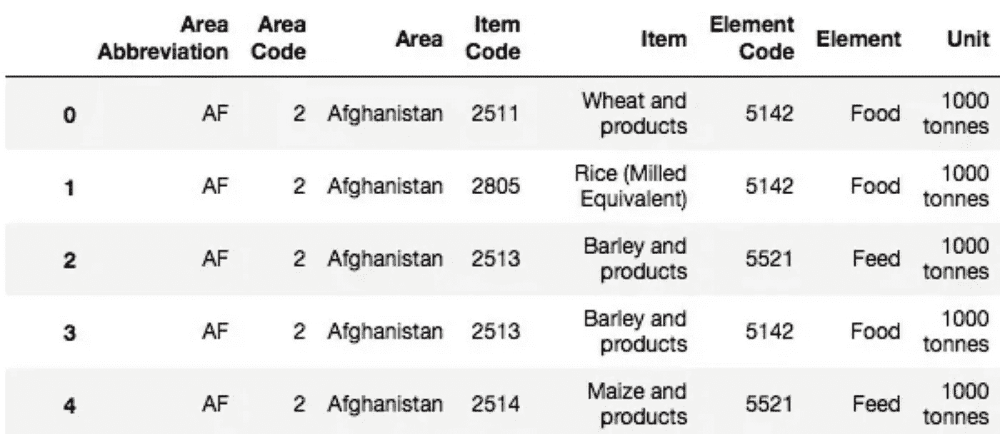

# 从 JSON 到 uint32 再到 Tensors:高级程序员数据类型参考指南

> 原文：<https://levelup.gitconnected.com/from-json-to-uint32-to-tensors-the-advanced-programmers-data-type-reference-guide-cbe554b86971>


来源: [Unsplash](https://unsplash.com/photos/JKUTrJ4vK00)

## 41 种重要的数据类型，已解释

理解数据类型对于在代码中创建和建立变量的存在是必不可少的。但是除了数据类型对于初学者的重要性之外，选择正确的数据类型不仅仅是这样，它对于优化代码的性能和效率是不可或缺的。选择一种基本的数据类型，它可以立即天真地完成您想要做的基本任务，这可能会完成任务，但是更明智地选择数据类型是区分有经验的程序员和初学者以及区分优秀代码和优秀代码的一个关键区别。

虽然这篇文章是专门针对 Python 的，但是这些数据类型中有许多是通用的，可以移植到其他语言和库中。这些语言翻译将在适用的情况下进一步概述。

*   *标准内置奇异值*:科学记数法，复数，+
*   *标准内置多重/代码* : lambdas、tuples、sets、+
*   *高级数值数据类型*:双精度、无符号整数、+
*   *日期和时间*:日期时间、时间增量、+
*   *数据科学/表格数据*:序数数据、名义数据、+
*   *张量流特殊化类型*:秩 2 张量、参差张量、+
*   *文件类型/数据容器* : XML、CSV、DataFrames、+

# 标准内置奇异值

**整数**包括负整数、正整数和零。在 Python 中，调用`int()`可以将浮点数或字符串转换成整数。在浮点数上使用整数有助于加速计算时间，因为它不需要和浮点数一样的开销。

浮点包括整数，也包括任何其他实数。“浮点”指的是小数点及其后的十进制数字。调用`float()`将数据类型转换成浮点数。

**科学记数法**是一种用 10 的幂来表示极大或极小数字的方法(十亿是 1×10⁹，而不是 10 亿)。尽管从技术上来说它要么是整数，要么是浮点数，但是可以通过使用`e`来触发 Python 的科学符号表示。例如，你可以把 5600000 写成 5.6×10⁶，或者用 Python 写`5.6e6`。对该值的所有进一步操作将保留在科学记数法中。在需要手写大值的情况下，使用这种初始化非常有用。

**十六进制**类似于位，但是以 16 为基数而不是以 2 为基数进行运算。0 到 9 用于表示 10 个数字，而字母 A 到 F 可以表示剩余的 6 个可能的数字。十六进制应该只用于长整数或者过大的整数——否则，使用它们真的没有意义。另一方面，它们可以用来寻找颜色值(十六进制代码利用十六进制)。

**复数**超越了浮点数所代表的实数，具有一个虚部。可以使用内置函数`complex(x)`将任何数据类型转换成复数。要从头开始创建一个复数值，使用`j`来表示虚部。例如，一个实部为 3、虚部为-2 的复数将被创建为`3 ˗ 2j`。

**布尔值**被设置为`True`或`False`。转换为整数时，结果分别为 1 和 0，通过`bool(x)`将整数转换为布尔值时，1 对应 True，0 对应 False。

**字符串**是用单引号或双引号括起来的任何字符的序列。两者可以互换使用，字符串中的引号可以使用转义符进行转义:`‘I don\’t like double quotes.’`这样，转义符后面的字符将被视为字符串，而不是系统命令。

**多行字符串**允许字符串跨越几行。这对于像分段文本或存储 HTML 数据这样的任务很有帮助。多行字符串可以用三个引号开始，再用三个引号结束，在文本中存储换行符。

# 标准内置多重/代码值

**对象**可以使用类方法在 Python 中创建。对象包含内部变量和函数，可以通过调用`object.variable`或`object.function()`来引用。使用面向对象的编程可以使编写和阅读代码更加干净和有条理。

**函数**是指定的代码序列，可以根据它们的名字来调用，而不需要在它们的主体中写出代码，因此是干净且不重复的代码的组成部分。在 Python 中，函数既可以用`def func_name: do_something`跨多行创建，也可以用`func_name = lambda x:something(x)`在一行中创建。

**列表**是项目的有序列表。它们可以用方括号(`[]`)初始化，内部元素用逗号分隔。

**元组**是成对的项，可以用`(a, b)`初始化。元组不需要列表数据类型中具有未设置的最大列表长度所提供的开销空间，因此如果只需要存储两个值，它们会更有效。为了保持这种效率优势，它们也是不可变的，或者一旦被创建就不能被改变或变更。元组可以很容易地解包，参见下面的例子:

```
for i, j in [(1,2), (3,4), (5, 6)]:
     print(i+j)
```

**字典**是`key:value`项的列表，其中每个值都可以通过其对应的键来访问。字典有助于保存双值，用花括号`{key1:value1, key2:value2}`创建。另一种方法是将`dict()`应用于另一个变量。

**集合**本质上是列表，但是更加严格，因此具有更多的信息能力。该集合支持诸如并集、交集和对称差之类的数学运算(尽管为 NumPy 保留复杂的数学运算可能更有效)。一个集合是无序的，有不可变的(不可改变的)项，并且不能有一个以上的相同元素。要初始化它，使用括号(像字典一样)，但是把它当作一个列表。

集合有助于从其他数据集中获取信息。如果我们想在列表`list_a`中找到唯一的元素，我们可以用`set(list_a)`将它转换成一个集合，并查看集合的值。由于集合不能有多个相同的值，Python 自动为我们完成了数据类型转换的重任。

# 高级数字

NumPy 是 Python 中的一个科学计算库，其根源是 c。因为它的编程效率比纯原生 Python 更高，所以建议在重型计算中使用它，这也是从 web scrapers 到机器学习模块的许多大计算库使用 NumPy 的原因。NumPy 如此成功的部分原因是因为它对变量的数据类型非常具体——给予了足够的利用自由，但不足以产生过多的开销。理解它们至关重要。

**前驱—比特**:比特是机器的关键单位，是二进制的 0 或 1，物理上用一个电子(或另一个分子项)的有无来表示。所有信息都表示为位的组合:一个 4 位的字符串可以容纳 2×2×2×2=16 个可能的值。一个 8 位字节可以保存 2⁸=256 值。供参考:

*   千字节:2 个值(13 位)
*   兆字节:2 个值(23 位)
*   千兆字节:2 个值(33 位)
*   太字节:2⁴值(43 位)
*   拍字节:2⁵值(53 位)

许多更具体讨论的数据类型都围绕着保存特定位数的能力。当一个变量被初始化时，它所能接受的最大大小被保留在内存空间中，所以选择正确的大小而不超过它是很重要的。

**np.array** 表示数组对象，是元素的集合，可以是任何数据类型，包括子数组。数组对编程语言至关重要，因为它们是数据和信息的计算机表现形式。使用基于数组的计算比使用循环系统和手写条件要快得多。带有子阵列的阵列称为矩阵。在某些条件和上下文中，数组可以被认为是张量，是机器学习所必需的数据类型。

**np.int8 到 np.int64** 包含可能的以 2 为基数的整数类型(`int8`、`int16`、`int32`、`int64`)。这些值存储负值和正值，并且可以保存 2ˣ，其中 *x* 表示整数值，例如，int8 可以保存从-128 到 127 的值(总共 256 个值)。

**np.uint8 到 np.uint64** 包含无符号整数类型，这意味着它不能保存负值。相反，这些数据类型的范围仅限于等于或大于 0 的整数。例如，`np.uint16`可以表示从 0 到 2 ⁶-1=65535.的所有整数

**np.int_** 表示 NumPy 中的默认整数类型，与 c 中的`long`类型相同。这种“动态”类型支持 int64 或 int32，具体取决于它的设置值。

**np.float16 到 np.float64** 代表 NumPy 浮点类型。`np.float16`表示具有 10 位尾数(3.141×10⁴的 3.141)和 5 位指数(3.141×10⁴).的 4)的半精度浮点数`np.float32`表示“单精度浮点”，可以包含 23 位尾数和 8 位指数。`np.float64`是‘双精度浮点’，可以保存 52 位的尾数和 11 位的指数。这些精度浮点测量几乎是通用的，起源于 c 语言的创建。

*   `np.float16`与`np.half`相同
*   `np.float32`与`p.single`相同
*   `np.float64`与`np.double`相同

**NP . complex 64&NP . complex 128**是 NumPy 中复数的实现。`np.complex64`可以保存两个 32 位浮点，一个用于复数(实数和虚数)中的每个分量。`np.complex128`可以容纳两个 64 位浮点。128 位复杂是 Python 实现的形式，尽管可以想象如果不需要 128 位精度，指定一个`complex64`数据类型会快多少。

**np.ufunc** 表示一个所谓的‘通用函数’，这是一个已经用 C 编译过的函数，使得它对数组数据类型的操作非常高效。这些通用函数接受一个标量(单个)值，但是按元素方式应用于数组。Python 函数可以通过 NumPy 的`frompyfunc`函数转换成通用函数。

一般来说，这些高级数值数据类型由大型库处理和优化，但如果您需要编写更专业的低级代码(许多高级开发人员就是这种情况)，理解每种数据类型的含义是很重要的。了解这些数据类型可以让您避免因选择不正确的数据类型来存储数值数据而导致的计算错误、内存溢出或大量开销问题。

# 日期和时间

**datetime.date** 是最基本的日期对象，有三个属性:年、月、日。当时间不是一个因素时，处理日期对象比处理其他对象更容易。

**datetime.time** 是最基本的时间对象，不考虑日期。相反，它由小时、分钟、秒、微秒和 tzinfo 表示，tz info 表示时区信息。

**datetime.datetime** 可能是最常见的测量时间的数据类型，它由`date`和`time`对象组成，包含这两个对象的参数。

**datetime.timedelta** 是请求两个时间点之间的差异时返回的对象，精确到微秒。可以在任何两个有效的 datetime 对象之间请求 timedelta，只要它们的比较有效。

可以用 Python 的`+`和`-`操作符将日期、时间、日期时间和时间增量相加或相减。

# 数据科学/表格数据

**数字数据**由数字组成，可以是整数、浮点数、复数等等。数字列或特征完全由数字组成。

**分类数据**由无法在数字尺度上测量的数据组成，如字符串(“猫”和“狗”)，并且具有有限数量的可能唯一值。如果一个特征只包含分类数据，那么它就是分类的。

**顺序数据**是指数据不一定是它所代表的数字，但仍然保持一定的数字关系，如等级。虽然 A 比 B 好(A > B 关系)，但是数据不是数值。序数数据只显示顺序关系。

**名义数据**是分类数据的数字表示，其中每个值相对于其他值毫无意义。举个例子，考虑[1，2，3，2，3，1]，其中 1 代表“猫”，2 代表“狗”，3 代表“鱼”。

# TensorFlow 专用类型

TensorFlow 可以说是使用最广泛的机器学习库。TensorFlow 植根于 Python，应用于 JavaScript，是人工智能项目从概念到部署的基础。因为机器学习是一项计算量非常大的任务，TensorFlow 有自己的高效实现值的系统。

**tf.tensor(num)** 表示零维张量(秩-0)，或者标量(奇异值)。根据`num`的大小，TensorFlow 会自动确定大小，虽然默认是 int32。张量是不可变的，或者说不可改变的；相反，只能创建新的张量。所有张量都可以使用`tf.constant(value)`创建。

**tf.tensor(list)** 表示一个一维张量(秩-1)，或者一个列表。现在可能很清楚了，TensorFlow 构造张量(数据)都来自`tf.constant`，通过传递给它的构造函数的数据的维数来推断张量的形状。

**tf.tensor(列表数组)**表示二维张量(秩-2)。这类似于矩阵，因为它有两个轴。这种增加维度的模式可以继续到三维数据(例如，RGB 图像，其中每个像素由三个值表示)、四维数据(批量大小)等。

**tf.sparse.SparseTensor** 是一种张量类型，专门创建用于计算极其稀疏或多数空/0 张量。

**tf.ragged.RaggedTensor** 是可以容纳非矩形数组的张量类型；也就是说，并非所有行的长度都相同。这在分析或建模的情况下可能是有用的，例如，用不同大小的数字表示的文本串(可能使用递归神经网络建模，这对于输入大小是不变的)。

**tf.uint16 等。** : TensorFlow 的高级数字数据类型(如无符号整数、浮点数以及在相应章节中讨论的其他数据类型)的实现与 NumPy 中的实现相同，它们只是针对 TensorFlow 操作进行了优化的重新创建。事实上，`np.uint16==tf.uint16`将返回`True`，因为 TensorFlow 数据本质上是建立在 NumPy 之上的。

# 文件类型/数据容器

JSON 或 JavaScript Object Notation 是一种标准的文件和数据交换格式，强调可读性。作为一种应用广泛的常见数据格式，JSON 几乎出现在任何与 web 应用程序或交互有关的地方。JSON 语法非常简单:花括号(`{}`)表示“字典”，如`key` : `value`，方括号表示列表。在下面的示例中，有一个“employees”表，有两列`firstName`和`lastName`，三行。

```
{“employees”:[
 { “firstName”:”John”, “lastName”:”Doe” },
 { “firstName”:”Anna”, “lastName”:”Smith” },
 { “firstName”:”Peter”, “lastName”:”Jones” }
]}
```

Pandas 是流行的数据操作库，可以从带有`pd.read(‘filename.json’)`或`pd.read(‘url’)` ( `pd`是`import pandas as pd`中 pandas 的缩写)的文件或互联网 URL 中读取 JSON 数据。请注意，尽管 JSON 可读性很强，但它可能会被批评为效率低下，因为表中的列重复了几次。如果数据太大，可能有必要将 JSON 转换成更“有效”的数据类型，如 CSV。

XML 是网页使用的另一种数据存储形式。虽然它已经普遍失宠，但许多网站仍在使用它，而且是基于标签的。上面 JSON 表中的数据可以用 XML 表示为:

```
<employees>
 <employee>
 <firstName>John</firstName> <lastName>Doe</lastName>
 </employee>
 <employee>
 <firstName>Anna</firstName> <lastName>Smith</lastName>
 </employee>
 <employee>
 <firstName>Peter</firstName> <lastName>Jones</lastName>
 </employee>
</employees>
```

Pandas 不直接支持读取 xml 文件，尽管有一个 Python 库——[pandas-read-XML](https://pypi.org/project/pandas-read-xml/)——可以将 XML 文件转换成数据帧。

CSV 或逗号分隔值是一种高效的数据存储方法。这种数据类型使用逗号来分隔每行中的值，并使用新行来分隔每行。例如，上面的 JSON 表将以 CSV 格式表示为:

```
‘firstName’,’lastName’
'John','Doe'
'Anna','Smith'
'Peter','Jones'
```

Excel 数据以 CSV 格式存储——您可以通过保存扩展名为`.csv`的 excel 工具箱并在记事本或其他纯文本编辑器中查看该文件来亲自尝试一下。CSV(和 Excel)数据可以用带`pd.read_csv(‘file_path’)`和`pd.read_excel(‘file_path’)`的熊猫读取。

**HTML 表格**是在维基百科等 HTML 网站中使用的表格。这些表格通常在专门的表格标签内，熊猫用`pd.read_html(‘url’)`就可以读取。这将返回一个数据帧列表，对应于 Pandas 在网页上找到的表。

数据帧是熊猫的表格。使用 Pandas 读取的任何外部数据源都被转换为 DataFrame。数据帧中的数据可以使用各种方法进行修改，如应用函数、重命名列、删除单元格值、设置索引、连接数据帧等等。



使用`to_datatype(‘file_path’)`可以将数据帧导出为其他数据类型。例如，要将名为“data”的数据帧转换为 CSV 格式，需要运行下面的代码:`data.to_csv(‘file_path.csv’)`。

如果这份参考资料有所帮助，您可能会喜欢其他一些备忘单:

[](https://towardsdatascience.com/your-ultimate-data-mining-machine-learning-cheat-sheet-9fce3fa16) [## 您的终极数据挖掘和机器学习备忘单

### 特性重要性、分解、转换等

towardsdatascience.com](https://towardsdatascience.com/your-ultimate-data-mining-machine-learning-cheat-sheet-9fce3fa16) [](https://towardsdatascience.com/your-ultimate-data-manipulation-cleaning-cheat-sheet-731f3b14a0be) [## 您的终极数据操作和清理备忘单

### 解析日期、输入、异常检测等等

towardsdatascience.com](https://towardsdatascience.com/your-ultimate-data-manipulation-cleaning-cheat-sheet-731f3b14a0be)