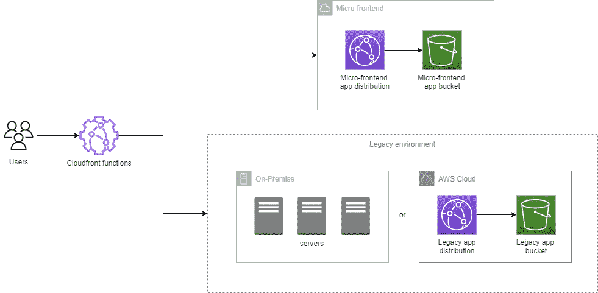

# 通过 CloudFront 函数将 Canary 从传统应用程序发布到微前端

> 原文：<https://levelup.gitconnected.com/from-legacy-apps-to-micro-frontends-via-cloudfront-functions-1a7dd7f34be1>

遗留前端的迁移正在成为软件工程中非常常见的活动，部分原因是 JavaScript 生态系统和框架在过去十年中的不断发展。在这种情况下，微前端正在成为在新的框架中重写遗留应用程序的有效选择。让我们来看看一个有效而简单的方法，你可以通过 [CloudFront 函数](https://aws.amazon.com/blogs/aws/introducing-cloudfront-functions-run-your-code-at-the-edge-with-low-latency-at-any-scale/)应用 [canary release](https://martinfowler.com/bliki/CanaryRelease.html) 策略，通过扼杀遗留应用程序并将它们迁移到微前端应用程序。

# 冰冷矿井中的金丝雀前来救援

虽然有时重写生产应用程序是必要的，但这对业务和客户体验来说是一个具体的风险。我们需要保守的方法来做局部的转变:释放金丝雀。

目标是慢慢地将一小部分用户流量从旧应用转移到新应用。看似对[可怜的鸟儿](https://share.america.gov/english-idiom-canary-coal-mine/)的工作来说，金丝雀放生是一种非常有效的方法:

*   当出现问题时，支持快速回滚策略。
*   通过快速了解新发布产品的功能、可扩展性和性能，提供即时反馈
*   学习失败的文化，然后可以通过收集的数据进行分析。

# 为什么 CloudFront 功能

CloudFront 函数是已经庞大的 AWS 功能组合的最新成员。通俗地说，它们有点像类固醇上的 [Lambda@Edge](https://aws.amazon.com/lambda/edge) ，它们的主要区别在于，通过在[边缘位置](https://wa.aws.amazon.com/wellarchitected/2020-07-02T19-33-23/wat.concept.edge-location.en.html)而不是[区域边缘缓存](https://aws.amazon.com/about-aws/whats-new/2016/11/announcing-regional-edge-caches-for-amazon-cloudfront/)上执行，它们在非常低的延迟下更容易扩展，甚至在地理上更接近客户。该功能将根据 cookie 策略在我们的旧应用和新应用之间重定向用户。

传统和微前端之间的重定向

如上所示，假设我们既有一个现有的生产遗留应用程序(部署在 AWS 上或内部)，又有一个基于微前端架构的新 web 应用程序(在生产 AWS 上，但还不能公开访问)。让我们看看 CloudFront 函数如何向这两个设置分派流量。

# 设置 CloudFront 功能

函数可以在 CloudFront 收到来自查看器的请求(查看器请求)之后和 CloudFront 将响应转发给查看器(查看器响应)之前被触发。

当创建函数时，我们需要将它们关联到 CloudFront 发行版，该发行版指向默认遗留应用程序所在的 S3 源。下面让我们来看看它的实际操作(AWS [指南在这里](https://docs.aws.amazon.com/AmazonCloudFront/latest/DeveloperGuide/create-function.html))。

创建 CloudFront 函数的步骤

**重要提示:**对于这个概念验证，我选择指出传统应用程序的来源，但它可以很容易地转换为使用微前端。

下图显示了该功能的内容:

该函数本身检查请求中是否存在一个 *X-Source* cookie。

*   用户的百分比由实验流量常数决定。当设置为零时，所有流量都流向传统，否则，如果设置为 1，所有流量都流向微前端。
*   如果 *X-Source* 不存在(第一次访问者)，该函数随机选择其值(无论是传统还是微前端应用程序)并将其分配给请求 cookie。
*   如果 *X-Source* 存在，该功能会将用户重定向到 cookie 值中定义的应用类型，即*传统应用*或 *mfe-app* 。
*   当返回请求时，我们将 index.html 添加到 CloudFront 发行版的默认根 url 前面，因为 spa 需要这个技巧，[，如此处所示](https://docs.aws.amazon.com/AmazonCloudFront/latest/DeveloperGuide/example-function-add-index.html)。

同样，让我们看看查看器响应函数的内容:

这是一个更简单的函数，因为它在我们从缓存返回后，在响应中用正确的值设置 cookie。

# 结果

当用户第一次访问 URL 分发时，他们将被分配一个 cookie，该 cookie 将管理他们将被重定向到的状态。在下图中，我通过在 web 控制台中修改 X-Source cookie 来手动修改它以加快这个过程。传统应用程序是橙色的登录应用程序，而新的微前端只是典型的有棱角的蓝色应用程序。

# 局限性和想法

以下限制和想法可以得到加强:

*   与 Lambda@Edge 相比，最大的限制是缺乏对在 CloudFront 函数中获取外部配置的支持。在 S3 或 DynamoDB 中存储额外的配置很方便，不需要更新发行版代码，但代价可能是通过避免这种情况，CloudFront 函数在可伸缩性和低延迟方面达到了更好的性能
*   使用 console.log 语句来监视函数。日志组将在 *CloudWatch 中可见，*仅在北弗吉尼亚地区可见。
*   流量配置可能比本 PoC 中所示的更复杂，在这种情况下，Lambda@Edge 可能更合适。
*   可以使用类似的方法用新的 URI 替换旧应用程序的某些部分。

# 摘要

重写工作是昂贵的，企业应该小心，并且有很好的商业和技术理由这样做(不支持的框架、修改产品、团队成长、处于危险中的商业案例等)..).Canary 版本和 CloudFront 支持我们重新评估应用的性能和可用性，可能重新访问用户流，并通过数据获得关于架构决策(微前端)的见解和知识。

# 参考

*   [引入 CloudFront 功能——在任何规模下以低延迟在边缘运行您的代码](https://aws.amazon.com/blogs/aws/introducing-cloudfront-functions-run-your-code-at-the-edge-with-low-latency-at-any-scale/)
*   [在边缘构建无服务器微前端](https://www.youtube.com/watch?v=fT-5RHTtFNg) (Re:Invent 2019)