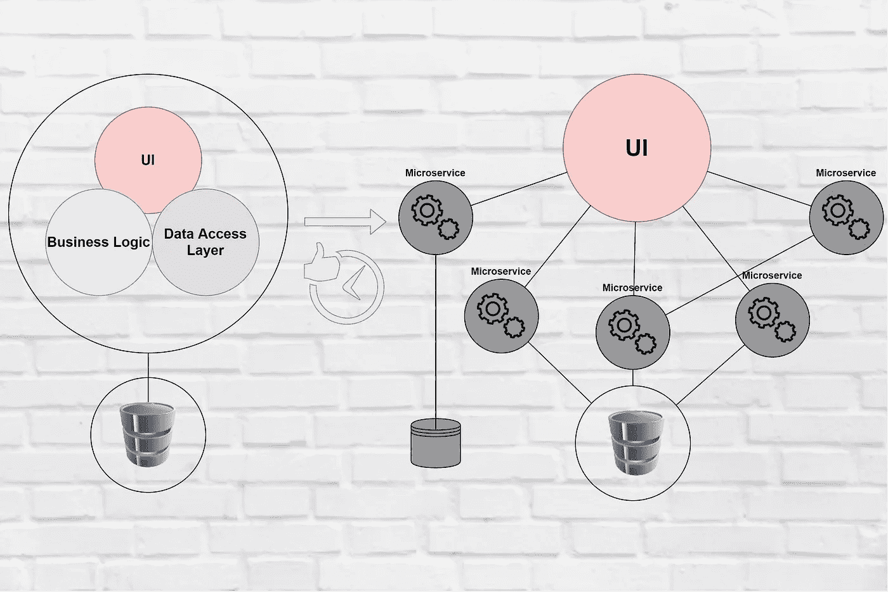
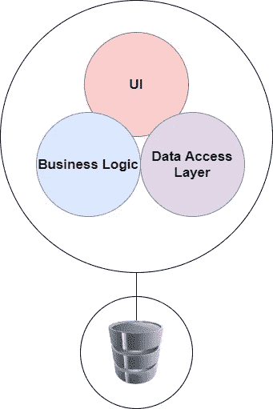
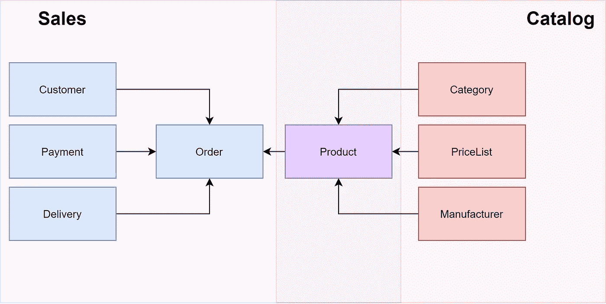
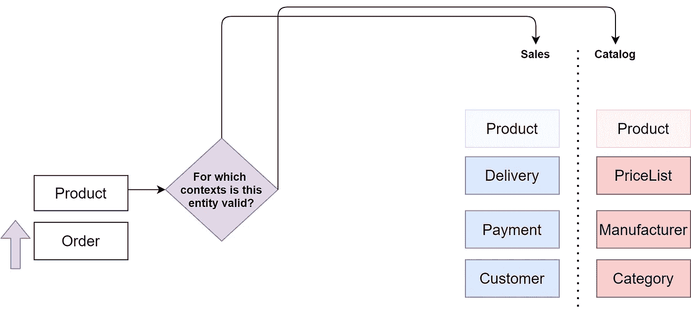
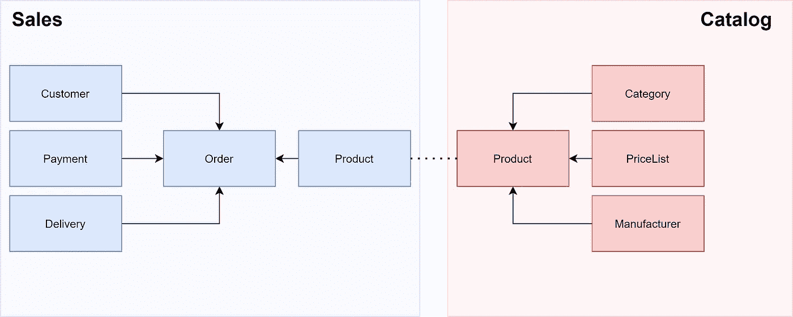
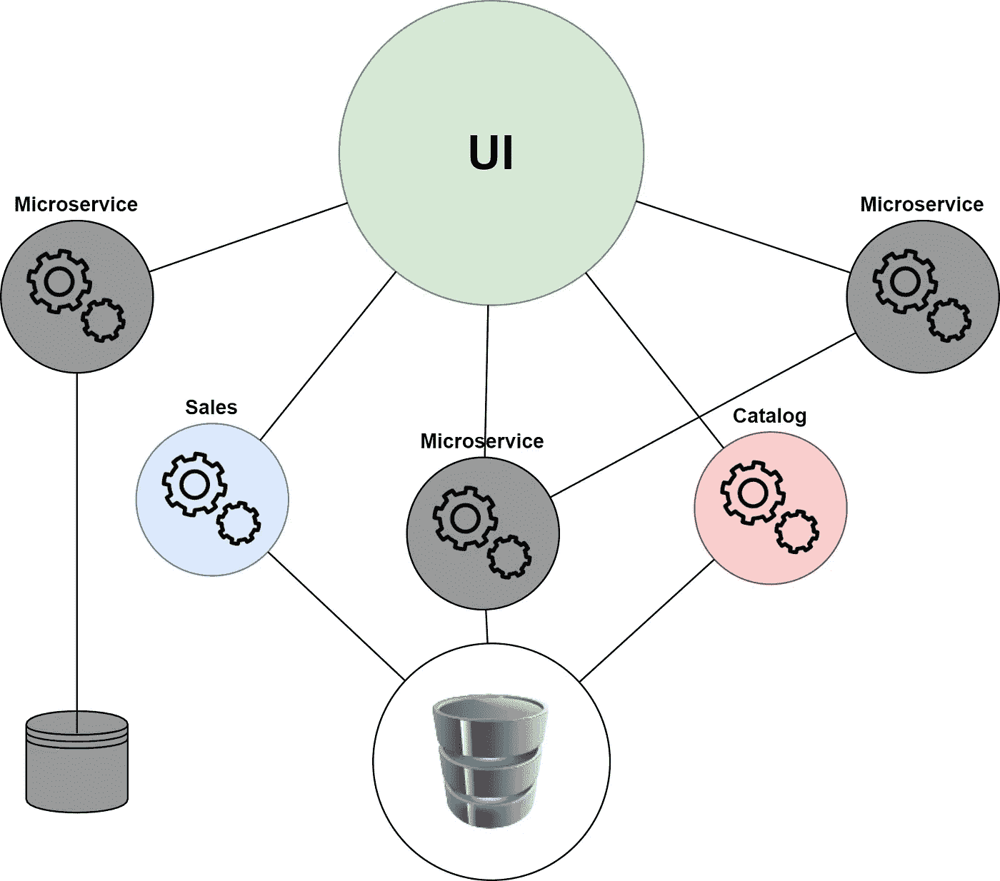

# 5 分钟内从整体服务到微服务

> 原文：<https://levelup.gitconnected.com/from-monolith-to-microservices-in-5-minutes-83069677d021>

## 软件架构和重构

## “微服务架构风格是一种将单个应用程序开发为一套小型服务的方法。”——马丁·福勒。

整体架构与微服务架构

首先，我们将了解什么是整体架构。因此，我将向您展示如何修改它的域，以便为微服务架构做好准备。最后简单给大家讲一下微服务架构的基础，判断一下它的优劣。

# 整体建筑

整体架构是每一个非垂直分割的架构。软件设计中的垂直划分意味着将应用程序分割成更多可部署的单元。这并不意味着 monolith 不能[水平分层](/layers-in-software-architecture-that-every-sofware-architect-should-know-76b2452b9d9a)。

形容词**单片**指的是软件的架构由一个后端单元组成。我说后端是因为我相信 monolith 可以像 web 和 mobile 一样拥有不止一个 UI，并且仍然保持 monolith。

整体建筑

组件之间的通信主要是通过方法调用进行的。如果你的前端和后端在物理上被分成，比如说，API 和 web 客户端，那么它仍然是一个整体。

直到你把后端分成更多的部署单元，在我眼里你还是在用单体架构。

# 单域模型

> “领域是计算机程序的目标主题区域。从形式上来说，它代表了特定编程项目的目标主题。—维基百科

用我的话来说，领域是软件存在和存在的原因。我在 [3 每个软件开发人员都应该知道的以领域为中心的架构](/3-domain-centric-architectures-every-software-developer-should-know-a15727ada79f)一文中写了更多关于领域的内容。

这是一个可视化的部分从网上商店的领域。

单域模型

销售和目录子域包含单个**产品**实体。这就导致一个地方顾虑多，总是不好。这违反了[关注点分离原则](https://en.wikipedia.org/wiki/Separation_of_concerns)。

强迫一个实体考虑更多的问题感觉不对。实体在两种上下文中都包含未使用的属性。销售人员不需要知道产品的类别，目录对于产品如何交付给客户的信息没有任何用处。

为了避免这个问题，我们需要找到销售和目录上下文的边界来将它们分开。这将我们引向一个有界的上下文。

# 限界上下文

> 有界上下文是上下文的边界或周界。—[Idapwiki.com](https://ldapwiki.com/wiki/Bounded%20Context)

为了指定有界的上下文，我们需要识别模型仍然有效的上下文范围。

我们可以通过在领域的每个实体中问一个简单的问题来验证这个模型。**这个实体在哪个上下文中有效？**

指定实体上下文

当一个实体对多个上下文有效时，它被分成多个上下文。每个都具有与上下文相对应的属性。在这个过程之后，您的应用就可以用于**微服务架构**了。

这是一个可视化的部分撕裂从网上商店的领域与分裂的产品实体。

多领域模型

# 微服务架构

微服务架构也称为微服务。这是细分的整体。微服务将大型系统分成较小的部分。

有界上下文帮助我们找到一个微服务的最佳规模。微服务应该有一个足够小的模型来最大限度地减少与外部世界的通信，并且由于存在的原因而足够大。

微服务

微服务架构提供了独立性的力量。该架构支持分离的开发团队、不同的操作系统、不同的编程语言以及不同的业务层架构，如 [CQRS](/3-cqrs-architectures-that-every-software-architect-should-know-a7f69aae8b6c) 。

每个微服务都有其明确定义的接口，大部分是通过 restful API 由 JSON over HTTP 实现的。微服务之间通信的推荐解决方案是通过消息平台，如 [RabitMQ](https://www.rabbitmq.com/) 或 [Azure Service Bus](https://azure.microsoft.com/cs-cz/services/service-bus/) 。

如果没有合适的消息传递工具，微服务必须知道其他微服务的位置，并且位置很容易改变。

# 摘要

微服务架构开发的成本曲线在大型应用中被夸大了。小型应用无法从微服务中受益，应该保持整体性。

微服务带来了分布式系统成本，如负载平衡和网络延迟。这种担忧可以通过像 Kubernetes 或 Azure Service Fabric 这样的组织者很好地解决。

下一步，我会推荐 Mark Heath 的 [Pluralsight 课程——微服务基础](https://app.pluralsight.com/library/courses/microservices-fundamentals/table-of-contents)。

如果你喜欢这篇文章，给它几个掌声。谢谢你的时间。

# 来源

*   [马丁·福勒关于微服务的博客文章。](https://martinfowler.com/microservices/)
*   [马丁·福勒关于有界语境的博客文章。](https://martinfowler.com/bliki/BoundedContext.html)
*   [Pluralsight 课程清洁架构模式、实践和原则](https://app.pluralsight.com/library/courses/clean-architecture-patterns-practices-principles/table-of-contents)。

# 进一步阅读

 [## 文件夹和尖叫建筑的功能组织

### 架构应该表达系统的意图——鲍勃叔叔

levelup.gitconnected.com](/let-me-hear-you-screaming-architecture-3adcc02f2ca3)  [## 每个软件架构师都应该知道的软件体系结构的层次

### “所有的架构都有相同的目标——关注点的分离。都是通过分软件来实现的…

levelup.gitconnected.com](/layers-in-software-architecture-that-every-sofware-architect-should-know-76b2452b9d9a)  [## 每个软件架构师都应该知道的 3 个 CQRS 架构

### 关注点分离是一种有效整理一个人思想的技术。如果你能集中一个人的注意力就最好了…

levelup.gitconnected.com](/3-cqrs-architectures-that-every-software-architect-should-know-a7f69aae8b6c)  [## 每个软件开发人员都应该知道的 3 个以领域为中心的架构

### 建筑师首先关心的是确保房子是可用的。并不是要保证房子造出来…

levelup.gitconnected.com](/3-domain-centric-architectures-every-software-developer-should-know-a15727ada79f)  [## 如何重写代码以实现更灵活的设计

### 《终极指南》举例说明了如何使用单一责任来划分类别和分离问题…

levelup.gitconnected.com](/how-to-rewrite-your-code-to-achieve-more-flexible-design-3c86dad822e)  [## 丹尼尔·鲁斯诺克的时事通讯

### 每个月我都会给你发一封邮件，列出我的最新文章。当然，这将是友好的联系…

www.danielrusnok.com](https://www.danielrusnok.com/daniel-rusnoks-newsletter) 