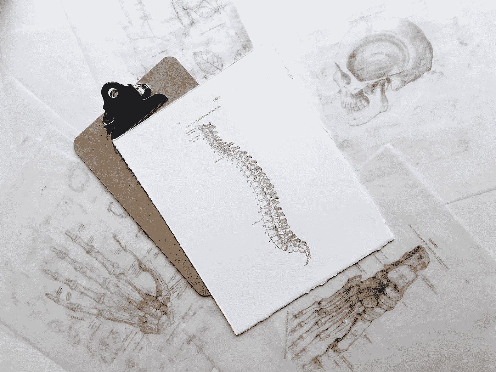
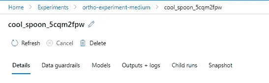

# Azure 机器学习从无代码到有代码

> 原文：<https://levelup.gitconnected.com/from-no-code-to-code-in-azure-machine-learning-38ee6b556de2>

## Azure 机器学习指南

## 使用骨科多类数据的 Azure ML 演练



Joyce McCown 在 [Unsplash](https://unsplash.com/s/photos/orthopedic-spine?utm_source=unsplash&utm_medium=referral&utm_content=creditCopyText) 上的照片

# 为什么这篇文章

一些人听说了机器学习，然后立即输入“pip install tensorflow ”,并开始探索深度学习。对于这种方法，我不是最有天赋或直觉的，所以我从低代码开始，然后发展到使用笔记本。我觉得这种方式为更多人打开了学习机器学习的光圈。Azure Machine Learning 有在云上学习机器学习的工具，没有编码经验或者有很多编码经验。这是一个逐步进入越来越复杂的机器学习的好过程。我在指南中采用了这种一小步一小步的方法，我走过了无代码(自动化 ML)，然后是低代码(设计者)，最后是实际代码(笔记本)

# Azure 机器学习概述

Azure Machine Learning Studio 有一系列很好的功能，这使得它适用于广泛的用户。从无代码 AutoML 到低代码拖放设计器，再到全代码笔记本集成。我们将遍历具有这三个复杂层次的相同数据集和分类问题，并讨论这三个层次的优点。[查看微软文档的细节](https://docs.microsoft.com/en-us/azure/machine-learning/overview-what-is-azure-machine-learning)。


Azure 机器学习主页界面

我将用三种方法遍历同一个[数据集](http://archive.ics.uci.edu/ml/datasets/vertebral%2Bcolumn)。

1.  自动化 ML —无代码 ML
2.  设计师——低代码 ML
3.  笔记本 Azure 计算实例上的 Jupyter 笔记本(实际代码 ML)

# 资料选择:UCI **脊柱数据集**

我是用于机器学习的 [UCI 公共数据集](http://archive.ics.uci.edu/ml/index.php)的忠实粉丝，因为它们非常容易访问并且被广泛使用，所以你可以获得相对模型性能的良好脉搏。此外，我的妻子是一名医生，所以深入研究这些特征背后的背景和理解医学含义是一件有趣的事情。其中一类是颈椎病；[这篇文章](https://www.ncbi.nlm.nih.gov/pmc/articles/PMC2697338/#CR93)给出了进一步的背景，但对于创建模型来说不是必需的。[链接到数据集](http://archive.ics.uci.edu/ml/datasets/vertebral%2Bcolumn)

# Azure 机器学习设置

我将掩饰最初的 Azure 机器学习设置，但它非常简单。当你在 Azure 门户上创建一个 Azure 机器学习帐户时，你会自动将其链接到其他相关资源(存储、密钥库、应用洞察、容器注册表)。您可以链接到现有的资源或创建新的资源。


配置 Azure 机器学习概述

现在你已经设置好了(相当容易)，打开你新创建的 Azure 机器学习帐户，进入概述，点击“启动工作室”

在主页上，我们将使用下面的模块开始我们的无代码、低代码和实际代码多类分类。


Azure 机器学习模块的高级概述

# 获取数据

有几种简单的方法可以将数据导入 Azure 机器学习:

1.  将本地文件直接上传到“数据集”
2.  从数据存储中接收文件(更多内容将在后面介绍)
3.  链接到 web 文件
4.  使用微软提供的开放数据集


将数据上传到 Azure 机器学习数据集的示例选项

对于本地文件或 web 文件，我已经包含了到 cleansed 的链接。这里可以直接摄取的 csv 版本文件:
[https://github . com/van-William/azure-ml-demo/tree/main/source-data](https://github.com/van-william/azure-ml-demo/tree/main/source-data)

我还展示了如何提取。csv 文件从原始文件(。arff 文件)由 GitHub 上的原始设置提供

## **数据存储和数据集:**

为了简单地浏览数据存储和数据集，Azure 机器学习本质上允许您查看存储在其他存储帐户、数据库等上的现有数据的抽象；当你在 Azure 中有来自很多位置的很多文件时，这简化了组织的可访问性。数据存储是 Azure 存储或数据库中文件夹位置的抽象。这让你可以在 Azure Machine Learning 的单一视图(数据存储)中轻松组织文件和数据。

就个人而言，我对数据存储和数据集非常感兴趣。设置一切可能需要一点时间，但跨多个存储帐户和数据库保持有序是很容易的。数据集更进了一步，你可以将特定的文件提升为数据集，以便于机器学习使用。这对于自动化 ML 和 Designer 来说尤其方便。

## 可选:将数据获取到数据存储

这一步是可选的，但在以后管理来自不同存储帐户和数据库的文件时会很有帮助。通过数据存储，您可以选择将 Azure 上的数据抽象到机器学习上更容易访问的位置(注意:这不会改变数据的实际存储位置):Azure 存储帐户(Blob、文件共享)、Azure 数据湖(Gen1、Gen2)、SQL 数据库(Azure SQL、Postgres、MySQL)

我将使用 Azure Blob 存储作为一个例子。通常，我更喜欢使用 AzureAD 而不是帐户密钥，因此请确保您在 blob 存储帐户或容器上拥有“存储 Blob 数据贡献者”的角色，并且您可以通过 AzureAD 而不是帐户密钥进行身份验证。

现在，当您单击数据存储时，您可以轻松查看存储在该特定容器中的文件。下面的例子。


Azure 机器学习数据存储文件内容示例

## 将数据放入数据集

现在，要么从数据存储中单击“创建数据集”,要么转到数据集以创建新数据集。数据集使您能够轻松使用自动化 ML 和 Designer。你有四个选择

1.  本地文件
2.  从数据存储区—选择我们刚刚创建的数据存储区和。csv 文件
3.  从 Web 文件—(链接到。Github 上的 csv 文件-> [二进制类](https://raw.githubusercontent.com/van-william/azure-ml-demo/main/source-data/ortho-data-binary-class.csv)，[多进制类](https://raw.githubusercontent.com/van-william/azure-ml-demo/main/source-data/ortho-data-multiclass.csv)
4.  来自开放数据集 Microsoft 开放数据集

好吧！现在我们已经有了数据，让我们运行一个计算实例或集群，然后进入 ML。

# 设置计算

要在 Azure 上运行机器学习，你需要连接到一个计算实例或集群。实例通常用于笔记本或设计器。集群通常用于自动化的 ML。

出于演示目的，我选择了更便宜的集群:


集群配置示例

# 自动化 ML(无代码 ML)

在我们开始制作模型之前，让我们先来研究一下数据。转到数据集，然后单击“Generate Profile ”,然后选择您创建的计算实例或集群。分析完成后，单击 explore 并切换到“Profile”


Azure 机器学习中的数据集剖析

似乎我们有 6 个数字特征和 3 类标签(脊椎前移、疝气和正常)；我们将使用 6 个数字特征(矫形测量)来预测患者是否有脊椎前移(椎骨错位…哎哟！)，一个椎间盘突出(椎骨间椎间盘膨出…也哎哟！)，或者正常的磁盘行为。在使用笔记本的实际代码部分，我们将更深入地研究源代码和数据，但现在，让我们继续预测。

现在，转到自动化 ML 并选择创建的数据集。您将选择或创建一个新的实验(管理 ML 运行的方法)、目标列(“类”)和计算。截图如下:


自动 ML 运行的配置

在下一个屏幕上，您将为机器学习类型选择一些设置。在我们的例子中，这是一个分类问题。转至查看其他配置设置，并根据您的偏好和预算更改默认的 6 小时培训工作时间(小时)。


机器学习设置

自动化 ML 的最终屏幕:可以选择更改验证集和测试集。验证集用于“调整”模型；测试数据集用于根据模型未见过的数据评估模型性能。下面的文章很好地总结了培训、测试和验证集。

[](https://towardsdatascience.com/training-vs-testing-vs-validation-sets-a44bed52a0e1) [## 培训 vs 测试 vs 验证集

### 在机器学习的背景下讨论训练、测试和验证数据之间的差异

towardsdatascience.com](https://towardsdatascience.com/training-vs-testing-vs-validation-sets-a44bed52a0e1) 

修改验证和测试集

然后，单击 finish，模型将运行。

## 探索模型性能

转到自动 ML，选择实验运行和作业运行。在这里，您可以查看关于模型性能的其他详细信息，包括指标、模型可解释性、数据护栏(例如，不平衡数据集)以及实验运行的其他日志。



自动化 ML 的可解释性击败了大多数无代码平台

现在，点击模型，最高性能的模型有一个链接到“模型解释”；这提供了关于模型如何执行的粒度细节；什么特征是重要的，以及其他标准。这不仅对于理解**模型是否**不正确，而且对于理解**模型以何种方式**不正确都是至关重要的。

制作一些图表来显示特性的重要性是很容易做到的。还预先创建了关于模型性能指标的图表，包括混淆矩阵、ROC 曲线等。

下面的要素重要性图表示例显示了在确定数据集的预测类时最重要的要素。


来自自动化 ML 的内置特性重要性图表

除了模型解释，您还可以提供各种各样的度量标准。对于分类问题(尤其是多类)，理解特定的假阳性或假阴性发生在哪里是很重要的。

## 模型含义——骨科数据背景

似乎我的模型最大的问题是将大约 31%的疝(椎间盘突出)分类为正常。哎呀，这不是一个伟大的假阴性整体。总的来说，该模型的准确率为 86%，但是了解**哪里不准确是很重要的。**


混淆矩阵

查看这篇文章，了解更多关于混淆矩阵的细节。

[](https://towardsdatascience.com/understanding-confusion-matrix-a9ad42dcfd62) [## 理解混淆矩阵

towardsdatascience.com](https://towardsdatascience.com/understanding-confusion-matrix-a9ad42dcfd62) 

现在，让我们去设计师那里复制我们的结果。

## 结论

自动化 ML 是一个精简的工具，但无论是自动化 ML 工具，为了理解结果，了解一些基本的底层统计或数据科学指标仍然是很好的。

# 设计师(低代码 ML)

Designer 通过拖放界面(低代码)提供了额外的选项和功能。自动化 ML 不需要太多的编码经验或数据科学经验(除了核心统计学和数据科学指标以外，以了解结果)。设计师需要一些数据科学逻辑和经验，但很少编码经验。随着我们继续朝着更复杂的方向努力，我们将利用越来越多的定制功能来区分三种机器学习模型。[微软在这里也有一个很棒的演练](https://microsoftlearning.github.io/mslearn-dp100/instructions/03-azureml-designer.html)

单击 Designer 并创建一个新管道。对于各种分析，有一些预制的管道，但从头创建管道并不太难。这里有一个管道接口的例子。有一个拖放接口(可以选择包含定制 python 或 R 代码块),整体上是自顶向下的。自动化 ML 自动化了模型选择、数据标准化和其他数据处理任务。这些都是在 Designer 中手动创建的，但都是高层次的。

在创建新的设计师管道时，也有大量的示例和模板:


Azure ML 设计器的模板管道示例

[机器学习设计师 GitHub 也有几个例子](https://github.com/Azure/MachineLearningDesigner)

## Azure ML 设计器的基本多类管道

最初为了简单起见，我们将为多类数据集创建一个多类提升决策树，并将数据存储(和数据集)用于数据输入和输出。

## 我们将创建的设计师渠道概述:


示例多类分类(多类提升决策树)

使用 ML Designer 管道，您可以比自动化 ML 对模型性能和流程有更多的控制，但仍然可以在低代码接口上进行分析。单击 Designer，然后单击左上角的“+”创建一个新管道。我将介绍我在下面创建的示例管道:

*   **数据集** —单击下拉菜单选择您注册的数据集(注意，您也可以使用自定义 python 块从自定义 python 代码生成数据集([示例代码，用于从源](https://github.com/van-william/azure-ml-demo/blob/main/data-extraction/ortho-data-query.py)提取骨科数据)
*   **编辑元数据** —我澄清数据类型，并澄清哪些列是特征(用于进行分类)和标签(分类的输出)


在 ML 设计器中将特征列分类为“特征”


在 ML 设计器中将类列分类为“标签”

*   **汇总数据** —可以在 designer 中查看数据汇总，输出也保存在数据存储中(对于我们的示例，它连接到 Blob 存储)
*   **拆分数据** —取出一部分数据来构建模型，取出一部分数据来测试训练好的模型


用于在 ML 设计器上拆分数据的参数

*   **标准化数据** —标准化特征数据以更好地进行模型训练(可使用标准化函数，如 zscale 或缩放函数，如 minmax 或 zscore)


用于在 ML 设计器上规范化数据的参数

*   **多类提升决策树** —设计师有一些标准的机器学习模型，你可以去看看。您还可以使用定制 python 或 R 代码创建定制模型。超参数(超参数是模型选项，可通过超参数调节模块进行调节；用训练模型块训练参数)。我正在使用一系列超参数的超参数调整。见下文


超参数调谐的超参数范围

*   **调整模型超参数** —用数据子集迭代选择最佳超参数。这将输出一个经过训练的模型。您可以扫描整个网格(所有可能的超参数组合)或执行随机扫描(随机测试组合的子集)。[有关微软文档的更多信息，请点击此处](https://docs.microsoft.com/en-us/azure/machine-learning/component-reference/tune-model-hyperparameters)


超参数调谐输入

*   **应用转换** —对于测试数据，这将应用与训练数据相同的转换(例如标准化数据)。
*   **评分模型** —使用训练好的模型来预测测试数据集的类别
*   **评估模型** —最后，评估测试数据集的预测标签，了解模型的准确性和有效性

## 查看输出和后续步骤

转到“实验”选项卡，查看运行设计器管道的选定实验。从那里，您可以查看运行和模型性能。您也可以直接在 designer 中查看。


设计师模型性能输出

同样，所有这些信息都被上传到数据存储存储位置(Azure Storage Account —在我们的例子中是 Blob 容器)。以后可以从其他应用程序直接从存储帐户访问这些数据。下面是存储帐户详细信息的示例。请注意存储帐户上的数据结构如何与数据存储区相匹配


存储帐户(数据存储是其抽象)

## 设计师的结论和后续步骤

总的来说，Designer 是在 Azure 中构建管道的好方法。这个例子只是一个开始！真正的乐趣始于构建推理(批处理或实时)管道，用新发现的模型进行预测。[微软在这里有一个非常详细的概述](https://microsoftlearning.github.io/mslearn-dp100/instructions/03-azureml-designer.html)

# 笔记本(实际代码 ML)

好了，让我们进入真正的编码。这一部分相当详细，所以在 jupyter 笔记本中包含了详细的说明。请参见下面的链接开始使用:

*   微软概述网站:【https://microsoftlearning.github.io/mslearn-dp100/ 
*   我的 Github 概述:[https://github.com/van-william/azure-ml-demo](https://github.com/van-william/azure-ml-demo)

**终端命令:**

创建一个计算实例，然后单击“终端”。克隆下面的 github 存储库以开始。


示例计算实例

**克隆微软的 DP100 训练集:**

```
git clone https://github.com/MicrosoftLearning/mslearn-dp100 mslearn-dp100
```

**克隆我的 jupyter 笔记本:**

```
git clone [https://github.com/van-william/azure-ml-demo](https://github.com/van-william/azure-ml-demo) ortho-ml
```

# 摘要

微软 Azure 机器学习提供了广泛的机器学习机会，从无代码到低代码到实际代码 jupyter 笔记本。这个概述仅仅触及了表面。超参数调优、推理管道等等。

当然，在这里查看微软的指南:[https://microsoftlearning.github.io/mslearn-dp100/](https://microsoftlearning.github.io/mslearn-dp100/)并考虑获得 DP-100 认证以真正掌握 Azure 机器学习。