# 从原型到艺术作品

> 原文：<https://levelup.gitconnected.com/from-prototype-to-a-work-of-art-67f8241e11a7>

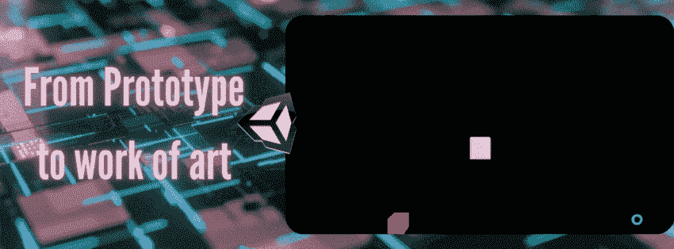

Unity 引擎允许用户直观地创建低成本的原语，这些原语可以完全由脚本提供动力和细节，从而实现简单的原型制作。这在游戏的前期制作阶段是非常重要的，这将在下一篇[文章](https://dennisse-pd.medium.com/pre-production-the-benefits-of-prototyping-without-assets-1883cd8eacb0)中探讨。现在，让我们来看看从原型到实际艺术作品的过渡过程！

# 从原型到 3D 艺术游戏资产

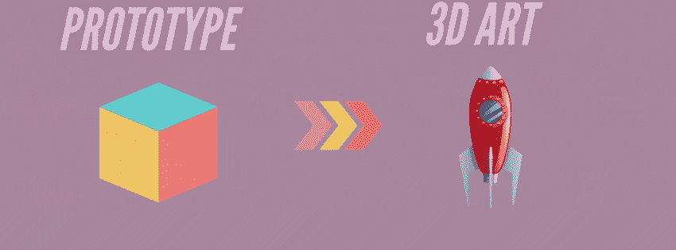

由于两个游戏对象都存在于三维空间中，因此所需的过程本质上是极简的。从原型到 3D 艺术游戏资源的转换就像附加行为脚本和替换原型一样简单。

1.  由于 Unity 的拖放系统，您可以轻松地将行为脚本附加到您的新游戏资产上，并获得与您编写原型时相同的结果。

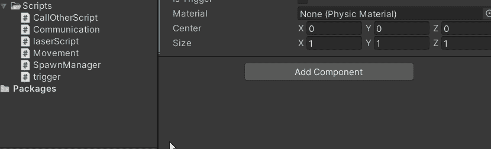

2.确保必要的组件如[刚体](https://dennisse-pd.medium.com/rigidbody-physics-in-unity-c8b616beb21b)和[碰撞器](/oncollisionenter-vs-ontriggerenter-when-to-use-them-56d42772dd22)也被添加到新资产中。

**注意**:你可能需要从你的刚体组件中取消“使用重力”,这取决于你的行为脚本是否使用它。

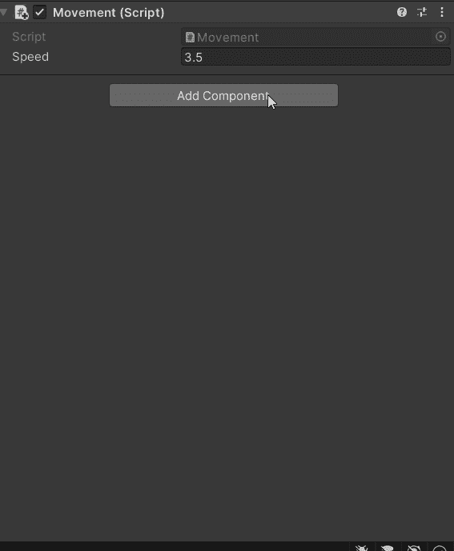

**并排行为比较**

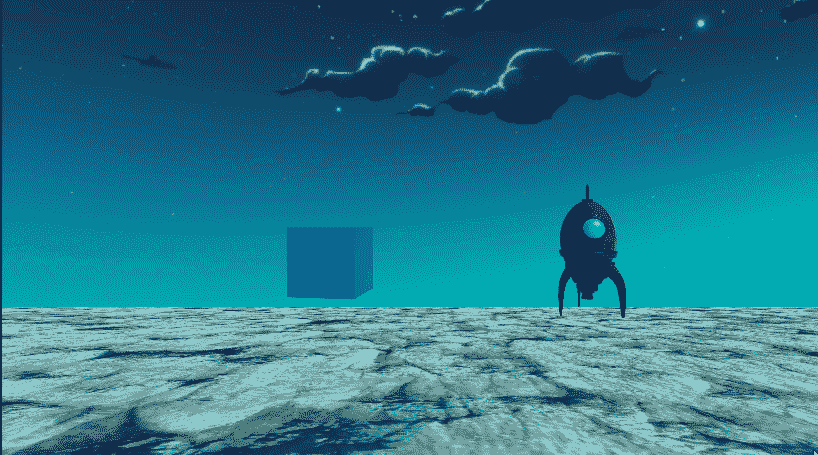

**注意**:根据你的对象的复杂程度，你可能需要做一些额外的微调，比如添加任何相关的动画。也就是说，代码将保持完整的功能，很少或没有变化。

# 从原型到 2D 精灵

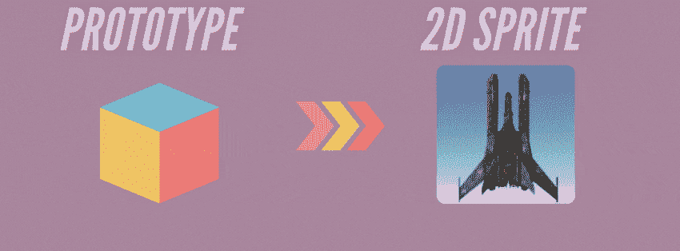

当从 3D 原型转换到 2D 精灵时，需要遵循一个多一点的过程。让我们一步一步来:

1.  将场景类型更改为 2D

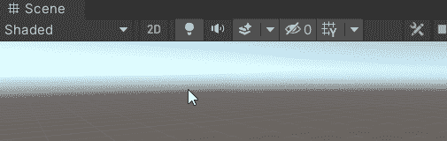

2.将精灵拖放到场景中，然后根据需要调整大小。

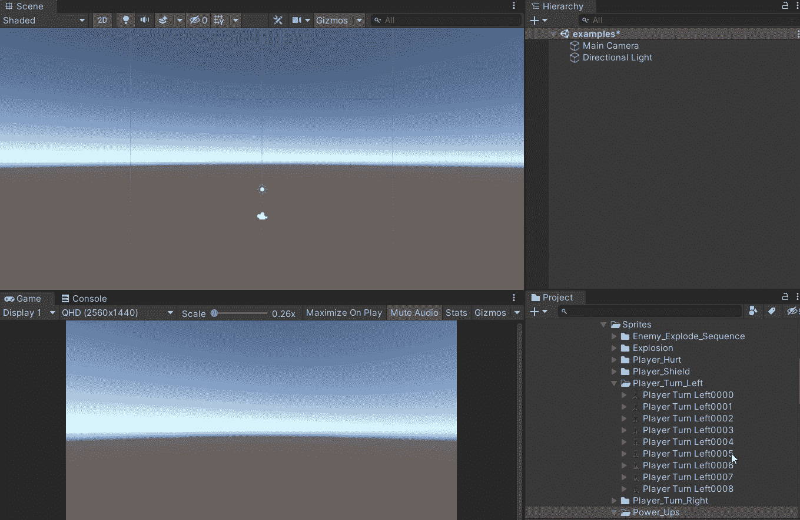

3.添加必要的组件，确保它们是 **2D 组件**。必要时，确保将刚体 2D 中的**重力刻度设置为 0。**

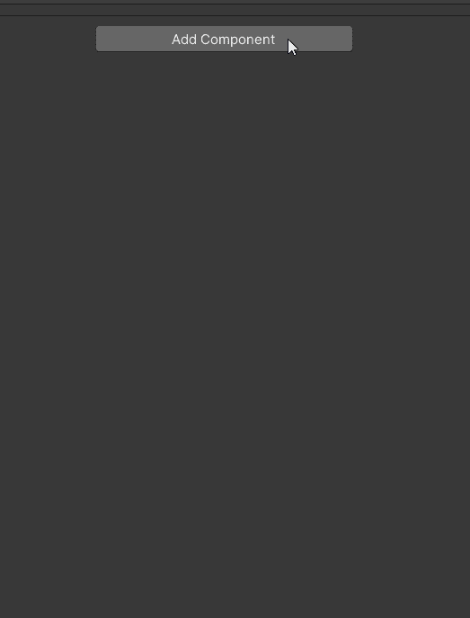

4.就像添加 2D 组件一样，您需要更改碰撞代码以匹配输入。这对引擎记录 [2D 物理碰撞是必不可少的。](https://docs.unity3d.com/ScriptReference/MonoBehaviour.OnCollisionEnter2D.html)

**由此**

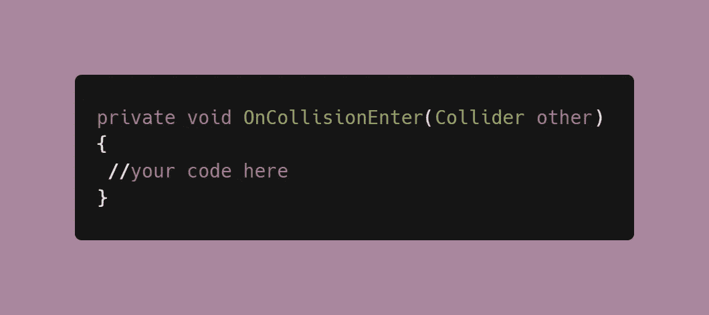

**到此**

有了所有的改变，你的精灵应该功能齐全，并遵循与原型相同的行为。

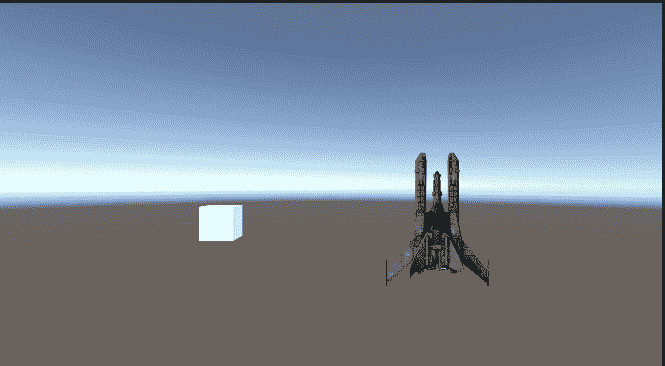

## 使用 2D 精灵时的图层

类似于 Photoshop，剪贴画工作室，和其他艺术软件，你需要留意层的位置。让我们来看看当你给游戏添加背景时会发生什么。

1.  通过拖放添加背景

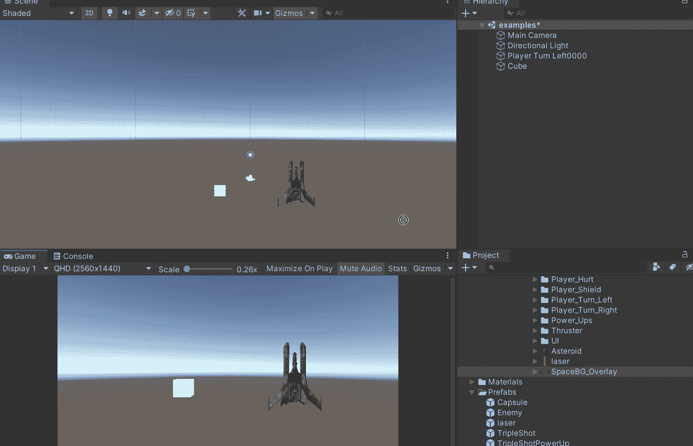

当你添加背景时，它会与你的其他游戏对象重叠。

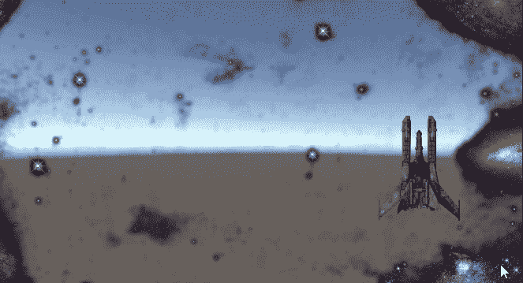

有一个简单的方法可以解决这个问题，那就是按照 [2D 排序](https://docs.unity3d.com/Manual/2DSorting.html)逻辑来组织你的层。Unity 优先渲染的方式是根据优先级顺序——列表中较低的**,靠近摄像机的**,或者堆栈中较高的**k******

1.  ****点击**背景**并为其创建一个图层。在我的例子中，我已经创建了一个背景层，但是你可以跟着做。****

****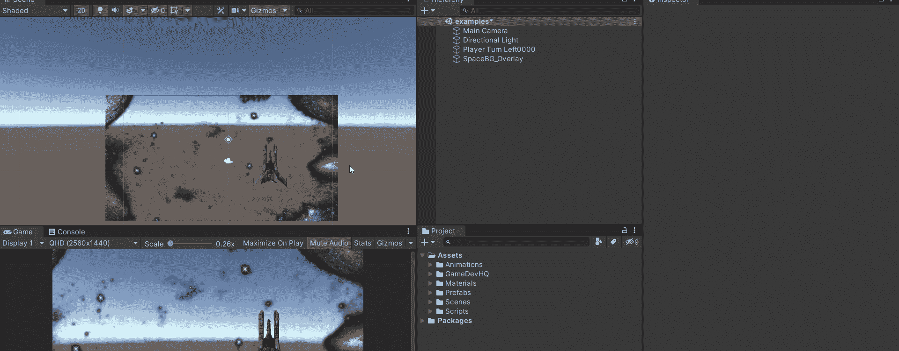****

****2.以同样的方式为你的精灵创建一个层。****

****现在，你有两层。一个用于需要在背景中渲染的所有内容，一个用于它上面的所有内容。它们必须按照各自的顺序。****

****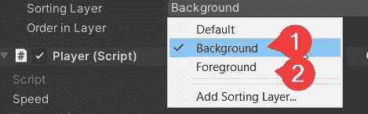****

****将所有元素分配给各自的层后，重叠是固定的。****

****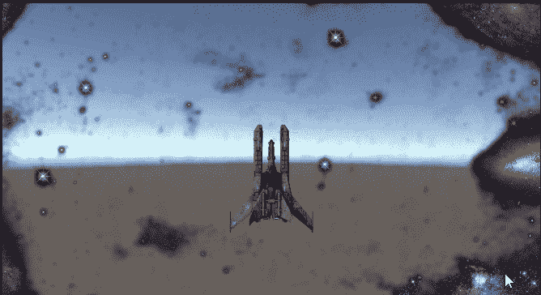****

****加入我的下一篇文章，我们将探讨原型在[预生产](https://dennisse-pd.medium.com/pre-production-the-benefits-of-prototyping-without-assets-1883cd8eacb0)中的重要性！****