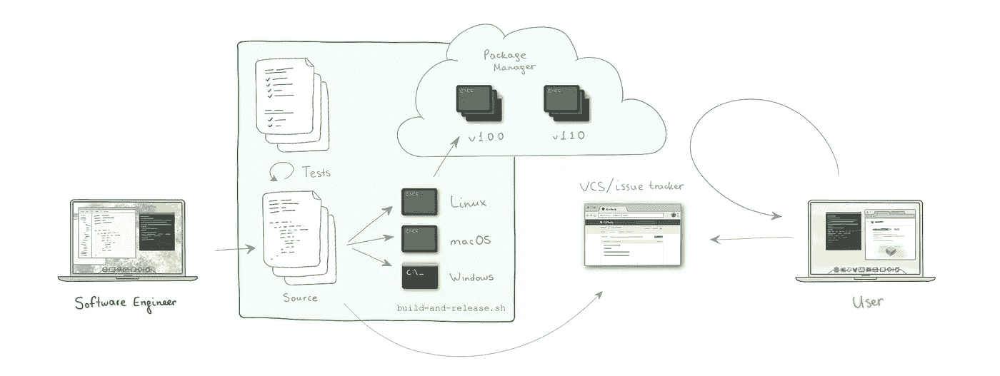

# 从来源到产品

> 原文：<https://levelup.gitconnected.com/from-sources-to-product-8b417f5ff2a0>

## 发布一个新的软件产品:一个玩具例子，或者如何发明一个持续集成系统

该软件产品是一个计算机程序。不仅如此，软件产品也是一种计算机程序，它会根据用户的反馈而变化。程序需要被创建，但是也必须做一些事情来允许反馈循环发生。这个故事探索了从源头到产品的技术步骤。

假设爱丽丝有一个程序的想法。一个命令行工具，它不断地学习你输入的内容，并自动给出建议，为你节省几秒钟宝贵的输入时间。或者一个分析你写的代码并给出设计模式建议的程序。或者用户启动的其他命令行程序，它在后台运行。

花了几个月编写代码，现在程序终于完成了。它编译、运行并做它应该做的事情。耶！我们应该到此为止吗？不完全是。我们的目标是给用户带来价值，在用户有办法获得我们的程序之前，我们还没有达到目标。

从来源开始

有些人确实检查源代码并自己构建软件，但是我们中的许多人更喜欢一种更方便的方法来下载和运行某种。exe 或二进制文件。所以程序必须被编译和汇编成可执行文件。我们的用户有可能在 Windows、macOS 和 Linux 上工作，所以我们应该为所有这些平台开发我们的程序。

构建可执行文件

构建完成了，但是我们还没有完成。**客户需要将程序安装到他们的电脑上**。如果他们去某个网站并点击“下载”按钮，或者在终端中运行一个命令来下载并解压缩它，或者使用一个包管理器来安装它，应该有一种方法来安装它。我们需要某种包管理器来存储我们的可执行文件(全部)，并让我们的用户得到程序。

向公众发布

现在我们技术上已经完成了。我们的程序就在那里，任何人都可以得到并使用它。然而，我们的目标是给用户带来价值，很少会出现软件的第一个版本是完美的，不需要任何修改。错误是不可避免的，小的改进可以显著改善用户体验，毕竟，我们可以更深入地了解用户如何使用我们的程序，并发现新的方式来提供价值。

一段时间后，我们从用户那里得到了压倒性的积极反馈，以及数十个功能请求。Alice 对此非常兴奋，她挑选了最受欢迎的功能并很快实现了它。现在她必须重新打包程序，并用新程序替换包管理器中的旧程序。没什么大不了的。但是我们即将推出大量的功能，所以我们会经常这么做。如果能有一些工具来帮助我们完成日常任务就好了。不要手动构建和运行打包和发布过程，而是让计算机为我们完成。*自动化* it。我们将编写一个用户永远看不到的程序，但是这将使我们的程序员的生活稍微轻松一些。在我们的例子中，这很简单——简单的 bash 脚本就可以做到。

自动化构建、打包和发布

除了新的功能需求，还有一些其他的东西——对于一些用户来说，我们的程序不能正常工作。Alice 查看最常见的投诉，修复它，并运行一个脚本来构建、打包和上传修复版本。现在最好让每个人都知道这个问题已经解决了，并且把这个问题的背景存储在某个地方。以防万一，如果以后有人(甚至可能是爱丽丝自己)会想为什么有一个“如果”声明。**如果能有一种方法来跟踪问题和管理我们的源代码就好了**。很高兴今天我们有免费的 GitHub / BitBucket，它给了我们开箱所需的东西。

Alice 继续处理特性请求，有一个特别有趣的请求，它极大地改变了程序的工作方式。我们可以继续我们通常的例行程序“编码—提交—发布”，但是这个变更不像以前做的其他变更。其他变化是修复和小的改进，但这一个需要用户重新学习一点程序如何工作。如果我们的一些用户已经编写了使用我们程序的工具会怎么样？这个更新会*打破*他们的设置！最终让每个人都使用新版本当然很好，但是我们必须给用户时间来迁移。所以我们需要**版本化**。幸运的是，包管理器已经拥有了支持版本控制所需的一切。Alice 应该只学习版本控制的最佳实践并配置它。

新版本获得了巨大的成功。在又一个修复小问题的版本发布后不久，Alice 收到了一个看起来极其熟悉的错误报告。这是一个发生在 Windows 平台上的错误，她已经修复了几次，但随着新功能的增加，它会一次又一次地出现。用户不得不反复体验和报告同一个问题，这是相当尴尬的。防止这种情况的唯一方法是在每个版本中测试该特性。但这并不是唯一一个可能重现 bug 的地方。如果软件可以自我测试不是很好吗？Alice 卷起袖子，为程序编写自动化测试，并将其与发布过程集成，以便在新版本通过所有测试之前不允许新的上传。

现在我们可以说这项工作更加“完整”了。很难说“完成了”，因为这是一个持续的过程。也许会有一天，软件会做它应该做的事情，任何新的东西都不应该作为功能添加，而是作为单独的程序创建，但这需要一些时间。

正如我们所看到的，在幕后发生了一些事情来持续改进我们的软件。对于在线服务来说，事情看起来会有一点点不同，但总体情况是一样的。

保持产品开发高速率的工具和实践通常被称为 *CI/CD:* [*连续集成&连续交付*](https://medium.com/@brenn.a.hill/noobs-guide-continuous-integration-continuous-delivery-continuous-deployment-d26ac4f2beeb) 。它作为一个物流网络和质量控制:它不应该花很长时间向用户提供修复和新功能，这些变化不应该破坏用户的系统。