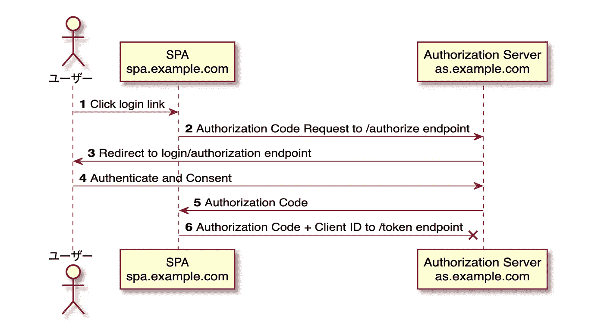
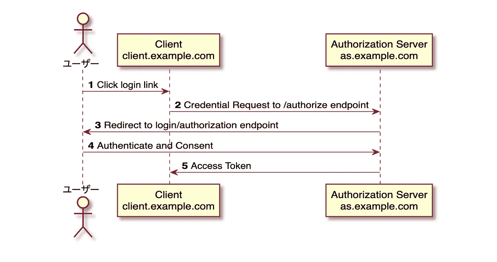
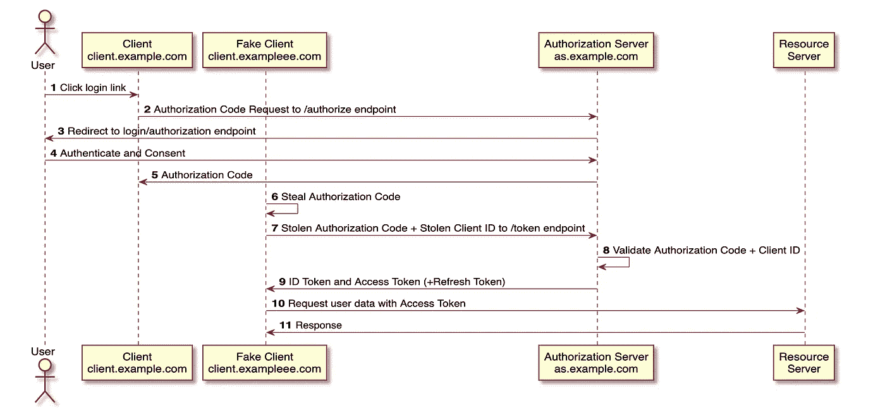
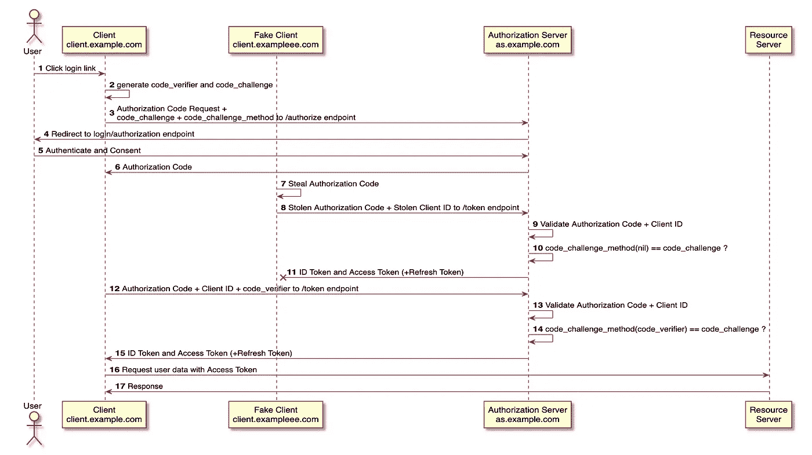

# 从隐式流程到 PKCE——面向 SPA 和移动应用的 OAuth 2.0

> 原文：<https://levelup.gitconnected.com/from-the-implicit-flow-to-pkce-oauth-2-0-for-spa-and-mobile-apps-df4343938053>

如何才能让 OAuth 流在单页面应用和移动 App 中安全？在本文中，让我们回顾一下在 2010 年实现这一点的传统方法，并看看它是如何演变成今天的最佳实践的。


图片由 [Unsplash](https://unsplash.com/photos/wh-RPfR_3_M?utm_source=unsplash&utm_medium=referral&utm_content=creditShareLink) 拍摄。

首先，你应该有一些关于 OAuth 和 OIDC 的背景知识，并且理解为什么说“通过 OAuth 登录”是不好的。我推荐以下资源:

*   在[越南](https://truongnmt.medium.com/nh%E1%BA%ADp-m%C3%B4n-oauth-v%C3%A0-openid-connect-e7875e60dda0)
*   在[英语](https://www.youtube.com/watch?v=996OiexHze0)

# 为什么会存在隐性流？

我们已经有了一个非常好的工作授权代码流程，为什么还要发明另一个流程呢？为什么 SPA 和手机 app 不用授权码流？

原来是不能的。首先，SPA 和移动应用程序是公共客户端，没有合适的方法来隐藏秘密，所以在这些类型的应用程序中没有存储客户端秘密，只有公共客户端 id。在授权代码交换步骤中，授权代码流需要客户端密码来向授权服务器验证其自身，但是由于公共客户端没有客户端密码，所以它不能这样做。

第二个原因是，在 2010 年，浏览器的工作方式与现在不同。Javascript 只能向加载页面的服务器发出请求([同源策略](https://developer.mozilla.org/en-US/docs/Web/Security/Same-origin_policy))。这个限制使得代码交换请求对于 SPA 来说是不可能的，因为授权服务器通常与部署的 Javascript 代码域在不同的域中。



由于同源策略，在步骤 6 中不允许 Javascript 的 POST 请求。

由于上述原因，授权码交换步骤无法在 SPA 和移动应用程序中工作，因此捷径是在浏览器的授权响应中返回访问令牌(步骤 5)。隐式流就是这样工作的。OAuth 2.0 推荐 SPA 的隐式流。

# 为什么不好？

隐式流程看起来超级简单，我们省略了授权代码交换步骤，但有什么问题吗？



如果你阅读我之前给你的资源，只是回顾一下，前通道中的返回访问令牌是不好的，因为前通道不是一个安全的环境，用户可以被诱骗安装一个恶意的浏览器扩展，它可以监听用户的网络或访问浏览器历史记录，或者只是简单地站在用户背后窥探令牌。

下面是 OAuth 2.0 安全最佳当前实践 RFC 关于隐式流的说法:

> *隐式授权(响应类型为“令牌”)和其他导致授权服务器在授权响应中发布接入令牌的响应类型容易出现接入令牌泄漏和接入令牌重放……*
> 
> *此外，由于在* [*章节 2.2*](https://datatracker.ietf.org/doc/html/draft-ietf-oauth-security-topics-18#section-2.2) *中推荐了
> ，因此不存在可行的机制来将授权响应中发布的访问
> 令牌加密绑定到某个客户端。这使得在资源服务器上不可能对这种
> 访问令牌进行重放检测。*

此外，在隐式流期间不发布刷新令牌。因此:

*   经常需要访问令牌万岁
*   当客户端需要额外的/新的令牌时，要么使用隐藏的 iframe 进行静默重定向(prompt=none ),要么必须将用户发送给 ID 提供者并重新认证用户。

虽然有所有这些风险，但隐性流动是当时唯一可能的方式。我们可以通过限制权限和使用短时令牌(通过静默重定向获得良好的 UX)来降低这些风险。那是当时人们通常的做法。(但是，我应该说，现在，SameSite=Lax 使带有隐藏 iframe 的静默重定向成为不可能)

如今，[【CORS】](https://developer.mozilla.org/en-US/docs/Web/HTTP/CORS)被浏览器广泛采用。CORS 为 JavaScript 提供了一种向不同域中的服务器发出请求的方式，只要目的地(IdP)允许。这开启了在 JavaScript 中使用授权代码流的可能性。

# 授权代码流

让我们看看如果我们只对公共客户端 SPA 使用授权代码流会发生什么。这里我们有一个序列图:



公共客户端授权代码流上的访问令牌劫持

假设用户的网络被监控，攻击者可以监听所有用户的请求。在步骤 4 中，用户登录到授权服务器后，授权码被返回。由于能够监听用户的网络活动，攻击者可以窃取授权码，其想法是在真正的用户这样做之前交换授权码。这实际上是可行的，因为对于公共客户端，授权服务器不会请求客户端机密来交换访问令牌。其他信息，如客户端 id、redirect_uri、范围等，都可以在对授权服务器的请求中检索到，攻击者可以获得所有需要的信息并伪造合法的令牌交换请求。

这就是为什么对于公众客户，建议使用 **PKCE** 。让我们看看如果我们在授权代码流之上添加 PKCE 会发生什么:



PKCE 的授权代码流

> *PKCE:密码交换的证明密钥*

(还要注意，在步骤 12 中，当设置应用程序时，客户端必须向授权服务器注册网站 URL，客户端将从该 URL 发出跨来源请求。)

在步骤 2 中，客户端生成 code_verifier 和 code_challenge，创建它的方法是选择一种单向散列方法，散列一个纯文本并得到一个散列字符串。

```
code_challenge_method(code_verifier) = code_challenge# which equivalent tohash_method(plain_text) = hash
```

客户端保存 code_verifier，并在步骤 3 的授权请求中发送 code _ challenge _ method code _ challenge。授权服务器将保存这两个值。

在令牌交换步骤中，授权服务器在步骤 12 中要求客户端提供 client_verifier，并通过在 code_verifier 上运行哈希方法来验证在步骤 3 中收到的 code_challenge，就像客户端在步骤 1 中所做的一样:

```
code_challenge_method(code_verifier) == code_challenge?
```

对于假客户端，它没有 code_verifier，所以验证会失败！！！这样，code_vefirier 就充当了一个临时的客户端秘密！

> 客户端必须防止攻击者将授权代码注入(重放)到授权响应中。**为此，公共客户必须使用 PKCE** [ [RFC7636](https://datatracker.ietf.org/doc/html/rfc7636) ]。对于机密客户，建议使用 PKCE [ [RFC7636](https://datatracker.ietf.org/doc/html/rfc7636) ]。

# 刷新公共客户端的令牌

使用授权代码流的一个好处是客户端可以拥有刷新令牌，这是一个非常强大的功能。如果泄露，可以无限期使用。因此，根据风险评估，授权服务器的策略决定是否在上面的步骤 15 中发布刷新令牌。

如果发布了刷新令牌，授权服务器需要通过以下方法小心地管理这些令牌以防恶意参与者:

*   受发件人约束的刷新令牌
*   刷新令牌循环

更多详细信息请参见第[节 OAuth 2.0 安全最佳当前实践 RFC #第 4.13.2 节](https://datatracker.ietf.org/doc/html/draft-ietf-oauth-security-topics-18#section-4.13.2)。

# 授权代码流是否使 SPA 完全安全？

在用户关闭应用程序并再次打开它后，我们不希望用户不得不再次启动该流程，这是非常糟糕的 UX。因此，在上面的步骤 17 中，在我们获得访问令牌之后，我们需要以某种方式存储它以供以后使用。

PKCE 的授权代码流确保访问令牌在传输过程中是安全的。然而，问题是我们如何存储这个访问令牌。无论我们使用隐式流程还是新推荐的流程，这个问题仍然存在。

所以答案是否定的，问题还是出在前通道，它无法存储秘密。最好的方法(目前)是将令牌管理完全放在 Javascript 之外，将授权代码流交给一个保密的客户端。

# 结论

希望你能大致了解为什么不推荐 SPA 和移动应用程序使用 Implicit Flow。在下一篇文章中，我将向您展示 SPA 和移动应用程序的安全最佳实践，敬请关注下一篇文章。^^

# 资源

*   [OAuth 2.0 安全最佳实践](https://oauth.net/2/oauth-best-practice/)(oauth.net)
*   【oauth.net】OAuth 2.0 隐式授权
*   [OAuth2 隐性资助和水疗](https://auth0.com/blog/oauth2-implicit-grant-and-spa/)(维托里奥·贝托奇)
*   [OAuth 2.0 隐式流死了吗？](https://developer.okta.com/blog/2019/05/01/is-the-oauth-implicit-flow-dead)(作者亚伦·帕雷基)
*   [为什么您应该停止使用 OAuth 隐式授权！](https://medium.com/oauth-2/why-you-should-stop-using-the-oauth-implicit-grant-2436ced1c926)(托尔斯滕·洛德斯特)

*感谢阅读本文！如果你有任何问题，请留言。如果你觉得这篇文章有帮助，请按住鼓掌按钮，让其他人也能发现。请务必在下面注册我的时事通讯，或者在 Medium 上关注我，以获得更多类似的文章。* ☝️👏 😄