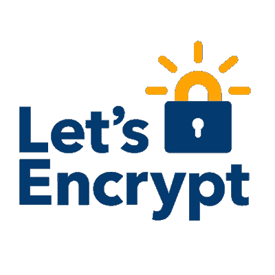
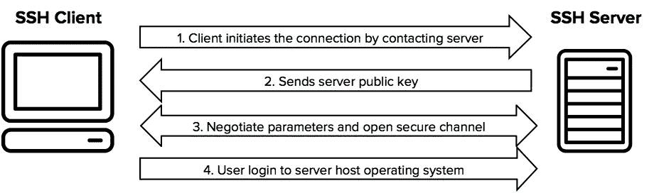

# 实践中的公钥加密

> 原文：<https://levelup.gitconnected.com/from-whence-we-come-security-edition-6f87cddc361>

## 我们从哪里来安全版

[上一次](https://medium.com/@eddiec76/from-whence-we-come-security-edition-f41137be9030)，我们了解了什么是公钥加密，以及它为什么如此重要。但我是一名开发人员，正忙于重要的计算机工作，需要知道这对我的生活有什么影响。我该如何在我的开发人员生活中使用这个奇妙的工具呢？众所周知，我的开发人员生活是非常繁忙和重要的。

# 端到端加密

如果你想不出一个案例，你只想在一端加密你的流量，在另一端解密，那么我担心你缺乏想象力。[这个家伙构建了一个基本的 messenger webapp](https://blog.patricktriest.com/building-an-encrypted-messenger-with-javascript/) 并用 [2048 位 RSA 密钥](https://en.wikipedia.org/wiki/RSA_(cryptosystem))对其进行加密，以演示开发者如何在他们自己的项目中实现强加密。即使你不做直接的事情，你也会在你的计算机生活中遇到公钥密码。例如:

# 超文本传输协议安全(HTTPS)

[HTTPS](https://https.cio.gov/faq/) 是[原始 HTTP 协议](https://en.wikipedia.org/wiki/Hypertext_Transfer_Protocol)的扩展，用于计算机网络上的安全通信。它创建于 1994 年，并于 2000 年获得正式规范。它使用[传输层安全](https://en.wikipedia.org/wiki/Transport_Layer_Security)在服务器和客户端之间建立安全连接；当客户端请求连接时，服务器用由私钥签名并由[认证机构](https://support.dnsimple.com/articles/what-is-certificate-authority/)验证的数字证书来标识自己。有趣的是，在服务器被验证之后，客户机和服务器交换一个会话密钥来加密和解密流量。这个，[你会记得](/from-whence-we-come-security-edition-f41137be9030)，就是[对称加密](https://en.wikipedia.org/wiki/Symmetric-key_algorithm)；客户端和服务器交换一个在会话结束时过期的共享密钥。

## 那又怎样？

[letsencrypt.org](https://letsencrypt.org/)

值得庆幸的是，典型的开发人员不需要关心 HTTPS 如何工作或者如何认证他们的网站。2014 年， [Let's Encrypt](https://letsencrypt.org/getting-started/) 宣布成立，这是一个非营利性、开放、便捷、[免费的 TLS 证书认证机构](https://www.howtogeek.com/howto/31717/what-do-the-phrases-free-speech-vs.-free-beer-really-mean/)。他们的[宣称的目标](https://letsencrypt.org/about/)是无处不在的网络服务器加密连接。真的没有借口不为你的网站设置 HTTPS 了。

# 安全外壳(SSH)

SSH 是一个安全运行网络服务的网络协议，比如远程登录和命令执行。

来自[ssh.com](https://www.ssh.com/ssh/protocol/#sec-How-does-the-SSH-protocol-work)

它用于在不安全的网络上建立客户端到服务器的安全通道。您通常通过在您的机器上生成一个密钥对来使用它，然后将公钥放在您(匹配私钥的所有者)想要访问的机器上。当然，在允许任何人访问之前，服务器需要验证公钥的所有者，但是这对于任何公钥系统都是必要的。

## 那又怎样？

这是远程管理系统的标准方式。例如，任何时候您想要传输、移动或删除远程服务器上的文件，您都需要 SSH。就个人而言，我最常用的 SSH 用例是[在我使用 GitHub 帐户的任何机器上集成本地 git 版本控制](https://help.github.com/en/articles/connecting-to-github-with-ssh)。当然，我可以通过 HTTPS 连接到 GitHub，但是每次我想远程推或拉任何东西，它都会提示我输入用户名和密码。又烦又没安全感；用 GitHub 设置 SSH 要好得多。

# JSON Web 令牌(JWT)

假设您有一个 webapp 后端，用于与数据库交互。它通过 API 提供前端服务。你不想让任何人访问你的 API，因为原因，所以如何管理你的前端到后端的认证和授权？输入 [JSON Web 令牌](https://jwt.io/)，或者 JWT ( [读作‘jot’](https://tools.ietf.org/html/rfc7519#section-1))。[jwt 非常适合在两个系统之间传递声明](https://jwt.io/introduction)，因为与 [SAML](https://www.varonis.com/blog/what-is-saml/) 相比，jwt 更紧凑，并且比 [SWT](https://lbadri.wordpress.com/2012/07/30/anatomy-of-a-simple-web-token-swt/) 更安全。

您可以对 jwt 进行对称编码，这对于小型应用程序来说很好，但是假设您有更大的想法，比如多个服务器上的多个服务都需要相互认证。要么你必须有一个到处共享的密钥(这不好)，要么你有一个专用的令牌生成和验证服务(这是一个性能瓶颈，也不好)。

好消息，各位！还有第三种选择:jwt 接受我们的老朋友 X.509 证书作为数字签名。这意味着你可以认证一个令牌而不泄露你的秘密。[这个家伙演示了](https://blog.miguelgrinberg.com/post/json-web-tokens-with-public-key-signatures)他如何用 Python 实现公钥加密的 jwt。

# 结论

作为一名开发人员，我一直在学习，因为在这个行业中不变的是变化。作为一名新兵训练营的毕业生，我总是在追赶，因为我没有四年的计算机科学来教我符号逻辑或大 O 符号的基础。我不是计算机科学家，也永远不会是，但是我想知道为什么我在学习用一种特殊的方式做一件事情。这让我更擅长我的工作。

*我在找工作！如果您或您的公司需要懂 React、JavaScript、Ruby 或 Rails 的人，我邀请您查看我的 LinkedIn 个人资料***。**