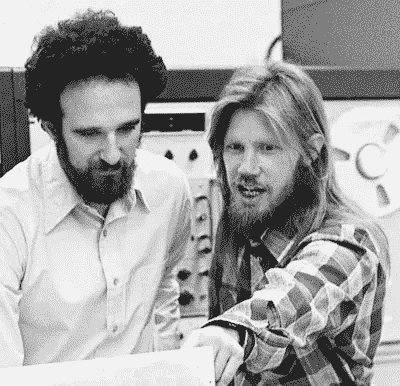
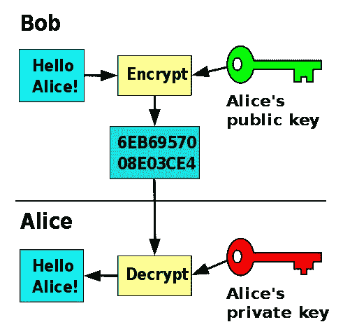
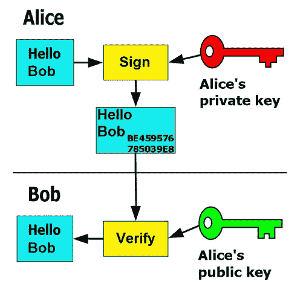

# 公钥密码学——我们从哪里来安全版

> 原文：<https://levelup.gitconnected.com/from-whence-we-come-security-edition-f41137be9030>

当互联网被发明的时候，安全是物理的:阻止坏人进入你的电脑所在的房间，你可能就没事了。网络安全不是一件事，因为新生的互联网上的每个人都互相认识。

然后互联网上市了。它成了各地人们相互联系的地方，否则人们就不可能见面。然而，问题是双重的:

1.  你如何证明你是你所说的那个人？
2.  当你不想让别人听你说的话时，你怎么让他们不听呢？

当然，解决方法和书写一样古老。这被称为[密码术](https://en.wikipedia.org/wiki/Cryptography)，对信息进行编码，因此只有你想读的人才可读。已知最早的用法是雕刻在埃及的石头上，可追溯到公元前 1900 年

千百年来，密码的复杂性不断增加，但在那段时间的大部分时间里，它们都有一个基本特征:发送方和接收方(比如鲍勃和爱丽丝)必须拥有相同的密钥来编码和解码消息。这被称为[对称加密](https://en.wikipedia.org/wiki/Symmetric-key_algorithm)，只要鲍勃和爱丽丝能在某个时候交换密钥，很可能是面对面，它就能正常工作。但是，假设鲍勃在英国，爱丽丝在澳大利亚，会发生什么呢？您不能以与要加密的邮件相同的格式发送密钥；如果你担心有人从邮箱里偷走你的锁箱，你就不要在邮箱里发送锁*的钥匙。*

赫尔曼和迪菲，1977 ( [*查克·佩因特/斯坦福新闻社*](https://news.stanford.edu/2016/03/01/turing-hellman-diffie-030116/) *)*

1976 年，Whitfield Diffie 和 Martin Hellman 发表了一篇论文，他们描述了一种让素未谋面的人进行私人通信的方法。他们可以共享秘密，而不必事先共享任何秘密。它被称为[公钥密码学](https://en.wikipedia.org/wiki/Public-key_cryptography)，它对现代生活的重要性不亚于网络浏览器的发明。

我不打算进入数学领域，但这个想法取决于陷门函数，在陷门函数中，计算一个方向很容易，但如果不进行强力猜测，计算另一个方向就很难。

密钥生成从一个大的随机数开始，该随机数被传递到密钥生成器中，生成一个公钥和一个私钥。公钥在更广泛的互联网上传播；它就在名字里。当 Bob 想给 Alice(也只有 Alice)发消息时，他用 Alice 的公钥加密；当用公钥加密时，只能用匹配的私钥解密。所以鲍勃知道只有爱丽丝能看到这条消息。

[CC BY-SA 4.0](https://creativecommons.org/licenses/by-sa/4.0/)BY[flippy link](https://commons.wikimedia.org/w/index.php?curid=70345628)

相反，Alice 可以用她的私钥加密消息，而只能用公钥解密。所以 Bob 知道如果 Alice 的公钥解密一条消息，那么这条消息实际上来自 Alice 私钥的所有者。这就是所谓的数字签名，它是用户和系统在互联网上证明他们身份的方式。

这段视频很好地解释了 Diffie 和 Hellman 是如何用隐喻和数学的方法来交换密钥的。

来自 YouTube 上的[问题艺术](https://www.youtube.com/channel/UCotwjyJnb-4KW7bmsOoLfkg)

然而，这样做的主要问题是证明你的身份。人们怎么知道你是上面有你名字的公钥的所有者呢？有几种方法可以实现[公钥基础设施](https://en.wikipedia.org/wiki/Public_key_infrastructure#Methods_of_certification)，在这里公钥可以被认证。

*   1988 年，发布了名为 [X.509](https://en.wikipedia.org/wiki/X.509) 的公钥证书标准，其中公钥和身份的关联由[认证机构](https://en.wikipedia.org/wiki/Certificate_authority)签名；这是 TLS/SSL 的基础，也是 HTTPS 的基础。
*   与 X.509 的中央分级授权模型相反，[信任网](https://en.wikipedia.org/wiki/Web_of_trust#Operation_of_a_web_of_trust)模型于 1992 年首次被描述，其中所有公钥证书都是自签名的，然后第三方证明它们的有效性。每个用户都是许多网站的一部分，因此一个网站的成员可以通过他们共有的人被另一个网站的成员验证。验证的人越多，公钥就越可信。

任何必须通过 SSH[连接到 GitHub 的人](https://help.github.com/en/articles/connecting-to-github-with-ssh)都使用过公钥加密。任何连接到`[https](https://www.howtogeek.com/181767/htg-explains-what-is-https-and-why-should-i-care/)`而不是`http`的人都使用过它，尽管是以一种更加自动化的方式。我伴随着互联网长大，我还记得那些狂野的日子，那时你可以成为你所说的任何人，匿名就是这样。然而，这不是做生意的方式，如果没有加密和数字签名，互联网永远不会发展起来。

下一次，我将讨论开发人员需要了解的关于公钥加密的知识，以及他们如何利用它。

*我在找工作！如果您或您的公司需要懂 React、JavaScript、Ruby 或 Rails 的人，我邀请您查看我的 LinkedIn 个人资料***。**