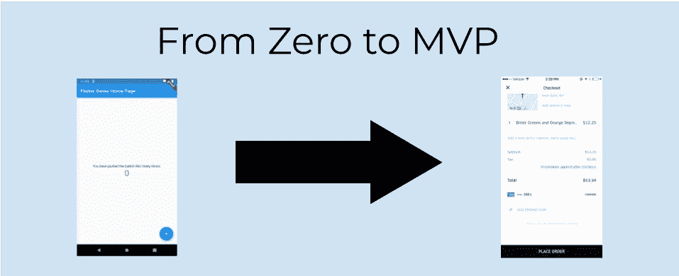
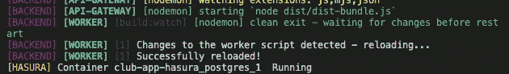

# 从零到 MVP:我用来快速构建应用的 3 个工具

> 原文：<https://levelup.gitconnected.com/from-zero-to-mvp-3-tools-i-use-to-build-apps-fast-f6438b575143>



上市时间对 MVP 至关重要:如果你花了一个多月的时间来构建(40 小时工作周)，它就不再是 MVP，而是一个产品。有时候，早花一个小时，晚省十个小时是值得的。

如果你想修改或添加什么，请不要犹豫，留下你的评论。我一直在寻求学习。

下面是我用来加快开发速度的 3 个工具。

## 1.邮递员

(我知道这个部分是对《邮差》的热情洋溢的评论——我没有得到赞助，这篇文章也没有。我只是觉得这是一个很棒的工具。)

Postman 在开发者社区中无处不在。我不知道有多少开发人员在没有它的情况下编写服务器端代码。它出色的用户界面和易用性使它成为调用 API 的最快方式。每当我启动我的应用程序时，当应用程序运行时，我会确保在另一个窗口打开 Postman，因为它会派上用场。

但是从我见过的所有使用 Postman 的开发者来看，几乎都只是使用了 Postman 的基本特性集。如果你只打开 postman 来发送 HTTP 请求，你就错过了它的一些最好的特性。

这不会是一个关于 Postman 的教程(如果你想要一个关于如何有效使用 Postman 的教程，请留下评论！)，但是我确实有一些特性，如果你想让自己成为一台 MVP 开发机器，你可能想看看。

**服务器嘲讽**

我最近的应用程序让我在后端花一秒钟之前就构建好了整个前端。我发现前端第一，对我来说，是要走的路:它帮助我跟随 YAGNI(你不会需要它)，因为我在后端建立的路线是*唯一的*我需要的路线:我的模型有我需要的数据，没有额外的，并且创建的功能是精简的，只做我要求它做的事情。

这里有一些开销，但是我认为快速开发的关键是在开发前花 10 分钟来节省 10 个小时。

**收藏**

邮差收藏有两大好处。第一个是调用 API 的便利性。如果您将调用您的(real！)后端，您不必担心进入您的 swagger 文档或计算出您需要的确切参数。

对我来说，我将我的身份验证路由添加到集合中，这为我节省了时间。我没有找到有效的 JWT，也没有每次都记住用户名和密码，而是打开 postman，点击集合中的路线，然后点击发送。嘣，有效通行令牌直接送到你手里。现在只需要将它保存为一个变量(至少在令牌过期之前)，现在您可以访问任何内容。

另一个大好处是与队友分享——如果你想让另一个开发者加入你的应用，你可以把你的收藏发给他们，包括对每条路线的评论、对整个收藏的注释等。它可以成为一个令人敬畏的知识来源。

**环境**

在生产、测试、本地、QA 等之间切换。环境从未如此简单。说够了。

## 2.GraphQL(哈苏拉，阿波罗等。)

再说一次——我们希望加快开发速度，如果 GraphQL 不是专门为此开发的，我会被诅咒的。

大多数应用都属于 CRUD 命名空间，即使没有(游戏、通讯)，你也可以保证在你的应用的某个地方有 CRUD 功能*。节省您为每个模型编写 PUT、GET、PATCH、POST、DELETE 路径的时间。REST 有一些主要的缺陷，即它的不灵活性。*

GraphQL 使得消费 API 的愚蠢变得容易。我使用 [Flutter Ferry](https://pub.dev/packages/ferry) (显然是专门针对 Flutter 的，但 Apollo 是大多数其他应用类型的类似客户端)我高兴不起来。能够跳过我的整个服务层，将一个`GqlConsumer`小部件直接添加到 UI 中，并且仍然保持一个干净的模式，这让我非常高兴。我节省了大量的时间和代码，因为我可以请求我想要的字段，而不必写出一个`/api/changeName/`路由和定义输入、功能、认证等。

使用 Ferry，我可以指定是否要进入缓存，或者是否要发出 API 请求。这很有帮助，因为我不需要本地缓存层——Ferry 为我们构建了它。我曾经是 SQLite 本地缓存的拥护者，现在仍然是很多事情的拥护者，但是在完全理解了 GraphQL 本地缓存之后，我完全抛弃了它。GraphQL 用一半的代码就完成了我用 Moor 做的所有事情。我不需要存储库层——我只需要用`.cacheOnly`进行查询，而不必手动进行任何缓存。

GraphQL 也有助于文档化:描述整个模式的单一路径有助于任何希望添加新开发人员或记住他们昨晚做了什么的人更加容易。

但是，如果您从头开始编写 GraphQL 后端，我可以看到这是一个巨大的麻烦。如果你打算走这条路，我推荐使用阿波罗或哈苏拉(我用的)——它会节省你几个小时。如果你想廉价地构建你的 MVP，Hasura 是开源的，你可以在 Heroku 上免费运行它。

## 3.单一报告

好吧，这与其说是一种工具，不如说是一种设计模式——但是请听我说。

我把我所有的代码都放在一个 mono repo 里。我的回购看起来像这样:

```
App
 | - API gateway
 | - Lambdas (actually Cloudflare Workers but they are less known)
 | - Hasura
 | - Frontend
```

我在每个子目录中都有一个 Makefile，包含以下两个命令:

*   运行:在本地运行应用程序
*   进行测试:测试应用程序

这有两大好处:

**App 启动速度**

在`App`目录中，该 Makefile 使用 npm [并发运行所有其他 Makefile](https://www.npmjs.com/package/concurrently)。这是其中的一个片段:



您可以看到，我将每个进程放在它自己的颜色括号中(即`[WORKER]`)(为了便于跟踪，我已经记住了这些颜色)，因此不难看出哪里发生了什么错误。

这样做的真正好处是启动应用程序的速度。我每次在根目录下做`make run`都会起鸡皮疙瘩。现代应用是高度分布式的。不管你喜不喜欢，你至少在为你的应用运行*一个 s3 木桶。您不必担心启动应用程序需要 15 分钟。如果你是一个斗志昂扬的 MVP 开发者，你一有机会就会开发——可能是在你在家休息的 30 分钟时间里。你不应该花一半的时间来启动你的应用。*

***CI/CD***

*用这个系统建立一个管道是非常简单的。如果您只对应用程序的一个部分进行更改，那么在每次推送时测试和部署应用程序的每个部分可能有点浪费，但是您可以获得一些高级 Github 动作脚本，该脚本只在某些文件夹发生更改时运行动作。对我来说，我让我的 github 操作运行我的`make test`,然后在每次推送时部署。*

*我确实认为 MVP 需要测试和 CI/CD。只需要几天时间就可以设置一些简单的东西。bug 对 MVP 来说是致命的，如果他们看到一个致命的 bug，就会拒绝用户——测试是必要的。对于无法通过测试发现的错误:你希望能够尽快部署更改，这样，如果用户在凌晨 2 点打电话给你，说有一个错误不允许他们使用应用程序，你可以在几分钟内做出更改并部署它，而不是几个小时。*

***组织利益***

*我只需在 VSCode 中打开我的 monorepo，然后开始破解。不需要打开许多窗口或项目——如果我想进行前端更改，我只需打开该文件夹并进行更改。如果我想进行后端更改，同样的过程适用。*

*原来如此！我用来提高开发速度的 3 个工具。*

*再说一次，我也很想听听你的建议。如果你认为我能做得更好，请告诉我！如果有我应该知道的流程或计划，请告诉我！*

*感谢阅读。*