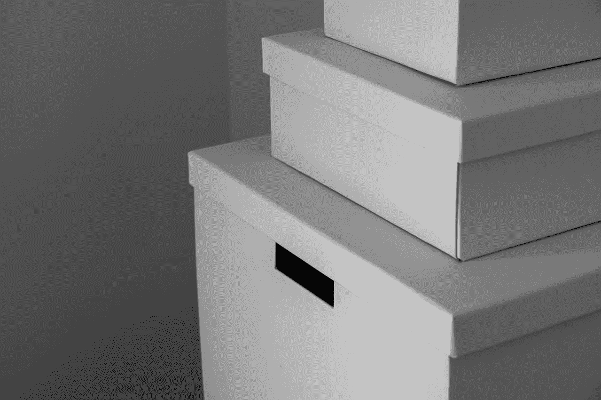
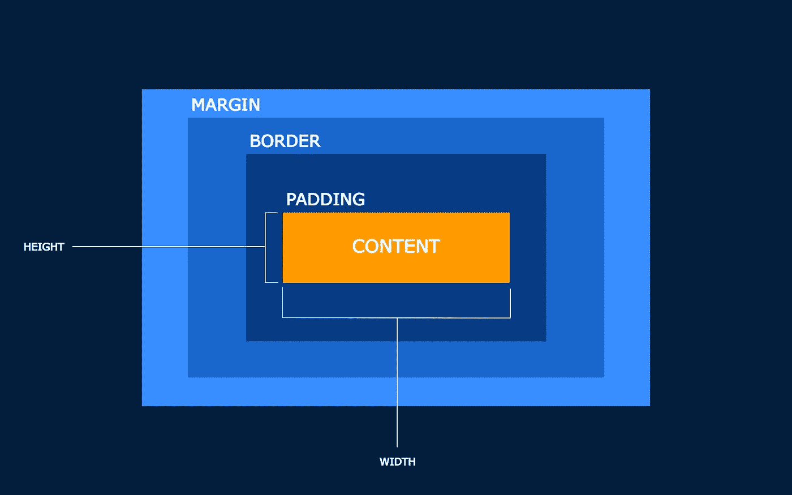
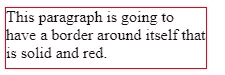
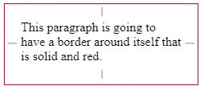
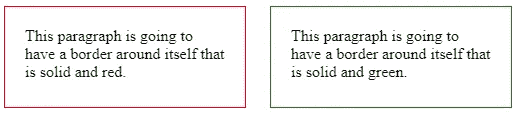

# 前端:箱式建模 101

> 原文：<https://levelup.gitconnected.com/front-end-box-modeling-101-3e4be4f4a282>



由[废弃库存](https://www.pexels.com/@castorlystock)

盒子模型可能是需要学习的最重要的 CSS 基础之一。浏览器以默认位置加载 HTML 元素，网页上的所有元素都被浏览器视为“生活在一个盒子里”。

例如，如果我们改变 h1 元素的背景颜色。然后改变 h1 元素所在的盒子的实际颜色。

盒子模型可能看起来有点混乱，但是通过正确的练习和阅读，你可以主宰这个主题！



被我

盒子模型包含了一组属性，这些属性描述了在网页中占据空间的元素的各个部分。该模型包含内容区域的大小，如*的宽度*和*的高度、内容、填充、边框和边距。*宽度和高度是内容区域的一部分，内容区域是实际的元素本身。当你走出盒子时，你会遇到更多的盒子，稍后我会解释。

# 宽度和高度

```
p{
  height: 60px;
  width: 200px;
}
```

只是一个宽度和高度的快速纲要。这些属性使用 *px* 设置元素的基本大小，这将分别设置所有设备的大小。

我将简短地解释一下什么是*边框、填充和边距*。边框非常简单，你可以在你的元素周围设置一条风格化的线条。

# 边境

```
//HTML<p>This paragraph is going to have a border around itself that is solid and red.</p>____________________________________________________________________/CSSp{
  height: 60px;
  width: 200px;
  border: solid 1px red;
}
```



边界结果

使用前面的演示，我们在段落周围添加了一个边框。在填充和边距之间，人们似乎对这两个属性有点混淆。简单来说，如果我们看看什么是填充。实际内容本身和框架之间有相当大的空间。不同于边距，边距用于在实际元素之间或其周围创建与其他元素隔开的框架之外的空间。

# 填料

```
//HTML<p>This paragraph is going to have a border around itself that is solid and red.</p>____________________________________________________________________//CSSp{
  height: 60px;
  width: 200px;
  border: solid 1px red;
  padding: 20px;
}
```



填充结果

如果您在使用速记方法添加填充后查看一下。您可以在这里输入顺时针方向的值。添加属性后，您会注意到内容“图片”现在在自身和边框“框架”之间有了空间。除此之外，您还可以在元素周围创建远离其他元素的边距。

# 边缘

```
//HTML<p>This paragraph is going to have a border around itself that is solid and red.</p><p class="green">This paragraph is going to have a border around itself that is solid and green.</p>____________________________________________________________________//CSS.red{
  height: 60px;
  width: 200px;
  border: solid 1px red;
  padding: 20px;
  margin-right: 10px;
}.green{
  height: 60px;
  width: 200px;
  border: solid 1px green;
  padding: 20px;
  margin-left: 10px;
}
```



毛利结果

此外，在两个元素之间添加了一个边距，以在彼此之间创建空间。这两者之间的空间累积起来。这意味着红色边框内容和绿色边框内容中的*右边距:10px 和左边距:10px* 将合计为 20px。

还有更多关于利润的解释，可能会有点复杂，我会在我的另一篇[中期文章](https://medium.com/@artistdev/font-end-margin-collapse-c54cceba8b01)中谈到。