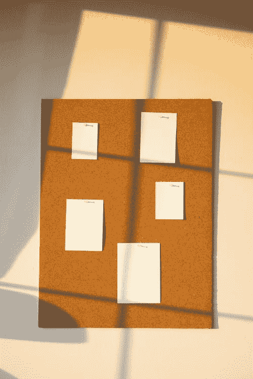
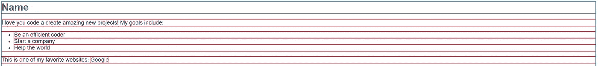
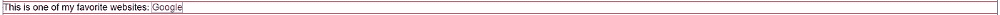
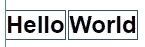
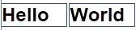

# 前端:显示效果布局

> 原文：<https://levelup.gitconnected.com/front-end-display-effects-layout-17e3203f018d>



安娜·涅克拉舍维奇

在页面上显示你的内容和它的位置有点不同。在 CSS 中，属性 *display* 是用来设计网页样式的最简单的属性之一。属性允许您控制元素在文档中垂直和水平排列的方式。

默认情况下，您的网页显示大部分内容，如标题文本和段落文本，这些内容被称为块级内容。这是根据从上到下书写的元素读取文档的位置。控制这一点的方法是使用*显示*属性。

我来说说这个 CSS 属性的本质中常用的 4 个主要值: *none* 、 *block* 、 *inline* 和 *inline-block* 。这些价值中的大部分只是相互叠加，为它们创造了不同的用途。除了 *none* value 之外，我将在演讲中省略它，因为它完全将你的元素从视野中移除。

# 街区

正如我之前提到的，block-level 或 *block* 值将你的元素设置为具有一个占据你的网页的整个部分的完整的框。



上图描绘了一个 block 元素在 web 浏览器中的样子。看这个图片，每个元素都在它自己的部分保留空间，在元素周围创建一个完整的框，包括右边的空白空间！您还可以手动调整块级元素的高度和宽度。

# 在一条直线上的

在这篇文章的 block 部分给出的图片中，你可以看到句子“这是我最喜欢的网站之一:Google。”谷歌这个词有自己的包装，并没有占据整个版面。这是因为锚标签**<>**元素默认为*内联*显示属性值。



当使用 *inline* 值时，它通常会缩小元素周围的框，并在网页内显示为一个< span >元素，但是高度和宽度属性不会影响 inline 属性。

# 内嵌块

从内联到块。 *inline-block* 为您提供了设置宽度和高度的一体化用法，但也可以彼此相邻出现，并且不会占用它们的整个容器宽度。

例如，如果您在网页上单独使用两个 h2 元素“Hello”和“World ”,并将 inline-block 值应用于 h2 标记的 display 属性，那么它将导致这两个元素并排出现。

```
//HTML<h2>Hello</h2><h2>World</h2>____________________________________________________________________//CSSh2{display: inline-block;}
```



这就是例子中所说的结果。假设您要自定义宽度，这可能是另一个输出:

> h2{
> 显示:直列-块；
> **宽度:80px**
> }



你如何显示你的网页的结果真的可以改变。如果内容总是按照文档要求的方式显示，并不是每个网站都好看。因此，display 属性提供了一种方式，使内容以一种独特的方式更具展示性，而不是枯燥的从上到下没有水平或垂直变化的旧文档。