# 前端:柔性盒第 1 部分

> 原文：<https://levelup.gitconnected.com/front-end-flexboxes-part-1-c82ad6427962>

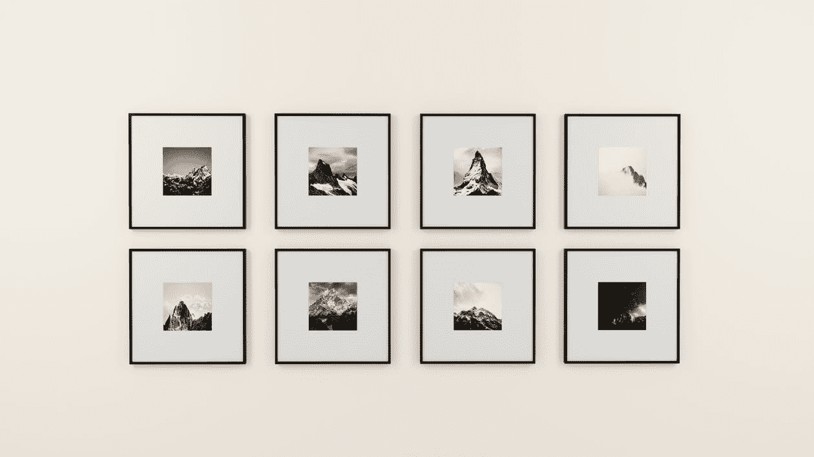

[梅德哈·伊亚德](https://www.pexels.com/@medhat-ayad-122846/)

当你为你的网站创造响应度的时候，它可能看起来很多。对此的一个很好的介绍叫做 flexbox(s)。当根据屏幕大小在屏幕上排列项目时，这些简单的框非常有用。CSS 保持干净和简单，没有任何额外的复杂性，如媒体查询。

起初，flexboxes 可能看起来超级复杂，但是，通过一点实践和一些解释，你应该准备好用一些新的和改进的布局来处理你的下一个项目！

# 为容器上的显示属性声明 flex

首先，在创建 flexbox 时，你通常会设置一个类容器，类似于一个 div 元素，这样你就可以把你的元素组合在一起。为了使 flexbox 的所有元素或项目具有弹性。在 CSS 类或称为容器的 div 父类的 id 上使用 *display: flex* 属性和值。这为您的 flex 项目奠定了基础，使您能够按照您希望的方式动态调整内容布局。

下面是将 *flex* 值添加到 CSS 中的显示属性之前的项目。

```
//HTML<div class="container">
  <div class="left"></div>
  <div class="center"></div>
  <div class="right"></div>
</div>____________________________________________________________________//CSS.container{
  background-color: #1c1d21;
}.left, .right, .center{
  background-color: #0cf574;
  height: 75px;
  width: 100px;
  border: 2px solid #3587a4;
}
```

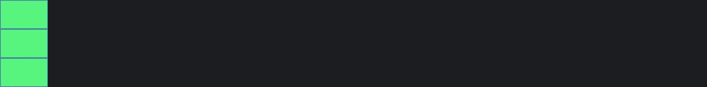

将 display *flex* 值添加到 div 容器类后，父 div 容器中的项目将变成一个单独的行，而不是它们自己行中的块元素。

> 。容器{
> 背景色:粉色；
> ***显示:flex←* (显示 flex 属性和添加的 flex 值)**
> }
> 
> 。框{
> 背景色:青色
> }

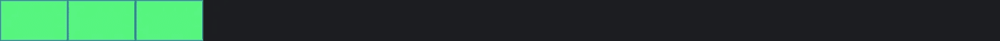

请注意，当您将 *flex* 值添加到 *display* 属性时，容器内的项目现在位于一行中。

# 与显示值 flex 一起使用的属性

当使用容器在网页中创建 flex 布局时，在构建 flexboxes 时使用了 8 个主要属性。在这篇文章中，我将只讨论前 4 个。

1.  **自圆其说-内容**
2.  **对齐项目**
3.  **弯曲方向**
4.  **订单**
5.  自我对齐
6.  柔性包装
7.  柔性流
8.  对齐内容

# 调整内容

justify-content 属性用于获取 flex 容器内的项目，并沿主轴(也称为 x 轴或水平轴)为容器内的项目创建空间。使用此属性，您可以从项目之间、项目周围、项目之前或项目之后在 flex 项目周围创建空间。

justify-content 属性中使用的值有:

1.  flex-start( **默认值** ) -将所有 flex 项设置在最左边，没有多余的空格。
2.  flex-end -将所有 flex 项目设置在最右边，没有多余的空间。
3.  居中-将所有项目水平对齐到页面中央。
4.  间距-在所有伸缩项之间均匀分布间距，在开始和结束处没有多余的间距。
5.  周围空间-最终在所有元素周围分配空间。

这是与 justify-content 属性一起使用的 5 个主要值。使用此属性，默认情况下，其每个值都会唯一地动态水平更改内容。

对于 *justify-content* 的每个值，当将 *flex* 值声明到 *display* 属性时，我将使用与前面相同的 HTML 给出内容发生了什么的可视化表示。

```
//HTML<div class="container">
  <div class="left"></div>
  <div class="center"></div>
  <div class="right"></div>
</div>
```

> *。容器{
> 背景色:粉色；
> 显示:flex* ***justify-content:flex-start；*** ← **默认值** *}*
> 
> *。方框{
> 背景色:青色
> }*

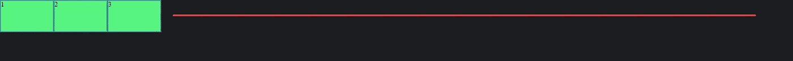

> *。容器{
> 背景色:粉色；
> 显示:flex* ***justify-content:flex-end；*** *}*
> 
> *。方框{
> 背景色:青色
> }*

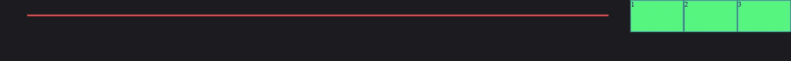

> *。容器{
> 背景色:粉色；
> 显示:flex* ***justify-content:居中；*** *}*
> 
> *。方框{
> 背景色:青色
> }*

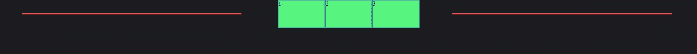

> *。容器{
> 背景色:粉色；
> 显示:flex* ***justify-content:space-between；*** *}*
> 
> *。框{
> 背景色:青色
> }*

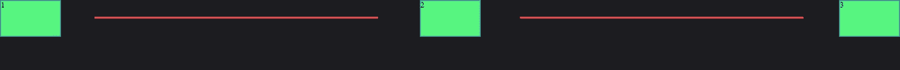

> *。容器{
> 背景色:粉色；
> 显示:flex* ***justify-content:space-around；*** *}*
> 
> *。框{
> 背景色:青色
> }*

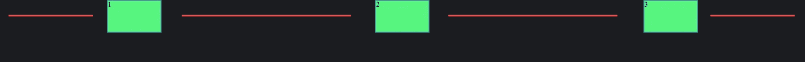

# 对齐-项目

*align-items* 属性用于沿横轴(也称为 y 轴或垂直轴)分隔项目。使得从上到下调整项目变得更加容易！

容器的高度设置为 150 像素，子类项目的高度设置为 75 像素，您将在下面的演示中看到使用其值的 *align-items* 属性:

1.  flex-start - Value 将所有项目与容器顶部对齐。
2.  flex-end - Value 将所有项与容器底部对齐。
3.  居中-将所有项目垂直居中对齐。
4.  baseline -将元素与父元素的基线对齐。
5.  拉伸-如果没有*高度*限制，并且父元素高度大于 flex 项目高度，则项目将拉伸以垂直填充整个容器。

使用和以前一样的 HTML，我将用粗体显示 CSS 代码的变化和增加。我使用 *justify-content* 来保持所有的项目对齐中心，以获得更清晰的图片。

```
//HTML<div class="container">
  <div class="left"></div>
  <div class="center"></div>
  <div class="right"></div>
</div>
```

> *。容器{
> 背景色:# 1c1d21
> 显示:flex
> 身高:150px
> justify-content:居中；* ***align-items:flex-start；*** ← **默认值***}*
> 
> *。左，。对。中心{
> 背景色:# 0cf574
> 身高:75px
> 宽度:100px
> 边框:2px 实心# 3587a4
> }*

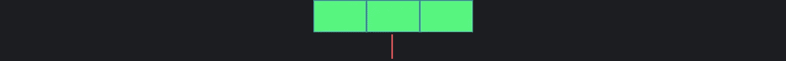

> *。容器{
> 背景色:# 1c1d21
> 显示:flex
> 高度:150px
> justify-content:居中；* ***align-items:flex-end；*** *}*
> 
> *。左，。对。中心{
> 背景色:# 0cf574
> 身高:75px
> 宽度:100px
> 边框:2px 实心# 3587a4
> }*

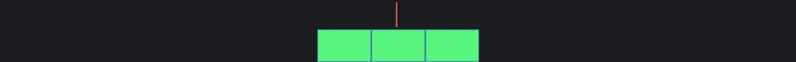

> *。容器{
> 背景色:# 1c1d21
> 显示:flex
> 高度:150px
> justify-content:居中；* ***对齐-项目:居中；
> T56***}
> 
> *。左，。对。中心{
> 背景色:# 0cf574
> 身高:75px
> 宽度:100px
> 边框:2px 实心# 3587a4
> }*

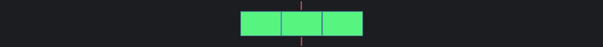

> *。容器{
> 背景色:# 1c1d21
> 显示:flex
> 高度:150px
> justify-content:center；* ***对齐-项目:基线；*** *}*
> 
> *。左，。对。中心{
> 背景色:# 0cf574
> 身高:75px
> 宽度:100px
> 边框:2px 实心# 3587a4
> }*
> 
> ***。集装箱。中心{
> 高度:100px
> 边框:5px 纯色# ed254e
> }***

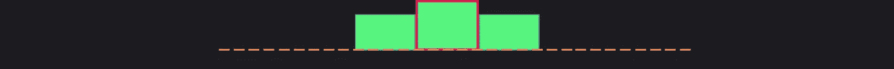

> *。容器{
> 背景色:# 1c1d21
> 显示:flex
> 高度:150px
> justify-content:center；* ***对齐-项目:拉伸；*** *}*
> 
> *。左，。对。中心{
> 背景色:# 0cf574* ***最小高度:75px*** *宽度:100px
> 边框:2px 实心# 3587a4
> }*

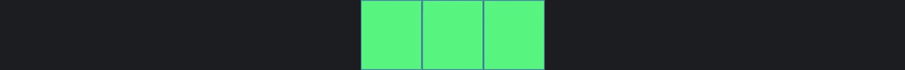

将*高度*设置为*最小高度*的原因是因为*高度*属性单独设置项目的永久高度。不像*最小高度*规定的在调整屏幕时，物体将要到达的**最小高度**是 75px **不能比这个小，并且**不能超过 75px** ，因为没有**最大高度设置**。**

# 弯曲方向

*伸缩方向*的属性非常简单，如属性名**方向**所示。

这用于改变项目的流动方向。物品只有两种流动方式，垂直和水平。

该属性使用 4 个主要值:

1.  row( **默认值** ) -按照常规顺序(第一个元素到最后一个元素)，从容器的*起点* ( **到最左边**)水平对齐项目。
2.  row-reverse -从容器的*端* ( **到最右边的**)以**相反的顺序** ( **最后一个元素第一个到第一个元素最后一个**)水平对齐项目。
3.  列-以**常规顺序(第一个元素到最后一个元素)**从容器的顶部到底部垂直对齐项目。
4.  column-reverse -按照**逆序** ( **最后一个元素到第一个元素最后一个**)从容器的顶部到底部垂直对齐项目。

在一个简单的例子中总结反向值:

> “假设您的集装箱中有来自**1–5**的箱子，然后您想要倒排。你基本上是拿着这些物品，**向后数 5–1**，因为所有的物品都被移动到容器的**端**(**最右边**)。”

这同样适用于*列-反向*，除了元件被推到容器的底部并且**被垂直设置**，物品向后计数。

```
//HTML<div class="container">
  <div class="left">1</div>
  <div class="center">2</div>
  <div class="right">3</div>
</div>
```

> *。容器{
> 背景色:# 1c1d21
> 显示:flex
> 高度:300px* ***伸缩方向:行；*******默认值*** *}**
> 
> **。左，。对。中心{
> 背景色:# 0cf574
> 身高:75px
> 宽度:125px
> 边框:2px 实心# 3587a4
> }**

*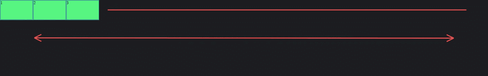*

> **。容器{
> 背景色:# 1c1d21
> 显示:flex
> 高度:300px* ***flex-方向:行-反转；*** *}**
> 
> **。左，。对。中心{
> 背景色:# 0cf574
> 身高:75px
> 宽度:125px
> 边框:2px 实心# 3587a4
> }**

*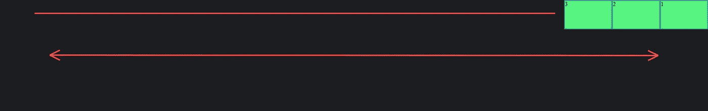*

> **。容器{
> 背景色:# 1c1d21
> 显示:flex
> 高度:300px* ***伸缩方向:列；*** *}**
> 
> **。左，。对。中心{
> 背景色:# 0cf574
> 身高:75px
> 宽度:125px
> 边框:2px 实心# 3587a4
> }**

*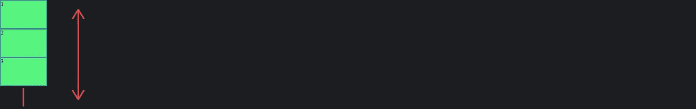*

> **。容器{
> 背景色:# 1c1d21
> 显示:flex
> 高度:300px* ***flex-方向:列-反转；*** *}**
> 
> **。左，。对。中心{
> 背景色:# 0cf574
> 身高:75px
> 宽度:125px
> 边框:2px 实心# 3587a4
> }**

*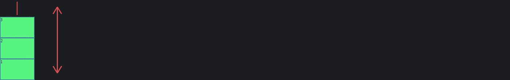*

*你会注意到高度设置为 300 像素，这是为了更清晰的图像。*

# *命令*

*在 flexbox 容器中，使用 *order* 属性很容易对元素进行排序。*

*它的使用方法是，实际上为您想要按顺序向前或向后设置的特定项目添加某种类。当设置*顺序*时，它基本上改变了项目所在的 HTML 顺序，但这是通过 CSS 完成的。*

> **//HTML**
> 
> **<div class = " container ">
> <div class = " left ">1</div class = " center****黄色****">2</div****←*(添加了一个名为黄色的类)***
> 
> ****//CSS****
> 
> ***。容器{
> 背景色:# 1c1d21
> 显示:flex
> 高度:300px
> }***
> 
> ***。左，。对。中心{
> 背景色:# 0cf574
> 身高:75px
> 宽度:125px
> 边框:2px 实心# 3587a4
> }***
> 
> *****。黄色{* ←(调用 CSS 中的黄色类) *背景色:黄色；* ←(将背景色改为黄色) *}*****

**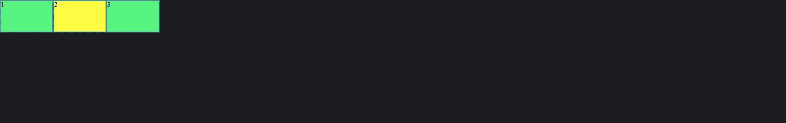**

**上图中，我们将颜色改为黄色，以区分我们重新订购的商品和将随订单变化的商品之间的区别。**

> ***。容器{
> 背景色:# 1c1d21
> 显示:flex
> 高度:300px
> }***
> 
> ***。左，。对。中心{
> 背景色:# 0cf574
> 身高:75px
> 宽度:125px
> 边框:2px 纯色# 3587a4
> }***
> 
> ***。黄色{
> 背景色:黄色；* ***顺序:1；********(添加顺序属性和值之一)** *}******

**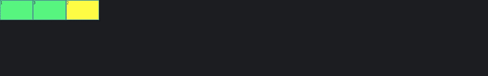**

**当您需要重新订购 flex 产品时，它非常简单易用。这可能是因为有其他 flex 属性妨碍了项目的顺序。**

**随着第 2 部分的开始，我希望这篇文章不仅有趣，而且是另一个有用的可视化文档来源！如果您想查看本文中提到的以下每个属性，您可以在这里列出的 MDN 文档中找到每个属性的链接: [justify-content](https://developer.mozilla.org/en-US/docs/Web/CSS/justify-content) 、 [align-items](https://developer.mozilla.org/en-US/docs/Web/CSS/align-items) 、 [flex-direction](https://developer.mozilla.org/en-US/docs/Web/CSS/flex-direction) 和 [order](https://developer.mozilla.org/en-US/docs/Web/CSS/order) 。**