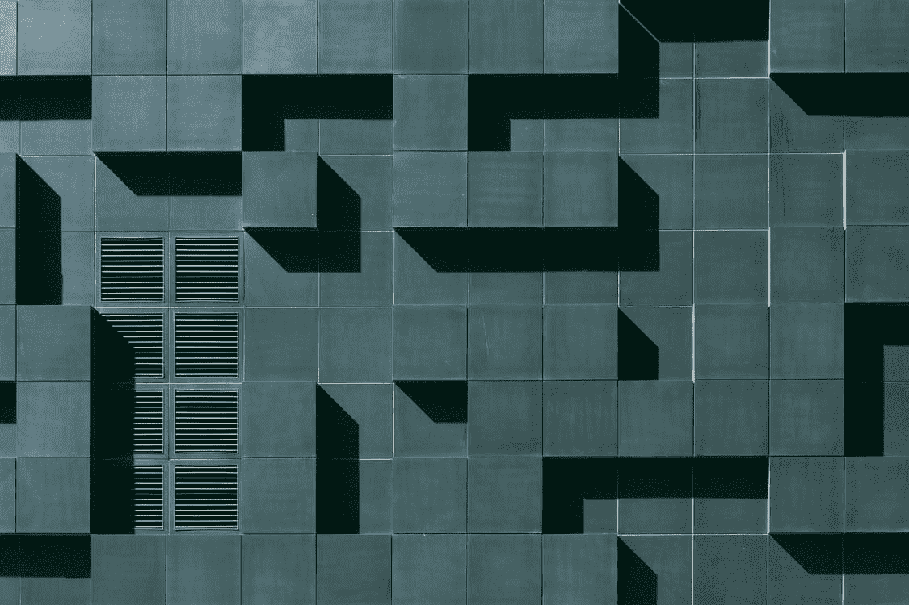
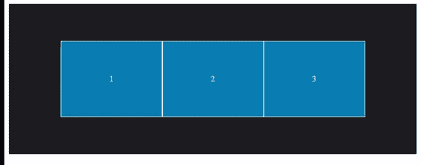
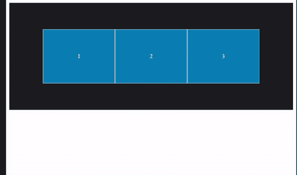
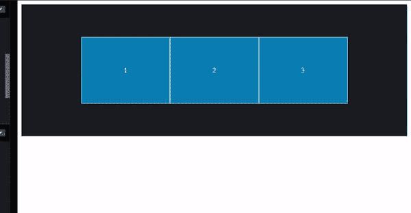
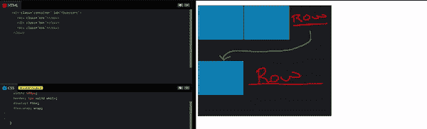
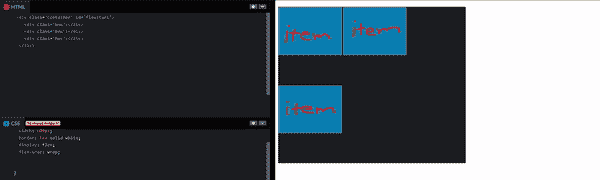

# 前端:柔性盒第 2 部分

> 原文：<https://levelup.gitconnected.com/front-end-flexboxes-part-2-4190ab0916df>



弗拉多·帕诺维奇

在 flexboxes 的[第 1 部分](/front-end-flexboxes-part-1-c82ad6427962)中，我首先谈到了它们对于在屏幕上定位项目是多么的重要，但是它们只对于在一维布局中定位是非常重要的，这意味着它一次只对一个部分有效，但是对于动态网页来说仍然是一个很好的开端！稍后我会谈到更二维、更强大的*网格*，它可以用来布局整个网页。

在第 2 部分(共 2 部分)中，我将讨论第 1 部分中提到的最后 4 项。

1.  自我对齐
2.  柔性包装
3.  柔性流
4.  对齐内容

我将使这一部分比第 1 部分更短、更简单。

让我们开始！

# 自我对齐

从列表中的第一个开始， ***align-self*** 给出了它的名字，self。您可以对容器内的单个项使用此属性。


自我对齐前

上图显示了 *align-self* 添加到 CSS 之前的图像。现在，我将把 ***align-self*** 添加到中间的项目中，这些项目分配有**个人 id****，其值的名称将被设置为它们的 *self-align*** 。

上面的代码笔向您展示了 *align-self* 必须提供的不同值，以及代码背后的解释。这很简单，因为你只是用属性一次只改变一个项目，而不是多个项目。

# 柔性包装

假设您的屏幕尺寸逐渐变小，您需要将项目移到下一行。嗯， ***flex-wrap*** 给了你更动态布局的能力。

当使用这个属性时，你不能让**在你的容器上有一个固定的宽度来包裹物品。您必须适当地设置其**最小宽度**和/或**最大宽度**，以使 ***换行*** 值在*伸缩换行*属性上工作。**

使用了三个值:

nowrap( **default** ) -当您调用 *display* 属性的 *flex* 值时，nowrap 不会将项目换行到下一行，并且默认情况下设置为所有 flex 项目。



wrap -该值使所有项目在**常规顺序**中换行。



wrap-reverse -该值使所有项目以**逆序**换行到下一行空格。



# 柔性流

通过使用所谓的 ***挠流*** ，有**短手**来同时设置*挠向*和*挠绕*。

这个属性只是一个更加**简单的**和**简化的**方式来设置你的*伸缩方向*和*伸缩缠绕*同时**减少了必须单独设置它们的麻烦。**

**如**绕线部分**中的**所示**，它为您提供了可以使用的不同数值，flex box 的[部分 1](/front-end-flexboxes-part-1-c82ad6427962) 用其数值讲述了**沿**的绕线方向**，也直观地向您展示了**在设定数值时是如何工作的。******

****设置*伸缩流*属性值的方法是通过**设置**伸缩方向属性值**第一个**和**然后**第二个*伸缩流*属性值。****

****以下是一些例子:****

```
**flex-flow: row wrap;
flex-flow: row wrap-reverse;
flex-flow: column nowrap;**
```

****其中每一个都将**方向**和**缠绕**属性**的值设置为 flex-flow** 内部的值。****

****如果你迷失在简单的解释中。****

# ****对齐内容****

****对齐内容和对齐项目是有区别的。****

****你将看到的**对齐内容**是用于**沿**横轴**间隔行**的**而不是用于**对齐项目**的**单项**。******

**那些行是当它们被**包装**时被移动到**新行**的项目。**

**这里有一些可视化:**

****

**对齐内容**

**用**对齐内容**注意到**行一起移动到中心**。**

**但是随着**对齐项目**,**组项目一起移动**:**

****

**对齐-项目**

**我希望这些视觉效果有助于区分*对齐内容*和*对齐项目*！**

## **最后注意:**

**至于这是 flexbox 的第 2 部分，我希望这是更简单的，并帮助您理解更多的 flex box 内容，当涉及到在您的网页上创建更动态的布局时！**

**此外，我想列出 MDN 的最后四个属性链接: [align-self](https://developer.mozilla.org/en-US/docs/Web/CSS/align-self) 、 [flex-warp](https://developer.mozilla.org/en-US/docs/Web/CSS/flex-wrap) 、 [flex-flow](https://developer.mozilla.org/en-US/docs/Web/CSS/flex-flow) 和 [align-content](https://developer.mozilla.org/en-US/docs/Web/CSS/align-content) 。**

**想要更多使用 flexboxes 的练习吗？这里有一个 [Flexbox Froggy](https://flexboxfroggy.com/) 的链接。一个网页浏览器游戏，让你在娱乐的同时练习技巧！**

**想要连接吗？**

**关注我的 [Twitter](https://twitter.com/isaiahbrown2022) 发布的新帖子，支持我新制作的 [Patreon](https://www.patreon.com/devblogpost) 改进的写作内容+额外付费的内容！**