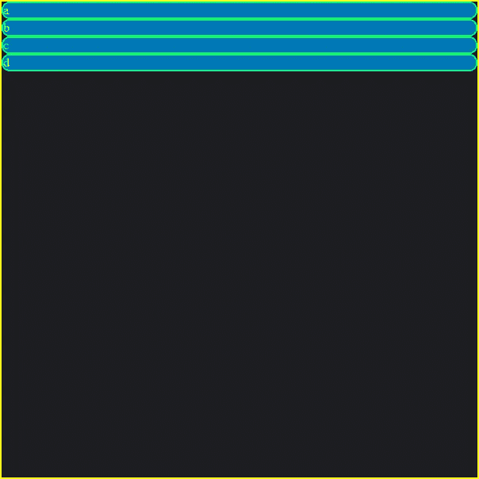
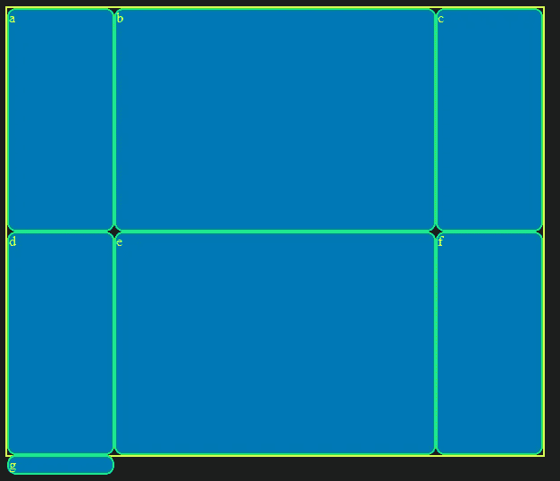

# 前端:CSS 网格对于初学者来说

> 原文：<https://levelup.gitconnected.com/front-end-grids-for-starts-9909f28ffac0>


由 [Engin Akyurt](https://www.pexels.com/@enginakyurt)

在上一篇文章中，我谈到了使用 flexboxes 来布局内容的方法。在 flexbox post 的 [*第 2 部分*](/front-end-flexboxes-part-2-4190ab0916df) 中，我**提到了**网格。有了 CSS **grid** 你就可以使用这个*属性*为你的网页创建完整的布局。使用 CSS **grid** 它们是二维的，因为你不仅能够**使用**父元素来构建**你的布局，而且**还能操纵**你的**项目**来满足你的布局需求。这与完全由**父**控制**的一维柔性盒不同。

要开始使用 CSS *网格*，你只需要将**父容器**和**设置为****显示** *属性*到**网格**。

我将使用 *codepen* 处理我所有的代码和一些视觉效果。下面的**是**将**网格**值添加到**显示**属性*之前的图像**。***

# 为容器设置网格



添加网格前

添加网格后

当**运行上面的**码笔时，你会注意到所有的**项目**都有**自动调整**它们的**高度、宽度、**和**位置**在**容器**本身的侧面内。由**默认**，**网格**开始只有一个***列*。**

**要开始**定义**的**列** ( ***垂直*** )和**行** ( ***水平*** )的**号**我们必须使用属性 **grid-template-columns** 和 **grid-template-rows。****

# **创建列**

**在上方的 **CSS 中，当您运行笔时，您将看到使用中的**网格-模板-列**及其值。****

**当你**运行**笔时，你会注意到有**溢出**正在发生，因为**容器**的**宽度**被设置**静态**为 **600 像素**，而列的**总宽度**加起来比多**。****

```
grid-template-columns: 200px 300px 200px;
```

**看着上面的片段**来自 CSS 出笔**中的 **3 列**和它们的**宽度加起来**为 **700 像素**，**导致**溢出**！****

****我会在后面谈一个**修复**溢出**的**，但是现在我们需要知道如何**设置**行**的**号**！******

# **创建行**

****在 **HTML** 中增加几个项目**，并设置两行的行数和高度。你会看到第一排**的**比第二排的**高度**短**很多。****

**你可能会*质疑*、**为什么会有第三排**，为什么会被推出集装箱压扁？**

```
grid-template-rows: 100px 500px
```

****对于这个答案**，这是因为不仅是**容器** *的**静态高度**将*设置为 **600 像素**，而且我们已经将**两行**的高度设置为当**添加**时到 **600 像素**的等效高度当你**将 100 像素**加到 **500 像素**时，你得到 **600 像素**。**

**你可能会奇怪**为什么只有 **2 排设置**时**还有一个**第三排**。**原因**是因为**列限制 3** 仍设置为**容器**导致**额外项目被推**到下一行。但是*由于*中没有**第三行**在我们的**网格-模板-行**中设置高度值 *为第三行它将*导致*项目被**压扁**。***

# **快速创建列和行的捷径**

**您可能厌倦了分别设置列和行？幸运的是，有一种更快捷的方法来设置网格的列数和行数！**

```
grid-template: 100px 500px / 200px 300px 200px;
```

**在 pen CSS 部分上面的**代码** 的**片段中，你会看到 **grid-template** 是**设置**的 ***属性*** 和**的**值**两个**行**和**列**。**

在斜线之前的值**将代表由代表每行高度的值定义的**行数**。**在**斜线**之后，通过设置每列的宽度来定义**列数**。

## 列和行采用不同的值后缀

像素是**而不是**中的**只有**后缀的一个数值可以在**设置**中的**行**和**列**时取。您也可以使用其他后缀，如 **%** 或 **em** 。你会发现自己**使用**或者**像素**或者 **%** 最**并且很少使用 em 的。**

```
height: 600px; 
width: 600px;
grid-template: 50% 50% / 20% 60% 20%;
```

**以下是在本节代码笔内更改**网格模板**代码的结果。**在**斜线之前，我们**将两行**设置为 **50%** ，当我们**将**百分比**加在一起时，我们得到 **100%或 600 个像素**的总空间使用率。所以这意味着**第一行**是 **300 像素**而**第二行**是 **300 像素**。****

**我们看一下**列**它们也**加起来**为 **100%** 而**第一和第三(*最后* )** 列是**使用 20%** 即 **120 像素**而**第二(*中间* )** 列是**

****

# **固定溢出**

**当你用像素或百分比来创建大于网格尺寸的数字时，如果你不精确，你会发现溢出了很多。**

**一个只为 CSS 网格制作的值后缀， **fr** 帮助**分解**容器**内**的**空间，即**可用**到**部分**。****

**看一下上面的钢笔，注意每一项都没有溢出！**

```
height: 600px; 
width: 600px;
grid-template: 2fr 4fr / 1fr 3fr 1fr;
```

**上方的**代码是来自笔**的**。这些分数能够从分数形式计算到真实像素。****

**代码中，**第 1 行是 **600 可用像素**中的 2fr** ，第**第二行是 4fr** 。说你要**在**第一行**中找到**高度**的**像素**。你**第一个**需要**把**第**行的数字**加在一起得到**可用的总分数**。在我们的例子中，应该是 **2fr + 4fr = 6** 。然后到**在**像素**中找到****第一行的高度**就像我们之前想的那样，你取 **2/6** 和**乘以**它**你的 600 像素**，你得到**第一行**的 200 像素。为了**找到****第二行的像素高度**，同样是**同样的过程** **4/6 * 600** 给你 **400 像素**。导致 0 溢出！****

如果您想要**以像素为单位找到**列的宽度尺寸，您可以像之前的一样通过**将 fr 值加在一起**到**找到**的**总数，**然后获取您想要**找到的**列的宽度(以像素为单位)**在我们的例子中，给定的代码将是 600 **像素。****

# 重复编号以创建行和列

**函数**可以在你的 **CSS 网格**的内使用**。当您希望所有**行**、**列**、**或两者**之间的**大小相等时，这尤其有用！****

最好是**用**到**使用 fr** 来完成这个**功能。**如果你**想要**使用**像素或%** 你也可以**使用**如果你正在寻找另一种类型的结果。

运行笔时，你会注意到现在有 6 列**和所有的**大小相等！

而不是写成:

```
grid-template-columns: 1fr 1fr 1fr 1fr 1fr 1fr;
```

你可以用重复来写:

```
grid-template-columns: repeat(6, 1fr);
```

很简单，对吧？

# 在行和/或列之间产生间隙

本部分以**为中心，为**您的物品**创造空隙**。当你把它们放在一起亲吻时，看起来不太吸引人，是吗？

因此，通过使用**列间隙**或**行间隙**，您可以分别设置**和**间隙**。还有一个**简写**用于**同时设定**和**、**间隙**。

注意:当寻址**的**间隙** *属性*时，无论是行**还是列 ***都不会在**项**的**开始或结束**处创建空间。***

在上面的笔中，我将**行间距设置为 20 像素**，将**列间距设置为 10 像素**。

下面是**的一段代码，同样的方式**你可以**使用简写的*属性*** 编写代码***。***

```
*gap: 20px 10px;*
```

*当**输入**间隙** *属性*的值**时，第一个**值**将**设置**行的**间隙**，第二个**值**将**设置**列的**间隙**。*

*如果您决定像这样只设置一个值:*

```
*gap: 10px;*
```

*此**为****行**和**列**增加 10 个像素的间隙**。***

# ***列和行有多个空间***

## ***行***

***要在**的多行或多列**中有一个**项**，有**属性**使**能够让**这样做。在这一节中，我将只讨论这些属性的**简写，但是下面我将**列出非简写属性**。*****

1.  ***网格-行-开始***
2.  ***网格-行尾***
3.  ***网格-列-开始***
4.  ***网格-列-结束***

***除了这些属性之外，还有一些方法可以方便地使用它们，而不需要单独使用每一个*属性*来耗费时间，造成更多的麻烦。***

***有**三个短轴**到**T17T19**横跨**的**行**和**列**。*属性* **grid-row** 使用了**的简写**来表示**跨越行**。对于**列**其**网格-列**。最后，使用**网格区域**在一个**中声明它们**。*****

***这些*属性*是**用在**单品本身**上的**！***

***上面的代码笔展示了如何使用 **grid-row** 让一个项目占据两行。***

***对于**网格行** *属性*，这些值很简单。斜线前的**第一个值是项目开始**的**，然后斜线**后的**值是项目拉伸结束**的**。*****

```
***.container{
  border: 2px solid yellow;
  height: 600px; 
  width: 600px; 
  display: grid;
  grid-template: **repeat(4, 1fr)** / repeat(4, 1fr);
}#a{
  **grid-row: 1 / 3;**
}***
```

***代码片段**显示**笔中 **CSS 的**代码**。**加粗的部分是我们关注的焦点**，*注意*有 **4 行**，但是在 **id (a)** 内部，从 **1 到 3 的网格填充了网格内部 4 个空间**中的 2 个。*****

*****原因**是因为对于您试图达到的**实际数字**有一个 **+1 数字偏移**。***

***在我们的例子中:我们想让**项(a)** **占用 4 个空格中的 2 个**，但是我们**设置**项到**从 1** 开始，**到 3** 结束，但是实际上是**占用了 4 个空格中的 2 个**和**而不是 4 个空格中的 3 个**。***

***为了**修正**这个**偏移误差**和**从 1 开始，到 2** 结束，对于您的值，您只需**在结束值**后使用*跨度*，就像这样:***

```
***#a{
  grid-row: 1 / 2 span;
}***
```

***这将给你与 **grid-row: 1 / 3 相同的**结果；*******

***上面的**表示*****跨距*用途**。***

## ***列***

***与**行**相同的概念**也适用于**列。取而代之的是，**在你的项目**上调用属性 grid-column** ，而不是 grid-row** 。***

***下面是一个使用**而没有** *跨度*的网格柱的代码示例:***

***带 *跨度*的**网格柱示例:*****

## ***列和行***

***假设你不只是设置列或行，**而是**你将需要**设置两者**。***

***这就是一个叫做**网格区域**的*属性*发挥作用的地方。***

***当涉及到该*属性*的**设定值**时，顺序很重要。***

```
***grid-area: 2 / 3 / span 3 / span 4***
```

***以上只是该属性的示例代码。****顺序**对值的作用是，你设置的**第一个值**是行开始，**然后是你的列开始**，**接下来是你的行结束**，最后是你的列结束值。*****

*****下面的**是正在使用的*属性*:*******

# *****总结*****

*****遵循声明和粗体字应该会使 CSS 网格的解释更加容易。我在我所涉及的每个部分的代码笔的 CSS 部分中设置了注释，希望这有助于您更清楚地理解用它们设置的属性和值。*****

*****关注我的 [Twitter](https://twitter.com/isaiahbrown2022) 发布新帖子，支持我新制作的 [Patreon](https://www.patreon.com/devblogpost) 改进写作内容+额外付费内容！*****