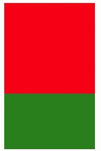
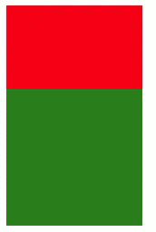
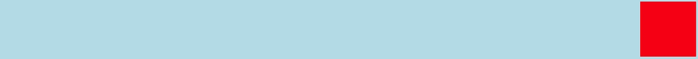

# 前端:堆叠元素层和额外定位

> 原文：<https://levelup.gitconnected.com/front-end-stacking-element-layers-and-extra-positioning-234fe44f6716>


叶卡捷琳娜·博洛夫索娃

web 开发内部的空间是由 2D 空间组成的。这意味着页面上的元素是平面的，不会突出来。如果在网页上使用 position 属性，您可能会看到元素根据它们在文档中的顺序而消失。

在 CSS 中有一个名为 ***z-index*** 的属性，它可以让你获取已经定位的非静态元素，并按照它们出现的顺序重新排列。

z 向索引使用起来非常简单。您所要做的就是给 CSS 文件中的元素分配一个数值，然后观察您的元素相对于屏幕上的其他元素向前或向后移动。

例如，如果我们有一个红色框和一个绿色框，然后将绿色框放在红色框的中间，但是红色框的索引值比绿色框高，那么红色框将显示在绿色框的上方。

```
//HTML<div id="red-box"></div>
<div id="green-box"></div>____________________________________________________________________//CSS#red-box{
  background-color: red;
  width: 150px;
  height: 150px;
  position: absolute;
  z-index: 1;
}#green-box{
  background-color: green;
  width: 150px;
  height: 150px;
  position: absolute;
  top: 100px;
  z-index: 0;
}
```



但是，如果我们获取 z-index 值，并使绿框的值为 1，红框的值为 0，那么绿框将出现在红框上方。

> //CSS
> 
> #red-box{
> 背景色:红色；
> 宽度:150px
> 高度:150px
> 位置:绝对；
> **z 指数:0；**}
> 
> #green-box{
> 背景色:绿色；
> 宽度:150px
> 高度:150px
> 位置:绝对；
> top:100px；
> **z 指数:1；**
> }



这种使用 z-index 堆叠图层的功能非常有用，尤其是当你滚动页面时，你总是想在屏幕顶部看到一个固定的标题。现在假设我们将红框的索引设为 1，将绿框的索引设为 2，甚至是 999999。这是另一种让绿盒子显示在红盒子上的方法。重要的是哪个值最大，显示了一个元素相对于另一个元素的顺序。

我想提到的最后一件事是一个名为 ***float*** 的属性。浮动属性可以在网页上尽可能的向左或向右移动元素。与 *float* 属性配合良好的另一个属性是***clear****属性，它清除元素的左侧或右侧或两侧。*

*下面是一个 ***float: left*** 在实际应用中的例子:*

```
*//HTML<div id="red-box"></div>____________________________________________________________________//CSS#red-box{
  background-color: red;
  width: 150px;
  height: 150px;
  float: right;
}*
```

**

*同样的视觉规则也适用于浮动到右边的情况，这是所有元素的默认位置。浮动最适合与图像和文本配对使用。如果你想玩更多的定位和 z-index 的游戏，如*浮动*属性和*清除*属性，请访问 [codepen.io](https://codepen.io/trending) 。*