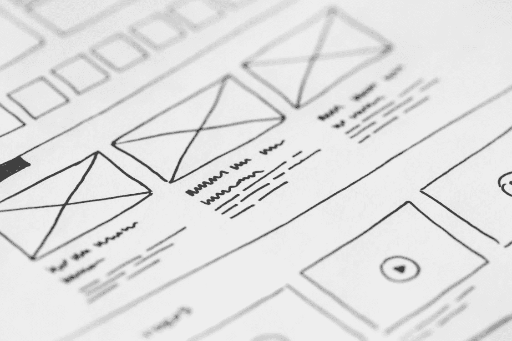
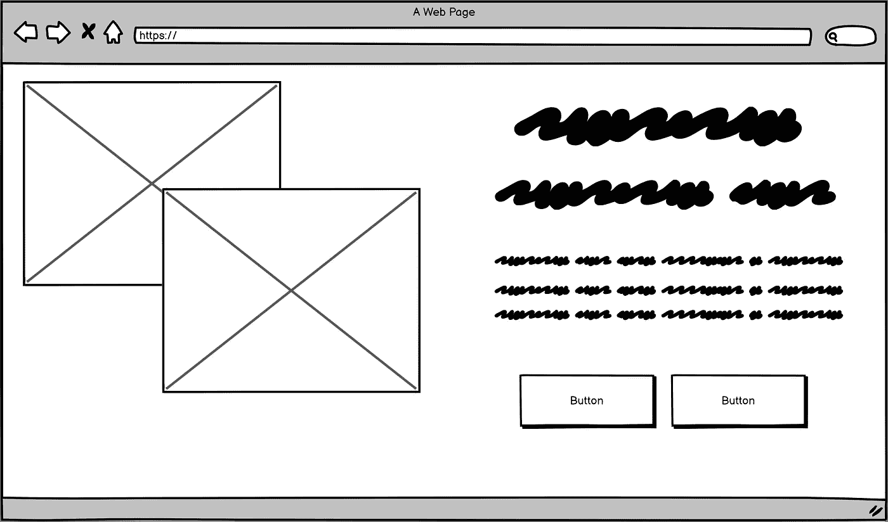
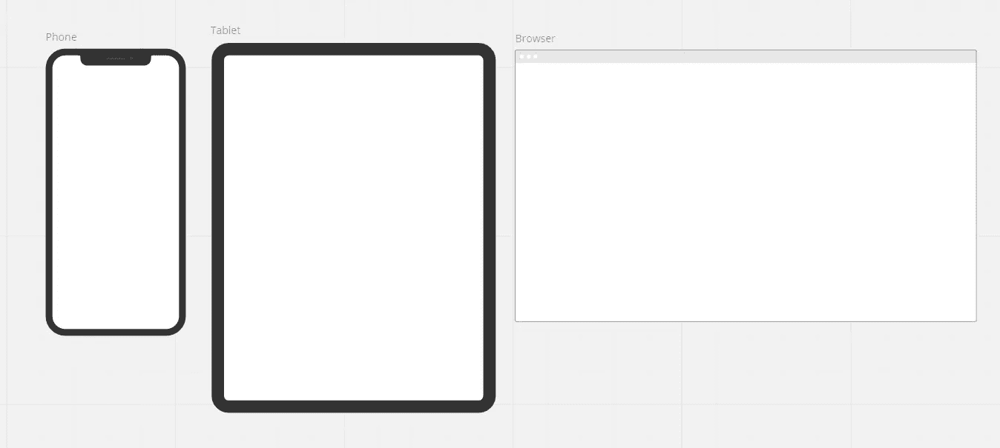
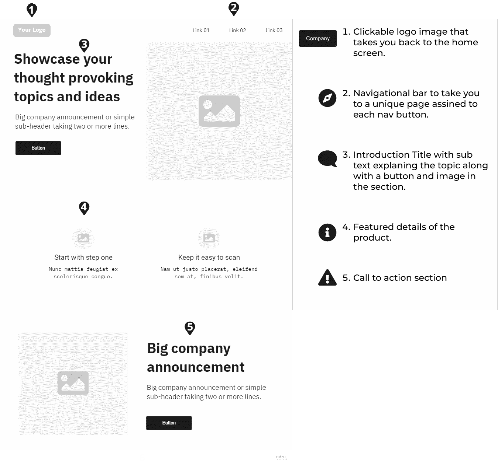

# 前端:什么是线框图，它在你的开发中是如何工作的？

> 原文：<https://levelup.gitconnected.com/front-end-what-is-wireframing-and-how-does-it-work-in-your-development-122bfdd9ca>



由[picjumbo.com](https://www.pexels.com/@picjumbo-com-55570/)

许多人试图用头脑中的第一个想法开始项目，但从来没有把它们画出来。因此，当他们开始创造他们的想法时，在创造他们的产品的中途，他们可能想改变他们最初的想法，但这可能会浪费时间，甚至可能导致你不得不重新开始你的项目！

我想简单介绍一下什么是线框图，以及在哪里开始你的下一个项目的线框图。让您能够轻松应对该项目。线框化之前还有一些步骤，但这项任务对于产品设计流程至关重要:

```
• User and marketing research
• Scoping and getting estimation
• Wireframing
• Prototyping
• Testing
• Launch
• Maintenancing
```

上面列出了一步一步的设计过程，并在其中列出了线框。设计和开发新产品时，线框是最重要的步骤之一！那么线框图到底是如何工作的呢？它的工作方式是把你头脑中的想法或图像快速地在软件或纸上画出来。

因为许多设计师更喜欢使用数字工具，如 [Adobe Xd](https://www.adobe.com/products/xd.html) 或 [Figma](https://www.figma.com/) 来创建他们的线框。虽然这种方法可能对其中一些设计师很有效，但对其他设计师来说可能并不奏效。在大多数情况下，当你有多个草图的变体时，最好在纸上画出你的线框，让你有一个更好的并排的外观。

创建线框时，有三个不同级别的详细线框:低保真度、中等保真度和高保真度。低保真或低保真度线框是你能从你的草图中得到的最低限度。对文本使用 squigals 和用线条穿过的方框来表示图像。



被我

上图展示了用 [Balsamiq](https://balsamiq.com/) 制作的低保真线框。在整个项目的线框阶段，你可能最终会创建许多线框，但一旦你选择了你喜欢的布局，你就可以开始创建一些更高保真的东西，以获得你想要创建的更详细的图像，与项目的其他成员甚至利益相关者分享。

有几件事与线框你可能要避免。一是不要在第一张草图上创建高保真度的框架。你想用最少的细节保持简单，不要让每样东西都像像素一样完美，直到你找到你喜欢的草图，然后你可以从那里开始拼凑你的设计。另一个需要指出的技巧是，确保你知道页面的目的，以及帮助用户/企业解决问题的设计是什么。这可以帮助你加快你的进度，如果你不线框每一页，只有那些对早期最佳反馈最有价值的页面。



被我

最后，因为你的大部分设计最终会在移动平台上完成，所以最好从小屏幕开始。从小到大的构建可以帮助你在早期遇到更少的问题。使用实际手机屏幕的模板也可以通过了解设计的局限性来加快进度。通过在你的线框图中添加一些注释，这也可以帮助那些评论者更好地理解你的想象力以及用户将如何与你的设计互动。



被我

考虑到这一点，作为一个开发人员，你可能对线框图比较陌生，现在你可以用新的知识来尝试你的技能，练习创建你自己的线框图，从低保真度开始，到高保真度线框图。这里有几个地方你可以开始自己创建线框: [Adobe Xd](https://www.adobe.com/products/xd.html) ， [Balsamiq](https://balsamiq.com/) ， [Figma](https://www.figma.com/downloads/) ， [Sketch(苹果电脑)](https://www.sketch.com/)，[等](https://www.creativebloq.com/wireframes/top-wireframing-tools-11121302)。

线框是所有关于你的设计技巧。如果你想把你的技能提升到一个新的水平，我会推荐你试试另外一种增强你设计经验的方法。